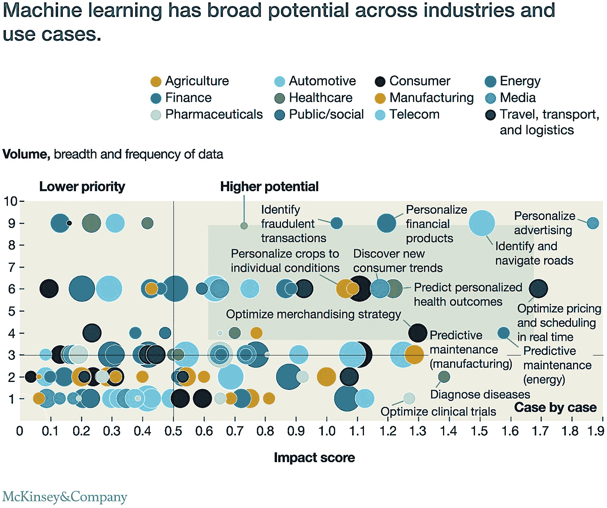
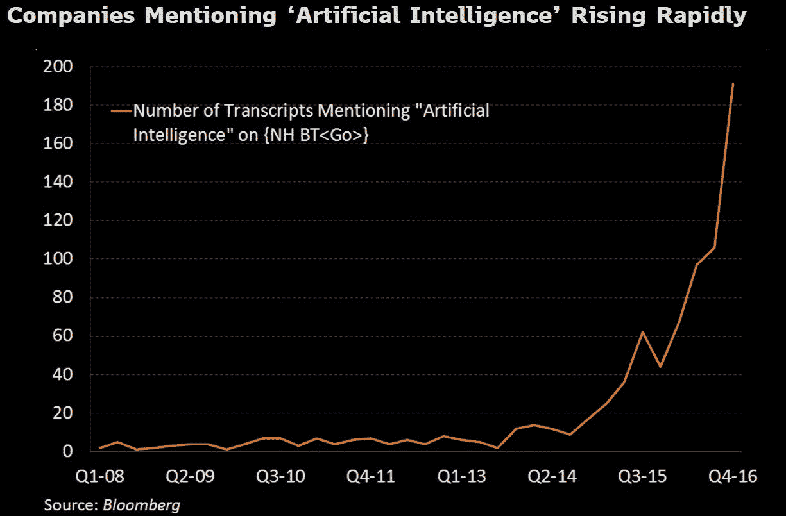
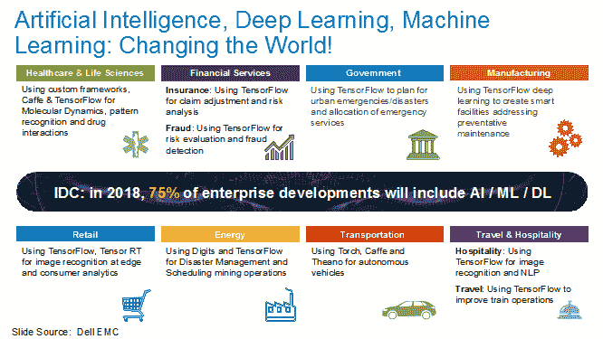
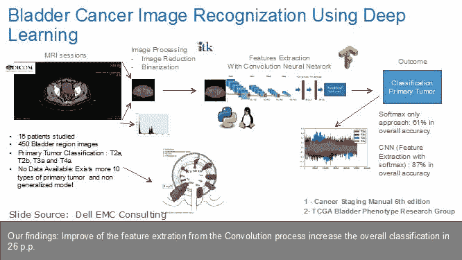
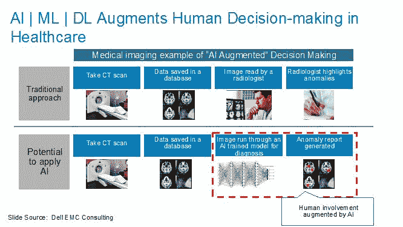
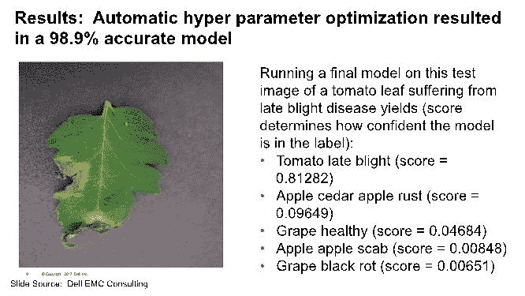
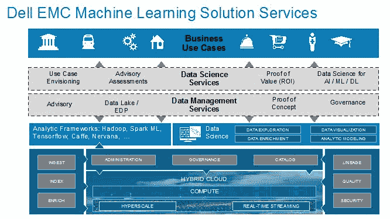
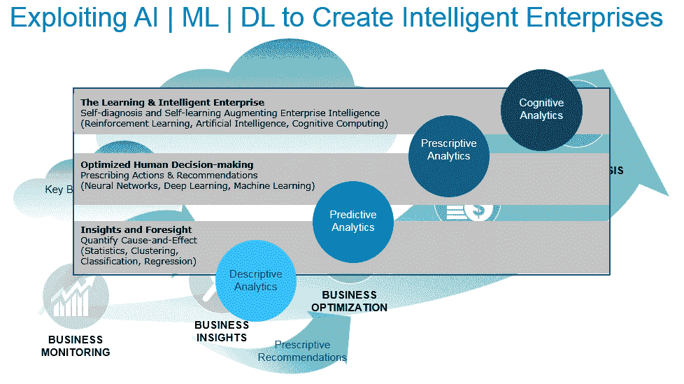

# 通过 Dell EMC Ready 解决方案实现人工智能、深度学习、机器学习的民主化

> 原文：[`www.kdnuggets.com/2018/01/democratizing-ai-deep-learning-machine-learning-dell-emc.html`](https://www.kdnuggets.com/2018/01/democratizing-ai-deep-learning-machine-learning-dell-emc.html)

 评论

人工智能、机器学习和深度学习（AI | ML | DL）在数字化转型的核心，通过使组织能够利用日益增长的大数据来优化关键的业务和操作用例。

+   **人工智能**（Artificial Intelligence，简称 AI）是理论和开发计算机系统的学科，这些系统能够执行通常需要人类智慧的任务（例如视觉感知、语音识别、语言翻译等）。

+   **机器学习**（Machine Learning，简称 ML）是人工智能的一个子领域，它使系统能够通过经验自行学习和改进，而无需明确编程。

+   **深度学习**（Deep Learning，简称 DL）是一种建立在深层次层级结构上的机器学习（ML），每一层解决复杂问题的不同部分。这些层相互连接成一个“神经网络”。深度学习框架是加速这些模型开发和部署的软件。

参见“[人工智能不是虚假智能](https://infocus.emc.com/william_schmarzo/artificial-intelligence-not-fake-intelligence/)”以获取更多关于人工智能 | 机器学习 | 深度学习的详细信息。

其商业影响令人震惊！（见图 1）

图 1：麦肯锡《分析、人工智能和自动化中的现状与未来》

高级管理人员似乎已经了解了这一点。《商业周刊》（2017 年 10 月 23 日）报道了在 363 次第三季度财报电话会议中提及“人工智能”的次数大幅增加（见图 2）。

图 2：高管在财报电话会议中提及“人工智能”

为了帮助我们的客户利用人工智能 | 机器学习 | 深度学习的业务和操作优势，Dell EMC 创建了“Ready Bundles”，旨在简化人工智能 | 机器学习 | 深度学习解决方案的配置、部署和管理。每个捆绑包包括集成的服务器、存储、网络以及深度学习和机器学习框架（如 TensorFlow、Caffe、Neon、Intel BigDL、Intel Nervana 深度学习工作室、Intel 数学核心库 - 深度神经网络和 Intel 机器学习扩展库），以优化机器学习或深度学习。

### 推动人工智能 | 机器学习 | 深度学习的民主化

民主化定义为将某物变得对所有人，即“普通大众”可及的行动/发展。历史提供了工业革命和信息革命的民主化教训。这两个历史时刻都受到零件、工具、架构、接口、设计和培训标准化的推动，这使得创建通用平台成为可能。组织不再依赖“高僧”式的专家来组装枪支、汽车或计算机系统，各种规模的组织能够利用通用平台来建立自己的客户、业务和财务差异化来源。

AI | ML | DL 技术栈是复杂的系统，调整和维护难度大，专业知识有限，栈的一个最小变化可能会导致失败。AI | ML | DL 市场需要经历类似的“标准化”过程，以创建能够使各种规模的组织建立自身客户、业务和财务差异化来源的 AI | ML | DL 平台。

为了帮助加速 AI | ML | DL 的民主化，戴尔 EMC 创建了机器学习和深度学习准备捆绑包。这些预打包的准备捆绑包降低了风险，简化了 AI | ML | DL 项目，并通过预集成必要的硬件和软件来加快价值实现时间（有关更多信息，请访问 [戴尔 EMC 机器学习准备捆绑包与 Hadoop](http://www.dellemc.com/ai)）。

不再需要一个孤立的专业知识小组来建立你的 AI | ML | DL 环境。相反，组织可以将宝贵的数据工程和数据科学资源集中在创造新的客户、业务和运营价值上。

### 用戴尔 EMC 咨询公司实现机器学习货币化

在每个行业中，组织正积极采纳 AI | ML | DL 工具和框架，以帮助他们更有效地利用数据和分析来驱动关键的业务和运营用例（见图 3）。

图 3：跨行业的 AI | ML | DL 用例

商机丰富。因此，真正的挑战不是识别利用 ML 获取业务和运营优势的机会，真正的挑战是：

+   确定从哪里以及如何开始将 AI | ML | DL 集成到业务模型中，通过构思、识别、验证和优先考虑潜在的用例

+   构建一个 [弹性数据平台](https://www.emc.com/collateral/service-overview/h16643-elastic-data-platform-service.pdf) （数据存储库或数据湖），使组织能够捕获、增强、保护和共享组织的关键数据和分析数字资产。

Dell EMC 服务旨在帮助客户弥合数据科学团队、IT 团队和业务线之间的差距。通过合作，我们能够陪伴你从部署到用例开发再到全面生产的整个过程。以下是 Dell EMC 帮助客户将 AI | ML | DL 整合到其关键业务和操作流程中的两个例子。

### 用例 #1: 使用医学图像识别进行膀胱癌识别

对人体的图像识别预计将大幅改善，帮助医生提供更好且更准确的医疗诊断。即使在疾病存在的情况下，应用于器官图像识别的 ML 也能减少医疗错误的可能性，加快疾病诊断。这在许多情况下都很重要，因为诊断延迟意味着治疗延迟。由于这些方法的前景，医疗成像技术将在不久的将来在医疗诊断和治疗中扮演关键角色。

在这一项目中，我们使用了来自癌症成像档案的磁共振成像（MRI）来识别患者的膀胱癌，采用了无监督和有监督的 ML 技术。这些算法识别出了图像之间的显著差异，使医生能够看到哪些特征可能与膀胱癌检测相关。ML 可以使用技术来减少图像的噪声，并提供更好的结果（见图 4）。

图 4: 利用机器学习加速膀胱癌检测

ML 算法的精准度将提高结果的准确性。随着更多图像数据的可用，全球范围内的好处将不断改善。此外，更多的 ML 模型将被训练，这些模型的有效性也将不断得到改进。

可以合理地说，利用 AI | ML | DL 技术进行计算机辅助肿瘤诊断将为社会带来重要的好处。它将减少医疗成本，并缩短治疗时间，同时推动更有效的结果（见图 5）。

图 5: AI | ML | DL 增强医疗决策

注: 此用例最近获得了 Dell EMC 2017 年“最佳应用数据分析”奖项，来自 Dell EMC 的 Proven Professional Knowledge Sharing 计划。

### 用例 #2: 作物疾病识别

人类社会需要到 2050 年将食品生产增加约 70%，以满足预计将超过 90 亿人口的需求。目前，传染病使潜在作物产量平均减少 40%，许多发展中国家的农民损失甚至高达 100%[[1]](https://infocus.emc.com/william_schmarzo/democratizing-artificial-intelligence-deep-learning-machine-learning-with-dell-emc-ready-solutions/#_ftn1)。

对全球 5 亿小农户来说，情况尤其严重，他们的生计依赖于作物的健康。在非洲，仅 80%的农业产出来自小农户。

全球范围内智能手机的广泛分布，预计到 2020 年将有 50 亿部智能手机，为将智能手机转变为各种种植食品社区的宝贵工具提供了潜力。一个潜在的应用是通过深度学习和众包开发移动疾病诊断。

参与的结果在对不同类型作物及其面临的不健康情况的风险评分方面非常令人印象深刻（见图 6）。

图 6：作物疾病识别与评分

### 戴尔 EMC 准备解决方案 + 戴尔 EMC 咨询 = 智能企业

戴尔 EMC 咨询提供了一整套服务，旨在帮助客户加速 AI | ML | DL 的采用并实现数据资产的变现（见图 7）。

图 7：戴尔 EMC 咨询整合 AI | ML | DL 用例

对任何组织而言，最终目标是掌握 AI | ML | DL 的使用，以在整个组织内产生并推动客户、产品和运营价值；创造具备持续学习和适应变化的商业、环境、竞争和经济条件的“智能企业”（见图 8）。

图 8：创建“智能企业”

未来已经到来，戴尔 EMC 与戴尔 EMC 咨询一起推出 AI | ML | DL 准备套餐，加速客户迈向“智能企业”的旅程。有关更多信息，请访问 [dellemc.com/services](https://www.dellemc.com/en-us/services/professional-services/index.htm)。

**来源：**

图 1：麦肯锡 [“分析、人工智能和自动化的现状与未来”](https://www.mckinsey.com/global-themes/digital-disruption/whats-now-and-next-in-analytics-ai-and-automation)

[1] [“一个开放获取的植物健康图像库，以便开发移动疾病诊断。”](https://arxiv.org/abs/1511.08060)

[原文](https://infocus.emc.com/william_schmarzo/democratizing-artificial-intelligence-deep-learning-machine-learning-with-dell-emc-ready-solutions/)。经许可转载。

**相关：**

+   为什么使用数据分析来预防，而不仅仅是报告

+   来自《权力的游戏》的经验教训：阻止数据货币化的白行者

+   数据货币化的关键

* * *

## 我们的前三大课程推荐

 1\. [谷歌网络安全证书](https://www.kdnuggets.com/google-cybersecurity) - 快速进入网络安全职业生涯。

 2\. [谷歌数据分析专业证书](https://www.kdnuggets.com/google-data-analytics) - 提升你的数据分析技能

 3\. [谷歌 IT 支持专业证书](https://www.kdnuggets.com/google-itsupport) - 支持你的组织的 IT 需求

* * *

### 更多相关内容

+   [RedPajama 项目：一个开源倡议以民主化 LLMs](https://www.kdnuggets.com/2023/06/redpajama-project-opensource-initiative-democratizing-llms.html)

+   [免费人工智能和深度学习速成课程](https://www.kdnuggets.com/2022/07/free-artificial-intelligence-deep-learning-crash-course.html)

+   [从人工智能到机器学习的演变](https://www.kdnuggets.com/2022/08/evolution-artificial-intelligence-machine-learning-data-science.html)

+   [人工智能系统中的不确定性量化](https://www.kdnuggets.com/2022/04/uncertainty-quantification-artificial-intelligencebased-systems.html)

+   [人工智能如何改变数据集成](https://www.kdnuggets.com/2022/04/artificial-intelligence-transform-data-integration.html)

+   [2022 年最受欢迎的人工智能技能](https://www.kdnuggets.com/2022/08/indemand-artificial-intelligence-skills-learn-2022.html)
