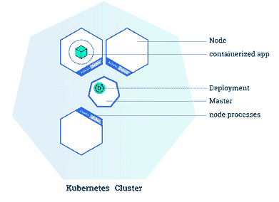
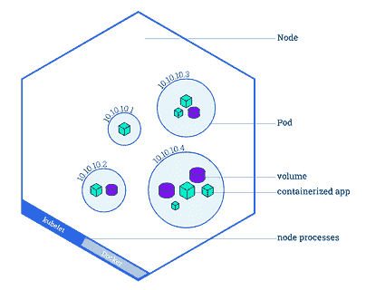
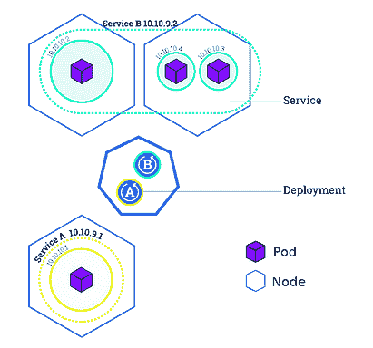
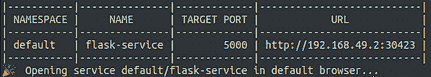

# 如何在 Kubernetes 中部署 Flask API 并将其与其他微服务连接

> 原文：[`www.kdnuggets.com/2021/02/deploy-flask-api-kubernetes-connect-micro-services.html`](https://www.kdnuggets.com/2021/02/deploy-flask-api-kubernetes-connect-micro-services.html)

评论

**作者：Rik Kraan, Vantage AI**

Kubernetes 是一个强大的容器编排工具，它自动化了 [容器](https://www.docker.com/resources/what-container) 的部署和管理。如果你有一个简单的轻量级应用，由一个服务组成，不用考虑使用 Kubernetes。Kubernetes 的优势在于，当你的应用具有 [微服务](https://microservices.io/) 架构并且多个组件协同工作时，它会显现出来。它是一个‘自动化部署、扩展和管理容器化应用的开源系统’，具有以下几个优势：

+   根据需求进行简单（自动）扩展

+   通过分配负载以使应用在部分故障时仍能正常运行，从而使应用具有容错能力

+   自动化健康检查和自我修复过程

+   处理微服务之间的通信，并将传入的流量均匀分配到所有资源上

* * *

## 我们的三大课程推荐

 1\. [谷歌网络安全证书](https://www.kdnuggets.com/google-cybersecurity) - 快速进入网络安全职业道路。

 2\. [谷歌数据分析专业证书](https://www.kdnuggets.com/google-data-analytics) - 提升你的数据分析技能

 3\. [谷歌 IT 支持专业证书](https://www.kdnuggets.com/google-itsupport) - 支持你的组织的 IT

* * *

初次使用 Kubernetes 可能会让人感到畏惧，但如果你掌握其主要概念，并在 [官方网站](https://www.kubernets.io/) 上进行一些练习，你可以相对轻松地入门。

在本博客中，我将：

1.  提供 Kubernetes 主要概念的快速概述

1.  演示如何启动自己的本地集群

1.  在集群上部署 MySQL 数据库

1.  设置一个作为 REST API 与数据库通信的 Flask 应用


网络。照片由 [Alina Grubnyak](https://unsplash.com/@alinnnaaaa?utm_source=unsplash&utm_medium=referral&utm_content=creditCopyText) 提供，来自 [Unsplash](https://unsplash.com/s/photos/network?utm_source=unsplash&utm_medium=referral&utm_content=creditCopyText)

### **Kubernetes 基础**

在这一部分，我将介绍 Kubernetes 的基础知识而不涉及过多细节；可以通过阅读官方文档深入了解。

一个 Kubernetes 集群由一个**主节点**和一个或多个**工作节点**组成。这种架构是 Kubernetes 的主要特征之一。如你所见，你的微服务分布在不同的节点上，以便在其中一个工作节点故障时保持健康。**主节点**负责管理集群，并通过 API 让你与集群进行通信。默认情况下，**工作节点** 配备了一些组件，包括预安装的软件，以便运行流行的容器服务如*Docker* 和 *containerd*。

部署你自己应用程序到 Kubernetes 集群上有三个主要概念是必不可少的：*部署、Pods 和服务。*

+   一个*部署* 是一组指令，提供给**主节点**，用于创建和更新你的应用程序。根据这些指令，**主节点** 将调度并在各个**工作节点**上运行你的应用程序。部署会持续由**主节点**监控。如果你的应用程序的某个实例出现故障（例如，如果**工作节点**出现故障），它将被自动替换为一个新实例。



Kubernetes 集群与部署（来源：[`kubernetes.io/docs/tutorials/kubernetes-basics/deploy-app/deploy-intro/`](https://kubernetes.io/docs/tutorials/kubernetes-basics/deploy-app/deploy-intro/)）

+   一个*Pod* 是 Kubernetes 平台中的原子单位。它代表一个或多个容器及这些容器共享的一些资源（共享存储、唯一的集群 IP 地址等）。如果你创建一个*部署*，该部署将创建带有容器的*pods*。每个*pod* 都绑定到一个**工作节点**。需要理解的是，一个**工作节点**可以拥有多个*pods*，如果当前的**工作节点**出现故障，这些*pods* 将会在另一个可用的**工作节点**上重新创建。



带有多个 pods 的**工作节点**概述（来源：[`kubernetes.io/docs/tutorials/kubernetes-basics/explore/explore-intro/`](https://kubernetes.io/docs/tutorials/kubernetes-basics/explore/explore-intro/)）

+   一个*service*基本上定义了一组逻辑上的*pods*并定义了访问它们的策略。这是必要的，因为*pods*可能会停止并重启（例如，如果**工作节点**被删除或崩溃）。一个*service*在一组 pods 之间路由流量，并允许 pods 在不影响应用程序的情况下死亡和复制。在定义一个服务时，你可以指定服务的类型。默认情况下，Kubernetes 创建一个 ClusterIP 服务，这使得你的*service*只能从集群内部访问。你可能想将一些*services*（例如前端）暴露给外界。在这种情况下，你可以创建一个*LoadBalancer*服务，它创建一个外部负载均衡器并分配一个固定的外部 IP，使其可以从集群外部访问（例如在你的浏览器中）。



一个包含 3 个**工作节点**、若干个 pods 和两个将 pods 绑定在一起的服务（A & B）的集群（来源：[`kubernetes.io/docs/tutorials/kubernetes-basics/expose/expose-intro/`](https://kubernetes.io/docs/tutorials/kubernetes-basics/expose/expose-intro/)）

### **开始使用自己的集群**

如果你想让你的集群快速运行：本博客中的所有代码（以及一个说明性的 Readme）可以在[此处](https://github.com/RikKraanVantage/kubernetes-flask-mysql)找到。我们将构建的应用程序由两个微服务组成：

1.  一个 MySQL 数据库

1.  一个实现 API 以访问和执行数据库 CRUD（创建、读取、更新、删除）操作的 Flask 应用程序。

> **先决条件**：*请确保已安装`*kubectl*`*和`*minikube*`*（[*https://kubernetes.io/docs/tasks/tools/*](https://kubernetes.io/docs/tasks/tools/)）。并确保你的*Docker CLI*通过命令*`*eval $(minikube docker-env)*`*使用集群中的*Docker daemon*。不用担心：如果你重启终端，你将自动使用自己的*Docker daemon*。最后通过命令*`*minikube start*`*启动本地集群。*

首先：在设置 MySQL 数据库时，我们需要考虑两件事。1) 要访问数据库，我们需要配置一些凭据；2) 我们需要一个持久卷，以防节点意外关闭时不会丢失所有数据。

### **创建密钥**

Kubernetes 有自己处理敏感信息的方法，通过配置 Kubernetes *Secrets*。这可以通过一个简单的 YAML 文件完成。这些*secrets*可以通过指定环境变量（稍后我们将看到）被集群中的任何*pod*访问。*Secrets*应该指定为**base64 编码**字符串。因此，我们首先需要通过终端获取密码的编码版本：`echo -n <super-secret-passwod> | base64`。复制输出并将其嵌入到以下*secrets.yml*文件中的`db_root_password`字段中。*metadata.name*字段很重要，因为我们需要在后面的阶段中指定它，所以一定要记住它。

现在你可以通过终端将秘密添加到集群中：`kubectl apply -f secrets.yml`。然后通过`kubectl get secrets`检查是否成功。

### **持久卷**

持久卷是一个生命周期独立于*Pod*的存储资源。这意味着如果*pod*崩溃，存储将继续存在。由于 Kubernetes 可以在任何时候重新启动*pods*，因此将数据库存储设置为*persistent volume*是一种良好的实践。*persistent volume*可以是本地文件系统上的目录，也可以是云提供商的存储服务（例如 AWS Elastic Block Storage 或 Azure Disk）。创建*persistent volume*时可以指定其类型。在本教程中，你将使用*hostPath*类型，这将在你的*minikube*节点上创建一个卷。然而，在生产环境中，确保使用其他类型（[参见文档](https://kubernetes.io/docs/concepts/storage/persistent-volumes/#types-of-persistent-volumes)），因为使用*hostPath*类型时，如果删除 minikube 节点，数据将会丢失。

使应用程序使用*persistent volume*包括两个部分：

1.  指定*卷*的实际存储类型、位置、大小和属性。

1.  指定一个*persistent volume claim*，请求部署所需的特定大小和访问模式的持久卷。

创建一个*persistent-volume.yml*文件，并指定大小（在本例中为 2GB）、访问模式以及文件存储的路径。`spec.persistentVolumeReclaimPolicy`指定了如果*persistent volume claim*被删除时应该执行的操作。对于像*MySQL*数据库这样的有状态应用程序，你希望在删除声明时保留数据，以便手动检索或备份数据。默认的回收策略是继承自*persistent volume*的类型，因此在 yml 文件中始终指定它是一种良好的实践。

你可以通过`kubectl apply -f persistent-volume.yml`再次添加存储。然后通过`kubectl describe pv mysql-pv-volume`和`kubectl describe pvc mysql-pv-claim`查看你创建的资源的详细信息。由于你创建了一个主机路径类型的*persistent volume*，你可以通过登录到 minikube 节点`minikube ssh`并导航到指定路径（`/mnt/data`）来查找数据。

### **部署 MySQL 服务器**

在我们的秘密和持久卷（声明）就位后，我们可以开始构建我们的应用程序。首先，我们将部署一个 *MySQL* 服务器。拉取最新的 *mysql* 镜像 `docker pull mysql` 并创建 *mysql-deployment.yml* 文件。关于这个文件，有几件事值得提及。我们指定仅启动一个 Pod（`spec.replicas: 1`）。该部署将管理所有带有标签 `db` 的 Pod，标签由 `spec.selector.matchLabels.app: db` 指定。`template` 字段及其所有子字段指定了 *pod* 的特征。它将运行 *mysql* 镜像，名称也为 *mysql*，并在 `flaskapi-secrets` *secret* 中查找 db_root_password 字段，将其值设置为 `MYSQL_ROOT_PASSWORD` 环境变量。此外，我们指定了一个容器暴露的端口，以及持久卷应该挂载的路径 `spec.selector.template.spec.containers.volumeMounts.mountPath: /var/lib/mysql`。在底部，我们还指定了一个名为 mysql 的 `LoadBalancer` 类型的服务，以便我们可以通过该服务访问我们的数据库。

现在你可以通过 `kubectl apply -f mysql-deployment.yml` 部署 MySQL 服务器。然后通过 `kubectl get pods` 查看 Pod 是否正在运行。

### 创建数据库和表格

在实现 API 之前，我们必须做的最后一件事是初始化 MySQL 服务器上的数据库和模式。我们可以使用多种方法来完成这项工作，但为了简单起见，让我们通过新创建的 *service* 访问 MySQL 服务器。由于运行 MySQL *service* 的 Pod 仅能从集群内部访问，你需要启动一个作为 `mysql-client` 的临时 Pod：

1.  通过终端设置 `mysql-client`： `kubectl run -it --rm --image=mysql --restart=Never mysql-client -- mysql --host mysql --password=<your_password>`。填写你在 *secrets.yml* 文件中指定的（解码）密码。

1.  创建数据库、表格和模式。你可以做任何你喜欢的事，但为了确保样本 Flask 应用程序能够正常工作，请按照以下步骤操作：

```py
CREATE DATABASE flaskapi;
USE flaskapi;

CREATE TABLE users(user_id INT PRIMARY KEY AUTO_INCREMENT, user_name VARCHAR(255), user_email VARCHAR(255), user_password VARCHAR(255));
```

### 部署 API

最后是时候部署你的 REST API 了。以下示例展示了一个实现了只有两个端点的 Flask 应用程序的示例。一个用于检查 API 是否正常工作，另一个用于在我们的数据库中创建用户。在 GitHub 的 [repo](https://github.com/RikKraanVantage/kubernetes-flask-mysql) 中，你可以找到具有读取、更新和删除数据库条目的端点的 Python 文件。连接到数据库 API 的密码是从创建的 *secrets* 中检索的。其余的环境变量（例如 `MYSQL_DATABASE_HOST`）则从之前实现的 MySQL *service* 中检索（稍后我将解释如何确保 Flask 应用程序能够访问这些信息）。

要在 Kubernetes 集群中部署这个应用，你需要通过创建一个简单的 Dockerfile 来制作这个 Flask 应用的镜像。没有特别之处，准备你的容器，安装所需的软件包，复制文件夹内容并运行 Flask 应用。前往 [GitHub 仓库](https://github.com/RikKraanVantage/kubernetes-flask-mysql) 查找构建镜像所需的 Dockerfile 和 requirements.txt 文件。在你可以将 Flask 应用部署到 Kubernetes 集群之前，你首先需要构建镜像并将其命名为 *flask-api*，命令为 `docker build . -t flask-api`。

现在是定义 *deployment* 和 *service* 的时候了，目的是为了实现一个 RESTful API 的 Flask 应用。部署将启动 3 个 Pod（在 *flaskapp-deployment.yml* 的 `spec.replicas: 3` 字段中指定）。在每个这些 *pods* 中，将从你刚刚构建的 *flask-api* 镜像创建一个容器。为了确保 Kubernetes 使用本地构建的镜像（而不是从外部仓库如 Dockerhub 下载镜像），请确保将 `imagePullPolicy` 设置为 `never`。为了确保 Flask 应用可以与数据库通信，应该设置一些环境变量。`db_root_password` 是从你创建的 *secrets* 中获取的。每个启动的容器都继承包含所有正在运行的 *services* 信息的环境变量，包括 `IP` 和 `port` 地址。因此，你不必担心在 Flask 应用中指定 MySQL 数据库的 `host` 和 `port`。最后，你将定义一个 `LoadBalancer` 类型的 *service*，以便在三个 Pod 之间分配传入的流量。

### 向 API 发起请求

你现在可以使用我们的 API 并与数据库交互。最后一步是通过终端暴露 API *service*：`minikube service flask-service`。你现在会看到类似的内容



访问提供的 URL，你将看到 **Hello World** 消息，以确保你的 API 正常运行。现在你可以使用你喜欢的请求服务如 **Postman** 或 **curl** 在终端中与 API 交互。要创建一个用户，提供一个 **json** 文件，其中包含 name、email 和 pwd 字段。例如：`curl -H "Content-Type: application/json" -d '{"name": "<user_name>", "email": "<user_email>", "pwd": "<user_password>"}' <flask-service_URL>/create`。如果你也实现了 API 的其他方法（如在 [GitHub 仓库](https://github.com/RikKraanVantage/kubernetes-flask-mysql) 中定义），你现在可能可以通过以下命令查询数据库中的所有用户：`curl <flask-service_URL>/users`。

### 结论

**在你的终端中使用 curl**。要创建用户，提供一个包含 name、email 和 pwd 字段的**json**文件。例如：`curl -H "Content-Type: application/json" -d '{"name": "<user_name>", "email": "<user_email>", "pwd": "<user_password>"}' <flask-service_URL>/create`。如果你还实现了 API 的其他方法（如[GitHub 仓库](https://github.com/RikKraanVantage/kubernetes-flask-mysql)中定义的那样），你现在可以通过以下命令查询数据库中的所有用户：`curl <flask-service_URL>/users`。

在这个动手教程中，你将设置*部署*、*服务*和*Pods*，通过部署 Flask 应用实现一个 RESTful API，并将其与其他微服务（在此案例中是 MySQL 数据库）连接。你可以在本地持续运行，也可以在云等远程服务器上实现并投入生产。欢迎克隆[仓库](https://github.com/RikKraanVantage/kubernetes-flask-mysql)并根据需要调整 API，或者添加其他微服务。

如果你有任何额外的问题、意见或建议，随时与我联系！

**简介： [Rik Kraan](https://www.linkedin.com/in/rikkraan/)** 是一位医学博士，拥有放射学博士学位，目前在**Vantage AI**，一家位于荷兰的数据科学咨询公司担任数据科学家。可以通过 rik.kraan@vantage-ai.com 与他联系。

[原文](https://towardsdatascience.com/how-to-deploy-a-flask-api-in-kubernetes-and-connect-it-with-other-micro-services-af16965b67fe)。经授权转载。

**相关：**

+   Kubernetes 与 Amazon ECS 对数据科学家的比较

+   使用 Python 和 Heroku 创建并部署你的第一个 Flask 应用

+   数据科学与 DevOps 的结合：Jupyter、Git 和 Kubernetes 下的 MLOps

### 更多相关主题

+   [Kubernetes 实战：第二版](https://www.kdnuggets.com/2022/03/manning-kubernetes-action-second-edition.html)

+   [Kubernetes 中的高可用性 SQL Server Docker 容器](https://www.kdnuggets.com/2022/04/high-availability-sql-server-docker-containers-kubernetes.html)

+   [在纽约市 Rev 3 会议上与数据科学社区联系，#1…](https://www.kdnuggets.com/2022/03/domino-connect-data-science-community-nyc-mlops-conference.html)

+   [如何成功部署数据科学项目](https://www.kdnuggets.com/2022/01/successfully-deploy-data-science-projects.html)

+   [调查：机器学习项目仍然经常无法部署](https://www.kdnuggets.com/survey-machine-learning-projects-still-routinely-fail-to-deploy)

+   [使用 Heroku 部署机器学习网络应用](https://www.kdnuggets.com/2022/04/deploy-machine-learning-web-app-heroku.html)
