# 使用 Docker 容器将机器学习管道部署到云端

> 原文：[`www.kdnuggets.com/2020/06/deploy-machine-learning-pipeline-cloud-docker.html`](https://www.kdnuggets.com/2020/06/deploy-machine-learning-pipeline-cloud-docker.html)

评论

**由 [Moez Ali](https://www.linkedin.com/in/profile-moez/)，PyCaret 的创始人和作者**

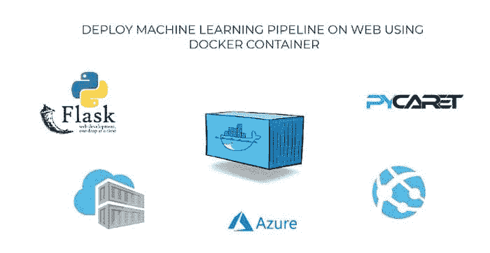

### **回顾**

在我们 [上一篇文章](https://towardsdatascience.com/build-and-deploy-your-first-machine-learning-web-app-e020db344a99)中，我们展示了如何使用 PyCaret 和 Flask 框架在 Python 中开发机器学习管道并将其作为 web 应用进行部署。如果你以前没有听说过 PyCaret，请阅读此 [公告](https://towardsdatascience.com/announcing-pycaret-an-open-source-low-code-machine-learning-library-in-python-4a1f1aad8d46) 以了解更多。

在本教程中，我们将使用之前构建和部署的相同机器学习管道和 Flask 应用。这次我们将演示如何使用 [微软 Azure Web 应用服务](https://azure.microsoft.com/en-us/services/app-service/web/)将机器学习管道作为 web 应用进行部署。

为了在 Microsoft Azure 上部署机器学习管道，我们需要在一个叫做**“Docker”**的软件中将我们的管道容器化。如果你不知道什么是容器化，*没关系*—本教程正是关于这个内容的。

### ???? 本教程的学习目标

+   什么是容器？什么是 Docker？我们为什么需要它？

+   在你的本地计算机上构建 Docker 文件并将其发布到 [Azure 容器注册表 (ACR)](https://azure.microsoft.com/en-us/services/container-registry/)。

+   使用我们上传到 ACR 的容器在 Azure 上部署一个 web 服务。

+   查看一个实际操作中的网络应用，使用训练好的机器学习管道对新的数据点进行实时预测。

在我们上一篇文章中，我们介绍了模型部署的基础知识及其必要性。如果你想了解更多关于模型部署的内容， [点击这里](https://towardsdatascience.com/build-and-deploy-your-first-machine-learning-web-app-e020db344a99) 阅读我们的上一篇文章。

本教程将涵盖从本地构建容器到将其推送到 Azure 容器注册表，再到将我们预训练的机器学习管道和 Flask 应用部署到 Azure Web 服务的整个工作流程。

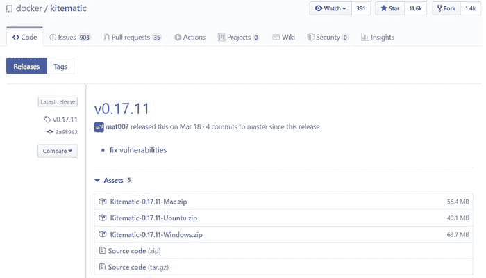

工作流程：创建图像 → 本地构建容器 → 推送到 ACR → 在云端部署应用

### ???? 本教程的工具箱

**PyCaret**

[PyCaret](https://www.pycaret.org/) 是一个开源、低代码的 Python 机器学习库，用于训练和部署机器学习管道和模型到生产环境中。PyCaret 可以通过 pip 轻松安装。

```py
pip install **pycaret**
```

**Flask**

[Flask](https://flask.palletsprojects.com/en/1.1.x/)是一个允许你构建网络应用程序的框架。网络应用程序可以是商业网站、博客、电子商务系统，或者是一个使用训练过的模型实时生成预测的应用程序。如果你没有安装 Flask，可以使用 pip 进行安装。

****Docker****

[Docker](https://www.docker.com/)是一个旨在通过使用容器来简化创建、部署和运行应用程序的工具。容器用于将应用程序及其所有必要组件（例如库和其他依赖项）打包在一起，并将其作为一个整体进行传输。如果你以前没有使用过 Docker，本教程还涵盖了在 Windows 10 上安装 Docker 的过程。

****Microsoft Azure****

[Microsoft Azure](https://azure.microsoft.com/en-ca/overview/what-is-azure/)是一组用于在大规模全球网络上构建、管理和部署应用程序的云服务。其他常用于部署机器学习管道的云服务包括[Amazon Web Services (AWS)](https://aws.amazon.com/)、[Google Cloud](https://cloud.google.com/)、[IBM Cloud](https://www.ibm.com/cloud)和[Alibaba Cloud](https://www.alibabacloud.com/)。我们将在未来的教程中涵盖它们中的大多数。

如果你以前没有使用过 Microsoft Azure，你可以在这里[注册](https://azure.microsoft.com/en-ca/free/search/?&ef_id=EAIaIQobChMIm8Onqp6i6QIViY7ICh2QVA2jEAAYASAAEgK9FvD_BwE:G:s&OCID=AID2000061_SEM_EAIaIQobChMIm8Onqp6i6QIViY7ICh2QVA2jEAAYASAAEgK9FvD_BwE:G:s&dclid=CK6R8aueoukCFVbJyAoduGYLcQ)一个免费账户。当你第一次注册时，你会获得一个 30 天的免费信用额度。你可以通过按照本教程来利用这些信用额度构建你自己的网络应用程序。

### 什么是容器，为什么我们需要它？

你是否遇到过这样的问题：你的 Python 代码（*或任何其他代码*）在你的计算机上运行正常，但当你的朋友尝试运行完全相同的代码时，却无法运行？如果你的朋友重复完全相同的步骤，他们应该得到相同的结果，对吧？这个问题的答案是***环境*。**你朋友的 Python 环境与你的不同。

环境包括什么？→ Python（*或你使用过的任何其他语言*）以及构建和测试应用程序所使用的所有库和依赖项及其确切版本。

如果我们能以某种方式创建一个可以转移到其他计算机（例如：你朋友的计算机或像 Microsoft Azure 这样的云服务提供商）的环境，我们就可以在任何地方重现结果。

因此，**容器**是一种软件，它打包了一个应用程序及其所有依赖项，以便该应用程序在不同的计算环境中可靠地运行。

> “当你想到容器时，就要想到**容器**。”

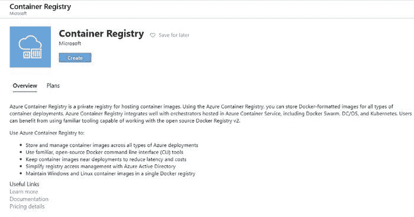

[`www.freepik.com/free-photos-vectors/cargo-ship`](https://www.freepik.com/free-photos-vectors/cargo-ship)

这是理解数据科学中容器的最直观的方式。**它们就像船上的集装箱**，其目标是将一个容器的*内容*与其他容器隔离，以免混淆。这正是数据科学中使用容器的目的。

现在我们理解了容器背后的隐喻，让我们看看创建应用隔离环境的其他选择。一个简单的替代方案是为每个应用程序使用一台独立的机器。

(1 台机器 = 1 个应用 = 无冲突 = 一切正常)

使用单独的机器是直接的，但它无法超越使用容器的好处，因为为每个应用程序维护多台机器是昂贵的，维护起来如同噩梦且难以扩展。简而言之，在许多实际场景中，这并不切实际。

创建隔离环境的另一个替代方案是**虚拟机**。在这里，容器更为可取，因为它们需要更少的资源，非常便携，并且启动速度更快。

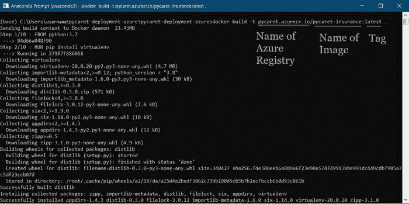

虚拟机 vs. 容器

你能发现虚拟机和容器之间的区别吗？使用容器时，你不需要客操作系统。想象一下在虚拟机上运行 10 个应用程序。这将需要 10 个客操作系统，而使用容器时则无需这些操作系统。

### 我了解容器，但 Docker 是什么？

Docker 是一家提供软件（也称为 Docker）的公司，允许用户构建、运行和管理容器。虽然 Docker 的容器最为常见，但也有其他不那么著名的*替代方案*，如 [LXD](https://linuxcontainers.org/lxd/introduction/) 和 [LXC](https://linuxcontainers.org/)，它们提供容器解决方案。

在本教程中，我们将使用**Docker Desktop for Windows**创建一个容器，并将其发布到 Azure 容器注册表中。然后，我们将使用该容器部署一个 web 应用。


### Docker 镜像 vs. Docker 容器

Docker 镜像和 Docker 容器有什么区别？这是最常被问到的问题，所以让我们马上澄清。虽然有许多技术定义，但直观的理解是将 Docker 镜像看作是创建容器的模具。镜像本质上是容器的快照。

如果你更倾向于稍微技术性的定义，那么可以这样理解：Docker 镜像在运行时会转变为容器，当它们在 Docker 引擎上运行时。

### **打破炒作：**

到头来，Docker 只是一个包含几行指令的文件，保存在你的项目文件夹中，文件名为***“Dockerfile”***。

另一种看待 docker 文件的方法是，它们就像你在自己厨房里发明的食谱。当你与其他人分享这些食谱，并且他们按照完全相同的步骤操作时，他们也能制作出相同的菜肴。同样，你可以将你的 docker 文件分享给其他人，他们可以基于这个 docker 文件创建镜像并运行容器。

现在你已经了解了容器、docker 以及为什么我们应该使用它们，让我们快速设定业务背景。

### 设定业务背景

一家保险公司希望通过更好地预测患者费用来改善现金流预测，方法是使用在住院时的基本人口统计和患者健康风险指标。

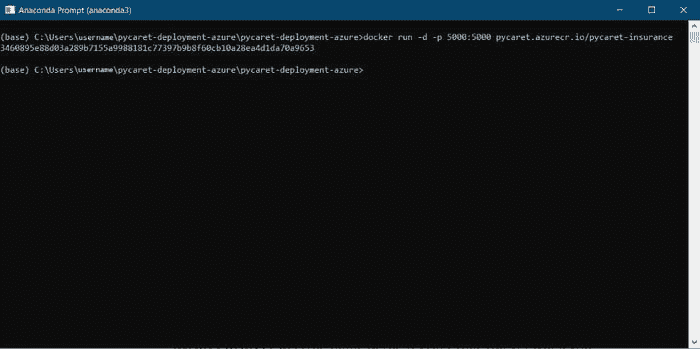

*(*[*数据来源*](https://www.kaggle.com/mirichoi0218/insurance#insurance.csv)*)*

### 目标

构建和部署一个 Web 应用程序，在其中输入患者的基本信息和健康信息，然后输出预测的费用金额。

### 任务

+   训练并开发用于部署的机器学习管道。

+   使用 Flask 框架构建一个 Web 应用程序。它将使用训练好的 ML 管道实时生成新数据点的预测。

+   创建一个 docker 镜像和容器。

+   将容器发布到 Azure 容器注册表（ACR）。

+   通过发布到 ACR，将 Web 应用程序部署到容器中。一旦部署，它将公开可用，并可以通过 Web URL 访问。

由于我们在上一个教程中已经涵盖了前两个任务，我们将快速回顾这些任务，并重点关注上述列表中的剩余任务。如果你对使用 PyCaret 开发机器学习管道和使用 Flask 框架构建 Web 应用程序感兴趣，你可以阅读我们的 [最后一个教程](https://towardsdatascience.com/build-and-deploy-your-first-machine-learning-web-app-e020db344a99)。

### ???? 开发机器学习管道

我们在 Python 中使用 PyCaret 进行机器学习管道的训练和开发，这将作为我们 Web 应用程序的一部分。机器学习管道可以在集成开发环境（IDE）或笔记本中开发。我们使用笔记本运行以下代码：

当你在 PyCaret 中保存模型时，基于在**setup()**函数中定义的配置会创建整个转换管道。所有的相互依赖关系会自动协调。查看存储在‘deployment_28042020’变量中的管道和模型：

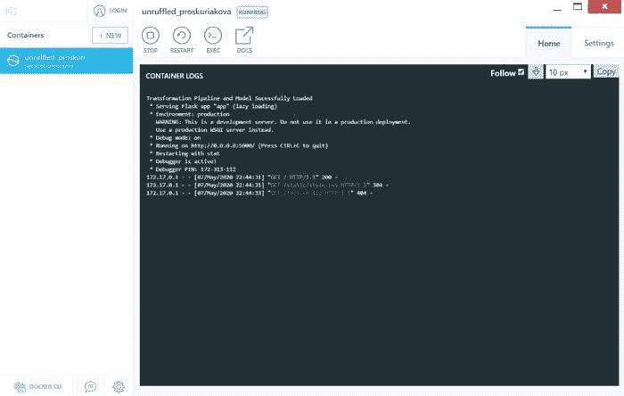

使用 PyCaret 创建的机器学习管道

### ???? 构建 Web 应用程序

本教程不专注于构建 Flask 应用程序。这里只是为了完整性进行讨论。现在我们的机器学习管道已经准备好，我们需要一个可以连接到训练管道以实时生成新数据点预测的网页应用程序。我们使用 Python 中的 Flask 框架创建了这个网页应用程序。这个应用程序分为两个部分：

+   前端（使用 HTML 设计）

+   后端（使用 Flask 开发）

这就是我们的网页应用的样子：

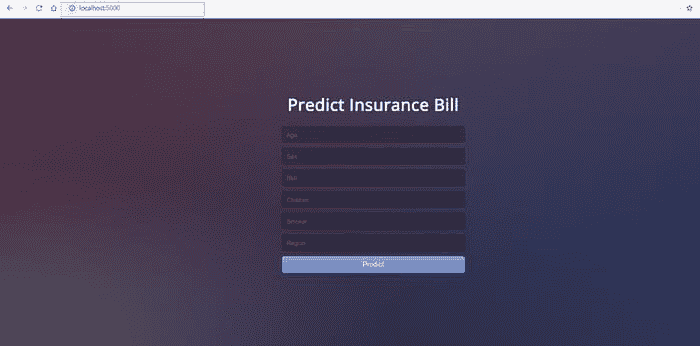

本地机器上打开的网页应用

如果你想查看这个网页应用的实际效果，请 [点击这里](https://pycaret-insurance.herokuapp.com/) 打开一个部署在 Heroku 上的网页应用（*可能需要几分钟才能打开*）。

如果你没有跟随操作，也没关系。你可以从 GitHub 上直接 fork 这个 [代码库](https://github.com/pycaret/deployment-heroku)。如果你不知道如何 fork 一个 repo，请 [阅读这个](https://help.github.com/en/github/getting-started-with-github/fork-a-repo) 官方 GitHub 教程。到这个时候，你的项目文件夹应该是这样的：

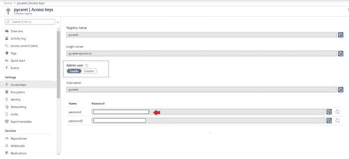

[`github.com/pycaret/deployment-heroku`](https://github.com/pycaret/deployment-heroku)

现在我们有了一个完全功能的网页应用程序，我们可以开始使用 Docker 将应用程序容器化。

### 部署 ML 管道到 docker 容器的 10 个步骤：

### ???? **第 1 步 — 安装 Windows 版 Docker Desktop**

你可以在 Mac 和 Windows 上使用 Docker Desktop。根据你的操作系统，你可以从 [这个链接](https://docs.docker.com/docker-for-windows/install/) 下载 Docker Desktop。在本教程中，我们将使用 Windows 版本的 Docker Desktop。

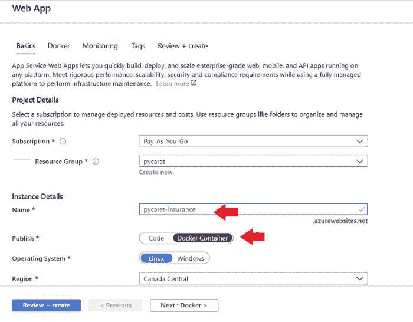

[`hub.docker.com/editions/community/docker-ce-desktop-windows/`](https://hub.docker.com/editions/community/docker-ce-desktop-windows/)

检查安装是否成功的最简单方法是打开命令提示符并输入‘docker’。它应该会打印出帮助菜单。

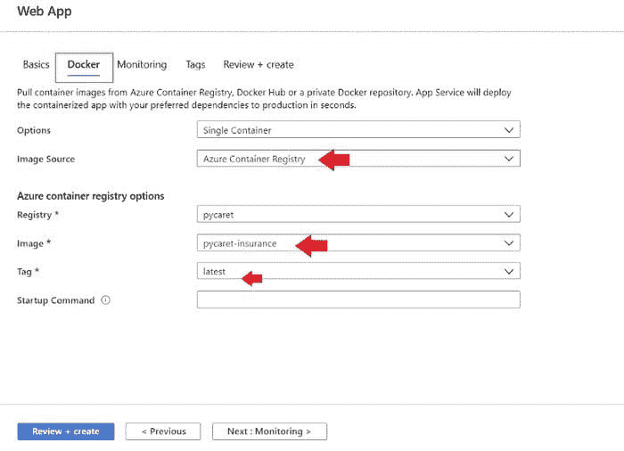

命令提示符

### ???? **第 2 步 — 安装 Kitematic**

Kitematic 是一个直观的图形用户界面（GUI），用于在 Windows 或 Mac 上运行 Docker 容器。你可以从 [Docker 的 GitHub 仓库](https://github.com/docker/kitematic/releases) 下载 Kitematic。

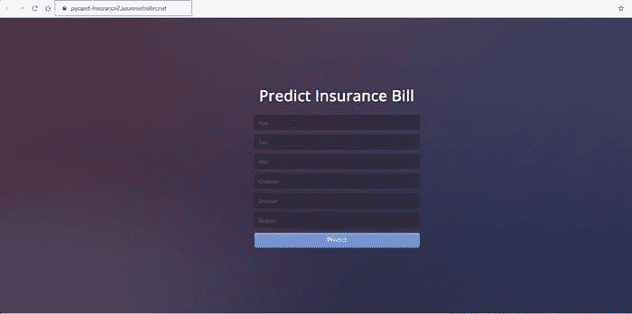

[`github.com/docker/kitematic/releases`](https://github.com/docker/kitematic/releases)

下载后，只需将文件解压到所需位置。

### ???? 第 3 步 — 创建 Dockerfile

创建 Docker 镜像的第一步是创建一个 Dockerfile。Dockerfile 只是一个包含一组指令的文件。这个项目的 Dockerfile 长这样：

Dockerfile 区分大小写，必须与其他项目文件一起放在项目文件夹中。Dockerfile 没有扩展名，可以使用任何编辑器创建。我们使用了 [Visual Studio Code](https://code.visualstudio.com/) 来创建它。

### ???? 第 4 步——创建 Azure 容器注册表

如果你没有 Microsoft Azure 账户或之前未使用过，可以 [注册](https://azure.microsoft.com/en-ca/free/search/?&ef_id=EAIaIQobChMIm8Onqp6i6QIViY7ICh2QVA2jEAAYASAAEgK9FvD_BwE:G:s&OCID=AID2000061_SEM_EAIaIQobChMIm8Onqp6i6QIViY7ICh2QVA2jEAAYASAAEgK9FvD_BwE:G:s&dclid=CK6R8aueoukCFVbJyAoduGYLcQ) 免费注册。当你首次注册时，会获得 30 天的免费信用额度。你可以利用这笔信用额度在 Azure 上构建和部署 web 应用程序。注册后，请按照以下步骤操作：

+   登录到 [`portal.azure.com`](https://portal.azure.com/)。

+   点击“创建资源”。

+   搜索“容器注册表”并点击“创建”。

+   选择订阅、资源组和注册表名称（在我们的例子中：**pycaret.azurecr.io** 是我们的注册表名称）

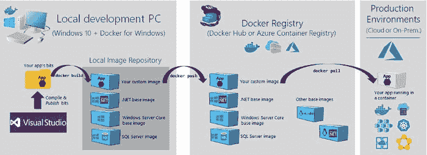

[`portal.azure.com`](https://portal.azure.com/) → 登录 → 创建资源 → 容器注册表

### ???? 第 5 步——构建 Docker 镜像

在 Azure 门户中创建注册表后，第一步是使用命令行构建一个 Docker 镜像。导航到项目文件夹并执行以下代码。

```py
docker build -t pycaret.azurecr.io/pycaret-insurance:latest . 
```


使用 Anaconda 提示符构建 Docker 镜像

+   **pycaret.azurecr.io** 是你在 Azure 门户上创建资源时得到的注册表名称。

+   **pycaret-insurance** 是镜像名称，**latest** 是标签。这个标签可以是你想要的任何名称。

### ???? 第 6 步——从 Docker 镜像运行容器

现在图像已经创建，我们将在本地运行一个容器并测试应用程序，然后再将其推送到 Azure 容器注册表。要在本地运行容器，请执行以下代码：

```py
docker run -d -p 5000:5000 pycaret.azurecr.io/pycaret-insurance
```

一旦此命令成功执行，它将返回创建的容器的 ID。

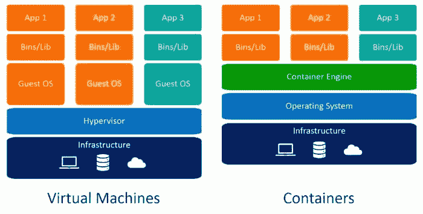

本地运行 Docker 容器

### ???? 第 7 步——在本地计算机上测试容器

打开 Kitematic，你应该能看到一个正在运行的应用程序。

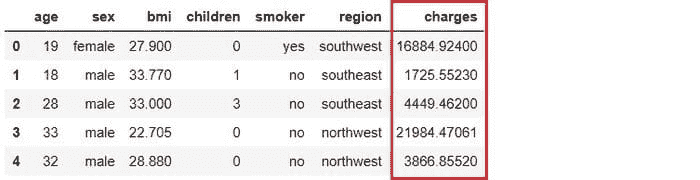

Kitematic — 一个用于在 Mac 和 Windows 操作系统上管理容器的图形用户界面

你可以通过在互联网浏览器中访问 localhost:5000 来查看应用程序的实际效果。它应该会打开一个 web 应用程序。

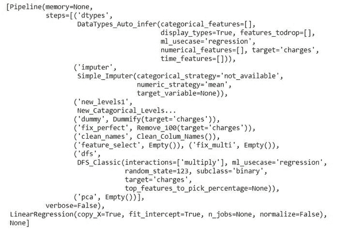

本地容器上运行的应用程序（localhost:5000）

完成后，请确保使用 Kitematic 停止应用程序，否则它会继续占用计算机上的资源。

### ???? 第 8 步——验证 Azure 凭据

在将容器上传到 ACR 之前的最后一步是验证本地计算机上的 Azure 凭据。请在命令行中执行以下代码：

```py
docker login pycaret.azurecr.io
```

系统会提示你输入用户名和密码。用户名是你的注册表名称（在此示例中，用户名为“pycaret”）。你可以在你创建的 Azure Container Registry 资源的访问密钥下找到你的密码。

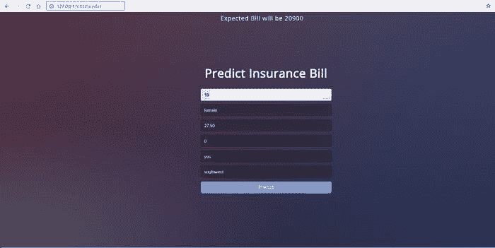

portal.azure.com → Azure Container Registry → 访问密钥

### ???? 第 9 步——将容器推送到 Azure Container Registry

现在你已认证到 ACR，你可以通过执行以下代码将你创建的容器推送到 ACR：

```py
docker push pycaret.azurecr.io/pycaret-insurance:latest
```

根据容器的大小，推送命令可能需要一些时间来将容器传输到云端。

### ???? 第 10 步——创建一个 Azure Web 应用并查看你的模型的实际效果

要在 Azure 上创建 Web 应用，请按照以下步骤操作：

+   登录 [`portal.azure.com`](https://portal.azure.com/)。

+   点击创建资源。

+   搜索 Web 应用并点击创建。

+   将你在（步骤 9 中）推送的 ACR 镜像链接到你的应用。

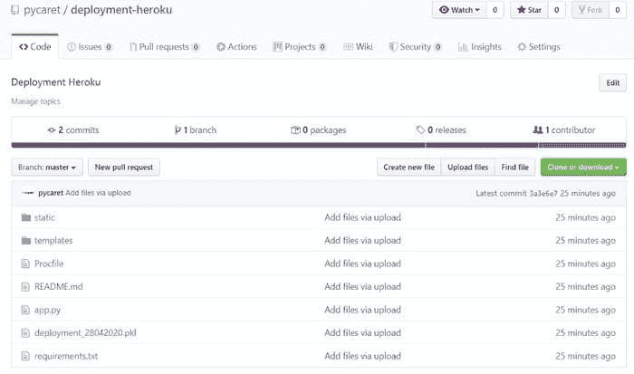

portal.azure.com → Web 应用 → 创建 → 基本设置 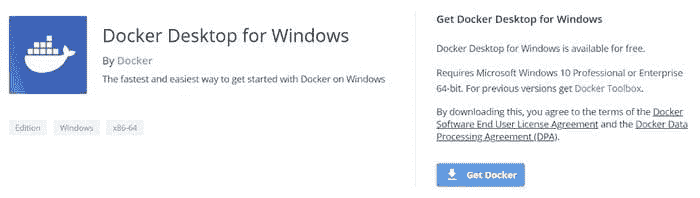

portal.azure.com → Web 应用 → 创建 → Docker

**BOOM!! 现在应用已在 Azure Web Services 上运行。**

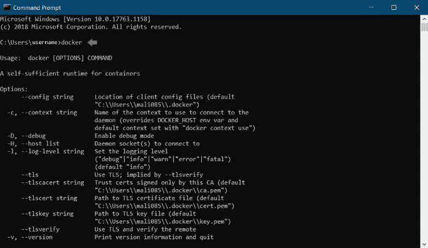

https://pycaret-insurance2.azurewebsites.net

**注意：** 当本故事发布时，来自 [`pycaret-insurance2.azurewebsites.net`](https://pycaret-insurance2.azurewebsites.net/) 的应用将被移除以限制资源消耗。

[**本教程的 GitHub 仓库链接。**](https://github.com/pycaret/pycaret-deployment-azure)

[**GitHub 仓库链接用于 Heroku 部署。**](https://www.github.com/pycaret/deployment-heroku)** *(不使用 docker)* **

### 下一个教程

在下一个关于部署机器学习管道的教程中，我们将深入探讨如何使用 Google Cloud 和 Microsoft Azure 的 Kubernetes 服务来部署机器学习管道。

关注我们的 [LinkedIn](https://www.linkedin.com/company/pycaret/) 并订阅我们的 [YouTube](https://www.youtube.com/channel/UCxA1YTYJ9BEeo50lxyI_B3g) 频道，了解更多关于 PyCaret 的信息。

### 重要链接

+   [用户指南 / 文档](https://www.pycaret.org/guide)

+   [GitHub 仓库](https://www.github.com/pycaret/pycaret)

+   [安装 PyCaret](https://www.pycaret.org/install)

+   [Notebook 教程](https://www.pycaret.org/tutorial)

+   [为 PyCaret 贡献](https://www.pycaret.org/contribute)

### PyCaret 1.0.1 即将到来！

我们收到了来自社区的巨大支持和反馈。我们正在积极改进 PyCaret，并准备我们的下一次发布。**PyCaret 1.0.1 将会更大更好**。如果你想分享你的反馈并帮助我们进一步改进，你可以在网站上[填写这个表格](https://www.pycaret.org/feedback)或在我们的[GitHub](https://www.github.com/pycaret/)或[LinkedIn](https://www.linkedin.com/company/pycaret/)页面留下评论。

### 想了解某个特定模块吗？

从 1.0.0 版本开始，PyCaret 提供了以下模块可供使用。点击下面的链接查看 Python 中的文档和工作示例。

+   [分类](https://www.pycaret.org/classification)

+   [回归](https://www.pycaret.org/regression)

+   [聚类](https://www.pycaret.org/clustering)

+   [异常检测](https://www.pycaret.org/anomaly-detection)

+   [自然语言处理](https://www.pycaret.org/nlp)

+   [关联规则挖掘](https://www.pycaret.org/association-rules)

### 另见：

PyCaret 入门教程在 Notebook 中：

+   [聚类](https://www.pycaret.org/clu101)

+   [异常检测](https://www.pycaret.org/anom101)

+   [自然语言处理](https://www.pycaret.org/nlp101)

+   [关联规则挖掘](https://www.pycaret.org/arul101)

+   [回归](https://www.pycaret.org/reg101)

+   [分类](https://www.pycaret.org/clf101)

### 你想要参与吗？

PyCaret 是一个开源项目，欢迎大家参与。如果你想参与，请随时处理[开放问题](https://github.com/pycaret/pycaret/issues)。拉取请求必须包含 dev-1.0.1 分支上的单元测试。

如果你喜欢 PyCaret，请在我们的[GitHub 仓库](https://www.github.com/pycaret/pycaret)上给我们⭐️。

Medium : [`medium.com/@moez_62905/`](https://medium.com/@moez_62905/machine-learning-in-power-bi-using-pycaret-34307f09394a)

LinkedIn : [`www.linkedin.com/in/profile-moez/`](https://www.linkedin.com/in/profile-moez/)

Twitter : [`twitter.com/moezpycaretorg1`](https://twitter.com/moezpycaretorg1)

**简介: [Moez Ali](https://www.linkedin.com/in/profile-moez/)** 是一名数据科学家，同时也是 PyCaret 的创始人和作者。

[原文](https://towardsdatascience.com/deploy-machine-learning-pipeline-on-cloud-using-docker-container-bec64458dc01)。经许可转载。

**相关：**

+   宣布 PyCaret 1.0.0

+   构建并部署你的第一个机器学习 Web 应用

+   使用 PyCaret 在 Power BI 中进行机器学习

* * *

## 我们的前三个课程推荐

 1\. [谷歌网络安全证书](https://www.kdnuggets.com/google-cybersecurity) - 快速进入网络安全职业轨道。

 2\. [谷歌数据分析专业证书](https://www.kdnuggets.com/google-data-analytics) - 提升你的数据分析技能

 3\. [谷歌 IT 支持专业证书](https://www.kdnuggets.com/google-itsupport) - 支持你的组织 IT 需求

* * *

### 更多相关话题

+   [2024 年顶级 8 大云容器管理解决方案](https://www.kdnuggets.com/the-top-8-cloud-container-management-solutions-of-2024)

+   [调查：机器学习项目仍然经常无法部署](https://www.kdnuggets.com/survey-machine-learning-projects-still-routinely-fail-to-deploy)

+   [使用 Heroku 部署机器学习网页应用](https://www.kdnuggets.com/2022/04/deploy-machine-learning-web-app-heroku.html)

+   [如何成功部署数据科学项目](https://www.kdnuggets.com/2022/01/successfully-deploy-data-science-projects.html)

+   [了解如何设计与部署负责任的人工智能系统](https://www.kdnuggets.com/2023/10/teradata-design-deploy-responsible-ai-systems-whitepaper)

+   [了解如何设计与部署负责任的人工智能系统](https://www.kdnuggets.com/2023/11/teradata-design-deploy-responsible-ai-systems-whitepaper)
