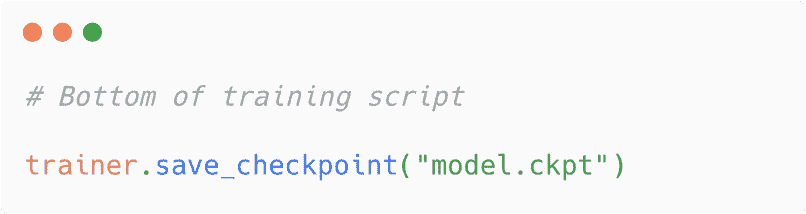
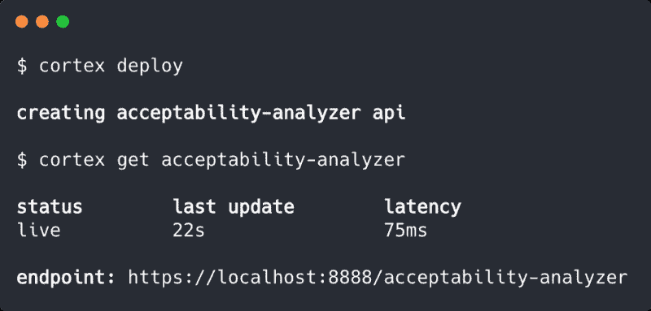
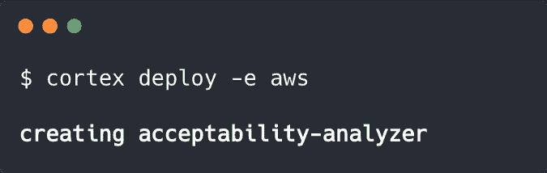
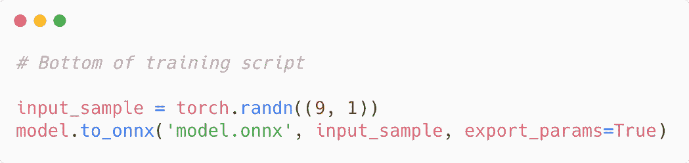
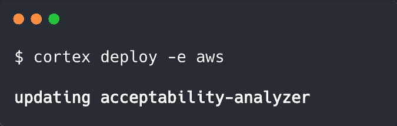

# 如何将 PyTorch Lightning 模型部署到生产环境中

> 原文：[`www.kdnuggets.com/2020/11/deploy-pytorch-lightning-models-production.html`](https://www.kdnuggets.com/2020/11/deploy-pytorch-lightning-models-production.html)

评论

**由 [Caleb Kaiser](https://www.linkedin.com/in/caleb-kaiser-843249126/)，Cortex Labs**

来源: [Pexels](https://www.pexels.com/photo/lightning-over-sea-against-storm-clouds-248775/)

* * *

## 我们的前三大课程推荐

 1\. [Google 网络安全证书](https://www.kdnuggets.com/google-cybersecurity) - 快速进入网络安全职业道路。

 2\. [Google 数据分析专业证书](https://www.kdnuggets.com/google-data-analytics) - 提升你的数据分析能力

 3\. [Google IT 支持专业证书](https://www.kdnuggets.com/google-itsupport) - 支持你的组织的 IT

* * *

从机器学习的角度来看，主要趋势之一是越来越多的项目专注于将软件工程原则应用于机器学习。例如，[Cortex](https://github.com/cortexlabs/cortex) 重新创建了无服务器函数的部署体验，但用于推理管道。类似地，DVC 实现了现代版本控制和 CI/CD 管道，但用于机器学习。

PyTorch Lightning 有类似的理念，只是应用于训练。该框架提供了一个 PyTorch 的 Python 包装器，使数据科学家和工程师可以编写干净、可管理且高效的训练代码。

作为那些部分原因是因为厌倦了编写样板代码而建立了[完整部署平台](https://towardsdatascience.com/why-we-built-a-platform-for-machine-learning-engineering-not-data-science-54004d5b6e95)的人，我们非常喜欢 PyTorch Lightning。怀着这种精神，我整理了这份关于将 PyTorch Lightning 模型部署到生产环境中的指南。在过程中，我们将探讨几种将 PyTorch Lightning 模型导出以纳入推理管道的不同选项。

### 部署 PyTorch Lightning 模型进行推理的所有方式

有三种方法可以将 PyTorch Lightning 模型导出以供服务：

+   将模型保存为 PyTorch 检查点

+   将模型转换为 ONNX

+   将模型导出为 Torchscript

我们可以用 Cortex 服务这三种方式。

### 1\. 直接打包和部署 PyTorch Lightning 模块

从最简单的方法开始，让我们在没有任何转换步骤的情况下部署一个 PyTorch Lightning 模型。

PyTorch Lightning Trainer，一个抽象样板训练代码的类（想想训练和验证步骤），具有一个内置的 save_checkpoint() 函数，可以将你的模型保存为 .ckpt 文件。要将模型保存为检查点，只需将以下代码添加到你的训练脚本中：

来源：作者

现在，在我们开始服务这个检查点之前，重要的是要注意，虽然我一直说“PyTorch Lightning 模型”，但 PyTorch Lightning 是 PyTorch 的一个封装——项目的 README 上明确写道“PyTorch Lightning 只是组织好的 PyTorch”。因此，导出的模型是一个普通的 PyTorch 模型，可以相应地提供服务。

有了保存的检查点，我们可以在 Cortex 中很容易地服务模型。如果你对 Cortex 不熟悉，可以 [在这里快速了解](https://docs.cortex.dev/)，但 Cortex 的部署过程的简单概述是：

+   我们用 Python 为我们的模型编写一个预测 API

+   我们在 YAML 中定义我们的 API 基础设施和行为

+   我们使用 CLI 中的命令部署 API

我们的预测 API 将使用 Cortex 的 Python Predictor 类来定义一个 init() 函数来初始化 API 并加载模型，以及一个 predict() 函数来在查询时提供预测：

相当简单。我们从训练代码中重新利用一些代码，添加一点推理逻辑，仅此而已。需要注意的一点是，如果你将模型上传到 S3（推荐），你需要添加一些逻辑来访问它。

接下来，我们在 YAML 中配置我们的基础设施：

再次，简单。我们给 API 命名，告诉 Cortex 我们的预测 API 在哪里，并分配一些 CPU。

接下来，我们进行部署：

来源：作者

请注意，我们也可以将模型部署到由 Cortex 启动和管理的集群中：

来源：作者

所有部署中，Cortex 会将我们的 API 容器化，并将其公开为网络服务。在云部署中，Cortex 配置负载均衡、自动缩放、监控、更新以及许多其他基础设施功能。

就这样！现在我们有一个实时的 web API，根据请求从我们的模型中提供预测。

### 2\. 导出为 ONNX 并通过 ONNX Runtime 提供服务

现在我们已经部署了一个普通的 PyTorch 检查点，让我们稍微复杂化一下。

PyTorch Lightning 最近增加了一个方便的抽象层，用于将模型导出为 ONNX（之前，你可以使用 PyTorch 内置的转换函数，但需要更多的样板代码）。要将你的模型导出为 ONNX，只需在你的训练脚本中添加这段代码：

来源：作者

请注意，你的输入样本应该模拟实际模型输入的形状。

一旦你导出了 ONNX 模型，你可以使用 Cortex 的 ONNX Predictor 来服务。代码基本相同，过程也完全一样。例如，这是一个 ONNX 预测 API：

基本上是一样的。唯一的区别是，我们不是直接初始化模型，而是通过 onnx_client 访问它，这是 Cortex 启动的一个 ONNX Runtime 容器，用于提供模型服务。

我们的 YAML 看起来也相当相似：

我在这里添加了一个监控标志，只是为了展示配置的简便性，虽然有一些 ONNX 特定的字段，但除此之外，它还是相同的 YAML。

最后，我们使用之前相同的 $ cortex deploy 命令进行部署，我们的 ONNX API 现已上线。

### 3\. 使用 Torchscript 的 JIT 编译器序列化

对于最终部署，我们将 PyTorch Lightning 模型导出到 Torchscript 并使用 PyTorch 的 JIT 编译器进行服务。要导出模型，只需将以下内容添加到你的训练脚本中：

来源：作者

这个 Python API 与普通的 PyTorch 示例几乎一样：

YAML 保持不变，CLI 命令当然也一致。如果需要，我们实际上可以通过简单地用新的脚本替换旧的 predictor.py 脚本，然后重新运行 $ cortex deploy 来更新之前的 PyTorch API：

来源：作者

Cortex 在这里自动执行滚动更新，即启动一个新的 API 然后与旧的 API 交换，防止模型更新之间出现任何停机时间。

就是这样。现在你有一个完全操作的实时推理预测 API，能够从 Torchscript 模型中提供预测。

### 那么，你应该使用哪种方法呢？

这里显而易见的问题是哪个方法表现最好。事实是没有简单的答案，因为这取决于你的模型。

对于像 BERT 和 GPT-2 这样的 Transformer 模型，ONNX 可以提供惊人的优化（我们测得 [在 CPU 上吞吐量提升了 40 倍](https://www.cortex.dev/post/40x-nlp-inference-with-hugging-face-and-onnx)）。对于其他模型，Torchscript 的表现可能优于普通 PyTorch —— 尽管这也有一些 caveats，因为并非所有模型都能顺利导出到 Torchscript。

幸运的是，使用任何选项进行部署都非常简单，你可以同时测试这三种方法，看看哪一种在你的特定 API 上表现最好。

**个人简介：[Caleb Kaiser](https://www.linkedin.com/in/caleb-kaiser-843249126/)** ([@KaiserFrose](https://twitter.com/KaiserFrose)) 是 Cortex Labs 创始团队成员之一，他帮助维护 Cortex。

[原文](https://towardsdatascience.com/how-to-deploy-pytorch-lightning-models-to-production-7e887d69109f)。经许可转载。

**相关内容：**

+   PyTorch 多 GPU 指标库及新 PyTorch Lightning 发布的更多内容

+   Pytorch Lightning vs PyTorch Ignite vs Fast.ai

+   训练 Lightning 快速神经网络的 9 个技巧

### 更多相关内容

+   [入门 PyTorch Lightning](https://www.kdnuggets.com/2022/12/getting-started-pytorch-lightning.html)

+   [深度学习库介绍：PyTorch 和 Lightning AI](https://www.kdnuggets.com/introduction-to-deep-learning-libraries-pytorch-and-lightning-ai)

+   [优先考虑用于生产的数据科学模型](https://www.kdnuggets.com/2022/04/prioritizing-data-science-models-production.html)

+   [Feature Store Summit 2023: 部署机器学习的实用策略](https://www.kdnuggets.com/2023/09/hopsworks-feature-store-summit-2023-practical-strategies-deploying-ml-models-production-environments)

+   [免费使用 Lightning AI Studio](https://www.kdnuggets.com/using-lightning-ai-studio-for-free)

+   [学习如何设计与部署负责任的 AI 系统](https://www.kdnuggets.com/2023/10/teradata-design-deploy-responsible-ai-systems-whitepaper)
