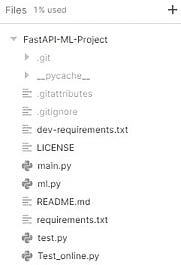
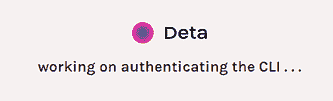
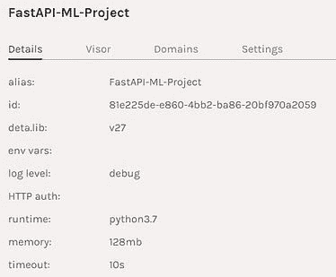
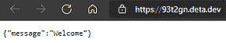

# 部署你的第一个机器学习 API

> 原文：[`www.kdnuggets.com/2021/10/deploying-first-machine-learning-api.html`](https://www.kdnuggets.com/2021/10/deploying-first-machine-learning-api.html)

comments


作者提供的图片 | 元素来自 [vectorjuice](https://www.freepik.com/vectorjuice)

## 介绍

* * *

## 我们的前三大课程推荐

 1\. [谷歌网络安全证书](https://www.kdnuggets.com/google-cybersecurity) - 快速进入网络安全职业生涯。

 2\. [谷歌数据分析专业证书](https://www.kdnuggets.com/google-data-analytics) - 提升你的数据分析能力

 3\. [谷歌 IT 支持专业证书](https://www.kdnuggets.com/google-itsupport) - 支持你的组织的 IT

* * *

在这个项目中，我们将学习如何为你的机器学习模型构建应用程序编程接口（API），然后使用简单的代码进行部署。我花了一个小时来学习 FastAPI，五分钟来学习如何将其部署到 Deta 服务器。我们还将使用 Python ***Request*** 在本地服务器和远程服务器上测试我们的 API。让我们深入了解一下我们将在项目中使用的技术。


作者提供的图片

## spaCy

相较于用于实验和评估的著名 NLTK Python 库，spaCy 在应用和部署方面更为友好。spaCy 提供了预构建的统计神经网络 NLP 模型，具有强大的功能，易于在你的项目中使用和实施，[spaCy](https://spacy.io/)就是这样一个工具。我们将使用一个相对简单的小型预构建英文模型来从我们的文本中提取实体。

## FastAPI

FastAPI 是一个用于构建 Python API 的快速 Web 框架，它具有更快的查询时间、简化的代码，使你可以在几分钟内设计你的第一个 API，[FastAPI](https://fastapi.tiangolo.com/)提供了这些功能。在我们的项目中，我们将学习 FastAPI 的工作原理，以及如何使用我们预构建的模型从英文文本中提取实体。

## Deta

我们将使用 Deta Micros 服务来处理我们的 API，并且在没有 docker 或 YAML 文件的情况下部署我们的项目。Deta 平台提供了易于部署的 CLI、高可扩展性、安全的 API 认证密钥、更改子域名的选项以及 Web 流量的日志记录。这些功能在[Deta](https://www.deta.sh/)上完全免费。在我们的项目中，我们将使用 Deta CLI 通过几行脚本来部署我们的 Fast API。

## 代码

当我学习 FastAPI 时，我偶然发现了 YouTube 上的[视频](https://www.youtube.com/watch?v=1zMQBe0l1bM&t=854s&pp=sAQA)，这激励我写了这篇文章。[Sebastián Ramírez](https://dev.to/tiangolo)解释了 Fast API 是如何工作的，以及它是最快的 Python 网页框架。我们将编写两个 Python 文件，一个包含机器学习模型，另一个包含你的 API 代码。

## 需求

在我们开始之前，我们需要创建一个新的目录，并添加一个*requirements.txt*文件。你可以在下面找到我们将要使用的所有必要库？？？？

```py
fastapi
spacy
uvicorn
https://github.com/explosion/spacy-models/releases/download/en_core_web_sm-3.1.0/en_core_web_sm-3.1.0.tar.gz
```

你可以逐个安装它们，也可以使用？？？？

```py
$ pip install -r requirements.txt
```

我们将为这个项目使用一个预训练的 NLP 模型，因此我们需要从 GitHub 仓库[`github.com/explosion/spacy-models`](https://github.com/explosion/spacy-models)下载，或者只需运行需求文件，它将自动下载并安装。

## 机器学习模型

我们将使用预训练的[Spacy](https://www.analyticsvidhya.com/blog/2021/07/creating-data-science-python-package-using-jupyter-notebook/) NLP 模型来从文本中提取实体。如果你使用 Jupyter notebook，尝试使用*%%writefile*在你的目录中创建 Python 文件。

首先，我们加载了 NLP 模型，然后从 CBS [News](https://www.cbsnews.com/news/gabby-thomas-womens-200-meter-bronze-medal-olympics/)文章中提取实体。只需几行代码，你就可以运行你的第一个机器学习模型。你也可以使用相同的方法加载训练好的模型。

## API 文件

这是你的主文件，其中包含：

1.  **read_main**：使用***GET***，**它从资源请求数据，在我们的例子中，它将显示一条消息，说***欢迎***。**

1.  **class Article**：使用*pydantic* ***BaseModel*** **来定义将用于你的 API 的对象和变量 [(helpmanual.io)](https://pydantic-docs.helpmanual.io/usage/models/)。在我们的例子中，我们将内容定义为字符串，将评论定义为字符串列表。**

1.  **analyze_article**：它接受一个包含评论的文本列表，并使用来自 ml 文件的*NLP*对象显示实体。

*我知道这很复杂，所以让我们将其分解成更小的部分以便更好地理解。*

## 拆解

我们创建了一个 FastAPI 对象，然后使用它作为[装饰器](https://www.python.org/dev/peps/pep-0318/)在你的函数上，使用***@app.get(“/”)***。

+   **@app** 是你 FastAPI 对象的装饰器

+   **.get 或 .post** 是返回数据或处理输入的 HTTP 方法

+   **(“/”)** 是网页服务器上的位置。在我们的例子中，它是主页。如果你想添加另一个目录，你可以使用（"/<new_section>/"）

我们创建了**read_main**函数来在主页上显示消息，就这么简单。

现在我们将创建一个***Article***类，它继承自**BaseModel**。这个函数帮助我们创建我们将用作***POST***方法的参数类型。在我们的例子中，我们将内容创建为字符串变量，将评论创建为字符串列表。

在最后一部分，我们正在创建一个***POST*** 方法（“/article/”）作为我们的 API。这意味着我们将创建一个新部分，该部分将接受作为输入的参数，并在处理后返回结果。

+   **文章类作为参数：**使用文章列表创建文章参数，这将允许我们添加多个文本条目。

+   **从文章中提取数据：**创建循环以从文章列表中提取数据，然后从评论列表中提取数据。它还将评论添加到一个数组中。

+   **将文本加载到 NLP 模型中：**将内容加载到***nlp*** 预训练模型中。

+   **提取实体：**从***nlp*** 对象中提取实体，然后将其添加到***ents*** 数组中。这将堆叠结果。

+   **显示：**该函数将返回实体和评论的列表。

## 测试

Fast API 是在 Uvicorn 上构建的，因此服务器也在 Uvicorn 上运行。在 Jupyter Notebook 中，你可以使用 ???? 运行应用程序，或者在终端中只需输入***uvicorn*** 然后是***main*** 文件和 FastAPI 对象，在我们的例子中是***app***。

我们的服务器运行平稳，所以让我们使用***request.get***方法来访问它。API 正在通过在主页上显示“欢迎”消息来工作。

现在让我们尝试将单个文本和评论作为字典添加到列表中。我们将使用***POST*** 请求方法和***/article/***来访问我们的 NLP 模型函数。将输出转换为***.json()*** 以便于提取数据。

我们有我们的字典键：**[‘ents’, ‘comments’]**

让我们检查一下我们整个输出的样子。看起来我们有***ents*** 和标签及实体的列表。***comments*** 键也是如此。

现在让我们提取单个实体及其文本，以检查我们输出的灵活性。在我们的例子中，我们正在提取输出中的第二个实体。

**结果显示完美。**

## 部署

进入终端，或者你可以在 Jupyter Notebook 单元中执行相同的步骤，但在任何脚本之前添加“**!**”。首先，你需要使用***cd*** 访问包含***main.py*** 和 ***ml.py*** 文件的目录。

```py
cd ~”/FastAPI-ML-Project”
```

**Deta** 所需的三个主要文件是***ml.py***、***main.py*** 和 ***requirments.txt***。



作者提供的图像 | 项目目录

如果你使用**Windows**，请在 PowerShell 中使用以下命令下载并安装 Deta CLI。

```py
iwr [`get.deta.dev/cli.ps1`](https://get.deta.dev/cli.ps1) -useb | iex
```

对于**Linux**

```py
curl -fsSL [`get.deta.dev/cli.sh`](https://get.deta.dev/cli.sh) | sh
```

然后使用***deta login***，它会带你到浏览器并要求你输入*用户名*和*密码*。如果你已经登录，它会在几秒钟内完成认证。

```py
deta login
```



Deta 认证 | [deta](https://www.deta.sh/)

这些**两个词** 在终端中是**魔法词**，它们将在 2 分钟内上传文件并部署你的应用程序。

```py
deta new
```

你的应用程序已上传到一个终点链接。在我们的例子中是 [`93t2gn.deta.dev/`](https://93t2gn.deta.dev/)

```py
Successfully created a new micro{“name”: “FastAPI-ML-Project”,“runtime”: “python3.7”,“endpoint”: “https://93t2gn.deta.dev/",“visor”: “enabled”,“http_auth”: “disable”}Adding dependencies…Collecting fastapi…Successfully installed ……
```

如果看到错误，请使用***deta logs*** 检查日志，进行一些更改后使用***deta deploy*** 来更新更改。

如你所见，我们的应用已在 Deta 服务器上部署并运行。



项目总结 | [deta](https://www.deta.sh/)

你可以访问**Deta**提供的链接自行查看。



作者提供的图像

## 测试 Web API

最后，让我们在 Deta 平台上将我们的远程 API 作为微服务进行测试。这次我们将添加 Deta 端点链接，而不是本地 IP。由于我们没有启用 API 认证，所以可以在没有头部的情况下运行。Deta 还提供免费的 API 密钥，当启用认证时，仅你或拥有 API 密钥的人可以访问 Web 服务器。要了解更多关于认证和子域名的信息，我建议你阅读 [文档](https://docs.deta.sh/docs/home/)。

我们将添加相同的参数和相同的代码，以获得相同的结果，瞧，它起作用了。你的 API 在线并可以通过链接*轻松*访问。

## 结论

在学习 FastAPI 之后，我在思考接下来要做什么，于是一天我在浏览网页时偶然发现了 Deta，这引起了我的注意。安装**Deta CLI**并在远程服务器上部署我的 API 只用了几分钟。我对他们的子域名和免费 API 密钥功能印象深刻。我很快就理解了服务的工作原理以及我将如何在未来的项目中使用它。

我们在学习了一些机器学习模型后都会问这个问题。

> 我知道如何训练我的模型并获取预测，但接下来该怎么办？我如何与他人分享我的模型？以便他们可以查看我所构建的内容，并在他们的项目中使用这些功能。

这就是像**Heroku**、**Google**、**Azure**这样的云平台的作用所在，但这些平台相当复杂，需要学习**Docker**文件的编码，这有时可能会让人感到沮丧。**Deta**通过其简单的两行脚本解决了所有问题，这将使你的应用在几秒钟内部署和运行。

*你还可以查看我关于这个项目的 GitHub 仓库：*[*kingabzpro/FastAPI-ML-Project*](https://github.com/kingabzpro/FastAPI-ML-Project)*。*

> 你可以在 [LinkedIn](https://www.linkedin.com/in/1abidaliawan/) 和 [Polywork](https://www.polywork.com/kingabzpro) 上关注我，我每周都会发布文章。

**个人简介：[Abid Ali Awan](http://abidaliawan.me/)** 是一名认证的数据科学专家，热爱构建机器学习模型并撰写有关最新 AI 技术的博客。

[原文](https://towardsdatascience.com/deploying-your-first-machine-learning-api-1649236c695e)。已获许可转载。

**相关：**

+   用于数据科学项目的 Python APIs

+   使用 Flask 构建 RESTful APIs

+   使用 FastAPI 和 spaCy 构建生产就绪的机器学习 NLP API

### 更多相关话题

+   [停止学习数据科学以寻找目的，并找到目的去…](https://www.kdnuggets.com/2021/12/stop-learning-data-science-find-purpose.html)

+   [学习数据科学的顶级资源](https://www.kdnuggets.com/2021/12/springboard-top-resources-learn-data-science-statistics.html)

+   [一桩 90 亿美元的人工智能失败案例，经过分析](https://www.kdnuggets.com/2021/12/9b-ai-failure-examined.html)

+   [成功数据科学家的 5 个特征](https://www.kdnuggets.com/2021/12/5-characteristics-successful-data-scientist.html)

+   [是什么让 Python 成为初创公司理想的编程语言](https://www.kdnuggets.com/2021/12/makes-python-ideal-programming-language-startups.html)

+   [每个数据科学家都应该知道的三个 R 库（即使你使用 Python）](https://www.kdnuggets.com/2021/12/three-r-libraries-every-data-scientist-know-even-python.html)
