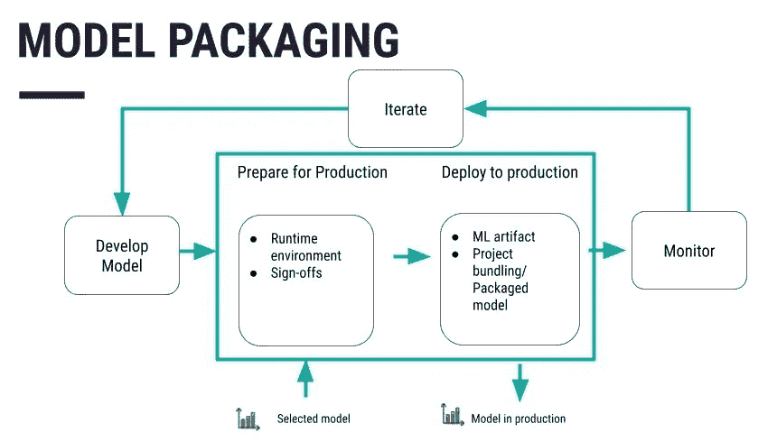
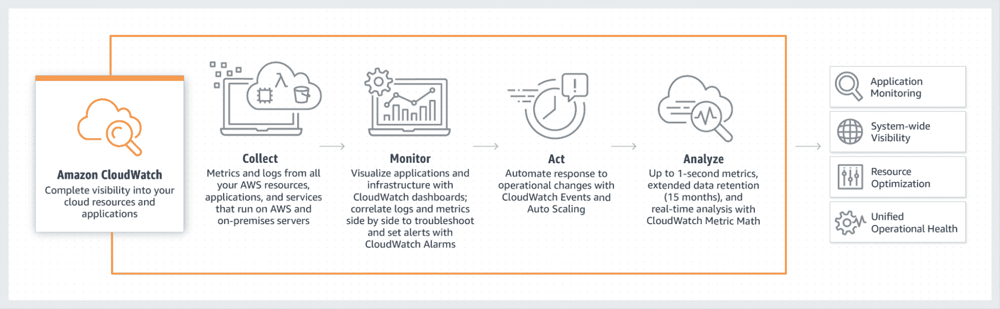
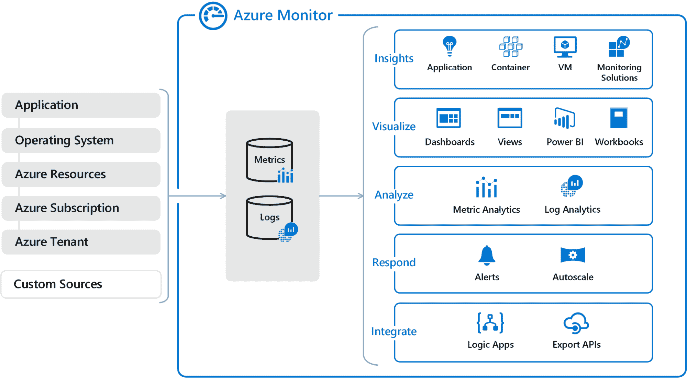

# 部署机器学习模型：逐步教程

> 原文：[`www.kdnuggets.com/deploying-machine-learning-models-a-step-by-step-tutorial`](https://www.kdnuggets.com/deploying-machine-learning-models-a-step-by-step-tutorial)


图片由作者提供

模型部署是将训练好的模型集成到实际应用中的过程。这包括定义所需的环境、指定如何将输入数据引入模型以及模型产生的输出，以及分析新数据并提供相关的预测或分类。让我们探讨生产环境中部署模型的过程。

* * *

## 我们的前三大课程推荐

 1\. [谷歌网络安全证书](https://www.kdnuggets.com/google-cybersecurity) - 快速进入网络安全职业轨道

 2\. [谷歌数据分析专业证书](https://www.kdnuggets.com/google-data-analytics) - 提升你的数据分析技能

 3\. [谷歌 IT 支持专业证书](https://www.kdnuggets.com/google-itsupport) - 支持你的组织的 IT

* * *

## 第 1 步：数据预处理

处理缺失值，可以通过使用均值填补或删除行/列来解决。确保分类变量也从定性数据转换为定量数据，方法包括独热编码或标签编码。规范化和标准化数值特征，将其转换为共同的尺度。

```py
import pandas as pd
from sklearn.impute import SimpleImputer
from sklearn.preprocessing import OneHotEncoder, StandardScaler, MinMaxScaler

# Load your data
df = pd.read_csv('your_data.csv')

# Handle missing values
imputer_mean = SimpleImputer(strategy='mean')
df['numeric_column'] = imputer_mean.fit_transform(df[['numeric_column']])

# Encode categorical variables
one_hot_encoder = OneHotEncoder()
encoded_features = one_hot_encoder.fit_transform(df[['categorical_column']]).toarray()
encoded_df = pd.DataFrame(encoded_features, columns=one_hot_encoder.get_feature_names_out(['categorical_column']))

# Normalize and standardize numerical features
# Standardization (zero mean, unit variance)
scaler = StandardScaler()
df['standardized_column'] = scaler.fit_transform(df[['numeric_column']])

# Normalization (scaling to a range of [0, 1])
normalizer = MinMaxScaler()
df['normalized_column'] = normalizer.fit_transform(df[['numeric_column']])
```

## 第 2 步：模型训练和评估

将数据分为两组：训练数据集和测试数据集，以训练模型。选择一个模型并对使用的数据进行训练。微调超参数以选择性能最佳的机器学习模型。模型的稳定性通过不同子组的数据进行检查，以实施交叉验证。

```py
import pandas as pd
from sklearn.model_selection import train_test_split, GridSearchCV, cross_val_score
from sklearn.ensemble import RandomForestClassifier
from sklearn.metrics import accuracy_score, precision_score, recall_score
from sklearn.impute import SimpleImputer
from sklearn.preprocessing import OneHotEncoder, StandardScaler, MinMaxScaler

# Load your data
df = pd.read_csv('data.csv')

# Split data into training and testing sets
X = df.drop(columns=['target_column'])
y = df['target_column']

X_train, X_test, y_train, y_test = train_test_split(X, y, test_size=0.2, random_state=42)

# Hyperparameter tuning
param_grid = {
    'n_estimators': [50, 100, 200],
    'max_depth': [None, 10, 20, 30],
    'min_samples_split': [2, 5, 10]
}

grid_search = GridSearchCV(estimator=RandomForestClassifier(random_state=42),
                           param_grid=param_grid,
                           cv=5,
                           scoring='accuracy',
                           n_jobs=-1)

# Fit the grid search to the data
grid_search.fit(X_train, y_train)

# Get the best model from the grid search
best_model = grid_search.best_estimator_

# Cross-validation to assess model generalization and robustness
cv_scores = cross_val_score(best_model, X_train, y_train, cv=5, scoring='accuracy')

print(f"Cross-validation scores: {cv_scores}")
print(f"Mean cross-validation score: {cv_scores.mean()}")
```

## 第 3 步：模型打包



来源：[`knowledge.dataiku.com/latest/mlops-o16n/architecture/concept-model-packaging.html`](https://knowledge.dataiku.com/latest/mlops-o16n/architecture/concept-model-packaging.html)

将代码序列化为更适合存储或分发到其他系统的格式。Pickle 是常见的格式之一，另外还有 joblib 和 ONNX 格式，具体取决于用户的需求。在定义和优化模型后，将其存储在文件或数据库中。像 Git 这样的平台也很有用，用于处理变更和修改。采取特定措施，如对存储和传输中的数据进行加密，以防止数据被他人轻易访问。

```py
import joblib

joblib.dump(model, 'model.pkl')
```

将序列化的模型放入如 Docker 这样的容器中。这使得模型具有可移植性，并且更容易将机器学习模型传输到不同的环境中。

```py
# Docker code
FROM python:3.8-slim
COPY model.pkl /app/model.pkl
COPY app.py /app/app.py
WORKDIR /app
RUN pip install -r requirements.txt
CMD ["python", "app.py"]
```

## 第 4 步：部署环境设置

为模型部署设置基础设施和资源，建议使用 AWS、Azure 或 Google Cloud 等云服务。修改托管模型所需的必要组件，如服务器、数据库以及所有可以在所选云平台的云基础设施服务上完成的事项。

**AWS**：使用 AWS CLI 设置 EC2 实例

```py
aws ec2 run-instances \
    --image-id ami-0abcdef1234567890 \
    --count 1 \
    --instance-type t2.micro \
    --key-name MyKeyPair \
    --security-group-ids sg-0abcdef1234567890 \
    --subnet-id subnet-0abcdef1234567890
```

**Azure**：使用 Azure CLI 设置虚拟机

```py
az vm create \
  --resource-group myResourceGroup \
  --name myVM \
  --image UbuntuLTS \
  --admin-username azureuser \
  --generate-ssh-keys
```

**Google Cloud**：使用 Google Cloud CLI 设置 Compute Engine 实例

```py
gcloud compute instances create my-instance \
  --zone=us-central1-a \
  --machine-type=e2-medium \
  --subnet=default \
  --network-tier=PREMIUM \
  --maintenance-policy=MIGRATE \
  --image=debian-9-stretch-v20200902 \
  --image-project=debian-cloud \
  --boot-disk-size=10GB \
  --boot-disk-type=pd-standard \
  --boot-disk-device-name=my-instance
```

## 第 5 步：构建部署管道

使用 Jenkins 或 GitLab CI/CD 等工具来自动化模型部署步骤。设计一系列步骤，以提高部署过程的效率，并在 GitHub Actions 的上下文中使用 Jenkinsfile 或 YAML 配置。

```py
# Using Jenkins for CI/CD pipeline
pipeline {
  agent any
  stages {
    stage('Build') {
      steps {
        sh 'python setup.py build'
      }
    }
    stage('Test') {
      steps {
        sh 'python -m unittest discover'
      }
    }
    stage('Deploy') {
      steps {
        sh 'docker build -t mymodel:latest .'
        sh 'docker run -d -p 5000:5000 mymodel:latest'
      }
    }
  }
}
```

## 第 6 步：模型测试

进行测试以确保模型的所有功能得到适当实现。之后，将预测结果与模型应提供的结果进行比较。检查模型的泛化能力，以确定其在其他新数据上的表现。选择正确的评估标准——准确性、精确度、召回率来与样本数据进行比较。

```py
# Import necessary libraries
from sklearn.metrics import accuracy_score, precision_score, recall_score

# Load your test data 
test_df = pd.read_csv('your_test_data.csv')  

X_test = test_df.drop(columns=['target_column'])
y_test = test_df['target_column']

# Predict outcomes on the test set
y_pred_test = best_model.predict(X_test)

# Evaluate performance metrics
test_accuracy = accuracy_score(y_test, y_pred_test)
test_precision = precision_score(y_test, y_pred_test, average='weighted')
test_recall = recall_score(y_test, y_pred_test, average='weighted')

# Print performance metrics
print(f"Test Set Accuracy: {test_accuracy}")
print(f"Test Set Precision: {test_precision}")
print(f"Test Set Recall: {test_recall}")
```

## 第 7 步：监控和维护

借助 AWS CloudWatch、Azure Monitor 或 Google Cloud Monitoring 等工具，确保模型中没有错误。这将需要展示未来部署的模型应如何修改，以使其更好。

**AWS CloudWatch**

```py
aws cloudwatch put-metric-alarm --alarm-name CPUAlarm --metric-name CPUUtilization \
--namespace AWS/EC2 --statistic Average --period 300 --threshold 70 \
--comparison-operator GreaterThanThreshold --dimensions "Name=InstanceId,Value=i-1234567890abcdef0" \
--evaluation-periods 2 --alarm-actions arn:aws:sns:us-east-1:123456789012:my-sns-topic
```



来源：https://blogs.vmware.com/management/2021/03/cloud-services-aws-cloudwatch-azure-monitor.html

**Azure Monitor**

```py
az monitor metrics alert create --name 'CPU Alert' --resource-group myResourceGroup \
--scopes /subscriptions/{subscription-id}/resourceGroups/{resource-group-name}/providers/Microsoft.Compute/virtualMachines/{vm-name} \
--condition "avg Percentage CPU > 80" --description 'Alert if CPU usage exceeds 80%'
```



来源：https://blogs.vmware.com/management/2021/03/cloud-services-aws-cloudwatch-azure-monitor.html

## 总结

本教程中概述的策略将确保你掌握部署机器学习模型所需的关键步骤。遵循上述步骤，可以使训练好的模型变得可用，并且易于实际部署。从构建模型到配置和验证结构，你现在知道如何将你的机器学习工作从假设变为实际应用。

**[Jayita Gulati](https://www.linkedin.com/in/jayitagulati1998/)** 是一位机器学习爱好者和技术写作专家，她热衷于构建机器学习模型。她拥有利物浦大学计算机科学硕士学位。

### 更多相关话题

+   [逐步教程：构建你的第一个机器学习模型](https://www.kdnuggets.com/step-by-step-tutorial-to-building-your-first-machine-learning-model)

+   [Feature Store 峰会 2023：部署 ML 模型的实用策略](https://www.kdnuggets.com/2023/09/hopsworks-feature-store-summit-2023-practical-strategies-deploying-ml-models-production-environments)

+   [部署你的第一个机器学习模型](https://www.kdnuggets.com/deploying-your-first-machine-learning-model)

+   [将机器学习模型部署到云端生产环境](https://www.kdnuggets.com/deploying-your-ml-model-to-production-in-the-cloud)

+   [在 Heroku 云端部署深度学习 Webapp 的技巧与窍门](https://www.kdnuggets.com/2021/12/tips-tricks-deploying-dl-webapps-heroku.html)

+   [使用 DAGsHub 将 Streamlit WebApp 部署到 Heroku](https://www.kdnuggets.com/2022/02/deploying-streamlit-webapp-heroku-dagshub.html)
