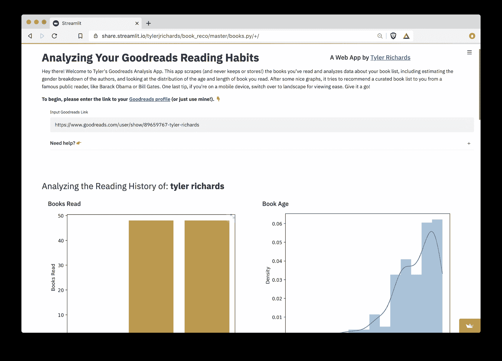
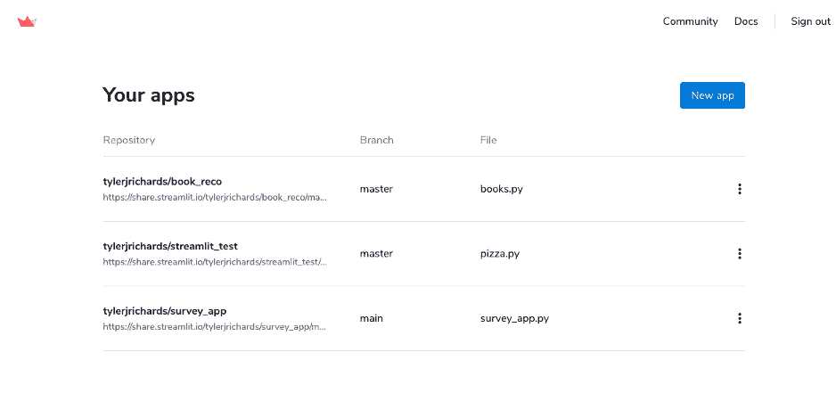
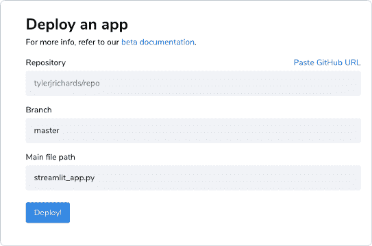

# 使用 Streamlit 分享部署 Streamlit 应用

> 原文：[`www.kdnuggets.com/2020/10/deploying-streamlit-apps-streamlit-sharing.html`](https://www.kdnuggets.com/2020/10/deploying-streamlit-apps-streamlit-sharing.html)

评论

**由[Tyler Richards](https://tylerjrichards.medium.com/)撰写，Facebook 数据科学家**


图片由作者提供

在过去的几周里，我一直在尝试一个新的 Streamlit 功能，叫做 Streamlit 分享，这使得部署自定义应用变得非常简单。我将首先介绍一些背景知识，如果你想开始使用 Streamlit 分享，你可以在[这里](http://docs.streamlit.io/sharing)找到相关文档。

### Streamlit 背景

简单来说，Streamlit 是一个框架，允许你快速而自信地将 Python 脚本转换为 web 应用，对于需要快速分享模型或互动分析的团队数据科学家，或者想向世界展示个人项目的数据科学家来说，它是一个不可思议的工具。如果你想试试，可以查看这个[Streamlit 入门教程](https://docs.streamlit.io/en/stable/)！

我在过去的约 6 个月里一直在使用 Streamlit，它真的非常**有用**。之前，如果我知道在项目结束时需要制作一个 web 应用，我总是选择切换到 R，以便使用出色的 R shiny 框架，尽管我在 Python 编程方面比 R 要好得多。使用 Django 或 Flask 开发总是会有很多摩擦，使得个人项目很少值得这样做，而在工作中也总是花费太多时间。但在使用了 Streamlit 后，我现在不仅有了选择，而且发现自己更喜欢 Python+Streamlit 而不是 R+shiny。

### Streamlit 分享

这让我想起几个月前的事。我开始了一个[数据科学项目](http://www.tylerjrichards.com/books_reco.html)，专注于使用来自[Goodreads](http://www.tylerjrichards.com/books_reco.html)应用的数据分析阅读习惯。我决定尝试 Streamlit，它将一个多天的 Django/Flask 应用在本地运行的过程缩短到了大约半小时的本地 Streamlit 使用。它确实像将你的分析放入脚本中，并在你想在应用中放置图表、小部件或文本解释时调用 Streamlit 函数一样简单。

然而，Streamlit 上最烦人的过程是部署和管理过程。[我跟随的教程](https://towardsdatascience.com/how-to-deploy-a-streamlit-app-using-an-amazon-free-ec2-instance-416a41f69dc3)很简单，而且不会花太多时间，但还是相当繁琐。它需要启动一个 ec2 实例，配置 SSH，使用 tmux，并在每次想要更改 web 应用时都回到终端。**虽然可以完成，但很烦人。**



图片由作者提供

几周前，Streamlit 看到我的 Goodreads 应用，并问我是否想测试他们的 Streamlit 分享测试版，该版旨在消除上述提到的摩擦。我显然答应了。

**我只需做的是：**

1.  将我的应用推送到 Github 仓库

1.  添加一个列出我使用的所有 Python 库的 requirements.txt 文件

1.  通过仓库链接将 Streamlit 指向我的应用

1.  点击部署

真的**如此简单**就能搞定。我预留了几个小时来解决这个问题，因为我预计会出现各种错误（毕竟还在测试版！），但我只花了不到 10 分钟就使其运行起来了。

我目前有三个应用在运行，一个是测试应用，第二个是前面提到的 [Goodreads 图书推荐应用](https://share.streamlit.io/tylerjrichards/book_reco/master/books.py/+/)，第三个是我创建的 [互动分析](http://www.tylerjrichards.com/survey.html)，从构思到功能齐全并部署的网页应用大约用了一个半小时。

转向 Streamlit 分享还为我节省了每月约 $5 的 AWS 账单，我很乐意为这项功能支付这个费用，仅仅是为了节省部署时间。



图片由作者提供

如果我想尝试一个新的应用程序，我只需点击新的应用程序按钮，将其指向我的仓库，它们会处理所有其他事情。



图片由作者提供

如果你的 Streamlit 应用使用了其他包，请确保在你的仓库中包含一个 requirements.txt 文件——否则在部署时会立即出现错误。你可以使用类似 pip freeze 的工具来获取要求，但这会列出环境中的所有包，包括你当前项目中未使用的包。这会减慢你的应用部署速度！所以我建议使用类似 pipreqs 的工具来只保留你的应用核心要求。

```py
pip install pipreqs
pipreqs /home/project/location
```

如果你有 apt-get 需求，请将它们添加到 `packages.txt -` 中，每行一个包。

### 结论

总结一下，Streamlit 分享为我节省了开发时间和托管费用（感谢让这一切成为可能的风险投资基金），使我的个人项目更加互动和美观，并消除了快速部署模型或分析的头痛问题。难怪我成为了 Streamlit 的粉丝。

想查看更多内容吗？你可以在 [Twitter](https://twitter.com/tylerjrichards)、[Substack](https://insignificantdatascience.substack.com/p/starting-a-data-science-newsletter) 或 [我的作品集网站](http://www.tylerjrichards.com/) 找到我。

**快乐的 Streamlit!**

**简历：[Tyler Richards](https://tylerjrichards.medium.com/)** 是 Facebook 的数据科学家。

[原文](https://towardsdatascience.com/deploying-streamlit-apps-using-streamlit-sharing-16105d257852)。转载时已获许可。

**相关：**

+   12 小时机器学习挑战：使用 Streamlit 和 DevOps 工具构建并部署应用程序

+   构建一个使用 TensorFlow 和 Streamlit 生成逼真面孔的应用程序

+   机器学习模型部署

* * *

## 我们的前三个课程推荐

 1\. [谷歌网络安全证书](https://www.kdnuggets.com/google-cybersecurity) - 快速进入网络安全职业道路。

 2\. [谷歌数据分析专业证书](https://www.kdnuggets.com/google-data-analytics) - 提升你的数据分析能力

 3\. [谷歌 IT 支持专业证书](https://www.kdnuggets.com/google-itsupport) - 支持你的组织进行 IT 管理

* * *

### 更多相关话题

+   [使用 DAGsHub 将 Streamlit WebApp 部署到 Heroku](https://www.kdnuggets.com/2022/02/deploying-streamlit-webapp-heroku-dagshub.html)

+   [数据科学家共享代码块的新方法](https://www.kdnuggets.com/2022/03/new-ways-sharing-code-blocks.html)

+   [数据共享平台的 5 个关键组件](https://www.kdnuggets.com/2022/05/5-key-components-data-sharing-platform.html)

+   [在 Heroku 云上部署深度学习 Web 应用程序的技巧与窍门](https://www.kdnuggets.com/2021/12/tips-tricks-deploying-dl-webapps-heroku.html)

+   [2023 年特征存储峰会：部署机器学习的实用策略…](https://www.kdnuggets.com/2023/09/hopsworks-feature-store-summit-2023-practical-strategies-deploying-ml-models-production-environments)

+   [部署你的第一个机器学习模型](https://www.kdnuggets.com/deploying-your-first-machine-learning-model)
