# 将你的机器学习模型部署到云中

> 原文：[`www.kdnuggets.com/deploying-your-ml-model-to-production-in-the-cloud`](https://www.kdnuggets.com/deploying-your-ml-model-to-production-in-the-cloud)

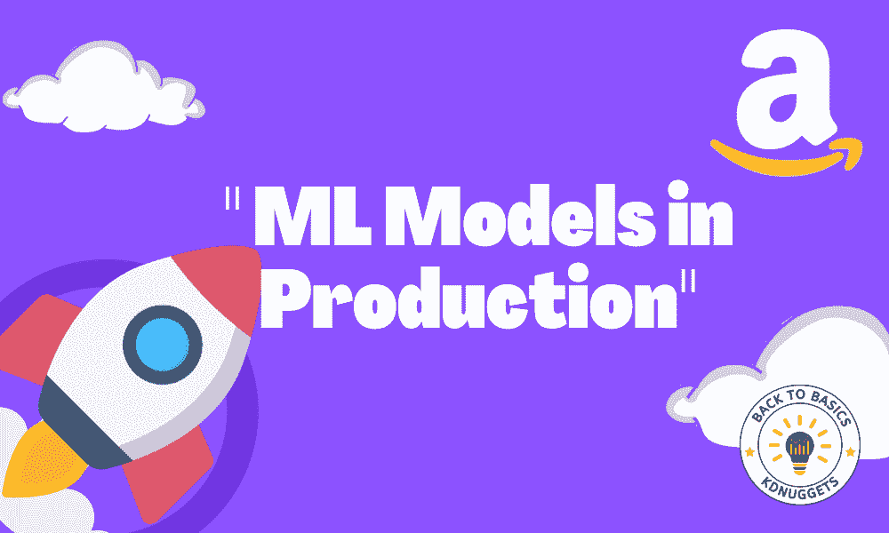

图片来源：编辑

[AWS](https://aws.amazon.com/) 或亚马逊网络服务，是一种用于存储、分析、应用程序、部署服务等的云计算服务。它是一个利用多个服务的平台，以无服务器的方式支持业务，并采用按需付费的方案。

* * *

## 我们的前三大课程推荐

 1\. [谷歌网络安全证书](https://www.kdnuggets.com/google-cybersecurity) - 快速进入网络安全职业生涯。

 2\. [谷歌数据分析专业证书](https://www.kdnuggets.com/google-data-analytics) - 提升你的数据分析技能

 3\. [谷歌 IT 支持专业证书](https://www.kdnuggets.com/google-itsupport) - 支持你的组织 IT

* * *

机器学习建模活动也是 AWS 支持的活动之一。通过多个服务，可以支持建模活动，从开发模型到将其投入生产。AWS 展示了多功能性，这对任何需要扩展性和速度的企业至关重要。

本文将讨论如何在 AWS 云中将机器学习模型部署到生产环境中。我们该如何做到这一点？让我们进一步探索。

# 准备工作

在开始本教程之前，你需要创建一个 [AWS 账户](https://aws.amazon.com/console/)，因为我们需要它来访问所有 AWS 服务。我假设读者将使用免费层来跟随本文。此外，我假设读者已经了解如何使用 Python 编程语言，并具备机器学习的基本知识。同时，我们将重点关注模型部署部分，而不会关注数据科学活动的其他方面，例如数据预处理和模型评估。

牢记这一点，我们将开始在 AWS 云服务中部署你的机器学习模型的旅程。

# 在 AWS 上部署模型

在本教程中，我们将开发一个机器学习模型来预测给定数据的客户流失。训练数据集来自 Kaggle，你可以 [在这里](https://www.kaggle.com/datasets/barun2104/telecom-churn) 下载。

在我们获取数据集之后，我们将创建一个 S3 桶来存储数据集。在 AWS 服务中搜索 S3 并创建桶。

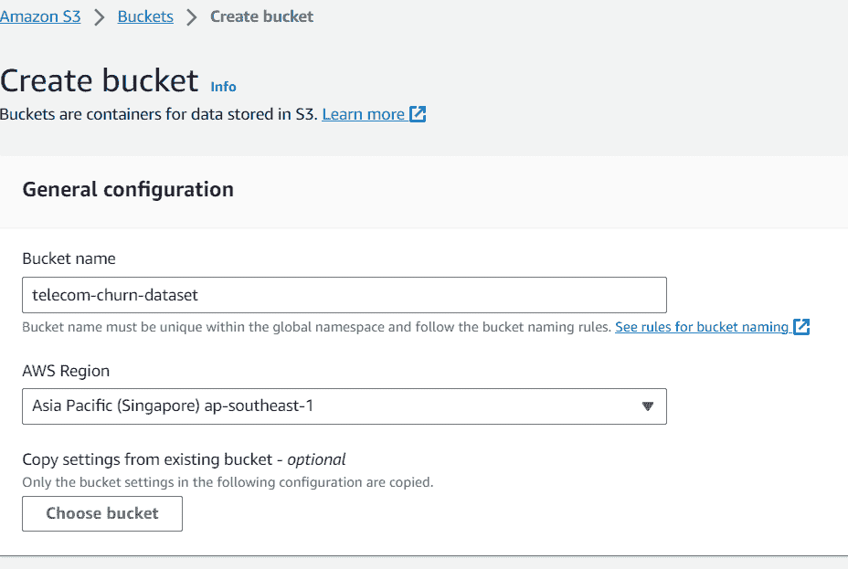

图片来源：作者

在这篇文章中，我将桶命名为“telecom-churn-dataset”，并位于新加坡。你可以根据需要更改这些设置，但暂时就使用这个名称吧。

在你创建好桶并将数据上传到你的桶中后，我们将前往 AWS SageMaker 服务。在这个服务中，我们将使用 Studio 作为我们的工作环境。如果你从未使用过 Studio，我们需要在继续之前创建一个域和用户。

首先，在 Amazon SageMaker 管理配置中选择“Domains”。

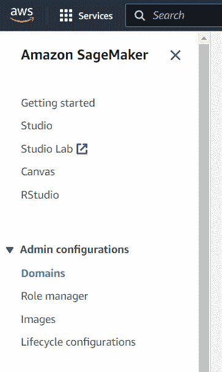

作者提供的图片

在“Domains”中，你会看到很多按钮供选择。在这个屏幕中，选择“Create domain”按钮。


作者提供的图片

如果你想加快创建过程，可以选择快速设置。完成后，你应该会在仪表板中看到一个新的域。选择你刚刚创建的新域，然后点击“Add user”按钮。

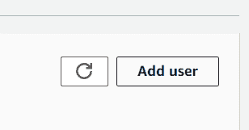

作者提供的图片

接下来，你应该根据你的偏好命名用户配置文件。对于执行角色，你可以先保持默认，因为它是创建域时生成的角色。

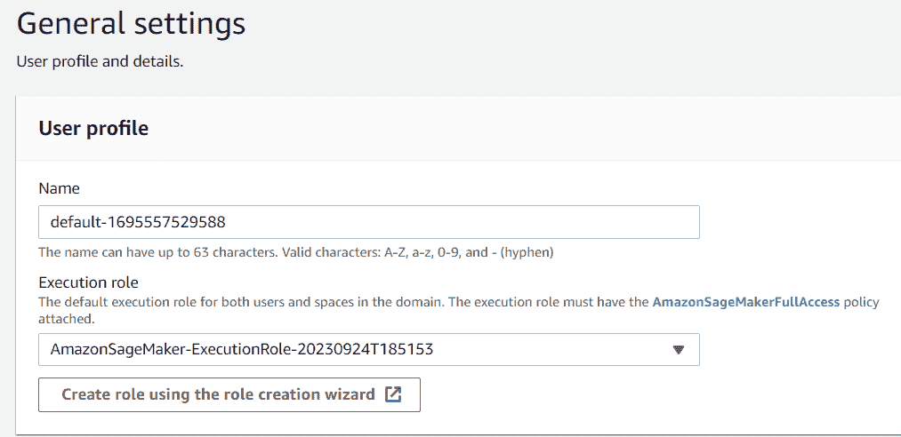

作者提供的图片

只需点击“下一步”直到画布设置。在此部分，我关闭了一些不需要的设置，例如时间序列预测。

一切设置好后，前往 Studio 选择界面，选择你刚刚创建的用户名对应的“Open studio”按钮。

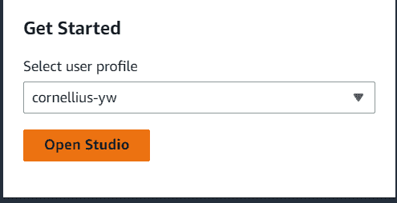

作者提供的图片

在 Studio 中，导航到看起来像文件夹图标的侧边栏，并在其中创建一个新的笔记本。我们可以保持默认设置，就像下面的图片所示。

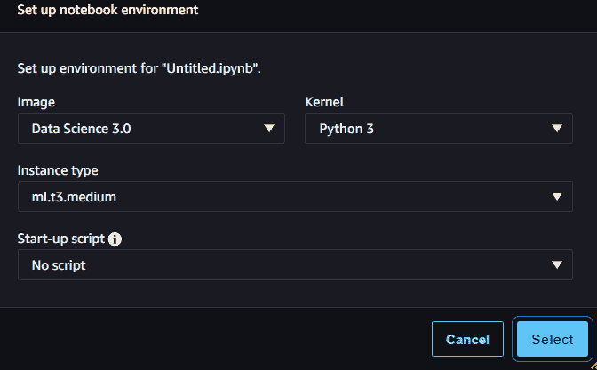

作者提供的图片

使用新的笔记本，我们将创建一个流失预测模型并将模型部署到 API 推断中，以便我们可以在生产中使用。

首先，让我们导入必要的包并读取流失数据。

```py
import boto3
import pandas as pd
import sagemaker

sagemaker_session = sagemaker.Session()
role = sagemaker.get_execution_role()

df = pd.read_csv('s3://telecom-churn-dataset/telecom_churn.csv')
```

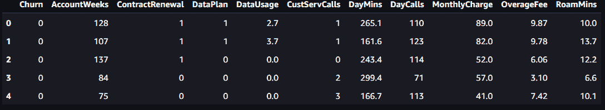

作者提供的图片

接下来，我们将用以下代码将上述数据拆分为训练数据和测试数据。

```py
from sklearn.model_selection import train_test_split

train, test = train_test_split(df, test_size = 0.3, random_state = 42)
```

我们将测试数据设置为原始数据的 30%。通过我们的数据拆分，我们将把它们重新上传到 S3 桶中。

```py
bucket = 'telecom-churn-dataset'

train.to_csv(f's3://{bucket}/telecom_churn_train.csv', index = False)
test.to_csv(f's3://{bucket}/telecom_churn_test.csv', index = False)
```

你可以看到你 S3 桶中的数据，目前包括三个不同的数据集。

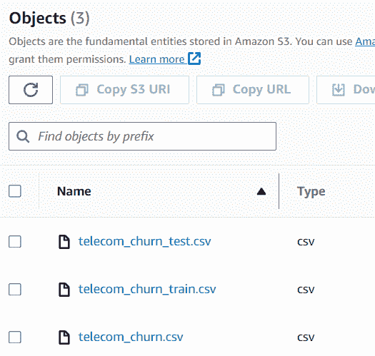

作者提供的图片

数据集准备好后，我们现在将开发一个流失预测模型并进行部署。在 AWS 中，我们通常使用脚本训练方法进行机器学习训练。这就是为什么我们在开始训练之前需要开发一个脚本。

在下一步中，我们需要在同一个文件夹中创建一个额外的 Python 文件，我称之为 train.py。

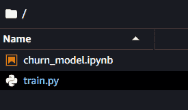

Image by Author

在这个文件中，我们将设置我们的模型开发过程来创建流失模型。对于本教程，我会采用 [Ram Vegiraju](https://github.com/RamVegiraju/SageMaker-Deployment/blob/master/RealTime/Script-Mode/Sklearn/Regression/train.py) 的一些代码。

首先，我们将导入所有开发模型所需的包。

```py
import argparse
import os
import io
import boto3
import json
import pandas as pd

from sklearn.ensemble import RandomForestClassifier
from sklearn.metrics import accuracy_score
import joblib
```

接下来，我们将使用解析器方法来控制我们可以输入到训练过程中的变量。我们将放在脚本中的整体`代码`如下。

```py
if __name__ == '__main__':

    parser = argparse.ArgumentParser()

    parser.add_argument('--estimator', type=int, default=10)
    parser.add_argument('--sm-model-dir', type=str, default=os.environ.get('SM_MODEL_DIR'))
    parser.add_argument('--model_dir', type=str)
    parser.add_argument('--train', type=str, default=os.environ.get('SM_CHANNEL_TRAIN'))

    args, _ = parser.parse_known_args()

    estimator = args.estimator
    model_dir = args.model_dir
    sm_model_dir = args.sm_model_dir
    training_dir = args.train

    s3_client = boto3.client('s3')
    bucket = 'telecom-churn-dataset'

    obj = s3_client.get_object(Bucket=bucket, Key='telecom_churn_train.csv')
    train_data = pd.read_csv(io.BytesIO(obj['Body'].read()))

    obj = s3_client.get_object(Bucket=bucket, Key='telecom_churn_test.csv')
    test_data = pd.read_csv(io.BytesIO(obj['Body'].read()))

    X_train = train_data.drop('Churn', axis =1)
    X_test = test_data.drop('Churn', axis =1)

    y_train = train_data['Churn']
    y_test = test_data['Churn']

    rfc = RandomForestClassifier(n_estimators=estimator)
    rfc.fit(X_train, y_train)
    y_pred = rfc.predict(X_test)

    print('Accuracy Score: ',accuracy_score(y_test, y_pred))

    joblib.dump(rfc, os.path.join(args.sm_model_dir, "rfc_model.joblib"))
```

最后，我们需要实现 SageMaker 进行推断所需的四个不同函数：*model_fn, input_fn, output_fn, 和 predict_fn*。

```py
#Deserialized model to load them

def model_fn(model_dir):
    model = joblib.load(os.path.join(model_dir, "rfc_model.joblib"))
    return model
#The request input of the application
def input_fn(request_body, request_content_type):
    if request_content_type == 'application/json':
        request_body = json.loads(request_body)
        inp_var = request_body['Input']
        return inp_var
    else:
        raise ValueError("This model only supports application/json input")
#The prediction functions
def predict_fn(input_data, model):
    return model.predict(input_data)

#The output function
def output_fn(prediction, content_type):
    res = int(prediction[0])
    resJSON = {'Output': res}
    return resJSON
```

脚本准备好后，我们将运行训练过程。在下一步中，我们将把上面创建的脚本传递给 SKLearn 估算器。这个估算器是一个 SageMaker 对象，它会处理整个训练过程，我们只需要传递所有类似于以下`代码`的参数。

```py
from sagemaker.sklearn import SKLearn

sklearn_estimator = SKLearn(entry_point='train.py', 
                          role=role,
                          instance_count=1, 
                          instance_type='ml.c4.2xlarge',
                          py_version='py3',
                          framework_version='0.23-1',
                          script_mode=True,
                          hyperparameters={
                              'estimator': 15})
sklearn_estimator.fit()
```

如果训练成功，你将会得到以下报告。

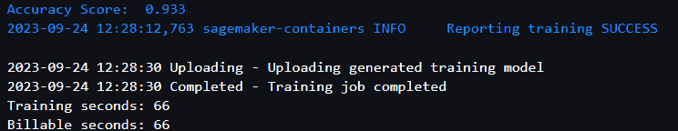

Image by Author

如果你想检查 SKLearn 训练的 Docker 镜像和模型工件的位置，你可以使用以下`代码`访问它们。

```py
model_artifact = sklearn_estimator.model_data
image_uri = sklearn_estimator.image_uri

print(f'The model artifact is saved at: {model_artifact}')
print(f'The image URI is: {image_uri}')
```

模型到位后，我们将把模型部署到一个 API 端点，以便进行预测。为此，我们可以使用以下`代码`。

```py
import time

churn_endpoint_name='churn-rf-model-'+time.strftime("%Y-%m-%d-%H-%M-%S", time.gmtime())

churn_predictor=sklearn_estimator.deploy(initial_instance_count=1,instance_type='ml.m5.large',endpoint_name=churn_endpoint_name)
```

如果部署成功，将创建模型端点，你可以访问它以进行预测。你也可以在 Sagemaker 仪表板中查看这个端点。

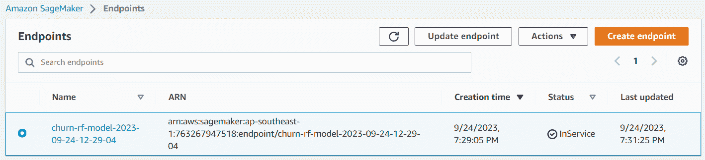

Image by Author

你现在可以通过这个端点进行预测。为此，你可以用以下`代码`测试端点。

```py
client = boto3.client('sagemaker-runtime')
content_type = "application/json"

#replace with your intended input data
request_body = {"Input": [[128,1,1,2.70,1,265.1,110,89.0, 9.87,10.0]]}

#replace with your endpoint name
endpoint_name = "churn-rf-model-2023-09-24-12-29-04" 
#Data serialization
data = json.loads(json.dumps(request_body))
payload = json.dumps(data)

#Invoke the endpoint
response = client.invoke_endpoint(
    EndpointName=endpoint_name,
    ContentType=content_type,
    Body=payload)
result = json.loads(response['Body'].read().decode())['Output']
result
```

祝贺你。你现在已经成功地在 AWS 云中部署了你的模型。测试过程完成后，不要忘记清理端点。你可以使用以下`代码`来完成这个操作。

```py
from sagemaker import Session

sagemaker_session = Session()
sagemaker_session.delete_endpoint(endpoint_name='your-endpoint-name')
```

如果你不再需要，别忘了关闭你使用的实例，并清理 S3 存储。

若要进一步阅读，可以了解更多关于 [SKLearn 估计器](https://sagemaker.readthedocs.io/en/stable/frameworks/sklearn/index.html) 和 [批量转换推理](https://sagemaker-examples.readthedocs.io/en/latest/sagemaker_batch_transform/introduction_to_batch_transform/batch_transform_pca_dbscan_movie_clusters.html)，如果你不想使用终端节点模型。

# 结论

AWS 云平台是一个多用途平台，许多公司用来支持他们的业务。常用的服务之一是数据分析，特别是模型生产。在本文中，我们学习如何使用 AWS SageMaker 以及如何将模型部署到终端节点。

**[Cornellius Yudha Wijaya](https://www.linkedin.com/in/cornellius-yudha-wijaya/)** 是一位数据科学助理经理和数据撰写者。在全职工作于 Allianz Indonesia 的同时，他喜欢通过社交媒体和写作媒体分享 Python 和数据技巧。

### 更多相关话题

+   [Feature Store Summit 2023：部署 ML 的实用策略…](https://www.kdnuggets.com/2023/09/hopsworks-feature-store-summit-2023-practical-strategies-deploying-ml-models-production-environments)

+   [部署你的第一个机器学习模型](https://www.kdnuggets.com/deploying-your-first-machine-learning-model)

+   [在 Heroku 云上部署深度学习 Web 应用的技巧与窍门](https://www.kdnuggets.com/2021/12/tips-tricks-deploying-dl-webapps-heroku.html)

+   [基础回顾加码周：部署到云端](https://www.kdnuggets.com/back-to-basics-bonus-week-deploying-to-the-cloud)

+   [使用 Eurybia 检测数据漂移以确保生产 ML 模型质量](https://www.kdnuggets.com/2022/07/detecting-data-drift-ensuring-production-ml-model-quality-eurybia.html)

+   [使用 MLOps 管理生产中的模型漂移](https://www.kdnuggets.com/2023/05/managing-model-drift-production-mlops.html)
