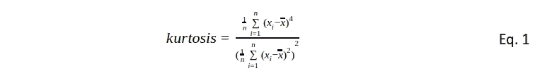
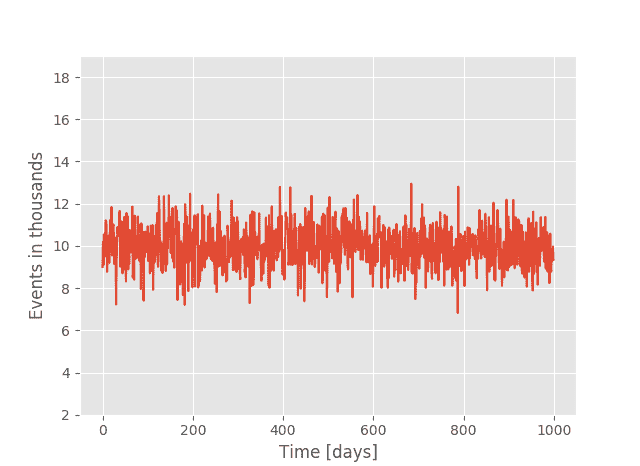
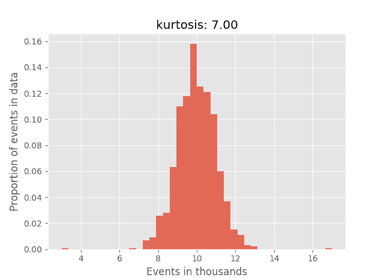

# 描述性统计：数据科学中的强大小巨人

> 原文：[`www.kdnuggets.com/2018/03/descriptive-statistics-mighty-dwarf-data-science.html`](https://www.kdnuggets.com/2018/03/descriptive-statistics-mighty-dwarf-data-science.html)

 评论

**由 [Pawel Rzeszucinski](https://www.linkedin.com/in/pawelrzeszucinski/)、[Codewise.com](http://www.codewise.com/)**


* * *

## 我们的三大课程推荐

 1\. [谷歌网络安全证书](https://www.kdnuggets.com/google-cybersecurity) - 快速进入网络安全职业生涯。

 2\. [谷歌数据分析专业证书](https://www.kdnuggets.com/google-data-analytics) - 提升你的数据分析技能

 3\. [谷歌 IT 支持专业证书](https://www.kdnuggets.com/google-itsupport) - 支持你的组织 IT

* * *

如今，社区中的相当一部分人（通常受商业压力影响）似乎倾向于将一些复杂且计算开销较大的算法应用于过去可以用更简单（因此更快）和更具可解释性（因此商业价值更高）技术轻松处理的应用。在接下来的系列文章中，我将尝试介绍描述性统计的力量和美妙，作为定量描述数据性质并为后续数据调查奠定坚实基础的方法。在这篇文章中，我将介绍强大小巨人的武器之一——“峰度”。

### 介绍

考虑一个监控系统需要在数据中检测异常的情况。通常，人们可能会转向经典的离群点分析方法，如基于 DBSCAN 的方法或 LOF。这些方法本身没有问题，它们可能非常好地指示出离群点可能存在的方向。然而，这些技术可能需要大量计算资源才能在高数据量下在合理的时间内完成任务。一个更快的替代方案是将给定案例视为时间序列分析问题。来自‘健康’条件下运行的系统的数据会有典型的、可接受的幅度分布，在这种情况下，任何偏离预期形状的情况都可能被视为潜在威胁，值得检测。

一种非常快速的描述性统计方法，旨在总结信号分布的形状，被称为“峰度”。用数学术语定义如下：



其中 n 是数据中样本的总数，xi 是数据中的第 i 个样本，x 是数据的样本均值。

通常峰度被认为是信号幅度分布的“峰态”度量。这意味着什么？我们都对高斯分布的钟形曲线非常熟悉。如果高斯信号累积了一些幅度显著更大的样本（冲动），其分布将由于尾部的扩展而变得更加尖锐，即相比纯高斯信号更尖峰。我将在接下来的案例研究中展示这一概念。

### 案例研究

考虑以下案例研究：一家商店记录销售商品的数量作为时间的函数，试图自动检测任何异常需求的存在。

让我们将数据合成一个高斯分布信号，为期一千天，均值集中在 10（销售的商品数量千位）。

```py
import numpy as np
sales = np.random.normal(loc = 10, size = 1000)

```

数据如 *图 1* 所示。



*图 1*

对于任何正态分布的信号，峰度值总是围绕 3 变化。在我们的商店案例中：

```py
from scipy.stats import kurtosis
print(kurtosis(sales, fisher = False)) 
3.0450704320268427

```

**注意：** 一些峰度的实现使用了公式 1 的原始输出，但通常会从峰度值中减去 3，使得高斯信号的峰度值接近 0。这样的实现通常被称为“超额峰度”。后者版本是 SciPy 默认使用的。由于我支持经典的“高斯输出为 3”的方式，因此我将峰度函数的“fisher”参数设置为 False。

除了计算速度快之外，峰度的力量和美在于输出的标准化，这意味着无论信号的绝对幅度如何，即销售的商品数量，峰度值都会保持在高斯信号预期的 3 附近：如果我们将信号的幅度放大 100 倍，峰度仍然在预期范围内：

```py
print(kurtosis(100 * sales, fisher = False))
2.9663203436894965

```

回到案例研究：假设由于需求的季节性变化，我们期望在销售中看到一些异常值。假设在第 200 天，我们看到销售商品的数量大幅上升，随后在第 201 天出现大幅下降（*图 2*）。


*图 2*

我们希望能够自动检测这些事件。这就是数据科学的潜力所在，它会说：“我很高兴能迅速检测到这样的异常！我将使用我的魔法‘峰度’工具。”


让我们创建讨论情境的数据：

```py
sales_spike = sales.copy()
sales_spike[200] = sales_spike [200] + 7
sales_spike[201] = sales_spike [201] - 7 
Applying kurtosis on “sales_spike” results in:
print(kurtosis(sales_spike, fisher = False)
7.0049964681419326
```

非常明显的增加。非常明显的变化。峰度值与冲动的幅度直接成正比，这是该指标的另一个非常有用的属性。

任务完成，没有 CPU 损失——检测非常迅速。

回到峰度的非正式定义，作为分布峰度的度量。比较图 3 和图 4 中显示的“销售”和“销售峰值”的直方图。尽管这两个直方图几乎是由相同的信号生成的，除了“销售峰值”有两个脉冲之外，幅度分布看起来非常不同，其中一个明显显得更尖锐（即具有更高峰度值的那个）相比于另一个。


*图 3* 

*图 4*

### 摘要

峰度在检测数据中的冲动内容方面非常高效，它对数据幅度差异进行了归一化处理，并且计算速度非常快。然而，它确实存在一些缺点，我将在文章中进行讨论。

**简历：[帕维尔·日舍钦斯基](https://www.linkedin.com/in/pawelrzeszucinski/)** 获得了克兰菲尔德大学计算机科学硕士学位和弗罗茨瓦夫理工大学电子学硕士学位。之后他转到曼彻斯特大学，在 QinetiQ 赞助的项目上获得了与直升机齿轮箱诊断相关的数据分析博士学位。回到波兰后，他在 ABB 企业研究中心担任高级科学家，并在汇丰银行战略分析部门担任高级风险建模师。目前，他在 Codewise 担任数据科学家。

**相关：**

+   描述性统计学关键术语解释

+   一些营销人员的统计学小贴士

+   使用 Python 移除异常值的标准差方法

### 更多相关主题

+   [描述性统计学关键术语解释](https://www.kdnuggets.com/2017/05/descriptive-statistics-key-terms-explained.html)

+   [在 Python 中应用描述性和推断性统计](https://www.kdnuggets.com/applying-descriptive-and-inferential-statistics-in-python)

+   [KDnuggets 新闻，7 月 6 日：12 个必备的数据科学 VSCode…](https://www.kdnuggets.com/2022/n27.html)

+   [数据科学的 8 个基本统计概念](https://www.kdnuggets.com/2020/06/8-basic-statistics-concepts.html)

+   [学习数据科学统计的顶级资源](https://www.kdnuggets.com/2021/12/springboard-top-resources-learn-data-science-statistics.html)

+   [数据科学、统计和机器学习词典](https://www.kdnuggets.com/2022/05/data-science-statistics-machine-learning-dictionary.html)
