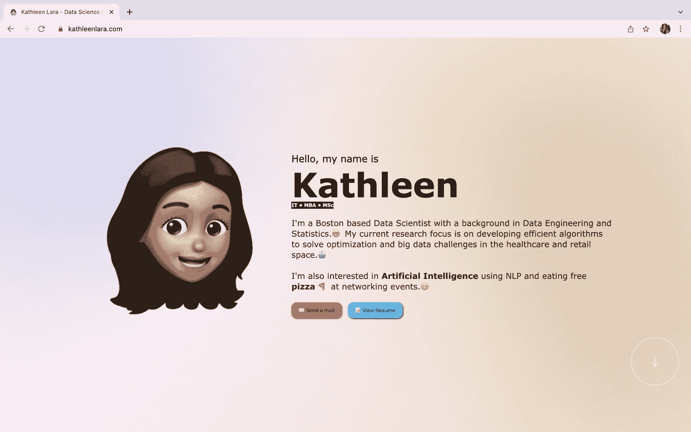
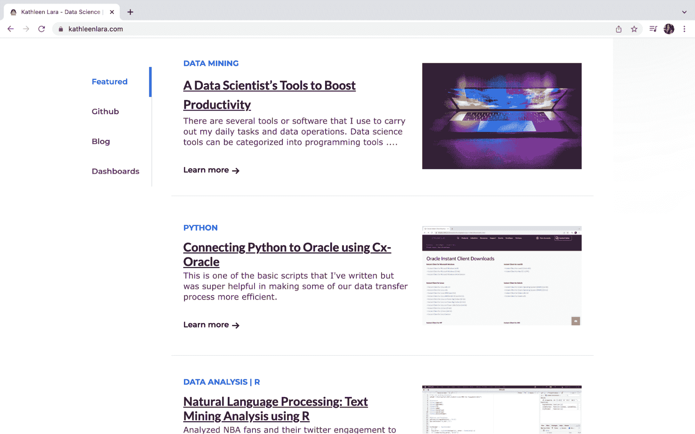
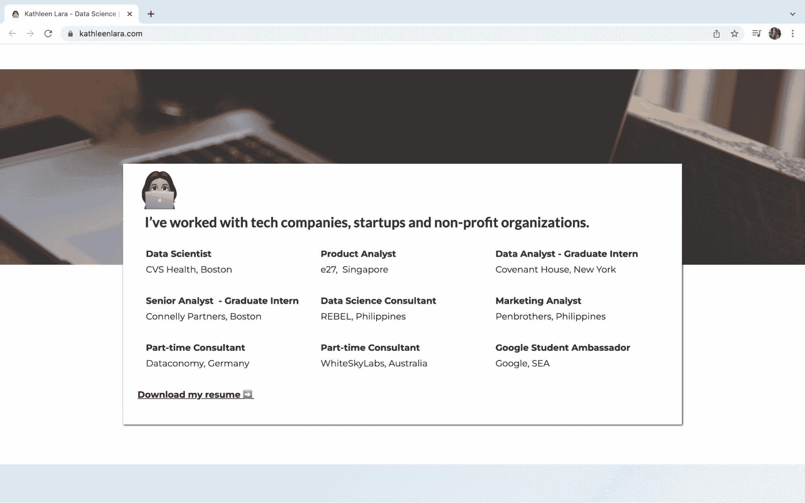
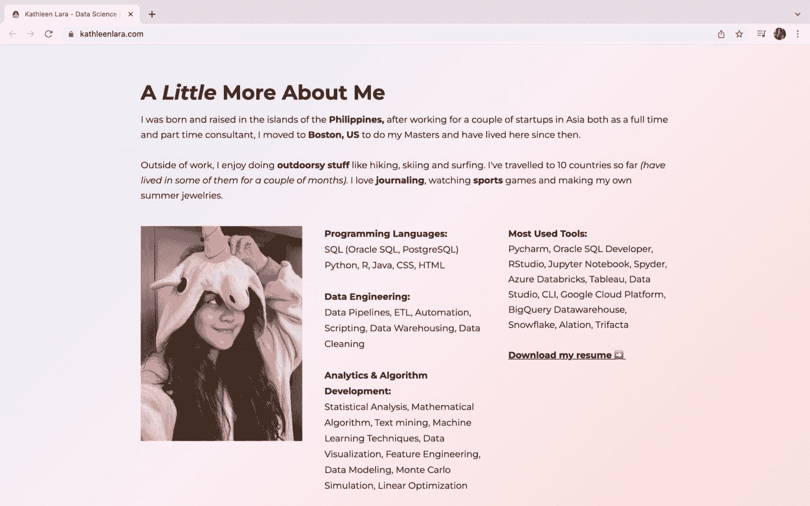
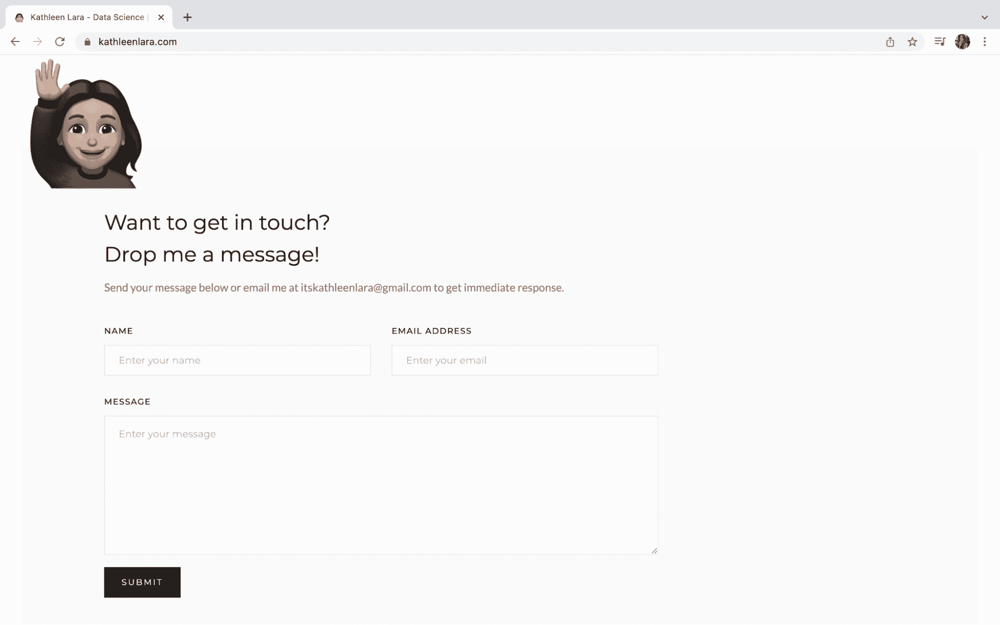

# 如何设计你的数据科学作品集

> 原文：[`www.kdnuggets.com/2022/01/design-data-science-portfolio.html`](https://www.kdnuggets.com/2022/01/design-data-science-portfolio.html)

拥有一个整理得当的作品集对于突出你的工作和讲述你的故事能力至关重要。精心挑选的项目是展示你专业知识和分享经验的最佳方式。

我个人在整合我的项目和找出最佳分享我激情的方式上遇到了一些挑战。数据科学和工程项目通常比较模糊，可能很难展示，在我的情况下，主要分为代码和内容。我将我的源代码放在 Github 页面上，将我的文章放在 Medium 或其他网络上。

* * *

## 我们的前三名课程推荐

 1\. [谷歌网络安全证书](https://www.kdnuggets.com/google-cybersecurity) - 快速进入网络安全职业道路。

 2\. [谷歌数据分析专业证书](https://www.kdnuggets.com/google-data-analytics) - 提升你的数据分析能力

 3\. [谷歌 IT 支持专业证书](https://www.kdnuggets.com/google-itsupport) - 支持你的组织的 IT 工作

* * *

所以我创建了一个个人的五部分作品集。以下是我对每个部分的思考过程。

## 介绍

kathleenlara.com: 介绍部分

我设计了这个部分，想象自己在给别人一个电梯演讲，介绍我自己和我的工作。我添加了 GIF 来代表自己，并提供互动感。*(我想我本可以添加一个我的 GIF，但目前我的自信水平还达不到那种程度！)*

关于背景，最初是白色的。我通常在几乎所有的视觉效果中使用最小化的白色，因为它的安全感与任何东西都相匹配。但是，我不能总是成为习惯的奴隶，所以我决定冒险，彻底使用柔和渐变色。

在那次简短的介绍之后，访客会进行三件事作为下一步。类似于你在现实世界中获得的选项——当你遇到某人时，你要么积极地给他们你的联系方式或名片，这代表着**发送邮件**按钮（*我知道我说得很直接，但无论如何，给我发邮件完全没问题，我喜欢读邮件！*），你可以直接进入，查看更多细节，通过查看**简历**，或者继续进行了解对话，滚动到作品集部分以了解更多。

## 项目

kathleenlara.com: 项目部分

接着我关于自己和兴趣的简短自我介绍，我设计了这一部分来分享更多我所做的事情。在这一部分，我对我的项目进行了分类。第一个是“精选”类别，这是我挑选并展示我最喜欢的作品。其他类别与编码、我撰写的文章以及我的数据可视化有关。

*免责声明：我参与的大多数项目都是保密的，不适合分享，这也解释了为什么我列出的项目有限* **目前**。*我正在尝试寻找时间进行更多个人研究工作。*

我添加了紫色标签，以快速了解项目内容。我还在底部添加了“了解更多”链接，如果你注意到，它们都在点击时打开新标签。我非常注重这个外部标签，因为我希望观众在另一个标签中保留作品集，这样他们可以轻松地返回我的页面，在了解特定项目后进一步探索我的作品集。

## 我曾工作过的公司

kathleenlara.com：我曾工作过的公司部分

我从一句总结性的话开始这一部分，概括了我曾工作过的公司类型。我的目标是突出我以前的角色，并引导观众下载我的简历。我不想用过多的信息淹没他们，因此跳过了职位描述的要点。

## 更多关于我

kathleenlara.com：关于我

你可能会想——为什么把这部分放在底部，而不是在一开始就更多地突出自己？实际上，在现实生活中，我注意到人们在社交活动中的交流和互动有一种模式。*（我应该在这里放一些引人注目的行为统计数据，但由于没有，所以这完全基于我的个人经验* ????*)。首先，你会询问工作情况，他们的职业，然后经过一段时间的交流，逐渐变得更加个人化，这就是为什么我把这一部分放在了底部。

那么，我是如何决定分享哪些个人信息的呢？这实际上是最难写的部分之一，因为我不习惯分享关于我的事，我觉得我在工作之外做的活动并不是**那么**独特。我包含了最基本的信息，包括我所在的地点和我的爱好。我还添加了一张略显不正式的照片，可能与其他部分相比有些不专业，但它为页面增添了更多个性*（我也想展示我的有趣的一面）*。

我列出了我的技能和我最常用的工具，以便给出我的日常工作的概念。这也是一个挑战，因为我不想给人留下“万金油”形象，能做从数据工程到全面数据分析的所有事情，但我认为这些是强大的数据科学家应该具备的一些技能和工具，以便在工作中更高效和富有生产力——必须知道如何深入处理数据。我也在不断进步，但我总是努力学习新事物。

## 联系我

kathleenlara.com：联系我

有两种方式可以联系我，要么复制我的电子邮件地址，要么填写表单。是的，我公开的电子邮件地址仅用于我的公共账户（我有不同的电子邮件地址用于更私密的账户）。

## 作品集改进

我对网页开发不是很擅长，希望我能有更多时间来真正改进我的作品集——但网页设计不是我的强项，我的主要目标只是展示我的工作。我开始使用**Webflow**来节省开发时间，并添加了自己的一些 CSS 和 Javascript 代码来增加额外功能。Webflow 还使得网站的设备响应变得更加容易。虽然有一些相关费用，并且需要一点 UI / UX 开发知识，但还有其他选项，比如 Square Space 或 Wix，对于没有编码或开发经验的用户来说可能更友好。

对我来说，整体上我花了一个周末来构建这个网站，内容和草图已经准备好。我还需要优化作品集中的各个元素，以提高加载速度，特别是在移动设备上。我还需要添加更多项目，或者挑选一些更好的项目来展示——但总体来说，我对目前所建的内容感到满意。

在建立作品集时没有对错之分，一个建议是先考虑你想如何讲述你的故事，然后从那里开始创建框架。

[祝观影愉快！](https://www.kathleenlara.com/)

[用一杯咖啡支持我](https://ko-fi.com/itskathleenlara) ☕

**[Kathleen Lara](https://www.linkedin.com/in/kathleenlara/)** ([@itskathleenlara](https://twitter.com/itskathleenlara)) 是一位来自波士顿的数据科学家，拥有数据工程和统计学背景。[查看她的网站](https://www.kathleenlara.com/)。

### 更多相关内容

+   [托管您的数据科学作品集的五个最佳地方](https://www.kdnuggets.com/2022/07/5-best-places-host-data-science-portfolio.html)

+   [如何作为初学者建立强大的数据科学作品集](https://www.kdnuggets.com/2021/10/strong-data-science-portfolio-as-beginner.html)

+   [Mercury 概述：创建数据科学作品集和……](https://www.kdnuggets.com/2022/05/overview-mercury-creating-data-science-portfolio-notebook-based-webapps.html)

+   [一个数据科学作品集，助你在 2022 年获得工作](https://www.kdnuggets.com/2022/10/data-science-portfolio-land-job-2022.html)

+   [7 个平台免费构建强大数据科学作品集](https://www.kdnuggets.com/2022/10/7-free-platforms-building-strong-data-science-portfolio.html)

+   [5 个提升数据科学作品集的高级项目](https://www.kdnuggets.com/2023/03/5-advance-projects-data-science-portfolio.html)
