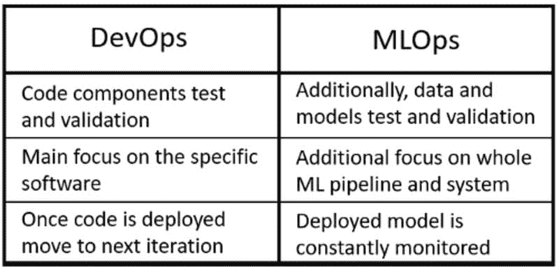
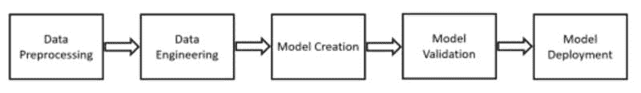
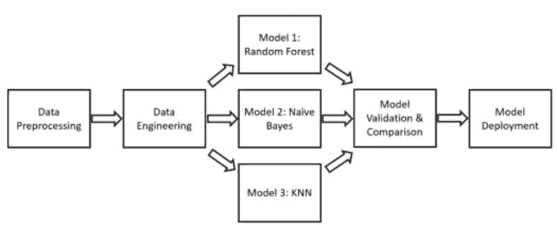
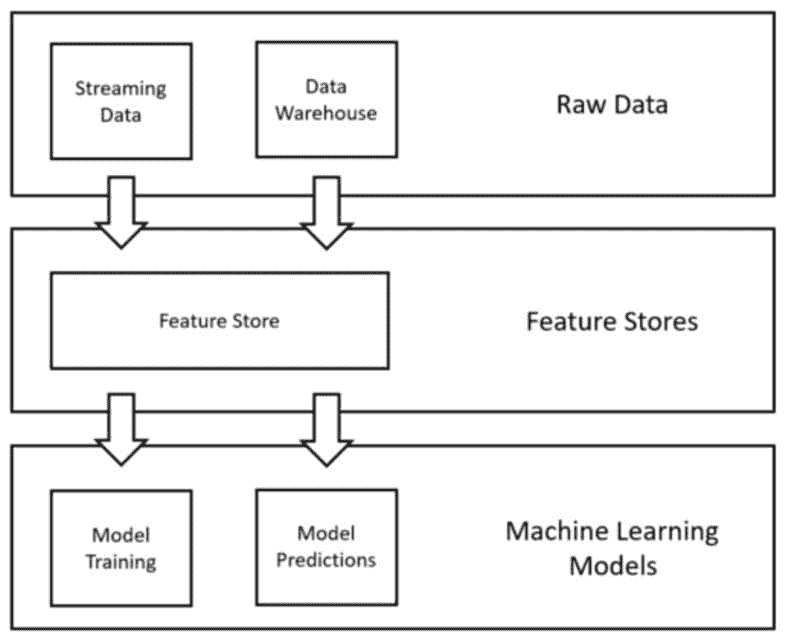
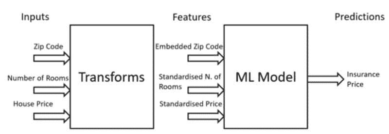
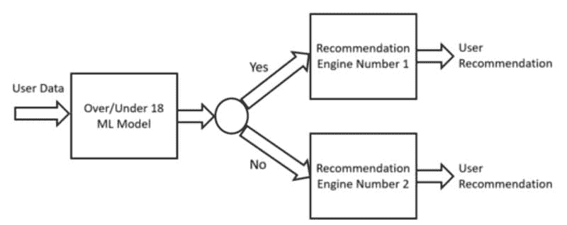

# MLOps 中的机器学习设计模式

> 原文：[`www.kdnuggets.com/2022/02/design-patterns-machine-learning-mlops.html`](https://www.kdnuggets.com/2022/02/design-patterns-machine-learning-mlops.html)

由[Juliana Malta](https://unsplash.com/@julianamalta?utm_source=medium&utm_medium=referral)提供的照片，发布在[Unsplash](https://unsplash.com/?utm_source=medium&utm_medium=referral)

## 介绍

设计模式是一组最佳实践和可重用的解决方案，用于解决常见问题。数据科学和其他领域，如软件开发、架构等，都由大量重复出现的问题组成，因此尝试对最常见的问题进行分类，并提供不同形式的蓝图以便于识别和解决，这将为更广泛的社区带来巨大的好处。

使用设计模式的想法最早由 Erich Gamma 等人提出于“*设计模式：可重用面向对象软件的元素*”*[1]，并在最近通过 Sara Robinson 等人应用于机器学习过程中的“*机器学习设计模式*”*[2]。

在本文中，我们将探索构成**MLOps**的不同设计模式。MLOps（机器学习 -> 操作）是一组旨在将实验性的机器学习模型转化为生产化服务的过程，准备在现实世界中做出决策。从本质上讲，MLOps 基于与 DevOps 相同的原则，但额外关注数据验证和持续培训/评估（见图 1）。

图 1：DevOps 和 MLOps（图由作者提供）。

MLOps 的主要好处之一是：

+   改善市场时间（更快的部署）。

+   增强模型的鲁棒性（更容易识别数据漂移、重新训练模型等）。

+   更大的灵活性来训练/比较不同的 ML 模型。

另一方面，**DevOps**强调软件开发的两个关键概念：持续集成（CI）和持续交付（CD）。持续集成专注于使用中央代码库作为团队协作的手段，并尽可能自动化新代码的添加、测试和验证过程。通过这种方式，可以随时测试应用程序的不同部分是否能正确通信，并尽早识别任何形式的错误。而持续交付则专注于平稳地更新软件部署，尽量避免任何形式的停机。

## MLOps 设计模式

### 工作流程管道

机器学习（ML）项目由许多不同的步骤构成（见图 2）。

图 2：ML 项目关键步骤（图像由作者提供）。

在原型设计新模型时，通常会先使用一个单独的脚本（**整体式**）来编码整个过程，但随着项目复杂性的增加以及更多团队成员的参与，可能会有必要将项目的每个不同步骤划分到单独的脚本中（**微服务**）。采取这种方法的一些好处包括：

+   更容易对不同步骤的编排进行变更实验。

+   通过定义使项目可扩展（可以轻松添加和删除新步骤）。

+   每个团队成员可以专注于流程中的不同步骤。

+   可以为每个不同的步骤创建独立的工件。

工作流管道设计模式旨在定义创建 ML 管道的蓝图。ML 管道可以表示为 **有向无环图（DAG）**，其中每个步骤都以一个容器为特征（见图 3）。

图 3：有向无环图示例（图像由作者提供）。

遵循这种结构，可以创建可重复和可管理的 ML 过程。使用工作流管道的一些好处包括：

+   通过在流程中添加和删除步骤，可以创建复杂的实验来测试不同的预处理技术、机器学习模型和超参数。

+   单独保存每个不同步骤的输出，可以避免在管道开始阶段重新运行步骤，如果有任何更改仅在最后几个步骤中（从而节省时间和计算资源）。

+   如果出现错误，可以很容易识别出可能需要更新的步骤。

+   一旦通过 CI/CD 部署到生产环境，管道可以根据不同因素进行调度重新运行，例如：时间间隔、外部触发器、机器学习指标的变化等。

### 特征存储

特征存储是为机器学习过程设计的数据管理层（见图 4）。这种设计模式的主要用途是简化组织管理和使用机器学习特征的方式。这是通过创建某种形式的中央存储库来实现的，公司用它来存储为 ML 过程创建的所有特征。这样，如果数据科学家需要在不同的 ML 项目中使用相同的特征子集，他们就不必多次将原始数据转换为处理过的特征（这可能非常耗时）。两个最常见的开源特征存储解决方案是 [Feast](https://feast.dev/) 和 [Hopsworks](https://www.hopsworks.ai/)。

图 4：特征存储设计模式（图像由作者提供）。

关于特征存储的更多信息可以在[我的上一篇文章](https://towardsdatascience.com/getting-started-with-feature-stores-121006ee81c9)中找到。

### 转换

转换设计模式旨在通过将输入、特征和转换保持为独立实体（图 5），使在生产中部署和维护机器学习模型变得更加容易。原始数据通常需要经过不同的预处理步骤，然后才能作为机器学习模型的输入，一些这些转换需要保存下来，以便在为推理预处理数据时重用。

图 5：输入和特征关系（图像由作者提供）。

例如，归一化/标准化技术通常应用于数值数据，以处理异常值并使数据更接近高斯分布。在训练 ML 模型之前，这些转换应保存下来，以便在未来处理新数据进行推理时可以重用。如果这些转换未保存，就会在训练和推理之间产生数据偏差，因为用于推理的输入数据与用于训练 ML 模型的输入数据的分布不同。

为了避免训练和服务之间出现任何类型的偏差，可以使用特征存储设计模式作为替代解决方案。

### 多模态输入

可以使用不同类型的数据（例如图像、文本、数字等）来训练 ML 模型，尽管某些类型的模型只能接受特定类型的输入数据。例如，Resnet-50 只能接受图像作为输入数据，而其他 ML 模型如 KNN（K 最近邻）则只能接受数值数据作为输入。

为了解决 ML 问题，可能需要使用不同形式的输入数据。在这种情况下，需要应用某种形式的转换，以创建所有不同类型输入数据的共同表示（多模态输入设计模式）。例如，假设我们获得了一组合成的文本、数值和分类数据。为了训练 ML 模型，我们可以使用情感分析、词袋模型或词嵌入等技术将文本数据转换为数值格式，并使用独热编码将分类数据转换为数值格式。这样，我们的所有数据就会以相同的格式（数值型）准备好进行训练。

### 级联

在某些场景下，仅用一个机器学习模型可能无法解决问题。在这种情况下，可能需要创建一系列相互依赖的机器学习模型以实现最终目标。例如，假设我们要预测推荐给用户的商品类型（图 6）。为了解决这个问题，我们首先要创建一个模型来预测用户是否超过 18 岁，然后根据该模型的响应，将我们的流程路由到两个不同的机器学习推荐引擎中的一个（一个用于推荐给 18 岁以上用户，另一个用于推荐给 18 岁以下用户）。

图 6：级联设计模式（图片来源：作者）。

为了创建这个*级联*的机器学习模型，我们需要确保它们一起训练。实际上，由于它们之间的依赖性，如果第一个模型发生变化（而其他模型没有更新），这可能会导致后续模型的不稳定。这种过程可以使用工作流管道设计模式来自动化。

## 结论

在本文中，我们探讨了支撑 MLOps 的一些常见设计模式。如果你对机器学习中的设计模式感兴趣，可以查阅 [this talk](https://www.youtube.com/watch?v=_Ni6JWdeCew) ，由 Valliappa Lakshmanan 在 AIDevFest20 上演讲，以及《机器学习设计模式》一书的公开 [GitHub 仓库](https://github.com/GoogleCloudPlatform/ml-design-patterns)。

## 联系方式

如果你想跟进我最新的文章和项目，*请在 Medium 上关注我* [follow me on Medium](https://pierpaoloippolito28.medium.com/subscribe) ，并订阅我的 [邮件列表](http://eepurl.com/gwO-Dr?source=post_page---------------------------)。以下是我的一些联系信息：

+   [Linkedin](https://uk.linkedin.com/in/pier-paolo-ippolito-202917146?source=post_page---------------------------)

+   [个人网站](https://pierpaolo28.github.io/?source=post_page---------------------------)

+   [Medium Profile](https://towardsdatascience.com/@pierpaoloippolito28?source=post_page---------------------------)

+   [GitHub](https://github.com/pierpaolo28?source=post_page---------------------------)

+   [Kaggle](https://www.kaggle.com/pierpaolo28?source=post_page---------------------------)

## 参考文献

[1] “设计模式：可重用面向对象软件的元素”（Addison-Wesley，1995）。访问链接： [www.uml.org.cn/c%2B%2B/pdf/DesignPatterns.pdf](http://www.uml.org.cn/c%2B%2B/pdf/DesignPatterns.pdf)

[2] “机器学习设计模式”（Sara Robinson 等，2020）。访问链接： [`www.oreilly.com/library/view/machine-learning-design/9781098115777/`](https://www.oreilly.com/library/view/machine-learning-design/9781098115777/)

**[Pier Paolo Ippolito](https://www.linkedin.com/in/pierpaolo28/)** 是一位数据科学家，并拥有南安普顿大学的人工智能硕士学位。他对人工智能的进展和机器学习应用（如金融和医学）充满兴趣。与他在 [Linkedin](https://www.linkedin.com/in/pierpaolo28/) 上联系。

[原文](https://towardsdatascience.com/design-patterns-in-machine-learning-for-mlops-a3f63f745ce4)。经许可转载。

* * *

## 我们的前三个课程推荐

 1\. [谷歌网络安全证书](https://www.kdnuggets.com/google-cybersecurity) - 快速进入网络安全职业道路。

 2\. [谷歌数据分析专业证书](https://www.kdnuggets.com/google-data-analytics) - 提升你的数据分析技能

 3\. [谷歌 IT 支持专业证书](https://www.kdnuggets.com/google-itsupport) - 支持你的组织 IT 需求

* * *

### 更多相关内容

+   [揭示隐藏模式：层次聚类简介](https://www.kdnuggets.com/unveiling-hidden-patterns-an-introduction-to-hierarchical-clustering)

+   [设计有效且可靠的机器学习系统！](https://www.kdnuggets.com/2023/05/manning-design-effective-reliable-machine-learning-systems.html)

+   [学习系统设计：五本必读书籍](https://www.kdnuggets.com/learning-system-design-top-5-essential-reads)

+   [优化和管理机器学习生命周期的十大 MLOps 工具](https://www.kdnuggets.com/2022/10/top-10-mlops-tools-optimize-manage-machine-learning-lifecycle.html)

+   [像老板一样进行 MLOps：无泪的机器学习指南](https://www.kdnuggets.com/2023/06/mlops-like-boss-guide-machine-learning-without-tears.html)

+   [25 个免费课程，掌握数据科学、数据工程、机器学习……](https://www.kdnuggets.com/25-free-courses-to-master-data-science-data-engineering-machine-learning-mlops-and-generative-ai)
