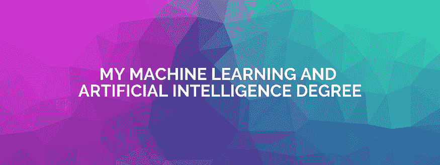

# 我设计了自己的机器学习和人工智能学位

> 原文：[`www.kdnuggets.com/2020/05/designed-machine-learning-ai-degree.html`](https://www.kdnuggets.com/2020/05/designed-machine-learning-ai-degree.html)

评论

**由[Angelica Dietzel](https://medium.com/@angelicacodes)撰写，数据科学自学之旅**。

* * *

## 我们的前三名课程推荐

 1\. [谷歌网络安全证书](https://www.kdnuggets.com/google-cybersecurity) - 快速进入网络安全职业。

 2\. [谷歌数据分析专业证书](https://www.kdnuggets.com/google-data-analytics) - 提升你的数据分析技能

 3\. [谷歌 IT 支持专业证书](https://www.kdnuggets.com/google-itsupport) - 支持你的组织的 IT

* * *

在发现我大学的编程课程过时后，我决定利用在线资源自学机器学习和人工智能。没有技术经验和之前的学位，我从头到尾设计了以下机器学习和人工智能学位，以实现我的目标：成为一个全面的机器学习和人工智能工程师。

### 我的目标

+   **为世界带来价值**—我学习这些技术不是为了学习而学习，也不是因为它们是新兴技术。我将利用所学知识构建一些不可思议的东西。

+   **利用机器学习和人工智能解决重大问题**—我知道我永远不会成为机器学习或人工智能领域的世界领先专家，但我希望能留下自己的印记。

+   **激励他人开始自己的学习旅程**—通过撰写我的经历并分享我所学到的一切，我希望激励他人创造自己的学习路径。

### 我决策的逻辑

我在决定选择什么课程时使用的主要标准是价格、灵活性、基于项目的学习、评论和评分。我使用了来自[Class Central](https://www.class-central.com/)和[CourseTalk](https://www.coursetalk.com/)的数千条课程评分和评论，以及各个机构的评分和评论，以帮助我做出决定。我基于这些选择了我能找到的最佳计算机科学、数学、数据科学、人工智能和机器学习课程。

### 我选择的概述

我选择学习的每一个不同科目的理由来自分析世界各地顶级大学的机器学习和数据科学学位，并通过研究自学者的成功故事来真正理解成功所需的条件。

我从数学开始。我相信数学扮演着重要角色，因为它为机器学习和人工智能奠定了基础（而且我喜欢数学！），所以我包含了一些涵盖线性代数、多变量微积分、概率和统计的课程。

我选择的学位基础语言是 Python，但我也包括了一门很好的 R 语言课程。

我转向提供数据科学、机器学习、人工智能和深度学习基础的课程。我以深入探讨机器学习和人工智能的高级课程结束我的学位。我还包括了额外的课程来填补一些空白。

### 开始吧！

我已经包含了每门课程的链接，标明了每个课程的机构，提供了价格，并概述了你将学习的内容。如果你知道任何优秀的课程，请随时推荐与机器学习或人工智能相关的证书或项目——我很乐意查看并/或包含它们。

### 数学基础

**[数据科学数学技能](https://www.coursera.org/learn/datasciencemathskills)** 由杜克大学（Coursera）[$49]

+   **涵盖内容：**集合论、区间符号、含不等式的代数；在 x-y 平面上绘制函数及其反函数；瞬时变化率和曲线的切线概念；指数、对数、概率论，包括贝叶斯定理

**[机器学习数学](https://www.coursera.org/specializations/mathematics-machine-learning)** 由帝国理工学院（Coursera）[$49/月]

+   **涵盖内容：**线性代数、多变量微积分、主成分分析的降维、特征值和特征向量

**[杜克大学的推断统计](https://www.coursera.org/learn/inferential-statistics-intro)**（Coursera）[$49/月]

+   **涵盖内容：**假设检验、置信区间以及数值和分类数据的统计推断方法。

**[数学思维导论](https://www.coursera.org/learn/mathematical-thinking)** 由斯坦福大学（Coursera）[$49] *可选*

+   **涵盖内容：**学习像数学家一样思考；数论、实分析、数学逻辑

**[离散优化](https://www.coursera.org/learn/discrete-optimization)** 由墨尔本大学（Coursera）[$49] *可选*

+   **涵盖内容：**如何使用离散优化概念和算法、约束编程、分支限界、线性规划（LP）、混合整数规划解决复杂的搜索问题

### 计算机科学基础

**[计算机科学导论](https://www.edx.org/course/cs50s-introduction-to-computer-science)** 由哈佛大学（edX）[免费，证书$99]

+   **涵盖内容：**抽象、算法、数据结构、封装、资源管理、安全、软件工程和网页开发。提供对 C、Python、SQL 和 JavaScript 以及 CSS 和 HTML 的熟悉

**[编程入门：基础知识](https://www.coursera.org/learn/learn-to-program)** 由多伦多大学（Coursera）[免费，证书$49]

+   **涵盖内容：**编程的基本构建块；教你如何使用 Python 编写有趣且实用的程序

### Python 基础

**[Python 编程入门](https://www.udacity.com/course/introduction-to-python--ud1110)**（Udacity）[免费]

+   **覆盖内容：** Python 的基础知识。学习使用 Python 数据类型和变量表示和存储数据，使用条件语句和循环，利用复杂数据结构的强大功能。

**[人人皆 Python](https://www.coursera.org/specializations/python)** 由密歇根大学（Coursera）[$49/月]

+   **覆盖内容：** 使用 Python 编程的基础；HTML、XML 和 JSON 数据格式；核心数据结构，SQL 基础，基本的数据库设计用于存储数据。

**[密歇根大学的 Python 3 编程专业化课程](https://www.coursera.org/specializations/python-3-programming)**（Coursera）[$49/月]

+   **覆盖内容：** 变量、条件语句和循环，关键字参数，列表推导式，lambda 表达式和类继承，编写查询互联网 API 的程序以获取数据并提取有用信息。

### 掌握 R

**[掌握 R 软件开发](https://www.coursera.org/specializations/r)** 由约翰斯·霍普金斯大学（Coursera）[$39/月]

+   **覆盖内容：** 专注于在数据科学环境中使用 R，稳健的错误处理，面向对象编程，性能分析和基准测试，调试，函数的正确设计，构建 R 包，构建数据可视化工具。

### 数据科学基础

**[数据科学中的 Python](https://www.edx.org/course/python-for-data-science-2)** 由加州大学圣地亚哥分校（edX）[免费，$350 认证]

+   **覆盖内容：** Python 和 Jupyter 笔记本、pandas、NumPy、Matplotlib、Git；如何操作和分析未整理的数据集；基本统计分析和机器学习方法；如何有效地可视化结果。

**[数据分析师纳米学位](https://www.udacity.com/course/data-analyst-nanodegree--nd002)**（Udacity）[$359/月，4 个月]

+   **覆盖内容：** 如何操作和准备数据以进行分析；为数据探索创建可视化；如何利用数据技能讲述数据故事。

[**应用数据科学与 Python**](https://www.coursera.org/specializations/data-science-python) 由密歇根大学（Coursera）[$49/月]

+   **覆盖内容：** 通过 Python 介绍数据科学；应用绘图、图表和数据表示，文本挖掘；pandas，Matplotlib。

### 机器学习基础

**[机器学习](https://www.coursera.org/learn/machine-learning)** 由斯坦福大学（Coursera）[免费，$79 认证]

+   **覆盖内容：** 广泛介绍机器学习、数据挖掘、统计模式识别、监督学习和无监督学习、最佳实践、如何将学习算法应用于智能机器人、文本理解、计算机视觉、医学信息学、音频、数据库挖掘及其他领域。

### AI 基础

**[TensorFlow 实践专业化课程](https://www.coursera.org/specializations/tensorflow-in-practice)** 由 deeplearning.ai（Coursera）[$49/月]

+   **覆盖范围：** 如何构建和训练神经网络，提升网络性能，教会机器理解、分析和响应人类语言的自然语言处理系统；计算机视觉。

### 高级课程

**[高级机器学习](https://www.coursera.org/specializations/aml)** 由国家研究大学——高等经济学院 [免费，$49/月 证书]

+   **覆盖范围：** 深度学习介绍、强化学习、自然语言理解、计算机视觉、贝叶斯方法，以及如何从顶级 Kagglers 学习赢得数据科学竞赛。

**[深度学习](https://www.coursera.org/specializations/deep-learning/)** 由 deeplearning.ai 和斯坦福大学（Coursera） [$49/月]

+   **覆盖范围：** 深度学习基础；了解如何构建神经网络并领导成功的机器学习项目；卷积网络、RNN、LSTM、Adam、Dropout、BatchNorm、Xavier/He 初始化。

**[深度学习 NanoDegree](https://www.udacity.com/course/deep-learning-nanodegree--nd101)**（Udacity） [$324/月，4 个月]

+   **覆盖范围：** 成为神经网络专家；学习如何使用深度学习框架 PyTorch 实现神经网络；构建用于图像识别的卷积网络，用于序列生成的递归网络，用于图像生成的生成对抗网络；学习如何部署从网站访问的模型。

**[人工智能微硕士](https://www.edx.org/micromasters/columbiax-artificial-intelligence)** 由哥伦比亚大学（edX） [$894.40]

+   **覆盖范围：** AI 的指导原则；如何将机器学习概念应用于实际问题和应用，设计和利用神经网络的力量，以及 AI 在机器人技术、视觉和物理模拟领域的广泛应用。

**[AWS 机器学习入门](https://www.coursera.org/learn/aws-machine-learning)** 由 AWS（Coursera） [免费，$49 证书]

+   **覆盖范围：** 如何使用内置算法和 Jupyter Notebook 实例通过 Amazon SageMaker 构建、训练和部署模型，如何使用 Amazon AI 服务（如 Amazon Comprehend、Amazon Rekognition、Amazon Translate 等）构建智能应用程序。

### 额外内容

随着我在这个课程中的进展，将在此部分添加额外资源。欢迎提出建议。

**[数据结构与算法专项](https://www.coursera.org/specializations/data-structures-algorithms)** 由 UCSD（Coursera） [$49/月]

+   **覆盖范围：** 基本算法技术，如贪心算法、二分搜索、排序和动态规划，应用图算法和字符串算法解决实际问题，最大流、线性规划、近似算法、SAT 求解器、流处理。

**[数据工程、大数据和 GCP 上的机器学习](https://www.coursera.org/specializations/gcp-data-machine-learning)** 由 Google Cloud（Coursera） [$49/月]

+   **涵盖内容：**对在 Google Cloud Platform 上设计和构建数据管道的实际介绍；设计数据处理系统，构建端到端的数据管道，分析数据，并得出见解；结构化、非结构化和流数据。

**[Hadoop 和 MapReduce 入门](https://www.udacity.com/course/intro-to-hadoop-and-mapreduce--ud617)** 由 Cloudera 提供 (Udacity) [免费]

+   **涵盖内容：**Apache Hadoop 项目开发开源软件以实现可靠、可扩展的分布式计算；其基本原理及如何利用其强大功能来理解大数据。

**[使用 Git 的版本控制](https://www.udacity.com/course/version-control-with-git--ud123)** (Udacity) [免费]

+   **涵盖内容：**使用版本控制系统 Git 的基础知识；学习创建新的 Git 仓库、提交更改、查看现有仓库的提交历史记录、如何使用标签和分支组织提交，以及通过解决合并冲突来合并更改。

**[使用 Python 进行软件调试](https://www.udacity.com/course/software-debugging--cs259)** (Udacity) [免费]

+   **涵盖内容：**如何系统地调试程序；如何自动化调试过程并在 Python 中构建几个自动化调试工具。

**[华盛顿大学的计算神经科学](https://www.coursera.org/learn/computational-neuroscience)** (Coursera) [$49]

+   **涵盖内容：**理解神经系统功能和运作的基本计算方法；人工神经网络、强化学习和生物神经元模型，使用 Matlab、Octave 和 Python。

### 就这样！

感谢 [Coursera](https://coursera.org/)、[edX](https://www.edx.org/) 和 [Udacity](https://www.udacity.com/) 成为教育领域的先锋，推动开放教育的发展。同时感谢 [Class Central](https://www.class-central.com/) 和 [CourseTalk](https://www.coursetalk.com/) 提供了寻找顶级在线课程的好方法，并帮助我找到上述课程选择。

如果你对我的学位有任何建议、评论或疑虑，或想讨论你的教育目标，请在下方留言！

[原文](https://medium.com/better-programming/i-designed-my-own-machine-learning-and-artificial-intelligence-degree-5a61bfb188bb)。经许可转载。

**相关内容：**

+   [在隔离期间开始你的机器学习职业生涯](https://www.kdnuggets.com/2020/05/machine-learning-career-quarantine.html)

+   [自学的数据科学课程](https://www.kdnuggets.com/2020/02/data-science-curriculum-self-study.html)

+   [数据科学课程路线图](https://www.kdnuggets.com/2019/12/data-science-curriculum-roadmap.html)

### 更多相关内容

+   [通过西北大学的数据科学学位启动你的职业生涯](https://www.kdnuggets.com/2022/04/nwu-launch-career-northwestern-data-science-degree.html)

+   [如果你没有相关学位，如何进入数据分析领域](https://www.kdnuggets.com/2021/12/how-to-get-into-data-analytics.html)

+   [哪个更好：数据科学训练营 vs 学位 vs 在线课程](https://www.kdnuggets.com/2022/09/best-data-science-bootcamp-degree-online-course.html)

+   [免费注册 4 年计算机科学学位课程](https://www.kdnuggets.com/enroll-in-a-4-year-computer-science-degree-program-for-free)

+   [9 种职业证书可以帮助你获得学位……如果……](https://www.kdnuggets.com/9-professional-certificates-that-can-take-you-onto-a-degree-if-you-really-want-to)

+   [学位还是证书？雇主更看重哪种资质？](https://www.kdnuggets.com/degree-or-certificate-which-credential-do-employers-value-more)
