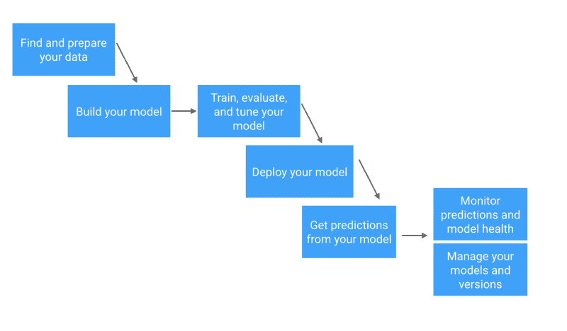
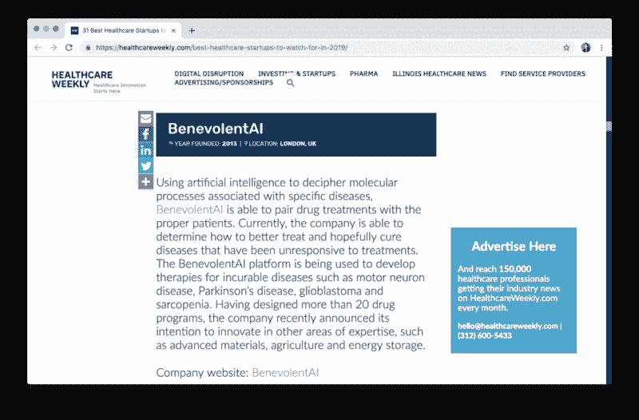
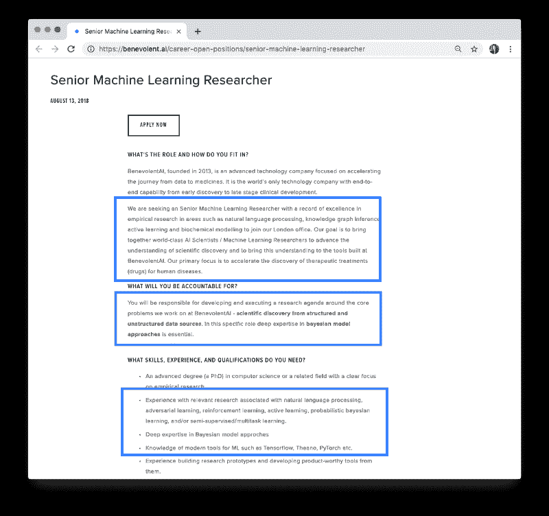
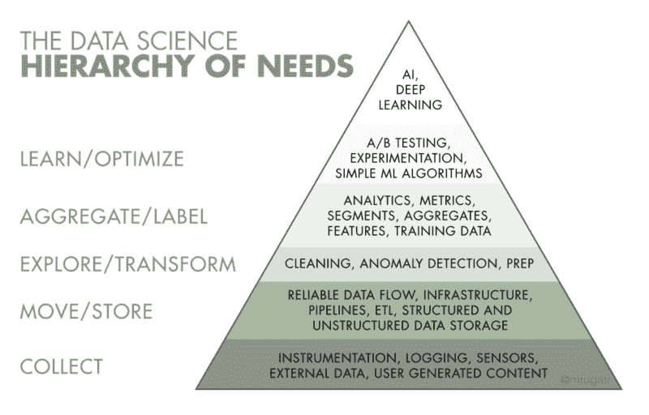

# 如果你是一个转行进入数据科学的开发人员，这里是你最好的资源

> 原文：[`www.kdnuggets.com/2019/06/developer-transitioning-data-science-best-resources.html`](https://www.kdnuggets.com/2019/06/developer-transitioning-data-science-best-resources.html)

 评论

**由 [Cecelia Shao](https://www.linkedin.com/in/ceceliashao/) 和 [Comet.ml](https://www.comet.ml/) 提供**

 由 Cecelia Shao 提供

* * *

## 我们的前三个课程推荐

 1\. [谷歌网络安全证书](https://www.kdnuggets.com/google-cybersecurity) - 快速进入网络安全职业。

 2\. [谷歌数据分析专业证书](https://www.kdnuggets.com/google-data-analytics) - 提升你的数据分析技能

 3\. [谷歌 IT 支持专业证书](https://www.kdnuggets.com/google-itsupport) - 支持你的组织的 IT

* * *

现在似乎每个人都想成为数据科学家——从博士生到数据分析师，再到你的老大学同学，他不断在 Linkedin 上发消息“约个咖啡”。

也许你也有过这样的感觉，你应该至少探索一下数据科学职位，看看这种炒作到底是什么。也许你已经看到像 Vicki Boykis 的 [《数据科学现在不同了》](https://veekaybee.github.io/2019/02/13/data-science-is-different) 这样的文章，其中提到：

> **显而易见的是，在炒作周期的后期，数据科学正渐渐接近工程学，而未来数据科学家所需的 [技能](https://www.youtube.com/watch?v=frQeK8xo9Ls) 越来越少涉及可视化和统计学，而是 [更符合传统计算机科学](https://tech.trivago.com/2018/12/03/teardown-rebuild-migrating-from-hive-to-pyspark/)……：**
> 
> 单元测试和持续集成等概念迅速融入了数据科学家和从事机器学习工程的数值科学家常用的术语和工具中。

或 [像 Tim Hopper 的](https://twitter.com/tdhopper/status/730425632862044161) [推文](https://twitter.com/tdhopper/status/730425632862044161)：

不清楚的是你如何将作为软件工程师的经验转化为数据科学职位。你可能还有一些其他问题，例如：

*我应该优先学习什么？*

*是否有针对数据科学家的最佳实践或工具？*

*我的现有技能能否转移到数据科学角色？*

本文将提供数据科学家角色的背景信息，以及为什么你的背景可能适合数据科学，并提供具体的逐步行动，供你作为开发人员提高数据科学技能。

> 想要查看最新的数据科学职位？订阅双周更新的[ML Jobs Newsletter](https://www.getrevue.co/profile/mljobs)，获取邮箱中的新数据科学职位信息。

### 数据科学家与数据工程师

首先，我们应该区分两个互补的角色：数据科学家与数据工程师。虽然这两个角色都涉及机器学习模型，但他们与这些模型的互动方式以及数据科学家和数据工程师的工作要求和性质有很大不同。

> 注意：专门从事机器学习的数据工程师角色在职位描述中也可能表现为“软件工程师，机器学习”或“机器学习工程师”。

作为[机器学习工作流](https://skymind.ai/wiki/machine-learning-workflow)的一部分，数据科学家将执行统计分析，以确定使用哪种机器学习方法，然后开始原型设计和构建这些模型。

机器学习工程师通常会在建模过程的前后与数据科学家合作：（1）构建数据管道，将数据输入这些模型，（2）设计一个工程系统来服务这些模型，以确保模型的持续健康。

下面的图表展示了一种查看这些技能连续体的方法：

关于数据科学家和数据工程师之间区别的在线资源非常丰富——一定要查看：

+   [Panoply: 数据工程师和数据科学家之间的区别是什么？](https://blog.panoply.io/what-is-the-difference-between-a-data-engineer-and-a-data-scientist)

+   [Springboard: 机器学习工程师与数据科学家的区别](https://www.springboard.com/blog/machine-learning-engineer-vs-data-scientist/)

+   [O’Reilly: 数据工程师与数据科学家的区别](https://www.oreilly.com/ideas/data-engineers-vs-data-scientists)

作为免责声明，本文主要涵盖数据科学家角色，并略微涉及机器学习工程的方面（特别是如果你正在考虑在小型公司担任两个角色的职位）。如果你有兴趣了解如何转型为数据工程师或机器学习工程师，请在下面的评论中告诉我们！

### 作为开发者的优势

对所有人不利的是，像“Python 中的数据科学导论”或 Andrew Ng 的 Coursera 课程这样的机器学习课程*未*涵盖来自软件工程的概念和最佳实践，例如单元测试、编写模块化可重用代码、CI/CD 或版本控制。即使是一些最先进的机器学习团队也仍未在其机器学习代码中使用这些实践，导致了一个令人担忧的趋势……

Pete Warden 将这一趋势描述为‘[机器学习可重复性危机](https://petewarden.com/2018/03/19/the-machine-learning-reproducibility-crisis/)’：

> 我们在跟踪变化和从头重建模型时仍然处于黑暗时代。**糟糕到有时感觉像是回到没有源代码控制的编程时代。**

虽然你可能在数据科学家职位描述中看不到这些“软件工程”技能被明确列出，但如果你已经掌握这些技能，将会使你作为数据科学家的工作提升十倍。此外，当你在数据科学面试中回答编程问题时，这些技能也会派上用场。

想要从另一方获取有趣的视角，可以查看[Trey Causey](https://www.freecodecamp.org/news/if-youre-a-developer-transitioning-into-data-science-here-are-your-best-resources-c31928b53cd1/undefined)关于‘[数据科学家的软件开发技能](http://treycausey.com/software_dev_skills.html)’的文章，其中他推荐数据科学家应该学习的技能，以“编写更好的代码、更好地与软件开发人员互动，并最终节省时间和头疼。”

### 提升数据科学技能

你已经拥有良好的软件工程背景，这很好，但成为数据科学家的下一步是什么？Josh Will 关于数据科学家定义的调侃推文出乎意料地准确：

如果你有兴趣从事数据科学家角色或职业，这暗示了你应该赶上的一个主题：统计学。在接下来的部分，我们将介绍一些优秀的资源：

+   **建立特定于机器学习的知识**

+   **建立行业知识**

+   **机器学习堆栈中的工具**

+   **技能和资格**

### 建立特定于机器学习的知识

建立理论知识（如概率和统计）与应用技能（如数据处理或在 GPU/分布式计算上训练模型）的结合是最有效的。

你获得的知识可以通过将其与机器学习工作流程对照来进行框架化。

机器学习工作流程的简化视图

> 查看来自 Skymind AI 的[详细工作流程](https://skymind.ai/wiki/machine-learning-workflow)

在这里，我们列出了一些你可以找到的最佳机器学习资源。虽然不可能列出所有资源，为了节省空间（和阅读时间），我们没有提到非常流行的资源，如 Andrew Ng 的 Coursera 课程或 Kaggle。

**课程：**

+   [Fast.ai MOOC](https://www.fast.ai/)（免费的课程，教授实际应用技能，包括实用深度学习、前沿深度学习、计算线性代数以及机器学习入门）

+   可汗学院

+   [3Blue1Brown](https://www.youtube.com/channel/UCYO_jab_esuFRV4b17AJtAw) 和 [mathematicalmonk](https://www.youtube.com/channel/UCcAtD_VYwcYwVbTdvArsm7w) 的 YouTube 频道

+   Udacity 课程（包括 [Python 中的机器学习预处理](https://www.datacamp.com/courses/preprocessing-for-machine-learning-in-python)）

+   [Springboard AI/ML 专用](https://www.springboard.com/blog/ai-machine-learning-career-track/) 轨道

**教科书：** **尝试找到大多数这些书籍的免费 PDF 版本**

+   [概率编程与黑客的贝叶斯方法](http://camdavidsonpilon.github.io/Probabilistic-Programming-and-Bayesian-Methods-for-Hackers/)

+   [概率与随机过程](https://www.amazon.com/Probability-Random-Processes-Geoffrey-Grimmett/dp/0198572220/)

+   [统计学习的要素](https://web.stanford.edu/~hastie/Papers/ESLII.pdf)

+   [线性代数正确处理](http://148.206.53.84/tesiuami/S_pdfs/Linear%20Algebra%20Done%20Right.pdf)

+   [线性代数导论](http://math.mit.edu/~gs/linearalgebra/)

+   [算法设计](http://www.cs.sjtu.edu.cn/~jiangli/teaching/CS222/files/materials/Algorithm%20Design.pdf)

**指南：**

+   [谷歌开发者机器学习指南](https://developers.google.com/machine-learning/guides/rules-of-ml/)

+   [机器学习掌握指南](https://machinelearningmastery.com/start-here/)（要找到一个好的起点，请参见[这个关于 Python 机器学习的迷你课程](https://machinelearningmastery.com/python-machine-learning-mini-course/)）

+   [Pyimagesearch](https://www.pyimagesearch.com/)（用于计算机视觉）

**聚会：** **主要是纽约市的聚会**

+   [我们喜爱的论文](https://paperswelove.org/)

+   [纽约市人工智能与机器学习](https://www.meetup.com/NYC-Artificial-Intelligence-Machine-Learning/)

+   [DataCouncil.ai](https://www.meetup.com/DataCouncil-AI-NYC-Data-Engineering-Science/)

+   [纽约人工智能](https://www.meetup.com/NYAImeetup/)

> 要找到一个很好的起点，可以查看 Will Wolf 的‘[开源机器学习大师](http://willwolf.io/2018/02/03/practical-guide-open-source-ml-masters/)’，了解如何安排时间，专注于特定主题，并进行项目工作，以展示在低成本远程地点的专业知识。

### 建立行业特定知识

如果你有意从事特定行业如医疗保健、金融服务、消费品、零售等，了解该行业的数据和机器学习相关的痛点和发展是非常宝贵的。

**一个专业提示 =** 你可以扫描垂直行业特定的 AI 初创公司的网站，查看他们如何定位其价值主张以及机器学习的作用。这将给你提供学习机器学习特定领域的思路以及项目主题，以展示你的工作。

**我们可以通过一个例子来了解：** 假设我对在医疗保健领域工作感兴趣。

1\. 通过快速谷歌搜索“*机器学习 医疗保健*”，我找到 Healthcareweekly.com 上关于‘[2019 年值得关注的最佳医疗保健初创公司](https://healthcareweekly.com/best-healthcare-startups-to-watch-for-in-2019/)’的列表。

> 你也可以在 [Crunchbase](https://www.crunchbase.com/hub/health-care-startups#section-leaderboard) 或 [AngelList](https://angel.co/jobs#find/f!%7B%22keywords%22%3A%5B%22Healthcare%22%5D%7D) 上用“healthcare”作为关键词进行快速搜索

2\. 以榜单上的公司之一，[BenevolentAI](https://benevolent.ai/)，为例。

3\. BenevolentAI 的网站上写道：

> 我们是一家从早期药物发现到晚期临床开发具有端到端能力的 AI 公司。BenevolentAI 将计算医学和先进 AI 的力量与开放系统和云计算的原则相结合，以改变药物设计、开发、测试和上市的方式。
> 
> 我们建立了 Benevolent 平台，以更好地理解疾病，并从大量生物医学信息中设计新药物并改进现有治疗方案。我们相信我们的技术能够使科学家更快、更具成本效益地开发药物。
> 
> 每 30 秒就会发布一篇新的研究论文，而科学家目前仅使用可用知识的一小部分来理解疾病的原因并提出新治疗方案。我们的平台能够处理、‘阅读’并将大量从书面文献、数据库和实验结果中提取的信息进行背景化。它能够在这些不同、复杂的数据源中做出无穷的推断和推理，识别和创建关系、趋势和模式，这些都是人类单独无法完成的。

4\. 你可以立即看到 BenevolentAI 使用自然语言处理（NLP），如果他们正在识别疾病与治疗研究之间的关系，他们很可能在使用一些知识图谱

5\. 如果你查看 BenevolentAI 的招聘页面，你会发现他们正在招聘 [高级机器学习研究员](https://benevolent.ai/career-open-positions/senior-machine-learning-researcher)。这是一个高级职位，因此不是一个完美的例子，但请查看他们要求的技能和资质：

**注意：**

+   自然语言处理、知识图谱推断、主动学习和生物化学建模

+   结构化和非结构化数据源

+   贝叶斯模型方法

+   现代机器学习工具的知识

**这应该为你提供一些下一步的方向：**

+   处理结构化数据

+   处理非结构化数据

+   在知识图谱中分类关系（查看一个很好的资源 [这里](https://medium.com/comet-ml/using-fasttext-and-comet-ml-to-classify-relationships-in-knowledge-graphs-e73d27b40d67)）

+   学习贝叶斯概率和建模方法

+   从事一个自然语言处理（NLP）项目（即文本数据）

我们并不建议你申请你通过搜索找到的公司，而是看看他们如何描述客户的痛点、公司的价值主张，以及他们在职位描述中列出的技能，以指导你的研究。

### 机器学习堆栈中的工具

在 BenevolentAI 高级机器学习研究员的职位描述中，他们要求*“具备现代机器学习工具的知识，如 Tensorflow、PyTorch 等……”*

学习这些现代机器学习工具可能会让人感到畏惧，因为这个领域总是在变化。为了将学习过程分解为易于管理的部分，请记住围绕上述机器学习工作流程来思考——*“这个工作流程的哪个部分可以通过什么工具来帮助我？”* ????

要查看哪些工具配合每个机器学习工作流程步骤，请查看 [Roger Huang](https://www.freecodecamp.org/news/if-youre-a-developer-transitioning-into-data-science-here-are-your-best-resources-c31928b53cd1/undefined) 的‘[机器学习堆栈介绍](https://hackernoon.com/introduction-to-the-machine-learning-stack-f5b64bba7602)’，其中涵盖了 [Docker](https://www.docker.com/)、[Comet.ml](http://www.comet.ml) 和 [dask-ml](https://dask-ml.readthedocs.io/en/latest/) 等工具。

从战术角度来看，[Python](https://www.python.org/) 和 [R](https://www.r-project.org/about.html) 是数据科学家使用的最常见编程语言，你将会遇到为数据科学应用设计的附加包，如 [NumPy](http://www.numpy.org/) 和 [SciPy](http://www.scipy.org/)，以及 matplotlib。这些语言是解释型的，而非编译型的，使得数据科学家可以专注于问题本身而不是语言的细节。学习面向对象编程以理解数据结构的实现作为类，值得投入时间。

要跟上 Tensorflow、Keras 和 PyTorch 等机器学习框架，确保访问它们的文档并尝试完整实现其教程。

最终，你要确保你正在构建展示这些现代工具的数据收集和处理、机器学习实验管理和建模的项目。

想要为你的项目寻找灵感，可以查看 [Edouard Harris](https://www.freecodecamp.org/news/if-youre-a-developer-transitioning-into-data-science-here-are-your-best-resources-c31928b53cd1/undefined) 关于‘[冷启动问题：如何构建你的机器学习作品集](https://towardsdatascience.com/the-cold-start-problem-how-to-build-your-machine-learning-portfolio-6718b4ae83e9)’的文章。

### 技能和资格

我们把这一部分放在最后，因为它汇总了之前部分的大部分信息，但特别针对数据科学面试准备。数据科学家面试中主要有六个主题：

1.  编程

1.  产品

1.  SQL

1.  A/B 测试

1.  机器学习

1.  概率（请参见[这里](https://www3.cs.stonybrook.edu/~skiena/jaialai/excerpts/node12.html)的良好定义与统计）

你会注意到这些主题中有一个与其他不同（产品）。对于数据科学职位，[关于技术概念和结果的沟通](https://medium.com/comet-ml/a-data-scientists-guide-to-communicating-results-c79a5ef3e9f1)以及商业指标和影响至关重要。

**一些有用的数据科学面试问题汇总：**

+   [`github.com/kojino/120-Data-Science-Interview-Questions`](https://github.com/kojino/120-Data-Science-Interview-Questions)

+   [`github.com/iamtodor/data-science-interview-questions-and-answers`](https://github.com/iamtodor/data-science-interview-questions-and-answers)

+   [`hookedondata.org/red-flags-in-data-science-interviews/`](https://hookedondata.org/red-flags-in-data-science-interviews/)

+   [`medium.com/@XiaohanZeng/i-interviewed-at-five-top-companies-in-silicon-valley-in-five-days-and-luckily-got-five-job-offers-25178cf74e0f`](https://medium.com/@XiaohanZeng/i-interviewed-at-five-top-companies-in-silicon-valley-in-five-days-and-luckily-got-five-job-offers-25178cf74e0f)

+   [你会注意到我们包含了 Hooked on Data 的《](https://medium.com/@XiaohanZeng/i-interviewed-at-five-top-companies-in-silicon-valley-in-five-days-and-luckily-got-five-job-offers-25178cf74e0f)[数据科学面试中的警示信号](https://hookedondata.org/red-flags-in-data-science-interviews/)》——在面试过程中，你可能会遇到那些仍在建设数据基础设施的公司，或者可能不完全了解他们的数据科学团队如何融入更大的公司价值中。

这些公司可能仍在上升这一需求层次。

来自 Monica Rogati 的流行 AI 需求层次

关于数据科学面试的期望设定，我建议阅读 Tim Hopper 的文章《[关于被拒绝许多数据科学工作的反思](https://tdhopper.com/blog/some-reflections-on-being-turned-down-for-a-lot-of-data-science-jobs/)》。

**感谢阅读！我们希望本指南能帮助你了解数据科学是否是你应该考虑的职业，以及如何开始这段旅程！**

*想看到最新的数据科学职位？订阅每两周更新的 [ML Jobs Newsletter](https://www.getrevue.co/profile/mljobs) 以在收件箱中获取新的数据科学职位开盘信息：*

[**ML Jobs Newsletter - Revue**](https://www.getrevue.co/profile/mljobs)

[*注册接收每两周一次的行业最佳公司数据科学职位开盘清单。角色…*www.getrevue.co](https://www.getrevue.co/profile/mljobs)

**简介：[Cecelia Shao](https://www.linkedin.com/in/ceceliashao/)** 是 [comet.ml](https://www.comet.ml/) 的产品负责人。

[原文](https://www.freecodecamp.org/news/if-youre-a-developer-transitioning-into-data-science-here-are-your-best-resources-c31928b53cd1/)。已获得许可转载。

**相关：**

+   如何进入数据科学领域：为有志数据科学家的终极问答指南

+   新数据科学家的建议

+   初学者数据科学家的七个实用建议

### 更多相关话题

+   [2021 年最佳 ETL 工具](https://www.kdnuggets.com/2021/12/mozart-best-etl-tools-2021.html)

+   [成为出色数据科学家所需的 5 项关键技能](https://www.kdnuggets.com/2021/12/5-key-skills-needed-become-great-data-scientist.html)

+   [每个初学者数据科学家应掌握的 6 种预测模型](https://www.kdnuggets.com/2021/12/6-predictive-models-every-beginner-data-scientist-master.html)

+   [数据科学学习统计学的顶级资源](https://www.kdnuggets.com/2021/12/springboard-top-resources-learn-data-science-statistics.html)

+   [每个数据科学家都应了解的三种 R 库（即使你使用 Python）](https://www.kdnuggets.com/2021/12/three-r-libraries-every-data-scientist-know-even-python.html)

+   [停止学习数据科学以寻找目标，并通过目标找到……](https://www.kdnuggets.com/2021/12/stop-learning-data-science-find-purpose.html)
