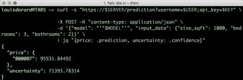
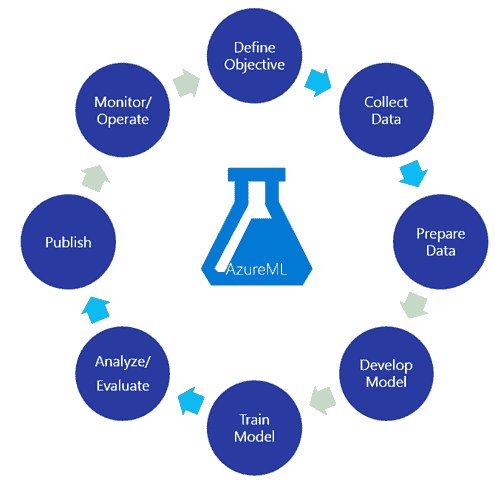

# 开发者实际需要了解的机器学习知识

> 原文：[`www.kdnuggets.com/2016/04/developers-need-know-about-machine-learning.html`](https://www.kdnuggets.com/2016/04/developers-need-know-about-machine-learning.html)

 评论

**由 Louis Dorard, PAPIs.io**

机器学习的教学方式存在问题。

大多数机器学习（ML）教师喜欢解释不同学习算法的工作原理，并在这方面花费大量时间。对于一个希望开始使用 ML 的初学者来说，能够选择算法并设置参数似乎是首要的入门障碍，了解不同技术的工作方式似乎是移除这个障碍的关键要求。然而，许多从业者认为，你只需一种技术即可开始：随机森林。其他技术有时可能表现更好，但通常，随机森林在各种问题上表现最佳的可能性最大（见[我们是否需要数百个分类器来解决现实世界中的分类问题？](https://www.kdnuggets.com/2016/04/developers-need-know-about-machine-learning.html)），这使得它们对于刚开始接触 ML 的开发者来说足够了。

我还认为，你不需要了解（随机森林）学习算法的所有内部工作原理（以及它们使用的更简单的决策树学习算法）。对算法的高层次理解、其背后的直觉、主要参数、可能性和限制就足够了。你会知道足够的信息来开始实践和实验 ML，因为有优秀的开源 ML 库（如 Python 中的 scikit-learn）和云平台，使得从数据中创建预测模型变得非常简单。

所以，如果我们只是概述一种技术，我们还可以教什么呢？

*[Dataiku](http://dataiku.com/)贴纸（见于 PAPIs）。他们的数据科学工作室使得实验和部署 ML 模型变得简单。*

**将 ML 模型部署到生产环境中**

事实证明，在实际应用中使用 ML 时，大多数工作发生在学习之前和之后。ML 讲师很少提供关于将 ML 应用于生产中预测应用所需的端到端视图。他们只是解释问题的一个部分，然后假设你会自己弄清楚其余的部分，并自行连接点。例如，将你被教会在 Python、R 或 Matlab 中使用的 ML 库与在 Ruby、Swift、C++等中开发的生产应用程序连接起来。

当我差不多 10 年前开始攻读博士学位时，我有一个在 Yahoo 的朋友刚刚完成了他的学业，他向我解释了软件工程师是如何将机器学习研究人员的代码重写成生产环境中使用的语言的。正如 Dataiku 的 [Florian Douetteau](https://medium.com/u/790b578dde3a) 在去年 PAPIs Connect 上 [展示](http://fr.slideshare.net/Dataiku/dataiku-productive-application-to-production-pap-is-may-2015-48747796/12) 的那样，将概念验证模型投入生产的成本可能会彻底扼杀机器学习项目。部署是一个非常重要的问题，他估计像 Spotify 和 Facebook 这样的顶级公司每家都在其机器学习生产平台上投资了超过 500 万美元（包括 10-20 名专门从事该工作的人员、资源、基础设施等）。

*从暴露为 REST API 的模型中获取预测。*

幸运的是，今天有新的可获取的解决方案来应对这个“最后一公里问题”。这些解决方案围绕着使用 REST（http）API。模型需要暴露为 API，如果模型执行的预测数量成为问题，这些 API 可以在多个端点上提供，前面有负载均衡器。平台即服务可以提供帮助——这里有一些关于 [Microsoft Azure ML 扩展能力](https://azure.microsoft.com/en-us/documentation/articles/machine-learning-faq/#scalability)、[Amazon ML](https://aws.amazon.com/machine-learning/faqs/#generating-predictions) 和 [Yhat 的分析负载均衡器](https://github.com/yhat/yhat-wiki/wiki/Analytics-Load-Balancer)（你也可以在自己的私人基础设施/云上运行）的信息。这些平台中的一些允许你使用任何你想要的机器学习库，其他则限制你使用他们自己专有的库。在我即将到来的 [研讨会](http://www.papis.io/workshops/operational-machine-learning) 中，我选择使用 Azure 将使用 scikit-learn 创建的模型部署到 API 中，并且还演示了 Amazon 和 BigML 提供的更高级的抽象层（同时仍提供准确的模型），这可以使它们在许多情况下更易于使用。

**机器学习工作流**

部署并不是现实世界机器学习中唯一的后学习挑战。你还应该在部署前后找到适当的方式来评估和监控模型的性能/影响。

*机器学习工作流 [由 Azure 提供](https://blogs.msdn.microsoft.com/continuous_learning/2014/11/15/end-to-end-predictive-model-in-azureml-using-linear-regression/)。*

上面的机器学习工作流图也展示了一些在训练模型之前需要采取的步骤，这些步骤涉及为算法运行准备合适的数据集。在实际运行任何算法之前，你需要…

+   为你的组织定义正确的机器学习问题

+   工程特征，即找到表示你将使用机器学习进行预测的对象的方式。

+   确定你需要进行预测的时间和频率，以及你可以为此分配多少时间（是否可以批量进行预测，还是必须要求所有预测都是实时的？）

+   收集数据

+   准备实际的数据集以运行学习算法，即从“原始”收集的数据中提取特征并进行清理

+   确定你需要学习新的/更新的模型的时间和频率，以及你可以为此分配多少时间。

**2 天掌握操作性机器学习**

开发者的机器学习课程应有什么目的？它不仅仅应该涉及教授一些新的、令人感兴趣和智力挑战的内容，还应着眼于使开发者尽可能熟练地使用他们所学到的新技术。

在 PAPIs，我们希望使开发者能够通过机器学习改善他们的应用程序并从数据中创造新的价值。我们将启动一系列**2 天的动手实践工作坊，既有课堂设置也有在线设置**。我们计划的第一类工作坊是一个面向[开源和云平台操作性 ML 的介绍](http://www.papis.io/workshops/operational-machine-learning)。第 1 天涵盖机器学习的介绍、预测模型的创建、操作化和评估。第 2 天包括模型选择、集成、数据准备、无监督学习和深度学习等高级主题的实用概述，以及开发自己的机器学习用例的方法论。

我们使用 Python 和一些库，如 Pandas、scikit-learn、SKLL，以及云平台，如 Microsoft Azure ML、Amazon ML、BigML 和 Indico。我认为这些平台对于许多组织和实际使用案例来说非常出色，但即使由于某些原因你发现它们可能不完全适合你，我仍然推荐你使用它们来学习和练习机器学习。ML-as-a-Service 使得设置工作环境变得更快（例如，Azure ML 预装了大多数流行的库，并且可以运行交互式 Jupyter notebooks，你可以通过浏览器访问），同时也使得使用它们提供的更高抽象层进行机器学习实验变得更加容易（例如，使用 BigML 的一键聚类、异常检测和分类模型，或者使用 Indico 的深度学习 API 快速特征化文本和图像）。

[了解更多信息](http://www.papis.io/workshops/operational-machine-learning)关于 PAPIs.io 的开源和云平台操作性机器学习 2 天工作坊，适用于开发者——无论是面对面还是在线——从应用开发者的角度出发，提供机器学习整合到应用程序中的端到端视图。

**简介：[Louis Dorard](https://medium.com/@louisdorard)** 是《Bootstrapping Machine Learning》的作者，也是 [PAPIs.io](http://www.papis.io/) 的共同创始人。

[原文](https://stories.papis.io/what-developers-actually-need-to-know-about-machine-learning-1a3ea2284631)。已获得许可转载。

**相关信息**：

+   Quora 关于“如何学习机器学习”的最佳建议

+   数据科学家的职业建议 – 去赚更多的钱

+   当好建议变坏时

    * * *

    ## 我们的三大课程推荐

     1\. [Google 网络安全证书](https://www.kdnuggets.com/google-cybersecurity) - 快速开启网络安全职业生涯。

     2\. [Google 数据分析专业证书](https://www.kdnuggets.com/google-data-analytics) - 提升你的数据分析能力

     3\. [Google IT 支持专业证书](https://www.kdnuggets.com/google-itsupport) - 支持你的组织的 IT

    * * *

    ### 更多相关话题

    +   [初级机器学习工程师实际上需要知道什么才能被聘用？](https://www.kdnuggets.com/what-junior-ml-engineers-actually-need-to-know-to-get-hired)

    +   [为什么越来越多的开发者在机器学习项目中使用 Python？](https://www.kdnuggets.com/2022/01/developers-python-machine-learning-projects.html)

    +   [低代码：开发者还需要吗？](https://www.kdnuggets.com/2022/04/low-code-developers-still-needed.html)

    +   [真正免费的课程：人工智能与机器学习版](https://www.kdnuggets.com/free-courses-that-are-actually-free-ai-ml-edition)

    +   [KDnuggets 新闻，4 月 13 日：数据科学家应该了解的 Python 库…](https://www.kdnuggets.com/2022/n15.html)

    +   [机器学习中的统计学：你需要了解的内容以成为…](https://www.kdnuggets.com/2024/03/sas-statistics-machine-learning-need-know-become-certified-expert)
