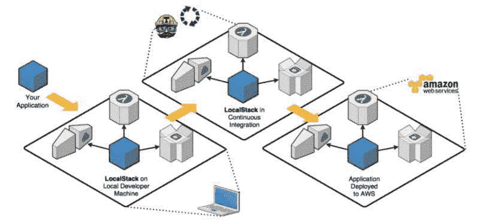

# 在本地开发和测试 AWS 的 ETL 管道

> 原文：[`www.kdnuggets.com/2021/08/development-testing-etl-pipelines-aws-locally.html`](https://www.kdnuggets.com/2021/08/development-testing-etl-pipelines-aws-locally.html)

评论

**由[Subhash Sreenivasachar](https://www.linkedin.com/in/subhashsreenivasachar/)，Epsilon 的软件工程技术负责人**

## 介绍

* * *

## 我们的三大课程推荐

 1\. [谷歌网络安全证书](https://www.kdnuggets.com/google-cybersecurity) - 快速进入网络安全职业生涯。

 2\. [谷歌数据分析专业证书](https://www.kdnuggets.com/google-data-analytics) - 提升你的数据分析能力

 3\. [谷歌 IT 支持专业证书](https://www.kdnuggets.com/google-itsupport) - 支持你的组织 IT

* * *

AWS 在帮助工程师和数据科学家专注于构建解决方案和解决问题方面发挥了关键作用，而不必担心设置基础设施的需求。通过无服务器和按需付费的定价方式，AWS 提供了即刻创建服务的便利。

AWS Glue 被数据工程师广泛用于构建无服务器 ETL 管道。PySpark 是开发中常用的技术栈之一。然而，尽管服务可用，但仍有一些挑战需要解决。

在 AWS 环境中调试代码，无论是 ETL 脚本（PySpark）还是其他服务，都具有挑战性。

+   持续监控 AWS 服务的使用情况是控制成本因素的关键。

+   AWS 确实提供了带有所有 Spark 库的开发端点，但考虑到价格，对于大型开发团队来说并不切实可行。

+   对某些用户而言，AWS 服务的可访问性可能是***有限的***。

## 解决方案

AWS 的解决方案可以在本地环境中开发和测试，无需担心可访问性或成本因素。通过本文，我们解决了两个问题 -

1.  在不使用 AWS 开发端点的情况下，本地调试 PySpark 代码。

1.  本地与 AWS 服务的交互

这两个问题可以通过使用 Docker 镜像来解决。

1.  首先，我们取消了在 AWS 环境中使用服务器的需求，而是使用运行在机器上的 Docker 镜像作为执行代码的环境。

AWS 提供了一个沙盒镜像，可用于 PySpark 脚本。可以设置 Docker 镜像来执行 PySpark 代码。 [`aws.amazon.com/blogs/big-data/developing-aws-glue-etl-jobs-locally-using-a-container/`](https://aws.amazon.com/blogs/big-data/developing-aws-glue-etl-jobs-locally-using-a-container/)

1.  有了可以执行代码的 Docker 机器，需要像 S3 这样的服务来存储（读/写）文件，以便在构建 ETL 管道时使用。

与 S3 的交互可以用 [LocalStack](https://localstack.cloud/) 替代，它提供了一个易于使用的测试/模拟框架，用于开发云应用程序。它在你的本地机器上启动一个测试环境，提供与真实 AWS 云环境相同的功能和 API。



到目前为止，本文涉及构建 ETL 管道和使用可用服务。然而，类似的方法可以适用于与 AWS 服务（如 SNS、SQS、CloudFormation、Lambda 函数等）一起工作时的任何用例。

### 方法

+   使用 docker 容器作为远程解释器

+   在容器上运行 PySpark 会话

+   使用 LocalStack 在本地启动 S3 服务

+   使用 PySpark 代码从运行在 LocalStack 上的 S3 存储桶中读取和写入数据

### 前提条件

必须在你的机器上安装以下工具

+   Docker

+   PyCharm Professional/ VisualStudio Code

### 设置

+   下载或拉取 docker 镜像（docker pull <image name>）

    +   libs:glue_libs_1.0.0_image_01

    +   localstack/localstack

+   Docker 容器可以作为 PyCharm 专业版中的远程解释器使用。

### 实施

在本地机器上安装 Docker 并拉取镜像后，开始设置 PyCharm 配置以启动容器。

+   创建一个 docker-compose.yml 文件

```py
version: '2'
services:
    glue-service:
        image: amazon/aws-glue-libs:glue_libs_1.0.0_image_01
        container_name: "glue_ontainer_demo"
        build:
            context: .
            dockerfile: Dockerfile
        ports:
            - "8000:8000"
        volumes:
            - .:/opt
        links:
            - localstack-s3
        environment:
          S3_ENDPOINT: http://localstack:4566
    localstack-s3:
      image: localstack/localstack
      container_name: "localstack_container_demo"
      volumes:
        - ./stubs/s3:/tmp/localstack
      environment:
        - SERVICES=s3
        - DEFAULT_REGION=us-east-1
        - HOSTNAME=localstack
        - DATA_DIR=/tmp/localstack/data
        - HOSTNAME_EXTERNAL=localstack
      ports:
        - "4566:4566"
```

+   创建一个 DockerFile

```py
FROM python:3.6.10

WORKDIR /opt

# By copying over requirements first, we make sure that Docker will cache
# our installed requirements rather than reinstall them on every build
COPY requirements.txt /opt/requirements.txt
RUN pip install -r requirements.txt

# Now copy in our code, and run it
COPY . /opt
```

+   使用包含要安装的包的 requirements 文件

```py
moto[all]==2.0.5
```

+   设置 Python 远程解释器

+   使用 docker-compose 文件设置 Python 解释器。

+   在 PyCharm Docker Compose 设置中选择 `glue-service`。

+   Docker-compose 文件创建并运行两个镜像的容器

+   LocalStack 默认运行在 4566 端口，S3 服务在该端口启用

### 代码

+   需要导入的库

```py
import boto3
import os
from pyspark.sql import SparkSession
```

+   将文件添加到运行在 LocalStack 上的 S3 存储桶

```py
def add_to_bucket(bucket_name: str, file_name: str):
    try:
        # host.docker.internal
        s3 = boto3.client('s3',
                          endpoint_url="http://host.docker.internal:4566",
                          use_ssl=False,
                          aws_access_key_id='mock',
                          aws_secret_access_key='mock',
                          region_name='us-east-1')
        s3.create_bucket(Bucket=bucket_name)

        file_key = f'{os.getcwd()}/{file_name}'
        with open(file_key, 'rb') as f:
            s3.put_object(Body=f, Bucket=bucket_name, Key=file_name)
        print(file_name)

        return s3
    except Exception as e:
        print(e)
        return None
```

http://host.docker.internal:4566 是在 docker 容器内本地运行的 S3

+   设置 PySpark 会话以从 S3 读取数据

```py
def create_testing_pyspark_session():
    print('creating pyspark session')
    sparksession = (SparkSession.builder
                    .master('local[2]')
                    .appName('pyspark-demo')
                    .enableHiveSupport()
                    .getOrCreate())

    hadoop_conf = sparksession.sparkContext._jsc.hadoopConfiguration()
    hadoop_conf.set("fs.s3a.impl", "org.apache.hadoop.fs.s3a.S3AFileSystem")
    hadoop_conf.set("fs.s3a.path.style.access", "true")
    hadoop_conf.set("fs.s3a.connection.ssl.enabled", "false")
    hadoop_conf.set("com.amazonaws.services.s3a.enableV4", "true")
    hadoop_conf.set("fs.s3a.aws.credentials.provider", "org.apache.hadoop.fs.s3a.TemporaryAWSCredentialsProvider")
    hadoop_conf.set("fs.s3a.access.key", "mock")
    hadoop_conf.set("fs.s3a.secret.key", "mock")
    hadoop_conf.set("fs.s3a.session.token", "mock")
    hadoop_conf.set("fs.s3a.endpoint", "http://host.docker.internal:4566")
    return sparksession
```

+   PySpark 会话通过提供的模拟凭证连接到 S3

+   你可以直接使用创建的 PySpark 会话从 S3 读取数据

```py
test_bucket = 'dummypysparkbucket'
# Write to S3 bucket
add_to_bucket(bucket_name=test_bucket, file_name='dummy.csv')
spark_session = create_testing_pyspark_session()
file_path = f's3a://{test_bucket}/dummy.csv'

# Read from s3 bucket
data_df = spark_session.read.option('delimiter', ',').option('header', 'true').option('inferSchema',
                                                                                      'False').format('csv').load(
    file_path)
print(data_df.show())
```

+   最后，可以以任何首选格式写入 S3

```py
# Write to S3 as parquet
write_path = f's3a://{test_bucket}/testparquet/'
data_df.write.parquet(write_path, mode='overwrite')
```

一旦完成上述步骤，我们可以创建一个带有模拟数据的虚拟 CSV 文件用于测试，你应该可以

+   将文件添加到 S3（运行在 LocalStack 上）

+   从 S3 读取数据

+   以 parquet 格式写回 S3

你应该能够运行 .py 文件来执行，PySpark 会话将被创建，可以使用 LocalStack API 从本地运行的 S3 存储桶中读取数据。

此外，你还可以检查 LocalStack 是否运行，通过 [`localhost:4566/health`](http://localhost:4566/health)

LocalStack 还提供了使用 AWS CLI 运行命令的功能。

## 结论

使用 Docker 和 Localstack 提供了一种快速简便的方式来运行 Pyspark 代码、在容器中调试并写入本地运行的 S3。所有这些无需连接到任何 AWS 服务。

**参考资料：**

+   Glue 端点: [`docs.aws.amazon.com/glue/latest/dg/dev-endpoint.html`](https://docs.aws.amazon.com/glue/latest/dg/dev-endpoint.html)

+   Docker: [`docs.docker.com/get-docker/`](https://docs.docker.com/get-docker/)

+   PyCharm: [`www.jetbrains.com/pycharm/`](https://www.jetbrains.com/pycharm/)

+   PyCharm 远程解释器: [`www.jetbrains.com/help/pycharm/using-docker-compose-as-a-remote-interpreter.html`](https://www.jetbrains.com/help/pycharm/using-docker-compose-as-a-remote-interpreter.html)

+   LocalStack: [`localstack.cloud`](https://localstack.cloud/)

**简介: [Subhash Sreenivasachar](https://www.linkedin.com/in/subhashsreenivasachar/)** 是 Epsilon 数字体验团队的首席软件工程师，负责构建工程解决方案来解决数据科学问题，特别是个性化，并帮助推动客户的投资回报率。

**相关链接:**

+   MLOps 是一门工程学科：初学者概述

+   云中的 ETL：通过数据仓库自动化转变大数据分析

+   什么是 ETL？

### 相关主题

+   [假设检验与 A/B 测试](https://www.kdnuggets.com/hypothesis-testing-and-ab-testing)

+   [2021 年最佳 ETL 工具](https://www.kdnuggets.com/2021/12/mozart-best-etl-tools-2021.html)

+   [用 SQL + Python 构建可扩展的 ETL](https://www.kdnuggets.com/2022/04/building-scalable-etl-sql-python.html)

+   [ETL 与 ELT：数据集成对决](https://www.kdnuggets.com/2022/08/etl-elt-data-integration-showdown.html)

+   [ETL 与机器学习有什么关系？](https://www.kdnuggets.com/2022/08/etl-machine-learning.html)

+   [SQL 和数据集成：ETL 与 ELT](https://www.kdnuggets.com/2023/01/sql-data-integration-etl-elt.html)
