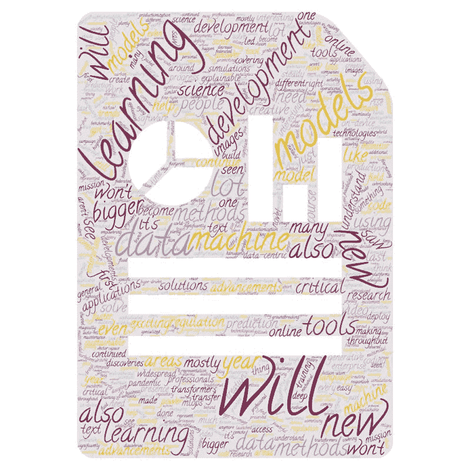
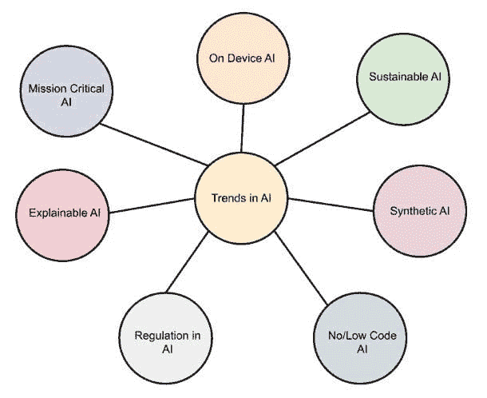

# AI、分析、机器学习、数据科学、深度学习研究 2021 年的主要发展和 2022 年的关键趋势

> 原文：[`www.kdnuggets.com/2021/12/developments-predictions-ai-machine-learning-data-science-research.html`](https://www.kdnuggets.com/2021/12/developments-predictions-ai-machine-learning-data-science-research.html)

comments

又一年将要结束，再次，KDnuggets 联系了专家，以了解他们对今年发生的事情以及未来可能发生的事情的看法。

今年，我们向一些 AI、分析、机器学习、数据科学、深度学习研究领域的领导者提出了以下问题：

* * *

## 我们的前三课程推荐

 1\. [谷歌网络安全证书](https://www.kdnuggets.com/google-cybersecurity) - 快速进入网络安全职业轨道

 2\. [谷歌数据分析专业证书](https://www.kdnuggets.com/google-data-analytics) - 提升你的数据分析技能

 3\. [谷歌 IT 支持专业证书](https://www.kdnuggets.com/google-itsupport) - 支持你的组织 IT

* * *

**2021 年 AI、数据科学、机器学习研究的主要发展是什么？你对 2022 年有哪些关键趋势的看法？**

虽然本文从研究的角度探讨了这个问题，但在接下来的几天里，我们还将分享从技术和行业的角度讨论同一问题的文章。

我想感谢本轮意见中的每位参与者，感谢他们在这个繁忙时节抽出时间提供见解和意见：Anima Anandkumar、Louis Bouchard、Andriy Burkov、Charles Martin、Gaurav Menghani、Ines Montani、Dipanjan Sarkar 和 Rosaria Silipo。

现在，让我们不再拖延，来看看 AI、分析、机器学习、数据科学、深度学习研究在 2021 年的主要发展和 2022 年的关键趋势。

**[Anima Anandkumar](https://www.linkedin.com/in/anima-anandkumar/) 是 NVIDIA 的 ML 研究主任及加州理工学院的 Bren 教授**

AI4Science 在过去一年中显著成熟，疫情作为重要催化剂，将来自多个领域的科学家聚集在一起。我们看到突破性的十亿原子分子模拟，以了解 Covid-19 病毒及其与气溶胶的相互作用，借助人工智能方法增强了这些研究。我们看到能够解决复杂科学模拟的创新人工智能方法，例如首次解决湍流流体流动问题。我们看到许多医院联手，通过保留隐私的联邦学习平台协作训练 AI 患者护理模型。语言模型变得更大，但对偏见问题的广泛意识导致对这些模型的更深入检查，并开发了少量样本和微调方法以减少伤害。

**[路易斯·布歇](https://www.linkedin.com/in/whats-ai/) 专注于在 YouTube 和 Medium 上的“What's AI”使人工智能更易于获取**

第一个问题对我来说相对容易回答。我实际上维护着一个 GitHub 仓库，记录了人工智能的所有主要发展，所以我的答案很快：CLIP。它介绍了许多令人激动的可能性，将文本与图像连接起来。当然，这是我首先想到的，但今年还有许多其他惊人的发现和进展，我强烈邀请你查看我制作的精心挑选的列表，也在 KDnuggets 上共享，涵盖了 2021 年最有趣的人工智能研究，包括视频演示、文章和代码（如果适用）。

我相信我们将在 2022 年继续在图像合成和文本到图像应用领域取得许多激动人心的发现，并迈出比以往更大的步伐，许多技术进步也将再次发生。当然，如果你想跟上最新的研究趋势，我将继续在我的 YouTube 频道和博客上覆盖这些令人兴奋的趋势！

**[安德烈·布尔科夫](https://www.linkedin.com/in/andriyburkov/) 是数据科学主任——机器学习团队负责人，同时是《一百页机器学习书》和《机器学习工程书》的作者**

2021 年人工智能的主要突破是 DALL·E 和类似的技术，这些技术可以从文本中创建图像。这些技术为创造性的人提供了全新的工具，并使创作过程更加民主化。我认为 2022 年我们将看到更多创造性 AI 的例子：在视频和音乐中。模型将变得更大，我们将看到新的多模态模型。

**[查尔斯·马丁](https://www.linkedin.com/in/charlesmartin14/) 是一位 AI 专家和自然语言处理及搜索领域的杰出工程师**

在 2021 年，疫情仍在全面爆发中，我们看到在线零售和一般在线存在的显著增长，越来越多的企业尝试将数据科学和机器学习运用于提升在线销售和运营。这导致了从纯数据科学作为孤立活动的转变，推动更多的机器学习/人工智能模型投入生产，增加了对机器学习工程、机器学习运维和数据中心人工智能的需求。虽然传统的机器学习方法（即 XGBoost）仍主导企业，但现代人工智能正找到自己的位置，包括向量空间搜索、图神经网络，以及计算机视觉应用。因果机器学习也受到关注，因为企业需要了解机器学习方法的工作原理。

在 2022 年，机器学习和人工智能将越来越成为标准软件产品开发生命周期的一部分，并且将出现更好的企业工具来管理它们的开发、部署和监控。

图片由 Gaurav Menghani 提供

**[Gaurav Menghani](https://www.linkedin.com/in/gauravmenghani/) 是 Google Research 的一个软件工程师**

1.  **可持续人工智能**：随着对人工智能需求的增长，其[碳足迹](https://www.forbes.com/sites/robtoews/2020/06/17/deep-learnings-climate-change-problem/?sh=1b9f27ba6b43)也在增加。减少这种环境影响对于[可持续人工智能](https://fortune.com/2021/04/21/ai-carbon-footprint-reduce-environmental-impact-of-tech-google-research-study/)至关重要。

1.  **可解释人工智能**：为什么这个模型会做出这个具体的预测？理解[模型行为背后的理由](https://www.ibm.com/watson/explainable-ai)将帮助我们理解人工智能带来的偏见，从公平性和伦理角度来看。

1.  **合成人工智能**：Cadbury 最近推出了一项[广告活动](https://zeenews.india.com/people/shah-rukh-khans-latest-cadbury-ad-wins-internet-huma-qureshi-calls-it-beautiful-2405179.html)，使小企业主能够创建自己的广告，并有一位受欢迎的电影明星为他们的杂货店做宣传。

1.  **无/低代码人工智能**：像[MindsDB](https://github.com/mindsdb/mindsdb)这样的公司通过使人工智能训练和预测能够直接通过 SQL 进行，从而赋能用户，让他们可以无缝利用人工智能和预测分析的力量。

1.  **设备端人工智能**：随着硅芯片每单位能量消耗提供更多的功率，[设备端人工智能](https://venturebeat.com/2019/03/21/the-rise-of-on-device-ai-and-why-its-so-important-vb-live/)将变得更具吸引力，因为它更快、更响应迅速且更私密。

1.  **关键任务人工智能**：当前的人工智能实践可能不适合关键任务应用（例如医疗保健中的安全/可靠性），在这些应用中，即使最后 0.1%的[准确性也非常重要](https://www.electronicsforu.com/technology-trends/tech-focus/ai-mission-critical-applications)。

1.  **人工智能的规范**：由于现有的规范无法涵盖不断扩大的[人工智能需求](https://en.wikipedia.org/wiki/Regulation_of_artificial_intelligence)，我们需要额外的规范和治理，以确保使用人工智能的机构不会忽视关键的保护措施。

**[Ines Montani](https://www.linkedin.com/in/inesmontani/) 是 Explosion 的首席执行官兼创始人**。

我们在 2021 年看到很多有趣的发展，但最让我印象深刻的是：对炒作驱动的开发的持续减少。人们大多已接受，自驾车并不是即将到来，人工智能不会治愈 COVID，这个新模型也不是仅差一步就能成为通用人工智能，GPT-3 及更大的语言模型不会神奇地解决所有实际问题，甚至最新论文中的这个奇特技巧可能也无法帮助你的生产应用。

仍然充满了兴奋和热情，但这次更为务实，且源于该领域有了更多时间成熟。现在有很多人已经在人工智能和机器学习领域工作了几年，2020 年和 2021 年远程工作的广泛接受帮助了合适的人找到合适的角色，从而真正完成工作。在 2022 年，我认为将会少写把人工智能呈现为这种陌生的新奇事物的文章。人工智能的发展就像软件开发，遵循相同的趋势。它大多是在内部完成的。维护的开支大于开发。工具大多是开源的。每个项目都有自己的挑战，因此没有灵丹妙药。

**[Dipanjan Sarkar](https://www.linkedin.com/in/dipanzan/) 是苏黎世施法豪森技术学院的数据科学负责人，Google 机器学习开发专家，出版作者以及顾问**。

根据我去年的预测，2021 年在迁移学习和表示学习领域取得了巨大进展，特别是变换器成为了理解、表示和构建有效解决方案于非结构化数据（包括文本、图像以及音频和视频）的突破性工具。我们还看到在使用低代码和自动化机器学习工具来自动化机器学习训练的领域取得了很多进展，以及可解释人工智能和机器学习运营的持续增长。

对于 2022 年，我预见到编码器-解码器模型架构（如变换器）在解决复杂的多模态数据问题和创建新基准方面将继续上升。我们还应看到生成式深度迁移学习领域的更多进展，以及更容易微调这些预训练模型来解决各种任务，使用的模型甚至比 GPT-3 更强大。生成式深度学习也应该密切关注，其在数据生成和内容创建等新兴领域中的应用。最后，机器学习、数据中心机器学习和 MLOps 的自动化将以稳定的步伐继续发展，更多高效工具的出现将帮助我们更快地构建、部署、监控和维护机器学习模型。

**[Rosaria Silipo](https://www.linkedin.com/in/rosaria/?originalSubdomain=ch)是 KNIME 的数据科学布道负责人**

过去的一年是 AI 生产化的一年。新的工具和流程应运而生，以便于部署、实施和监控基于数据科学的解决方案。多亏了数据科学生命周期中的这一新分支，AI 现在已成为主流学科。它不再是一个研究领域，而是数据分析社会的越来越多的领域都在寻求接触它。

市场分析师、护士、医生、首席财务官、会计师、机械工程师、审计专业人员等具有不同背景和不同程度编程及 AI 算法知识的专业人士，都需要在陌生领域内迅速开发数据解决方案——无论是编码、大数据还是 AI。在这种情况下，低代码工具的易用性可能成为非数据科学专业人士创建复杂 AI 解决方案的关键。

个人而言，我希望 2022 年能看到更多女性和其他少数代表性类别在数据科学领域的出现。

**相关**：

+   2020 年 AI、分析、机器学习、数据科学、深度学习研究的主要进展及 2021 年关键趋势

+   2020 年主要进展和 2021 年 AI、数据科学、机器学习技术的关键趋势

+   2021 年 AI、分析、数据科学、机器学习行业预测

### 更多相关话题

+   2021 年主要进展和 2022 年 AI、数据科学…的关键趋势

+   [2021 年数据科学与分析行业的主要进展及关键…](https://www.kdnuggets.com/2021/12/developments-predictions-data-science-analytics-industry.html)

+   2022 年数据科学、机器学习、AI 和分析的关键进展

+   [2022 年及未来的 10 个关键 AI 与数据分析趋势](https://www.kdnuggets.com/2021/12/10-key-ai-trends-for-2022.html)

+   [5 个关键数据科学趋势与分析趋势](https://www.kdnuggets.com/2022/08/5-key-data-science-trends-analytics-trends.html)

+   [百度研究发布 2022 年十大技术趋势预测](https://www.kdnuggets.com/2022/02/baidu-research-unveils-top-10-tech-trends-forecast-2022.html)
