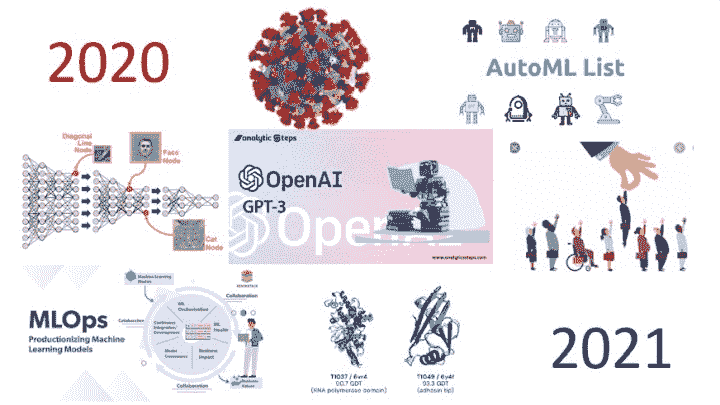
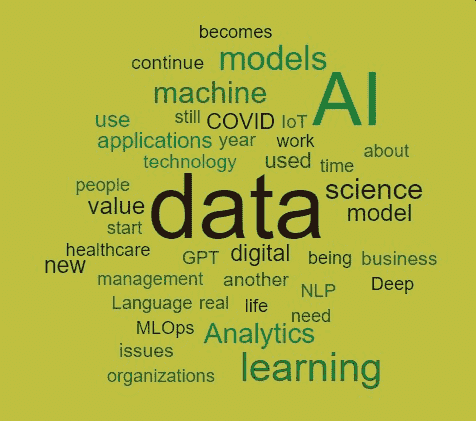

# 2020 年的主要进展和 2021 年 AI、数据科学、机器学习技术的关键趋势

> 原文：[`www.kdnuggets.com/2020/12/developments-trends-ai-data-science-machine-learning-technology.html`](https://www.kdnuggets.com/2020/12/developments-trends-ai-data-science-machine-learning-technology.html)

评论这是非常不寻常且困难的一年，我很高兴它很快就会过去。但我们仍然可以拥有美好的事物，其中之一是 KDnuggets 每年的专家预测总结。

早些时候，我们涵盖了 2020 年 AI、分析、机器学习、数据科学、深度学习**研究**的主要进展和 2021 年的关键趋势。

COVID 改变了人们的生活和工作方式，也突显了预测模型对假设的依赖以及对突然变化的脆弱性。

本博客将更多关注**技术**。我们询问了我们的专家小组：

> **2020 年 AI、数据科学、机器学习、深度学习技术的主要进展是什么？你对 2021 年有何关键趋势的期待？**

一些常见的主题包括 AutoML、自动化 / RPA、AI 偏见、COVID 影响、深度学习的限制、伦理 AI、GPT-3、医学和医疗保健以及 MLOps。

在提交截止日期之后发生了一项巨大的 AI/ML 发展。来自 DeepMind 的[AlphaFold](https://deepmind.com/blog/article/alphafold-a-solution-to-a-50-year-old-grand-challenge-in-biology)显然解决了长达 50 年的蛋白质折叠问题，对医学和生物学具有巨大的潜力。

这是专家们的意见，来自 Marcus Borba、Kirk Borne、Tom Davenport、Carla Gentry、Jake Flomenberg、IPFConline（Pierre Pinna）、Nikita Johnson、Doug Laney、Ronald van Loon、Bill Schmarzo、Kate Strachnyi 和 Mark van Rijmenam。

享受吧！

* * *

**[Marcus Borba](https://twitter.com/marcusborba)，全球思想领袖与影响者：#AI #MachineLearning #DataScience #BI #BigData #Analytics #IoT #DigitalTransformation**。

在 2020 年，对 AI 工作原理的关注日益增加，同时也评估了偏见问题，这使得 AI 需要越来越具可解释性和责任感。AutoML 的使用在资源工程和算法测试等问题上为数据科学家带来了若干好处。

在 2021 年，我预见到人工智能和机器学习在所有知识领域的使用将大幅增加，通过超自动化的概念，这涉及到除了 AI 和机器学习外的许多技术，如增强分析、物联网、iBPM 和 RPA。人工智能和机器学习将在网络安全领域、企业系统、智能城市和智能家居中被越来越多地使用。人工智能与物联网的结合（AIoT）也将是一个关键趋势，使得创建具有更高效率操作的解决方案成为可能，改善机器与人类之间的互动，同时在数据分析中获得更多的稳健性。

* * *

**[柯克·D·博恩](https://twitter.com/KirkDBorne)，布兹艾伦的首席数据科学家。全球演讲者。顶级#大数据 #数据科学 #人工智能 影响者。博士，天体物理学家。**

我在 2020 年数据相关领域的主要趋势包括：自动化叙述文本生成（如 GPT-3）的惊人（且令人惊恐）的进展；RPA 部署的无处不在；用于操作企业机器学习活动的 MLOps 工具的增长；AI 和 DevSecOps 在 IT 操作中的融合，作为 AIOps；数据科学家对我们部署模型中的数据漂移和概念漂移重要性的警示，特别是在 COVID 疫情期间之前成功模型的失败；包括边缘计算、边缘到云计算和雾计算在内的多样化混合数据架构的兴起；分布式数据挖掘的复兴（10-15 年前流行）在“联邦机器学习”标签下，允许在分布式数据集上进行增量模型训练而无需移动数据；在所有组织和市场领域对数据素养的巨大广泛兴趣和投资；以及对物联网的认识逐渐觉醒，不仅仅是监控活动（作为你做的事情），而是作为新的企业可观测性战略的技术推动者（作为你这样做的原因）。

我希望在 2021 年看到更多这样的趋势，特别是 MLOps、可观测性、数据素养和智能流程自动化（AI 增强 RPA）。

* * *

**[汤姆·达文波特](https://www.tomdavenport.com/)、[@tdav](https://twitter.com/tdav) 是巴布森学院的 IT 和管理学杰出教授；德勤分析与人工智能实践的高级顾问；麻省理工学院数字经济倡议的数字研究员。**

**2020**

+   我去年预测，广泛称为“MLOps”的机器学习模型持续管理将变得流行。这个概念已经变得流行，但我认为实际使用仍然主要集中在大型金融服务和科技公司中。

+   我还预测翻译员将变得对数据科学团队很重要，许多公司确实使用他们，但这个角色尚未成为制度化。

+   我预测了“模型对数据的适配只是考虑其是否有用的一个因素”，我认为这实际上并没有发生。强调这一信息的供应商并没有真正繁荣起来。

**2021**

+   大规模深度学习模型的受欢迎程度将在 2021 年达到峰值；数据和能源需求正变得过高，无法继续这一趋势。

+   数据科学团队将采纳成功实施项目所需的角色和技能分类；“产品经理”将成为确保部署的重要角色。

+   外部公司将专注于“数据科学即服务”的各个方面，包括提供训练模型的数据和通过 MLOps 监控模型。

* * *

这是这些预测中的一个词云

* * *

**[Carla Gentry](https://www.linkedin.com/in/datanerd13/)，数据科学家，分析解决方案**

**2020**

当我们回顾过去的一年时，我发现最有趣的关于人工智能、机器学习和数据科学的事情是：许多人仍在谈论 Python/编程/软件，但很少有人展示这些伟大领域如何帮助社会“解决问题”的现实例子——人工智能被简化为聊天机器人，机器学习变成了在某些“大型网站”上进行角色和物体识别，用于分类产品或寻找类似产品或推荐……我并不是说没有一些非常酷的东西在做，尤其是考虑到 Covid 是大家关注的焦点，数据科学和机器学习也被用来寻找热点和/或帮助接触追踪，这将有助于遏制新感染的增加。你知道，数据科学、分析和机器学习曾经并继续在所有疫苗的研发中发挥作用，但正如我们在“可靠性”和“再现性”部门即“AstraZeneca/Oxford COVID 疫苗数据”中看到的，数据质量和能够涉及代表性样本仍然是大问题。

尽管我们已经取得了进展，基本的“数据 101”问题仍然非常严峻——所以我们在开始任何项目时，请记得检查数据、查询并跟进异常，不要假设任何事情。有趣的是，在感恩节晚餐时，户外且保持社交距离，我妈妈给我看了一个两个“人跳舞”的视频，我说“哦，这很好”并微笑——她说——你注意到这两个“人”是机器人吗？嗯，跳舞就是数学，对吧（眨眼，不过，类似于 AI 画作，没有灵魂）2021 年及以后，我们可以做的事情无限，因此让我们通过记住基础知识——再现性、透明性、准确性和它是否代表真实生活和形式——来推动机器学习和数据科学的发展——我们必须摆脱黑箱思维——仅仅因为它在大学环境或实验室环境中有效，并不意味着它在现实生活中也会有效……

记住这一点，那些“短距离”内有上匝道和下匝道的高速公路——使得进出合流混乱——是由认为这样设计更高效的工程师设计的……对谁高效？在设计算法或模型时，了解你的受众……知道你的最终目标是什么，目的或功能是什么，然后——当然要有逻辑——但也要实际……

* * *

**[杰克·弗洛门贝格](https://www.wing.vc/people/jake-flomenberg)是 Wing Venture Capital 的合伙人，专注于 AI/ML 驱动的应用，他最近发布了一份关于数据科学领导者面临的最大问题的[调查](https://www.wing.vc/content/chief-data-scientist-survey)。**

**2020 年：** COVID-19 是一个黑天鹅事件，使许多模型经受了考验。不幸的是，大多数 AI 尚未能很好地适应快速变化的情况。随着公司被迫适应，AI 可观测性和模型监控成为所有从事生产模型工作者的明显需求。

NLP 领域的 AI 正在上升。人类 NLP 基准测试正在被超越。像 GPT-3 这样的语言处理模型正在解锁新的应用场景，如总结和代码生成。利用 NLP 从文本中发掘价值的初创公司继续激增。

医疗保健领域的 AI 终于开始发挥作用——无论是化学、药物发现、蛋白质组学等。在过去 2 年中，涉及 AI 的生物学出版物占比超过一半。

**2021 年：** 随着数据科学家努力在组织内部各方——利益相关者、监管者和最终用户之间建立信任，并更好地理解他们的模型并提供性能置信区间，模型可解释性成为主流需求。各种问题，如不公平的偏见、模型不稳定性、监管要求，推动了这一点。

计算机视觉不断普及。我预计除了自动驾驶车辆外，将会看到更多的现实世界应用案例以及更多的风险投资。我也希望看到计算机视觉开始受益于在 NLP 中解锁价值的自注意力策略。

数据标注变得更加自动化。随着少量样本学习和迁移学习的进步，计算机终于能够介入，减少人工手动标注所有数据的需求。

* * *

**[IPFConline](https://twitter.com/ipfconline1)，数字化转型咨询，法国马赛。**

对于 IPFConline 团队来说，2020 年在 AI 和数据科学领域标志着 3 个重要事实：

+   OpenAI GPT-3 的发布是自然语言处理领域的一个重大进步，

+   对于深度学习的真实认识在于，深度学习算法对数据的需求过于贪婪，这使得它们的解释变得非常困难。

+   在世界许多地方，禁止在大规模监控中使用面部识别技术。

2021 年将与 2020 年有很强的相似性，深度强化学习和迁移学习可能会开辟出新的算法类型，这些算法更公平，因此更值得信赖且偏见更少。

* * *

**[尼基塔·约翰逊](https://www.linkedin.com/in/nikitaljohnson/)，创始人，[RE.WORK 深度学习与人工智能](https://twitter.com/teamrework)活动，#reworkDL #reworkAI #AIforGood**

这一年充满挑战，但或许在我们保持社交距离的同时，关于如何将人工智能应用于社会影响的讨论使我们更紧密地团结在一起，并且由于探索如何利用人工智能应对疫情及造福社会，这些讨论变得更加突出。当然，DeepMind 近期关于蛋白质折叠突破的公告也是今年人工智能在医疗领域的一大进步。

我希望我们能看到人工智能在医疗和数字健康领域的力量在 2021 年进一步发展，包括隐私和个性化的进展，以及远程医疗和心理健康应用的改进。

* * *

**[道格·拉尼](https://www.linkedin.com/in/douglaney/)，创新研究员，数据与分析战略**

在 2021 年，应用人工智能和数据科学的主要工业焦点将是提高生命科学研究和医疗服务的效率。新冠疫情危机突显了医疗政策、供应链、运营、诊断、预防和治疗中的差距和机遇。

随着个人继续寻找更有效的远程工作方式，智能代理将逐渐融入我们用来协作的应用程序中。它们将帮助我们与彼此及大量的数据、内容和其他应用程序进行集成和沟通。智能设备和助手将从以问答为主的发展到真正具备对话性和情境意识。此外，它们将学习并模仿我们个人在处理事务时的伦理标准。

此外，我们将看到人工智能开始自主管理数据。数据的体量和速度一直只是基础设施扩展的问题。然而，日益增长和不断演变的数据种类需要整合、清洗、组织、存储和访问，用于事务和分析目的，这一直是一项艰巨的手动建筑和工程任务。自组织的数据管理能力将会出现，以减轻这一负担。

* * *

**[罗纳德·范·伦](https://twitter.com/Ronald_vanLoon)，帮助数据驱动型公司创造价值；#AI、#BigData、#DataScience、#IoT、#MachineLearning、#Analytics、#Cloud、#5G 领域的 Top10 影响者**

在 2020 年，随着企业应对 COVID-19 大流行带来的挑战，对话 AI 的加速发展达到了一个非凡的速度。对新数字服务的紧急需求、客户需求的变化以及远程工作的转变推动了这一技术的大规模战略性采用。AI API 的兴起，如对话 AI API 和文档 AI API，使得推动 AI 的可及性变得更加容易和快捷，并消除了对专业 AI 技能或经验的需求。

对于 2021 年，嵌入式 AI 将成为一个主要趋势，因为公司将专注于通过直观、简化的 AI 功能推动数字化转型的势头，并快速进行 AI 创新。这将确保 AI 的好处和价值能迅速实现，同时允许组织快速现代化业务。类似地，针对业务用户的机器学习应用将通过精简的实施和流程、自动化工作流以及更快的洞察生成推动企业中的 AI 民主化。

* * *

**[比尔·施马佐](https://www.linkedin.com/in/schmarzo/), [@schmarzo](https://twitter.com/schmarzo), 大数据学主任 | 认可的创新者、教育者、实践者 数据科学、设计思维、数据货币化**

**2020 年的主要发展：**

+   利用 AI 创建在使用过程中增值而非贬值的自主资产已经成为现实（感谢埃隆·马斯克）

+   孤立分析 - 为一次性分析目的构建的机器学习模型，但从未设计为可重复使用或持续学习和适应 - 继续成为组织的失望

+   开源工具在 AI/ML 模型开发、操作化和管理方面的持续进展

+   低估了由于错误估计误报和漏报错误成本而产生的意外后果

**2021 年的关键趋势：**

+   尽管数据货币化仍然是 CIO 的首要挑战，但许多组织缺乏以业务为中心的价值工程方法来识别和优先考虑 AI/ML 如何产生新的客户、产品和运营价值来源

+   组织开始认识到数据和分析的经济价值，这些数字资产不会磨损，而且使用越多，它们的价值就越高。

+   自主分析开始在领先组织中取代孤立分析

* * *

**[凯特·斯特拉赫尼](https://www.linkedin.com/in/kate-strachnyi-data/), Story by Data 和 DATAcated Academy 创始人**

在 2020 年，我们见证了从静态仪表板向交互式数据故事的转变，这些故事自动开发并向利益相关者传递关键洞察。数据消息是有上下文的，并根据受众（人们看到对他们有意义的洞察）量身定制的。我们还看到了一些软件，允许业务用户通过在搜索栏中输入问题来“询问”问题；这使他们能够更接近数据，减少获取数据驱动答案所需的时间和精力。

在 2021 年，我们可以期待看到推动提升所有行业和角色（不仅仅是数据专家）专业人士的数据素养技能的努力。将会有一个教育员工如何阅读、分析、解读和沟通数据的趋势。借助创新技术，我们将减少构建仪表盘的时间，更多地关注做出基于数据的决策。

* * *

**[马克·范·瑞门南博士](https://www.linkedin.com/in/markvanrijmenam)，[VanRijmenam](https://twitter.com/VanRijmenam)，思考技术及其对商业和社会的影响。三本管理书籍的作者。[Datafloq.com](http://datafloq.com)的创始人。通过[Mavin.org](http://Mavin.org)打击虚假新闻、机器人和网络喷子。**

在 2020 年，我们见证了拥有数十亿参数的先进语言模型的出现，这些模型凭借其准确性让人惊叹。**《卫报》**的一篇文章甚至展示了这一模型的先进性。

然而，在 2021 年，我们可能会看到首个拥有万亿参数的语言模型将技术提升到另一个层次。虽然这些模型可能最初会停留在研究领域，但如 GPT-3 这样的技术将会进入企业，并开始直接与客户互动。2021 年我们还会看到对伦理人工智能的关注和要求的增加。人工智能在社会中变得越来越普遍，公民将要求对人工智能采取伦理方法。在 2020 年，我们见证了阿姆斯特丹和赫尔辛基推出算法注册册，以带来人工智能公共部署的透明度，2021 年我们将看到这种情况更加频繁。

**相关：**

+   [人工智能、分析、机器学习、数据科学、深度学习研究 2020 年的主要进展和 2021 年的关键趋势](https://www.kdnuggets.com/2020/12/predictions-ai-machine-learning-data-science-research.html)

+   人工智能、分析、机器学习、数据科学、深度学习研究 2019 年的主要进展和 2020 年的关键趋势

+   人工智能、分析、机器学习、数据科学、深度学习技术 2019 年的主要进展和 2020 年的关键趋势

### 更多相关话题

+   [2021 年主要进展和 2022 年人工智能、数据科学等关键趋势](https://www.kdnuggets.com/2021/12/trends-ai-data-science-ml-technology.html)

+   [人工智能、分析、机器学习、数据科学、深度学习…](https://www.kdnuggets.com/2021/12/developments-predictions-ai-machine-learning-data-science-research.html)

+   [数据科学与分析行业 2021 年的主要进展及关键…](https://www.kdnuggets.com/2021/12/developments-predictions-data-science-analytics-industry.html)

+   [2021 年最佳 ETL 工具](https://www.kdnuggets.com/2021/12/mozart-best-etl-tools-2021.html)

+   [成为伟大数据科学家所需的 5 项关键技能](https://www.kdnuggets.com/2021/12/5-key-skills-needed-become-great-data-scientist.html)

+   [每个初学者数据科学家都应该掌握的 6 种预测模型](https://www.kdnuggets.com/2021/12/6-predictive-models-every-beginner-data-scientist-master.html)
