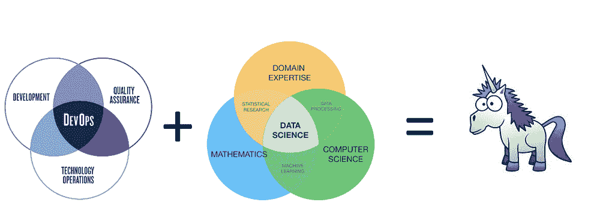
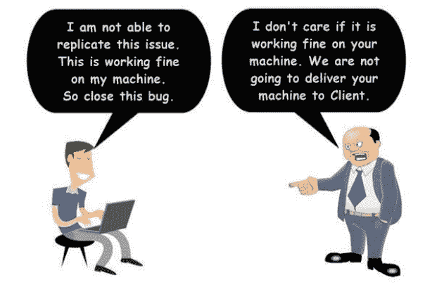
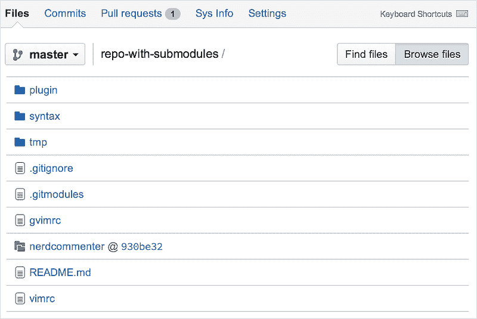
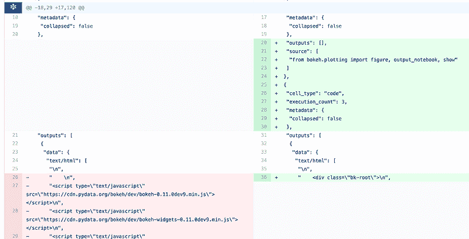
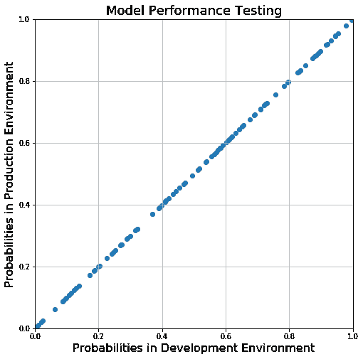
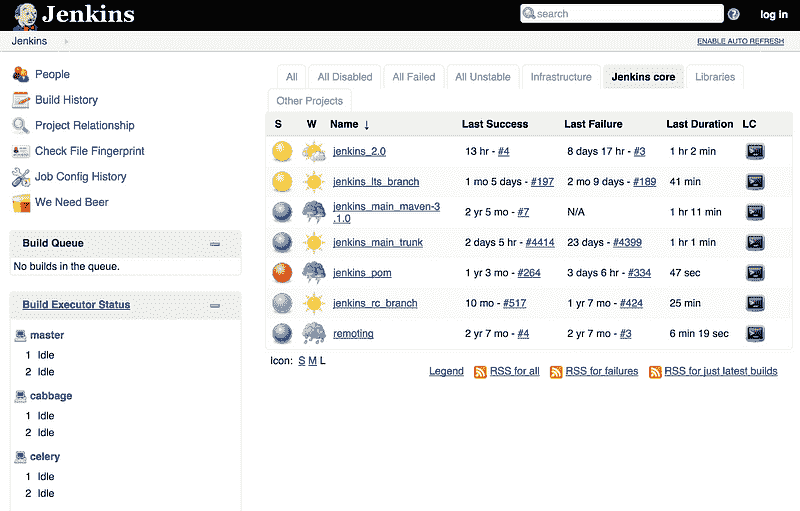
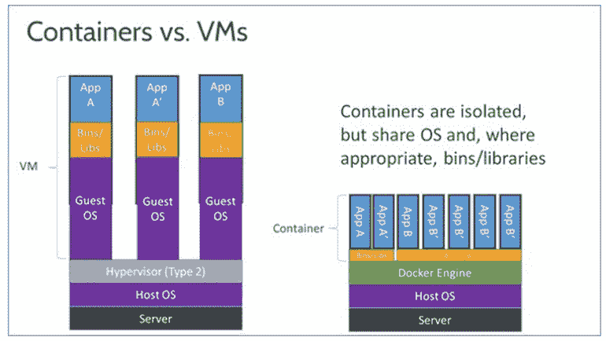
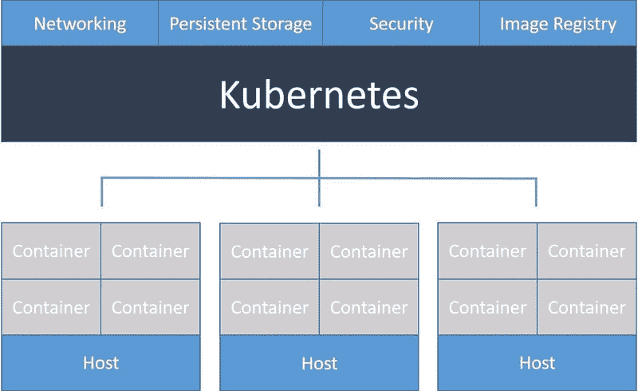
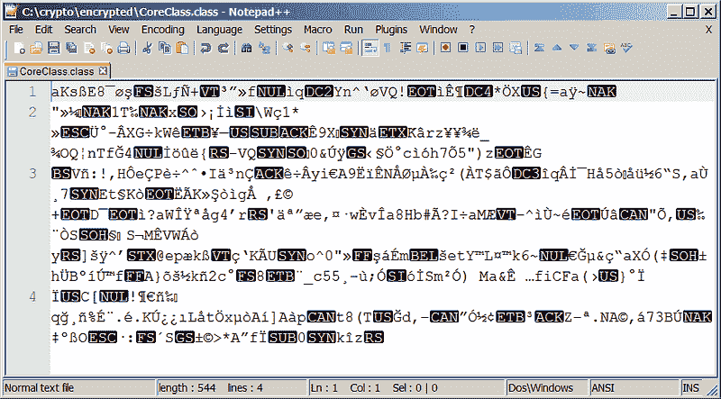

# 《数据科学家的 DevOps：驯服独角兽》

> 原文：[`www.kdnuggets.com/2018/07/devops-data-scientists-taming-unicorn.html`](https://www.kdnuggets.com/2018/07/devops-data-scientists-taming-unicorn.html)

 评论

**作者 [Syed Sadat Nazrul](https://www.linkedin.com/in/snazrul1/)，分析科学家**

* * *

## 我们的前三个课程推荐

 1\. [谷歌网络安全证书](https://www.kdnuggets.com/google-cybersecurity) - 快速进入网络安全职业生涯

 2\. [谷歌数据分析专业证书](https://www.kdnuggets.com/google-data-analytics) - 提升你的数据分析技能

 3\. [谷歌 IT 支持专业证书](https://www.kdnuggets.com/google-itsupport) - 支持你的组织的 IT

* * *

当大多数数据科学家开始工作时，他们通常具备了从教科书中学到的所有数学概念。然而，很快他们就会意识到，大多数数据科学工作涉及将数据转换成模型所需的格式。更进一步地，正在开发的模型是最终用户应用的一部分。现在，一个合格的数据科学家应该将他们的模型代码版本控制在 Git 上。然后，VSTS 将从 Git 下载代码，VSTS 随后将被封装在 Docker 镜像中，然后被放到 Docker 容器注册表上。一旦在注册表中，它将使用 Kubernetes 进行编排。对普通数据科学家来说，这些术语可能会让他们感到完全困惑。大多数数据科学家知道如何提供静态报告或带有预测的 CSV 文件。然而，我们如何对模型进行版本控制并将其添加到应用程序中？用户如何基于结果与我们的网站互动？如何扩展！？所有这些都涉及到信心测试，检查是否有任何内容低于设定的阈值，来自不同方的签署和不同云服务器之间的编排（以及所有丑陋的防火墙规则）。这就是一些基本 DevOps 知识派上用场的地方。

### 什么是 DevOps？

简而言之，DevOps 是那些帮助开发者（例如数据科学家）和 IT 部门协作的人。

开发者和 IT 之间的常见斗争

开发人员有自己的指挥链（即项目经理），他们希望尽快推出功能。对于数据科学家来说，这意味着更改模型结构和变量。他们根本不在乎机器发生了什么。数据中心冒烟？只要他们能够获取数据以完成最终产品，他们根本不在乎。另一方面是 IT 部门。他们的工作是确保所有服务器、网络和精美的防火墙规则都得到维护。网络安全对他们来说也是一个巨大关注点。他们对公司的客户毫不关心，只要机器正常运作。DevOps 是开发人员和 IT 之间的中介。常见的 DevOps 职能包括：

+   集成

+   测试

+   打包

+   部署

博客的其余部分将详细解释整个持续集成和部署过程（或者至少是对数据科学家相关的内容）。在阅读博客的其余部分之前，请注意：理解业务问题，不要对工具过于依赖。博客中提到的工具可能会改变，但基础问题在可预见的未来将大致相同。

### 源代码管理

想象一下将你的代码推送到生产环境。它正常工作了！完美。没有任何抱怨。时间流逝，你不断添加新功能并持续开发。然而，其中一个功能引入了一个严重的错误，严重影响了你的生产应用。你本希望你的多个单元测试能发现这个错误。然而，仅仅因为某个功能通过了所有测试，并不意味着它没有漏洞。它只是意味着它通过了所有当前编写的测试。由于是生产级别的代码，你没有时间进行调试。时间就是金钱，你还有愤怒的客户。是否可以简单地回到代码正常工作的那个点呢？这就是版本控制发挥作用的地方。在[敏捷](https://www.agilealliance.org/agile101/)风格的代码开发中，产品在不确定的时间段内不断开发。对于这种应用，某种形式的版本控制将非常有用。

Bitbucket 仓库

就个人而言，我喜欢[Git](https://git-scm.com/)，但[SVN](https://subversion.apache.org/)用户仍然存在。Git 适用于所有形式的平台，如[GitHub](https://github.com/)、[GitLab](https://gitlab.com/)和[BitBucket](https://bitbucket.org/)（每个平台都有其独特的优缺点）。如果你已经熟悉 Git，考虑阅读更为[高级的 Git 教程](https://www.atlassian.com/git/tutorials/advanced-overview)。我推荐查看的一个高级功能是[Git 子模块](https://git-scm.com/book/en/v2/Git-Tools-Submodules)，你可以存储多个独立 Git 仓库的特定提交哈希，以确保你可以访问一组稳定的依赖项。当必要时，重要的是要有 README.md，概述仓库的详细信息以及打包（例如，使用 setup.py 进行 Python）。如果你存储二进制文件，考虑查看[Git LFS](https://git-lfs.github.com/)（不过我建议如果可能的话避免使用这个）。

在 Git 上合并 Jupyter 笔记本

数据科学中特定的版本控制问题是使用 Jupiter/Zeppelin 笔记本。数据科学家绝对**喜欢**笔记本。然而，如果你将代码存储在笔记本模板中并尝试在版本控制中更改代码，那么在执行差异比较和合并时，你会得到疯狂的 HTML 垃圾。你可以完全放弃在版本控制中使用笔记本（仅从版本控制的库中导入数学函数），或者可以使用现有工具如[nbdime](https://nbdime.readthedocs.io/en/stable/)。

### 自动测试

从数据科学家的角度来看，测试通常分为两类。一类是常规的单元测试，用于检查代码是否正常工作或是否按照你的要求运行。另一类更具体于数据科学领域，是数据质量检查和模型性能。你的模型是否为你提供了准确的分数？现在，我相信许多人会想知道为什么这是一个问题。你已经做了分类分数和 ROC 曲线，模型也足够令人满意，可以进行部署。好吧，有很多问题。主要问题是，开发环境中的库版本可能与生产环境完全不同。这意味着不同的实现、近似值，因此，模型输出也不同。

如果集成和部署做得正确，模型输出在开发和生产环境中应该是相同的。

另一个经典示例是为开发和生产使用不同语言。让我们设想这个场景。你，尊贵的数据科学家，希望用 R、Python、Matlab 或者上周刚刚发布白皮书的许多新语言之一来编写模型（这些语言可能还没有经过充分测试）。你将模型交给生产团队。生产团队怀疑地看着你，笑了 5 秒钟，然后才意识到你是认真的。他们可能会嗤之以鼻。生产代码是用 Java 编写的。这意味着需要将整个模型代码重写为 Java 以用于生产。这也意味着完全不同的输入格式和模型输出。因此，自动化测试是必要的。

Jenkins 主页

单元测试是非常常见的。[JUnit](https://www.tutorialspoint.com/junit/junit_test_framework.htm)可供 Java 用户使用，而[unittest](https://docs.python.org/3/library/unittest.html)库适用于 Python 开发人员。然而，有可能有人在将代码推送到生产环境之前忘记在团队中正确运行单元测试。虽然你可以使用[crontab](http://www.adminschoice.com/crontab-quick-reference)来运行自动化测试，但我推荐使用更专业的工具，如[Travis CI](https://travis-ci.org/)、[CircleCI](https://circleci.com/)或[Jenkins](https://jenkins.io/)。Jenkins 允许你安排测试、从版本控制库中选择特定分支、如果出现问题会发送邮件提醒，甚至可以启动 Docker 容器镜像，如果你希望将测试隔离在沙盒中。基于容器化的沙盒化将在下一部分中更详细地解释。

### 容器化

容器与虚拟机

沙盒化是编码的重要组成部分。这可能涉及为各种应用程序设置不同的环境。它可能只是将生产环境复制到开发环境中。它甚至可能意味着拥有多个具有不同软件版本的生产环境，以满足更大客户群的需求。如果你考虑使用带有[Virtual Box](https://www.virtualbox.org/)的虚拟机，我相信你已经注意到，你要么需要在多轮测试中使用完全相同的虚拟机（这是很糟糕的 DevOps 卫生），要么需要为每次测试重新创建一个干净的虚拟机（这可能需要接近一个小时，具体取决于你的需求）。一种更简单的替代方案是使用容器而不是完整的虚拟机。容器只是一个 UNIX 进程或线程，表现得像虚拟机。它的优点是功耗低，内存消耗少（这意味着你可以随意启动或关闭它……在几分钟内）。流行的容器化技术包括[Docker](https://www.docker.com/)（如果你只希望使用一个容器）或[Kubernetes](https://kubernetes.io/)（如果你喜欢协调多个容器以实现多服务器工作流）。

Kubernetes 工作流

容器化技术不仅有助于测试，还能提高可扩展性。特别是当你需要考虑多个用户使用你的模型基础应用程序时，这一点尤为重要。这可能涉及训练或预测。

### 安全

安全很重要，但在数据科学领域往往被低估。一些用于模型训练和预测的数据涉及敏感信息，如信用卡信息或医疗数据。在处理这些数据时，需要遵守 GDPR 和 HIPPA 等合规政策。不仅仅是客户端需要安全。贸易秘密模型结构和变量，在部署到客户端服务器时，也需要一定级别的加密。这通常通过将模型部署到加密的可执行文件（例如 JAR 文件）中，或在将模型变量存储到客户端数据库之前进行加密来解决（不过，请不要自己编写加密代码，除非你完全知道自己在做什么……）。

加密 JAR 文件

此外，最好按租户建立模型，以避免意外的迁移学习，这可能导致一个公司向另一个公司泄露信息。在企业搜索的情况下，数据科学家可以使用所有可用数据构建模型，并根据权限设置筛选出特定用户未授权查看的结果。虽然这种方法看起来合理，但用于训练模型的数据中一部分信息实际上是由算法学习并转移到模型中的。因此，无论如何，这使得用户有可能推断出被禁止页面的内容。没有绝对的安全。然而，它需要足够好（这一点的定义取决于产品本身）。

### 协作

当与 DevOps 或 IT 合作时，作为数据科学家，明确需求和期望是非常重要的。这可能包括编程语言、包版本或框架。最后但同样重要的是，彼此尊重也很重要。毕竟，DevOps 和数据科学家都面临着极具挑战性的工作。DevOps 对数据科学了解不多，而数据科学家在 DevOps 和 IT 方面也不是专家。因此，沟通是成功业务结果的关键。

### 额外信息

[**软件开发设计原则**](https://medium.com/@sadatnazrul/software-development-design-principles-79d15ef765f3)

当人们开始作为自学编程的程序员时，我们经常会想到创建一个简单的应用程序……

[**如何让你的软件开发体验变得无痛……**](https://towardsdatascience.com/how-to-make-your-software-development-experience-painless-2591ebcc69b6)

在各种形式的组织中工作（从大型软件开发公司到小型创业公司，再到学术实验室），我...

[**数据科学面试指南**](https://towardsdatascience.com/data-science-interview-guide-4ee9f5dc778)

数据科学是一个相当大且多样的领域。因此，很难成为一个全能型人才...

**简介：[Syed Sadat Nazrul](https://www.linkedin.com/in/snazrul1/)** 白天利用机器学习追捕网络和金融犯罪分子，晚上则撰写有趣的博客。

[原始](https://towardsdatascience.com/devops-for-data-scientists-taming-the-unicorn-6410843990de)。已获许可转载。

**相关：**

+   操作性机器学习：成功 MLOps 的七个考虑因素

+   数据科学面试指南

+   接收器操作特征曲线揭秘（Python 版）

### 更多相关内容

+   [通过这个免费的 DevOps 速成课程释放你的潜力](https://www.kdnuggets.com/2023/03/corise-unlock-potential-with-this-free-devops-crash-course.html)

+   [每个初学者应该学习的 10 种必备 DevOps 工具](https://www.kdnuggets.com/10-essential-devops-tools-every-beginner-should-learn)

+   [数据工程师和数据科学家都适用的高保真合成数据](https://www.kdnuggets.com/2022/tonic-high-fidelity-synthetic-data-engineers-scientists-alike.html)

+   [我们不需要数据科学家，我们需要数据工程师](https://www.kdnuggets.com/2021/02/dont-need-data-scientists-need-data-engineers.html)

+   [数据分析师和数据科学家有什么区别？](https://www.kdnuggets.com/2022/03/difference-data-analysts-data-scientists.html)

+   [掌握数据讲故事的艺术：数据科学家的指南](https://www.kdnuggets.com/2023/06/mastering-art-data-storytelling-guide-data-scientists.html)
