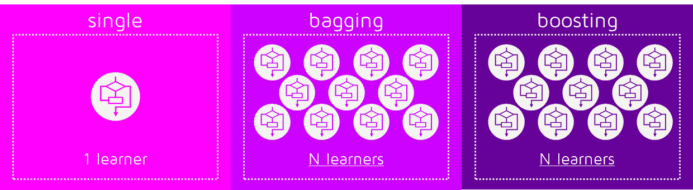
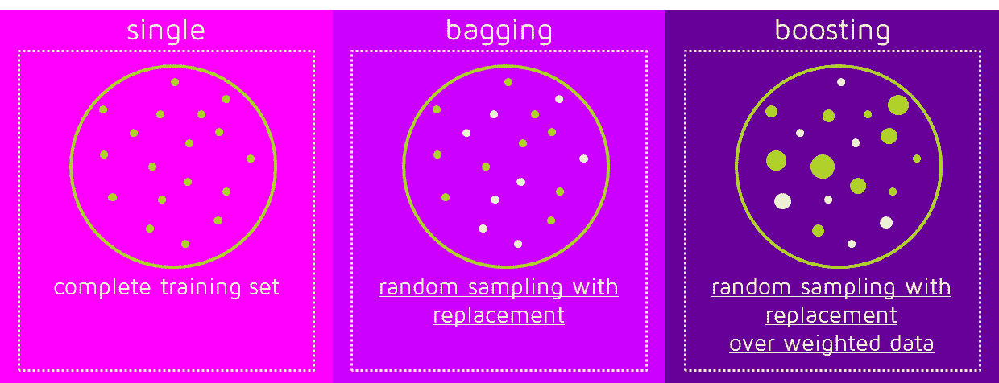
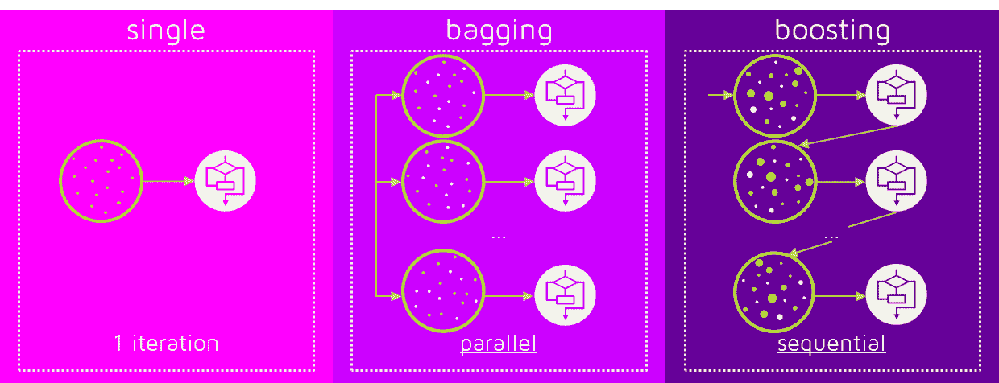
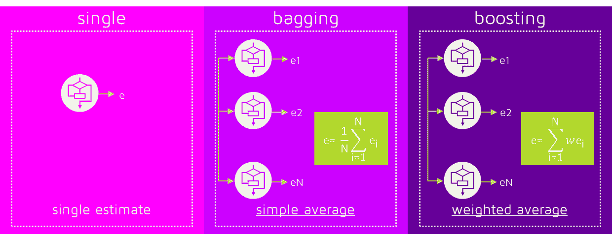
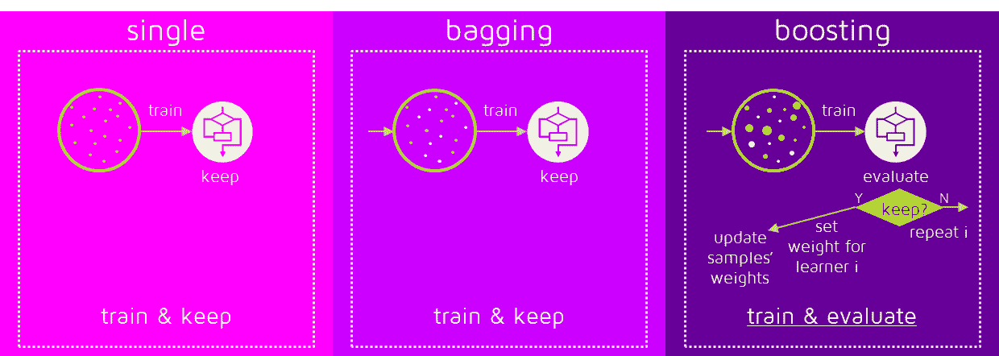

# Bagging 和 Boosting 有什么区别？

> 原文：[`www.kdnuggets.com/2017/11/difference-bagging-boosting.html`](https://www.kdnuggets.com/2017/11/difference-bagging-boosting.html)

评论

**由 xristica，[Quantdare](https://quantdare.com/)提供**。

Bagging 和 Boosting 的相似之处在于它们都是**集成技术**，在这些技术中，一组弱学习器被组合以创建一个强学习器，从而获得比单一学习器更好的性能。所以，让我们从头开始：

### 什么是集成方法？

集成是一个机器学习概念，其思想是使用相同的学习算法训练**多个模型**。集成方法属于更大的方法群体，称为**多分类器**，在这些方法中，数百或数千个具有共同目标的学习器被融合在一起以解决问题。

第二组多分类器包含**混合方法**。它们也使用一组学习器，但可以使用不同的学习技术进行训练。Stacking 是最著名的。如果你想了解更多关于 Stacking 的信息，你可以阅读我之前的文章，“[梦之队组合分类器](http://quantdare.com/dream-team-combining-classifiers-2/)”。

学习中的主要误差原因是**噪声、偏差和方差**。集成有助于最小化这些因素。这些方法旨在提高机器学习算法的稳定性和准确性。多个分类器的组合减少了方差，尤其是在不稳定分类器的情况下，并可能产生比单一分类器更可靠的分类。

要使用 Bagging 或 Boosting，你必须选择一个基础学习算法。例如，如果我们选择一个分类树，Bagging 和 Boosting 将由一个数量随意的树池组成。

### Bagging 和 Boosting 如何获得 N 个学习器？

Bagging 和 Boosting 通过在训练阶段生成额外的数据来获得 N 个学习器。通过**随机采样带替换**从原始集合中生成 N 个新的训练数据集。通过带替换的采样，一些观察值可能在每个新训练数据集中重复出现。

对于 Bagging，任何元素在新数据集中出现的概率是相同的。然而，对于 Boosting，观察值是加权的，因此其中一些会更频繁地参与新集合：

这些多个集合用于训练相同的学习算法，因此产生了不同的分类器。

### 为什么数据元素会被加权？

在这一点上，我们开始处理这两种方法之间的主要区别。虽然 Bagging 的训练阶段是并行的（即每个模型独立构建），但 Boosting 以顺序方式构建新的学习器：

在 Boosting 算法中，每个分类器都是在数据上训练的，并考虑了之前分类器的成功。每次训练步骤后，权重会重新分配。**被错误分类的数据增加其权重**，以强调最困难的案例。这样，后续学习器在训练过程中会集中关注这些案例。

### 分类阶段是如何工作的？

要预测新数据的类别，我们只需**将 N 个学习器应用于新观察数据**。在 Bagging 中，结果是通过对 N 个学习器的响应进行平均（或多数投票）获得的。然而，Boosting 为 N 个分类器分配第二组权重，以便对它们的估计进行**加权平均**。

在 Boosting 训练阶段，算法会为每个结果模型分配权重。对训练数据分类效果好的学习器会被分配比效果差的学习器更高的权重。因此，在评估新的学习器时，Boosting 还需要跟踪学习器的错误。我们来看看过程中的差异：

一些 Boosting 技术包括额外的条件来决定是否保留或丢弃单个学习器。例如，在最著名的 AdaBoost 中，需要误差小于 50% 才能维持模型；否则，迭代将重复进行，直到达到比随机猜测更好的学习器。

之前的图像展示了 Boosting 方法的一般过程，但存在几种替代方法，它们在确定下一训练步骤和分类阶段使用的权重方面有所不同。如果你想详细了解，请点击这里：[AdaBoost](https://en.wikipedia.org/wiki/AdaBoost)、[LPBoost](https://en.wikipedia.org/wiki/LPBoost)、[XGBoost](http://arxiv.org/pdf/1603.02754v1.pdf)、[GradientBoost](https://en.wikipedia.org/wiki/Gradient_boosting)、[BrownBoost](https://en.wikipedia.org/wiki/BrownBoost)。

### Bagging 和 Boosting 哪个更好？

没有绝对的赢家；这取决于数据、模拟和具体情况。

Bagging 和 Boosting 通过结合来自不同模型的多个估计来降低单个估计的方差。因此，结果可能是一个**更高稳定性**的模型。

如果问题在于单个模型性能非常低，Bagging 很少能获得**更好的偏差**。然而，Boosting 可以生成一个综合模型，具有较低的错误，因为它优化了单个模型的优点并减少了陷阱。

相反，如果单个模型的困难是**过拟合**，那么 Bagging 是最佳选择。Boosting 本身并不能避免过拟合；实际上，这一技术本身面临这个问题。因此，Bagging 比 Boosting 更常有效。

### 总结：

| **相似之处** |  | **差异** |
| --- | --- | --- |
| 两者都是集成方法，将 N 个学习者从 1 个学习者中获取… |  | … 但 Bagging 是独立构建的，而 Boosting 尝试添加在之前模型失败的地方表现良好的新模型。 |
| 两者都通过随机抽样生成多个训练数据集… |  | … 但只有 Boosting 为数据确定权重，以便将偏差倾斜到最困难的案例。 |
| 两者都通过对 N 个学习者的结果取平均（或取多数）来做出最终决定… |  | … 但 Bagging 采用的是等权重平均，而 Boosting 采用加权平均，更多权重分配给在训练数据中表现更好的学习者。 |
| 两者都擅长减少方差并提供更高的稳定性… |  | … 但只有 Boosting 尝试减少偏差。另一方面，Bagging 可能解决过拟合问题，而 Boosting 可能增加过拟合。 |

[原文](https://quantdare.com/what-is-the-difference-between-bagging-and-boosting/)。经许可转载。

**相关：**

+   集成学习以提升机器学习结果

+   数据科学入门：初学者的基本概念

+   必须了解：集成学习的基本思想是什么？

* * *

## 我们的前三大课程推荐

 1\. [谷歌网络安全证书](https://www.kdnuggets.com/google-cybersecurity) - 快速进入网络安全职业生涯。

 2\. [谷歌数据分析专业证书](https://www.kdnuggets.com/google-data-analytics) - 提升你的数据分析技能

 3\. [谷歌 IT 支持专业证书](https://www.kdnuggets.com/google-itsupport) - 支持你的组织进行 IT 管理

* * *

### 更多相关话题

+   [SQL 与对象关系映射（ORM）的区别是什么？](https://www.kdnuggets.com/2022/02/difference-sql-object-relational-mapping-orm.html)

+   [数据分析师和数据科学家的区别是什么？](https://www.kdnuggets.com/2022/03/difference-data-analysts-data-scientists.html)

+   [效率决定生物神经元与…](https://www.kdnuggets.com/2022/11/efficiency-spells-difference-biological-neurons-artificial-counterparts.html)

+   [L1 与 L2 正则化的区别](https://www.kdnuggets.com/2022/08/difference-l1-l2-regularization.html)

+   [机器学习中训练数据和测试数据的区别](https://www.kdnuggets.com/2022/08/difference-training-testing-data-machine-learning.html)

+   [GBM 与 XGBoost 的区别是什么？](https://www.kdnuggets.com/wtf-is-the-difference-between-gbm-and-xgboost)
