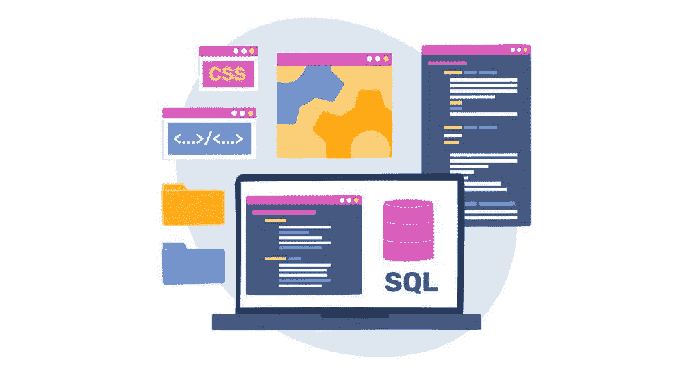

# SQL 与对象关系映射（ORM）之间的区别是什么？

> 原文：[`www.kdnuggets.com/2022/02/difference-sql-object-relational-mapping-orm.html`](https://www.kdnuggets.com/2022/02/difference-sql-object-relational-mapping-orm.html)

[由 freepik 创建的技术矢量图 - www.freepik.com](https://www.freepik.com/vectors/technology)

在处理数据库时，通常会出现是否应该使用结构化查询语言（SQL）还是对象关系映射（ORM）的问题。以下是这两者的概述，帮助人们做出明智的决定。

* * *

## 我们的前 3 个课程推荐

 1\. [Google 网络安全证书](https://www.kdnuggets.com/google-cybersecurity) - 快速进入网络安全职业。

 2\. [Google 数据分析专业证书](https://www.kdnuggets.com/google-data-analytics) - 提升你的数据分析能力

 3\. [Google IT 支持专业证书](https://www.kdnuggets.com/google-itsupport) - 支持你的组织的 IT

* * *

## **SQL 如何工作？**

SQL 允许人们通过使用特定的查询与关系数据库互动。关系数据库将信息存储在字段中，并通常按行和列组织内容。每个数据库通常至少包含一个表。

SQL 是一种编程语言，允许[个人提取或修改](https://www.w3schools.com/sql/sql_syntax.asp)在数据库中的所需信息。他们通过输入不区分大小写的查询来实现这一点。

例如，CREATE DATABASE 命令创建一个新的数据库，而 INSERT INTO 命令将信息移动到一个数据库中。这是两种直接的查询类型。然而，根据需要，它们可能变得更加复杂。在这些情况下，一个分心的开发人员更容易出错。

## **ORM 与 SQL 有何不同？**

对象关系映射让人们可以用自己选择的编程语言与数据库互动，而不是强制使用 SQL。开发人员可以使用称为对象关系映射器的工具。这些工具以结构化的方式展示数据，帮助用户理解数据库的内容和布局，而无需使用 SQL。一个主要的[好处是节省时间](https://dev.to/tinazhouhui/introduction-to-object-relational-mapping-the-what-why-when-and-how-of-orm-nb2)相比输入 SQL 查询。

随着人们与数据的交互变得越来越复杂，SQL 查询的长度也随之增加。这种现实增加了出错的可能性。由于有多种编写问题和获取相同结果的方法，情况也变得更加复杂。

对象关系映射器作为一种翻译器，将代码从一种形式转换为另一种形式。该工具创建表示数据库虚拟映射的对象。用户可以与这些对象互动，而不是直接操作代码。

## **选择 SQL 和 ORM 之间的考虑因素**

人们自然会想知道什么时候应该使用 SQL 或 ORM。以下是一些可以帮助他们在特定情况下做出正确决策的要点。

### **安全性**

任何[全面的数据安全方法](https://datamotion.com/best_practices_-securing_data_at_rest_in_use_and_in_motion/)都必须保护静态数据、使用中的数据和传输中的数据。SQL 注入攻击允许恶意方篡改存储的数据。许多因素可能使这些事件更有可能发生，但旧的或错误的代码是主要原因之一。使用参数化查询是避免 SQL 注入攻击的最佳实践之一。

许多 ORM 工具默认会对某些类型的查询进行参数化。这可以帮助防止一些 SQL 攻击。使用 ORM 不能完全杜绝这些攻击，但可以降低其发生的可能性。

### **当前 SQL 熟练程度**

数据显示，[2021 年全球 47.8% 的开发者](https://www.statista.com/statistics/793628/worldwide-developer-survey-most-used-languages/)使用 SQL。这虽然是一个总体少数，但仍然是一个相当大的比例。那些不经常使用 SQL 或对其不太舒适的人可能更愿意使用 ORM。他们可能会更少犯错，尤其是在处理复杂查询时。

然而，一些开发者指出，[ORM 的存在并不能成为](https://tylerclark.dev/orm-vs-vanilla-sql/)回避学习 SQL 的借口。使用 ORM 仍然需要设置和配置，才能开始使用。

### **查询的复杂性和所需速度**

关于使用 ORM 和 SQL 需要考虑的另一点是，前者可能会牺牲一些速度。因此，人们在运行复杂查询时[可能会发现他们的生产力降低](https://www.linkedin.com/pulse/object-relational-mapping-orm-supun-ishara-weerasekara)。

如果人们担心在使用 SQL 输入复杂查询时出错，他们可能会发现较慢的速度是可接受的权衡，以换取 ORM 工具所提供的更高准确性。然而，那些有多年 SQL 经验且对自己能力有信心的人可能不愿意使用 ORM 工具并接受较慢的处理速度。

### **供应商锁定的可能性**

使用 ORM 意味着在处理数据库时始终依赖第三方工具，而 SQL 则不需要。如果一个人不喜欢需要依赖供应商产品来进行数据库更改的想法，那么最好还是由具备强大 SQL 技能的其他人来完成这项工作。

市场上有许多 ORM 产品，确定哪个最适合组织的需求并不总是容易的。也许决策者还没有得出结论，而他们需要尽快完成数据库工作。在这种情况下，SQL 允许在公司购买 ORM 之前完成任务。

### **故障排除的便利性**

SQL 需要开发者直接处理代码。这意味着他们通常可以更容易地进行低级故障排除，因为他们可以确切看到哪些查询使他们达到了某个点。

ORM 在开发者与代码之间工作，因此不容易看到后台发生了什么。这一特性使得故障排除变得更加复杂。

## **没有普遍适用的最佳选择**

许多开发者可能会在不同的时间使用 SQL 和 ORM。这是因为在某些情况下，其中一个明显是更合适的选择。然而，简单地说其中一个在所有情况下都是最佳选择是短视的。考虑到这一点，开发者在决定使用哪一个之前，应考虑项目的范围、组织的需求和他们的能力。

**[香农·弗林](https://www.linkedin.com/in/shannon-flynn-8972a61b2/)** (**[@rehackmagazine](https://twitter.com/rehackmagazine)**) 是一位技术博主，专注于 IT 趋势、网络安全和商业技术新闻。她也是 MakeUseOf 的撰稿人，并且是 [**ReHack.com**](https://rehack.com/) 的执行编辑。关注 KDnuggets，了解更多来自香农以及其他数据科学更新的信息。有关更多信息，请参见香农的 [个人网站](https://shannonlflynn.com/)。

### 更多相关话题

+   [KDnuggets™ 新闻 22:n09，3 月 2 日：讲述一个精彩的数据故事：一个…](https://www.kdnuggets.com/2022/n09.html)

+   [数据分析师和数据科学家的区别是什么？](https://www.kdnuggets.com/2022/03/difference-data-analysts-data-scientists.html)

+   [机器学习中训练数据与测试数据的区别](https://www.kdnuggets.com/2022/08/difference-training-testing-data-machine-learning.html)

+   [L1 和 L2 正则化的区别](https://www.kdnuggets.com/2022/08/difference-l1-l2-regularization.html)

+   [效率决定生物神经元与人工神经元的区别](https://www.kdnuggets.com/2022/11/efficiency-spells-difference-biological-neurons-artificial-counterparts.html)

+   [GBM 和 XGBoost 之间的区别是什么？](https://www.kdnuggets.com/wtf-is-the-difference-between-gbm-and-xgboost)
