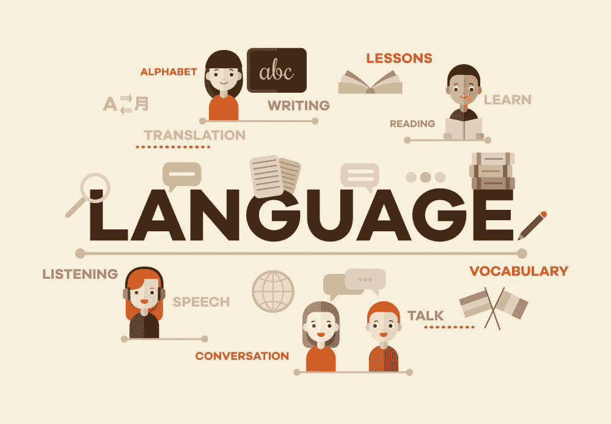

# NLP 在现实世界中的应用范围：每个问题的不同解决方案

> 原文：[`www.kdnuggets.com/2022/03/different-solution-problem-range-nlp-applications-real-world.html`](https://www.kdnuggets.com/2022/03/different-solution-problem-range-nlp-applications-real-world.html)

[背景矢量图由 freepik 创作 - www.freepik.com](https://www.freepik.com/vectors/background)

如今，公司开始意识到他们每天处理的所有非结构化数据中隐藏了大量价值，并埋藏在多年来巨大增长的档案中。我们观察到一个由许多提供基于人工智能解决方案的参与者组成的行业的（重新）诞生，组织要求他们帮助理解文档的内容，以及像数据科学家这样的新重要角色。

* * *

## 我们的前三个课程推荐

 1\. [谷歌网络安全证书](https://www.kdnuggets.com/google-cybersecurity) - 快速进入网络安全职业生涯。

 2\. [谷歌数据分析专业证书](https://www.kdnuggets.com/google-data-analytics) - 提升您的数据分析能力

 3\. [谷歌 IT 支持专业证书](https://www.kdnuggets.com/google-itsupport) - 支持您的组织的 IT

* * *

由于这个行业非常年轻，我们也记录了理解自然语言处理真正意义上的困难。大多数公司将其视为*一种大技术*，并认为供应商的产品质量和价格可能有所不同，但**NLP 并不是一种工具**；它不是一种工具，而是一个工具箱。当我们将市场作为一个整体来看时，存在很大的多样性，即使大多数供应商只有一个工具，而这个工具也并不适用于所有问题。虽然可以理解，当技术合作伙伴接触潜在客户时，会尝试使用它拥有的工具来解决业务案例，但从客户的角度来看这并不理想。每个问题都需要不同的解决方案。

多年来，我与来自各个行业的许多客户合作，由于我有幸为拥有多种工具的公司工作，我可以每次选择不同的方法。**最适合工作的工具**。我通常的问题是：

1.  方法论是否相关？鉴于相同的功能，是否有影响，比如说，偏好深度学习而不是[符号学](https://community.expert.ai/articles-showcase-56/a-quick-word-on-hybrid-ai-in-natural-language-processing-the-new-approach-to-machine-learning-applied-to-text-analysis-197?)？

1.  AI 解决方案预期要交付什么？针对特定的用例，哪个 NLP 特性最为合适？

尽管实现这一主题可能需要一个为期两周的研讨会来进行充分调查，但我会尝试通过几个例子总结我的经验（当然，也应用必要的简化）。

我会先说，从我的角度来看，这两个问题是紧密相连的。一些方法（例如基于机器学习的方法）可以响应短时间市场需求，实际上可以快速交付一个*足够好的*解决方案，至少对于一些用例（例如可以忽略[精度与召回率](https://community.expert.ai/articles-showcase-56/precision-and-recall-f-score-and-accuracy-measuring-nlp-performance-191?))，尤其是当我们的解决方案基于一个过去因为某种原因被手动标记的大型档案时。另一方面，一个项目可能要求高精度和高召回率，但它主要围绕专有名词或唯一的代码（即很少出现歧义），因此使用直接的关键词列表来处理问题更为容易。不幸的是，我们没有严格的指南来说明何时一种方法优于其他方法，这种选择与我们想要构建的具体解决方案紧密相关……但有一些一般规则。由于生活中的一切都有优缺点，这里是一个（再次，简化的）视角：

+   **关键词**技术（又名*浅层语言学*）在涉及明确的词汇列表时更为可取，但当相关词汇可以表示多重意义时不建议使用。

+   **符号性**（句法分析、语义学、深层语言学）将详细收集信息，理想情况下用于去除结果中的噪音，但当需要快速达到目标或保持最低工作量时不是最佳解决方案（除非我们谈论的是已经定制的解决方案，事实上，一些 NLP 供应商专注于某一行业，使得开发更快）。

+   **机器学习**（统计方法）近年来以我们通常称之为深度学习的技术形式强势回归，主要承诺从零开始提供解决方案所需的努力和时间非常少；确实，有时使用一个非常基础的算法可以轻松达到 75% [准确率](https://community.expert.ai/articles-showcase-56/precision-and-recall-f-score-and-accuracy-measuring-nlp-performance-191?)（假设你有一个足够大的已标记语料库，或者你愿意投入工作）。这可能是许多创业公司，特别是在支出方面非常谨慎的公司，青睐这种方法的原因。如果你的应用程序期望生产级别的准确性（我个人定义为 85%以上的 F-score），那么根据用例，问题可能看起来难以克服，实际上我们最近看到越来越多的文章谈论机器学习不是 NLP 问题的理想方法，业内一些公司已经将他们的信息重塑为“机器学习是来*帮助*你的”。

但让我们谈谈工具箱中的工具。这里是一个简短的、非全面的列表：*分类、实体提取、情感、摘要、词性标注、三元组（SAO）、关系、事实挖掘、关联数据、启发式、情感/感觉/情绪*。几乎所有计算语言学中的用例都可以归结为***元标记***；文档经过一个引擎处理后，变得更加丰富，装饰有一系列标签，指示与之相关的关键智能数据。正是这个简单的概念让许多公司认为所有 NLP 技术都是相同的，但问题是：你想用什么来标记你的文档？来自标准分类法的类别？文中提到的公司名称？以“正面”或“负面”表示的文档总体情感？也许是上述的组合（例如，对文档中提取的每个实体的情感）？

文本分析提供者本质上是问题解决者。例如，如果一个供应商仅提供**分类**，他们通常会建立一个论点，说明如何通过内容分类过程来解决任何用例。就像我可以用鞋子把钉子钉进墙里，但如果有一把锤子，我可能会选择用锤子。我们如何识别每个项目所需的工具？有些更明显，但让我给你一些最著名的工具的提示：

+   **分类**应该在您的应用程序的最终目标是识别文档属于一个非常具体、预定义的类别（如体育、食品、保险政策、东南亚能源市场的金融报告等）时使用。就像把杂志放进一个箱子里并贴上标签一样。一个类别的名称不一定在属于该类别的文档中提到。

+   **实体提取** 在你对内容中那些可变部分感兴趣时非常有用，特别是那些非预定义的元素、话题或实际提到的名称

+   **总结** 当你的解决方案需要加快调查速度时非常有帮助，因此你希望能够自动生成小的摘要，这些摘要能让你了解文档的内容，而不必在确认文档是否与你的研究相关之前完全阅读它

+   **情感** 和情绪（或感觉，或心情，根据供应商不同）基本上是不言自明的；在分析和商业智能应用中相当受欢迎，尤其是在衡量品牌/产品在消费者市场中的声誉时（通过分析社交媒体）

+   **关系** 和三元组/[SAO](https://dzone.com/articles/nlp-features-that-are-criminally-overlooked)（例如：“CompanyX 收购 CompanyY”标记为 CompanyX + 收购 + CompanyY）在我们寻找的信息比平常更复杂时非常有用；有时我们只是对文档中不同命名实体（人、公司等）的共现感兴趣，而有时我们需要知道特定实体是否是涉及另一个实体的动作的对象

不可能列出所有 NLP 领域技术供应商提供的功能的完整列表，更重要的是，**NLP 每年都在增长**，它的世界不断扩展，这可能也是为什么有时很难理清市场上提供的所有东西。尽管如此，了解每个产品都存在深刻的差异有助于做出正确的选择。

**[Filiberto Emanuele](https://www.linkedin.com/in/femanuele/)** 在软件、自然语言处理、项目管理方面有 30 多年的经验；设计产品并为大型企业和政府机构提供解决方案。这里的内容反映了我的个人观点，而不一定是 Filiberto 雇主的观点。

### 更多相关主题

+   [终极指南：NLP 中不同的词嵌入技术](https://www.kdnuggets.com/2021/11/guide-word-embedding-techniques-nlp.html)

+   [机器学习算法在不到 1 分钟内解释清楚](https://www.kdnuggets.com/2022/07/machine-learning-algorithms-explained-less-1-minute.html)

+   [KDnuggets 新闻，7 月 20 日：机器学习算法解释…](https://www.kdnuggets.com/2022/n29.html)

+   [缩小人类理解与机器学习之间的差距：…](https://www.kdnuggets.com/2023/06/closing-gap-human-understanding-machine-learning-explainable-ai-solution.html)

+   [Python 中加载数据的 5 种不同方法](https://www.kdnuggets.com/2020/08/5-different-ways-load-data-python.html)

+   [AI 生成的体育亮点：不同的方法](https://www.kdnuggets.com/2022/03/aigenerated-sports-highlights-different-approaches.html)
