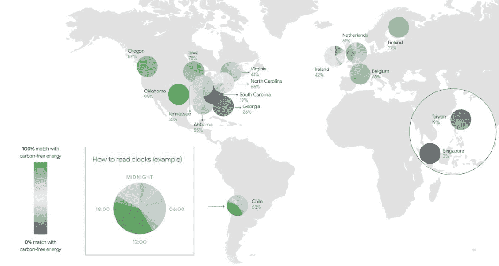

# 机器学习碳足迹估算难度

> 原文：[`www.kdnuggets.com/2022/07/difficulty-estimating-carbon-footprint-machine-learning.html`](https://www.kdnuggets.com/2022/07/difficulty-estimating-carbon-footprint-machine-learning.html)

照片由 [Dim Hou](https://unsplash.com/@dimhou?utm_source=unsplash&utm_medium=referral&utm_content=creditCopyText) 提供，来源于 [Unsplash](https://unsplash.com/s/photos/carbon-footprint?utm_source=unsplash&utm_medium=referral&utm_content=creditCopyText)

机器学习（ML）通常通过连接虚拟神经元和虚拟突触来模拟人脑的操作。深度学习（DL）是 ML 的一个子集，将虚拟大脑放大几个数量级。随着计算能力的进步，这些神经元的数量激增。大多数关于 ML 解决难题（如自动驾驶汽车或面部识别）的头条新闻使用了 DL，但这些“类固醇”也有代价。模型规模的增加带来了计算成本的增加，而计算成本与能源成本相关，从而导致更大的碳足迹。

* * *

## 我们的前三大课程推荐

 1\. [谷歌网络安全证书](https://www.kdnuggets.com/google-cybersecurity) - 快速进入网络安全职业生涯。

 2\. [谷歌数据分析专业证书](https://www.kdnuggets.com/google-data-analytics) - 提升你的数据分析技能

 3\. [谷歌 IT 支持专业证书](https://www.kdnuggets.com/google-itsupport) - 支持你所在组织的 IT 工作

* * *

全球变暖无疑是我们这一代人需要在未来几年解决的最关键问题。这是一个引发极大情感的两极化话题，这非常棒。这种情感成分是解决我们社会最具挑战性问题的前提，但不幸的是，它也是吸引点击标题和虚假信息的主要目标。

2019 年，马萨诸塞大学阿默斯特分校的学者研究了某些先进深度学习模型的能源成本和碳足迹。该[论文](https://arxiv.org/pdf/1906.02243.pdf)报告了令人眼花缭乱的温室气体排放，并恰当地提升了关于机器学习碳排放的讨论。其他科学家和科学记者也对此进行了报道，这份报告在过去三年里在数以千计的研究和新闻文章中被引用过多次。

麻省理工学院的学者在他们著名的文章《[深度学习的递减回报](https://spectrum.ieee.org/deep-learning-computational-cost)》中推演了原始论文。文章预测，要超越当前模型的准确性将基于增加模型规模，就像过去一样。作者预测，一个最先进的模型将很快需要 1000 亿美元的训练费用，并产生与纽约市一个月相同的碳排放。他们不相信这会发生，因为即使在当前的通货膨胀环境下，花费 1000 亿美元训练一个模型在 2025 年也将是荒谬的，但这并没有阻止其对读者的情感冲击。机器学习将毁灭地球！

争议促使谷歌和加州大学伯克利分校的学者与 2019 年原始论文的作者合作发起了一个[调查](https://ai.googleblog.com/2022/02/good-news-about-carbon-footprint-of.html)。该团队重新审视了原始论文中的估算，最终得出结论这些估算是不准确的。机器学习的碳足迹比我们想象的要小，而且对未来持谨慎乐观的理由也存在。

原始论文的问题在于在估算之上再进行估算。机器学习研究通常只报告收益，而对成本保持沉默。在多个不准确假设上进行外推会在最终结果中累积成指数误差，这就是发生的情况。在 2019 年论文中，作者假设了传统硬件、平均美国数据中心效率，并误解了神经架构搜索（NAS）的使用方式。2022 年的调查显示，最新的张量处理单元（TPUv2）效率更高，使用了一个高效的超大规模数据中心，并且 NAS 使用了微小模型作为代理。结合这些因素，原始论文中的错误幅度达到了 88 倍。

2022 年的论文还概述了确保我们未来不会毁灭地球的最佳实践。没有万灵药，但优化机器学习硬件、在“神经拓扑”方面创新稀疏模型，并允许客户选择最绿色的计算地理位置将是关键。他们认为，使用这些方法在 2017-2021 年间已经将训练著名的 Transformer NLP 模型的碳足迹减少了惊人的 747 倍或 99.998%。这并不意味着问题得到永远解决，因为模型还在不断增长，但它提供了一个更为平衡的展望。

根本的见解在于不估算而是测量。虽然粗略的外推可以提高意识，但解决问题需要可靠的度量标准。尽管最大的云服务提供商已经发布了揭示整体碳足迹的工具，但要准确了解机器学习操作的气候影响，还需要一个云无关的工具，比如 MLOps 平台。

2020 年 Google Cloud 各地区的碳零排放能源百分比（授权使用 [CC BY 4.0](https://creativecommons.org/licenses/by/4.0/)）

“每个人都应该关注碳足迹，但首先要确保准确测量，” Valohai 的 CEO **Eero Laaksonen** 说。Valohai 是一个与云无关的 MLOps 平台，位于云服务提供商和数据科学家之间。云计算的问题在于公司往往被锁定在单一的云服务提供商上。工程师为单一目标编写代码，“切换云”变得不可能。Valohai 抽象了云服务提供商，将计算分布到不同的目标上变成了一键操作。Laaksonen 说：“一旦你有了可靠的指标，确保你能够对其做出反应。”他补充道：“你将计算分布在多个提供商之间，根据任务选择最绿色的一个。”

虽然 ML 和 DL 模型可能持续增长，但未来比头条新闻所呈现的要光明和环保得多。硬件和数据科学的进步有望抵消成本的增加，大型云服务提供商如 Google 承诺到 2030 年实现[100% 碳零排放能源](https://sustainability.google/commitments/)。与此同时，让我们保持冷静，确保我们的指标保持敏锐。

### 更多相关话题

+   [三种难度级别解释的大型语言模型](https://www.kdnuggets.com/large-language-models-explained-in-3-levels-of-difficulty)

+   [每个机器学习工程师应该掌握的 5 种机器学习技能…](https://www.kdnuggets.com/2023/03/5-machine-learning-skills-every-machine-learning-engineer-know-2023.html)

+   [KDnuggets 新闻，12 月 14 日：3 门免费的机器学习课程…](https://www.kdnuggets.com/2022/n48.html)

+   [学习数据科学、机器学习和深度学习的坚实计划](https://www.kdnuggets.com/2023/01/mwiti-solid-plan-learning-data-science-machine-learning-deep-learning.html)

+   [人工智能、分析、机器学习、数据科学、深度学习…](https://www.kdnuggets.com/2021/12/developments-predictions-ai-machine-learning-data-science-research.html)

+   [打破数据障碍：如何通过零样本、单样本和少样本学习…](https://www.kdnuggets.com/2023/08/breaking-data-barrier-zeroshot-oneshot-fewshot-learning-transforming-machine-learning.html)
