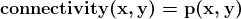
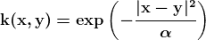

# 流形学习的扩散图，理论与实现

> 原文：[`www.kdnuggets.com/2020/03/diffusion-map-manifold-learning-theory-implementation.html`](https://www.kdnuggets.com/2020/03/diffusion-map-manifold-learning-theory-implementation.html)

comments

**由 [Rahul Raj](https://randomwalk.in)，印度理工学院坎普尔分校**

### 介绍

‘维度诅咒’是数据科学中的一个著名问题，它通常导致性能差、结果不准确以及最重要的相似性度量失效。这主要是因为高维数据集通常是稀疏的，通常会有一个低维结构或‘流形’来嵌入这些数据。因此，变量（或特征或维度）之间存在非线性关系，我们需要学习这些关系以计算更好的相似性。

* * *

## 我们的三大课程推荐

 1\. [谷歌网络安全证书](https://www.kdnuggets.com/google-cybersecurity) - 快速进入网络安全职业道路

 2\. [谷歌数据分析专业证书](https://www.kdnuggets.com/google-data-analytics) - 提升你的数据分析技能

 3\. [谷歌 IT 支持专业证书](https://www.kdnuggets.com/google-itsupport) - 支持你组织的 IT 工作

* * *

流形学习是一种非线性降维方法。流形学习算法的基础在于许多数据集的维度只是人为增加的¹。在这篇博客中，我们学习了流形学习中的一种技术，称为扩散图。其关键思想是，欧几里得距离，即最常见的相似性度量，仅在‘局部’上有意义。因此，假设数据存在一个低维结构或流形，测量这种结构上的相似性比在欧几里得空间中更为合适。

让我们从以下 2D 数据点的例子开始探索，这些数据点整齐地排列成**S**形状。

这个数据集具有明确的形状。如果我们需要测量这个集合中两个点的相似性，我们会计算欧几里得距离。如果这个距离很小，我们就说这些点相似，反之则不然。下图展示了这种情况。

然而，了解几何结构后，我们知道这种相似性度量是不准确的。由于‘x’和‘y’坐标之间存在非线性关系，因此如果我们在下面的图中所示的几何结构上测量相似性（或距离），会更为准确。

使用扩散映射，我们可以进行非线性维度减少以及学习高维数据的底层几何。让我们直接进入理论和实现，手牵手进行。

### 主要收获是什么？

本博客旨在介绍一种称为**扩散映射**²的流形学习技术。这种技术使我们能够理解高维数据集的底层几何结构，并在需要时通过准确捕捉原始维度之间的非线性关系来减少维度。

### 背后的理论（非常简要）

核心思想是一个时间相关的扩散过程，这只是数据集上的随机游走，每一步都有一个相关的概率。当扩散过程运行一段时间 t 时，我们得到不同路径的概率，以计算底层几何结构的距离。从数学上讲，我们称之为马尔科夫链的稳态概率。

两个数据点 x 和 y 之间的连通性定义为在随机游走的一步中从 x 跳到 y 的概率，为：

然而，将连通性表示为一个行归一化的似然函数 K 使用高斯核是有用的。这将被称为**扩散核**。

现在我们定义一个行归一化的扩散矩阵 P。从数学上讲，这等同于马尔科夫链中的转移矩阵。虽然 P 表示从点 x 到点 y 的单步跳跃概率（或在这种情况下的连通性），P² 表示从 x 在两步内到达 y 的概率，依此类推。随着跳跃次数或 Pᵗ 在 t 值增加的情况下增加，我们观察到扩散过程向前运行。换句话说，跟随几何结构的概率增加。

如果你想深入了解背后的理论，[论文](https://inside.mines.edu/~whereman/talks/delaPorte-Herbst-Hereman-vanderWalt-DiffusionMaps-PRASA2008.pdf) 已经解释得很清楚。对于快速概述，[这篇](https://en.wikipedia.org/wiki/Diffusion_map) 维基百科文章也很好地解释了理论。

### 实现

为了演示算法，我们从一个具有明确几何结构的数据集开始。让我们首先创建一个二维图形，如前所示。我们的主要目标是找出扩散映射是否揭示了数据的底层几何结构。

现在，让我们为这个二维数据集添加一个合成的第三维度（从均匀分布中提取的数据）。因此，我们的新三维数据集如下所示：

正如您可能已经注意到的，3D 数据集在一个角度上保留了 ‘S’ 形，这一点是正确的。现在我们的目标是将维度扁平化为 2，同时保留这种形状。希望在应用扩散映射后，我们能在 2D 中看到类似 ‘S’ 的结构。

### 输出

### 结果

从上述输出图中可以明显看出，应用扩散映射将维度从 3 降到 2 后，我们能够在一定程度上理解原始的几何结构，即 ‘S’ 形。通过调整 alpha 值，我们可以在最终结构中得到稍微不同的变体。（alpha 是上述扩散核中的参数）。

### 源代码

源代码可以在[这里](https://gist.github.com/rahulrajpl/36a5724d0c261b915292182b1d741393)找到，并且在 MIT 许可证下开源。您可以使用提供的链接在 Google Colaboratory 中尝试代码。

### 参考文献：

1.  Scikit-Learn 中的流形学习方法 (https://scikit-learn.org/stable/modules/manifold.html)

1.  Porte, Herbst, Hereman, Walt，*扩散映射简介*

**个人简介：[Rahul Raj](https://www.linkedin.com/in/rahul-r-909409184/)** (**[@rahulrajpl](https://twitter.com/rahulrajpl)**) 目前在印度理工学院坎普尔分校攻读计算机科学与工程硕士学位。他的兴趣领域包括机器学习、数据科学及其在网络安全中的应用。有关作者的更多信息请访问：**[`randomwalk.in`](https://randomwalk.in)**

[原文](https://randomwalk.in/python/ml/2020/03/14/Diffusion-Map.html)。经授权转载。

**相关：**

+   高级特征工程和预处理的 4 个技巧

+   掌握中级机器学习的 7 个步骤——2019 年版

+   什么是数据科学中的维度缩减？

### 更多相关内容

+   [生成性 AI 游乐场：文本到图像的稳定扩散…](https://www.kdnuggets.com/2024/02/intel-generative-ai-playground-text-to-image-stable-diffusion)

+   [使用 Phraser 和稳定扩散成为 AI 艺术家](https://www.kdnuggets.com/2022/09/become-ai-artist-phraser-stable-diffusion.html)

+   [扩散与去噪：解释文本到图像的生成性 AI](https://www.kdnuggets.com/diffusion-and-denoising-explaining-text-to-image-generative-ai)

+   [前 7 名基于扩散的应用及演示](https://www.kdnuggets.com/2022/10/top-7-diffusionbased-applications-demos.html)

+   [稳定扩散：生成性人工智能的基本直觉](https://www.kdnuggets.com/2023/06/stable-diffusion-basic-intuition-behind-generative-ai.html)

+   [使用稳定扩散生成超现实面孔的 3 种方法](https://www.kdnuggets.com/3-ways-to-generate-hyper-realistic-faces-using-stable-diffusion)
