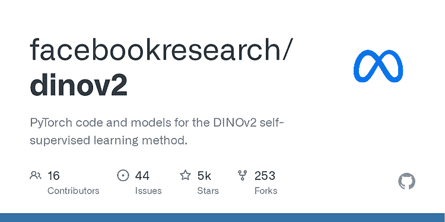
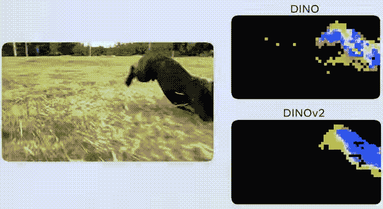

# DINOv2：Meta AI 的自监督计算机视觉模型

> 原文：[`www.kdnuggets.com/2023/05/dinov2-selfsupervised-computer-vision-models-meta-ai.html`](https://www.kdnuggets.com/2023/05/dinov2-selfsupervised-computer-vision-models-meta-ai.html)

图片来自 Bing 图片创作者

Meta AI 刚刚发布了开源的**DINOv2 模型**，这是第一个利用自监督学习来训练计算机视觉模型的方法。DINOv2 模型实现了与该领域标准方法和模型相匹配甚至更优的结果。

* * *

## 我们的三大课程推荐

 1\. [Google 网络安全证书](https://www.kdnuggets.com/google-cybersecurity) - 快速进入网络安全职业轨道。

 2\. [Google 数据分析专业证书](https://www.kdnuggets.com/google-data-analytics) - 提升你的数据分析能力

 3\. [Google IT 支持专业证书](https://www.kdnuggets.com/google-itsupport) - 支持组织的 IT 工作

* * *

这些模型在无需微调的情况下取得了强大的性能，使其成为许多不同计算机视觉任务和应用的理想选择。由于自监督训练方法，DINOv2 可以从各种图像和特征集合中学习，例如深度估计，而无需显式的训练。

图 1：DINOv2：Meta AI 的自监督计算机视觉模型

# 1\. 自监督学习的需求

## 1.1\. 无需微调

自监督学习是一种强大的方法，用于在没有大量标记数据的情况下训练机器学习模型。DINOv2 模型可以在图像语料库上进行训练，而不需要相关的元数据、特定的标签或图像标题。与几种最近的自监督学习方法不同，DinoV2 模型不需要微调，因此能够为不同的计算机视觉应用提供高性能的特征。

## 1.2\. 克服人工注释的局限性

在过去几年中，[图像-文本预训练](https://arxiv.org/pdf/2210.09263.pdf)已成为各种计算机视觉应用的主要方法。然而，由于其依赖于人工标注的标题来学习图像的语义，这种方法往往忽视了标题中未明确包含的重要信息。例如，一张黄房间里的红色桌子的图片的人类标签可能是“一个红色木桌子”。这个标签会遗漏背景、位置和桌子大小等重要信息。这会导致对局部信息的理解不足，从而在需要详细定位信息的任务中表现不佳。

此外，对人工标签和注释的需求将限制我们收集数据以训练模型的数量。这在某些应用中变得更加困难，例如，注释细胞需要一定水平的人类专业知识，而这种专业知识在所需规模上无法获得。对细胞图像使用自监督训练方法，为基础模型的进一步发展打开了途径，从而改善了[生物发现](https://arxiv.org/pdf/2209.07819.pdf)。同样，类似的高级领域，如[动物密度估计](https://l.facebook.com/l.php?u=https%3A%2F%2Fwww.sciencedirect.com%2Fscience%2Farticle%2Fabs%2Fpii%2FS1574954122001844&h=AT2tgMG2np9tKP9LiOPVXwDdkQAlcdDjdBj3xzNdDNvurZkHdzEwyCtKds5-08oeQcJISJklzVm6wKOElXMj9jnYGtK8GAmLPJtKJ4NNNF31w2aj0Nnl5hLcOrMZWWZpZyM)也适用。

从 DINO 到 DINOv2 的过渡需要克服多个挑战，如

+   创建一个大型且经过整理的训练数据集

+   改进训练算法和实现

+   设计一个有效的蒸馏流程。

# 2\. 从 DINO 到 DINOv2

图 2：DINO v1 与 v2 在分割精度上的比较

## 2.1\. 创建一个大型、整理过的、多样化的图像数据集

构建 DINOv2 的主要步骤之一是训练更大的架构和模型，以提升模型的性能。然而，更大的模型需要大量的数据集才能高效训练。由于没有满足要求的大型数据集，研究人员利用公开抓取的网络数据，建立了一个只选择有用数据的流程，如在[LASER](https://ai.facebook.com/blog/laser-multilingual-sentence-embeddings/)中所示。

然而，为了能够使用这些数据集，需要完成两个主要任务：

+   在不同概念和任务之间平衡数据

+   删除无关的图像

由于这个任务可以手动完成，他们从大约 25 个第三方数据集中整理出了一组种子图像，并通过获取与这些种子图像紧密相关的图像来扩展它。这个方法使他们能够从 12 亿张图像中生成总共 1.42 亿张相关图像的数据集。

## 2.2\. 算法和技术改进

尽管使用更大的模型和数据集会带来更好的结果，但这也带来了主要挑战。两个主要的挑战是潜在的不稳定性和在训练过程中保持可处理性。为了使训练过程更稳定，DINOv2 包含了额外的正则化方法，这些方法的灵感来源于[相似性搜索](https://l.facebook.com/l.php?u=https%3A%2F%2Farxiv.org%2Fabs%2F1806.03198&h=AT24VgJn3tbvHSzZQuScS7olEVE3k0ON36WLWv1MIwGvSVDzbGuRHljJq9PcTTD8B8E6JJ6TJcSlk7oKjUhlKM8azoaXKfbckLW-3dYD3G0nL6APxji3pnAGEO9AEF6-1eg) 和 [分类](https://l.facebook.com/l.php?u=https%3A%2F%2Farxiv.org%2Fabs%2F2204.07118&h=AT0uq-EmQFlt_8QbvXmuLC9n7uqnix4IkQwsreJ9VO7xBtPZtlH06fddPmcB4kW_8RLWfSJJXwhfJBUNgLyn_HlgctcwgUYNZyNDSAxpDaz4ZQ1NJihZdK7v_-_o9D3q_1U) 文献。

DINOv2 的训练过程整合了最新的混合精度和分布式训练实现，这些实现由前沿的[PyTorch 2](https://l.facebook.com/l.php?u=https%3A%2F%2Fpytorch.org%2F&h=AT2AFAD7WXt6mwgAVGfHVYaqGLTztSUIiS8u9jHa6TcCViFrqmD0_RBFUkSTCKnRMBwqV3wn9nifClNi5aajRuwy6BHIADrrN5ecjMhzyZ9PFcYF2b_5IkDmi1hPLAYyb6o) 提供。这使得代码的实现速度更快，并且使用相同的硬件进行 DINO 模型的训练使速度提高了一倍，内存使用减少到三分之一，从而实现了数据和模型规模的扩展。

## 2.3\. 通过模型蒸馏减少推理时间

运行大型模型进行推理需要强大的硬件，这将限制这些方法在不同用例中的实际应用。为了解决这个问题，研究人员使用了模型蒸馏技术，将大型模型的知识压缩到较小的模型中。通过这种方法，研究人员能够将高性能的架构浓缩成更小的模型，性能损失几乎可以忽略。这产生了强大的 ViT-Small、ViT-Base 和 ViT-Large 模型。

# 3\. 开始使用 DINOv2

训练和评估代码需要 PyTorch 2.0 和 [xFormers](https://github.com/facebookresearch/xformers) 0.0.18 以及许多其他第三方包，并且代码需要在 Linux 环境下运行。以下指令概述了如何配置所有必要的依赖项以进行训练和评估：

+   使用以下指令安装 PyTorch [here](https://pytorch.org/get-started/locally/)。建议安装支持 CUDA 的 PyTorch。

+   下载 [conda](https://docs.conda.io/projects/conda/en/latest/user-guide/getting-started.html)

+   使用以下命令克隆 DINOv2 仓库：

代码由作者提供

+   继续创建并激活名为 "dinov2" 的 Conda 环境，使用提供的环境定义：

代码由作者提供

+   要安装本项目所需的依赖项，请使用提供的 requirements.txt 文件。

代码由作者提供

+   最后，你可以使用以下代码加载模型：

代码由作者提供

总结来说，Meta AI 发布的 DINOv2 模型标志着一个重要的里程碑。DINOv2 模型采用的自监督学习方法提供了一种强大的方式来训练机器学习模型，无需大量标记数据。通过在不需要精调的情况下实现高准确率，这些模型适用于各种计算机视觉任务和应用。此外，DINOv2 可以从不同的图像集合中学习，并且可以从诸如深度估计等特征中学习，而无需明确的训练。DINOv2 作为开源模型的可用性为研究人员和开发者探索计算机视觉任务和应用的新可能性打开了大门。

## 参考资料

+   [DINOv2：具有自监督学习的最先进计算机视觉模型](https://ai.facebook.com/blog/dino-v2-computer-vision-self-supervised-learning/)

+   [DINOv2：无监督学习鲁棒视觉特征](https://arxiv.org/abs/2304.07193)

**[Youssef Rafaat](https://www.linkedin.com/in/youssef-hosni-b2960b135)** 是一位计算机视觉研究员和数据科学家。他的研究重点是为医疗保健应用开发实时计算机视觉算法。他还在市场营销、金融和医疗保健领域担任数据科学家超过 3 年。

### 更多相关话题

+   [TensorFlow 在计算机视觉中的应用 - 转移学习简化](https://www.kdnuggets.com/2022/01/tensorflow-computer-vision-transfer-learning-made-easy.html)

+   [探索计算机视觉的世界：介绍 MLM 最新的…](https://www.kdnuggets.com/2024/01/mlm-discover-the-world-of-computer-vision-ebook)

+   [计算机视觉的 5 个应用](https://www.kdnuggets.com/2022/03/5-applications-computer-vision.html)

+   [关于数据管理的 6 件事及其重要性…](https://www.kdnuggets.com/2022/05/6-things-need-know-data-management-matters-computer-vision.html)

+   [KDnuggets 新闻 2022 年 3 月 9 日：5 分钟内构建机器学习网络应用…](https://www.kdnuggets.com/2022/n10.html)

+   [Meta 新的数据分析师专业认证已推出！](https://www.kdnuggets.com/metas-new-data-analyst-professional-certification-has-dropped)
