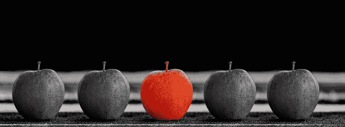
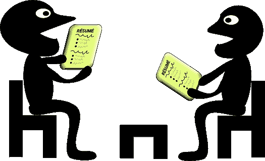
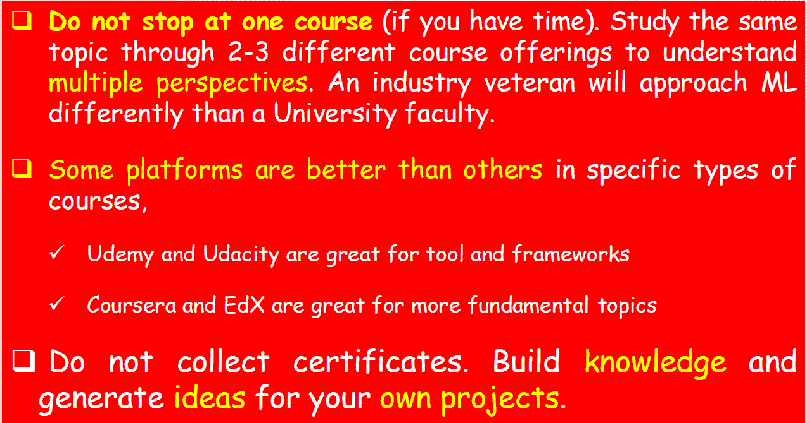
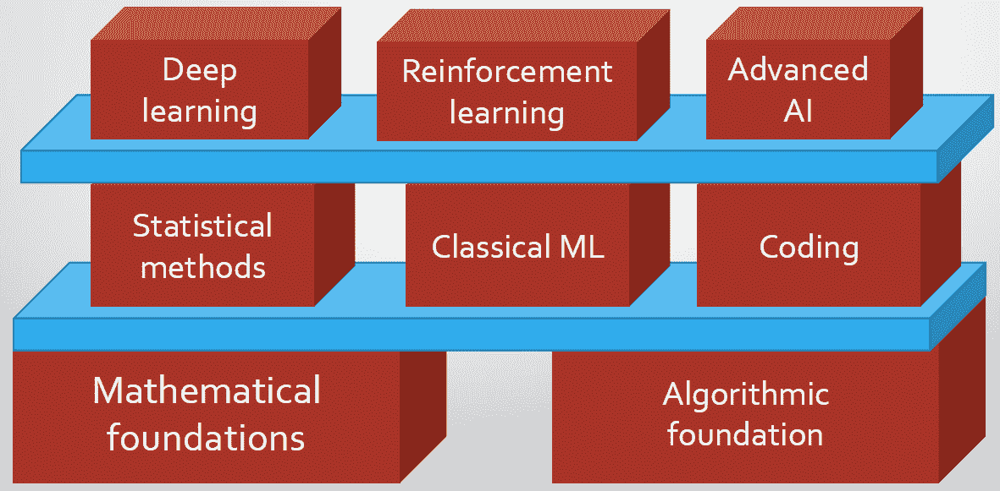
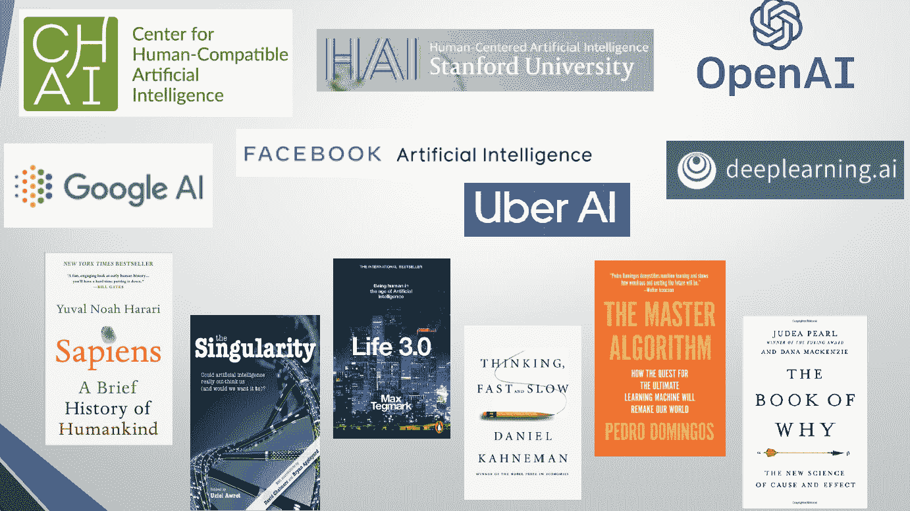

# 你如何在数百名其他数据科学候选人中脱颖而出？

> 原文：[`www.kdnuggets.com/2021/07/distinguish-yourself-hundreds-other-data-science-candidates.html`](https://www.kdnuggets.com/2021/07/distinguish-yourself-hundreds-other-data-science-candidates.html)

评论

图片来源： [Pixabay](https://pixabay.com/photos/apple-fruit-selection-especially-1594742/) （免费使用）

### 为什么要费心区分自己？

* * *

## 我们的三大课程推荐

 1. [谷歌网络安全证书](https://www.kdnuggets.com/google-cybersecurity) - 快速进入网络安全职业的快车道。

 2. [谷歌数据分析专业证书](https://www.kdnuggets.com/google-data-analytics) - 提升你的数据分析水平

 3. [谷歌 IT 支持专业证书](https://www.kdnuggets.com/google-itsupport) - 支持你的组织进行 IT 工作

* * *

因为成为数据科学家的**竞争**极其激烈。

[**获得数据科学工作比以往更难 - 如何将这一点转化为你的优势 - KDnuggets**](https://www.kdnuggets.com/2020/10/getting-data-science-job-harder.html)

尽管许多有志的数据科学家发现，找到工作的难度比以前更大……

因为有一股**疯狂的冲劲**。各种工程师、科学家和职场专业人士都自称为数据科学家。

**为什么有这么多“假”数据科学家？**

你有没有注意到有多少人突然自称为数据科学家？你的邻居、你在某个……

因为你不确定自己是否能胜任这份工作。记住，**冒名顶替综合症**在数据科学领域依然存在。

[**如何管理数据科学中的冒名顶替综合症**](https://towardsdatascience.com/how-to-manage-impostor-syndrome-in-data-science-ad814809f068)

如果他们发现你毫无头绪怎么办？

我可以继续，但你明白了……

那么，你如何与大众区分开来呢？我不确定你是否能做到，但我可以告诉你一些自我测试的指针。这就是这篇文章的内容。

### 问问自己几个简单的问题

图片来源： [Pixabay](https://pixabay.com/vectors/classroom-cooperative-learning-1297779/) （免费使用）

问问自己几个问题，并计算“是”的回答数量。你完成的越多，就越能与大众区分开来。

### 如果你是初学者

+   你是否**发布**了自己的 Python/R（无论你用什么编程语言）**包**？

+   如果有，你是否为它编写了详细的**文档**，以便其他人也能轻松使用？

+   你是否将你的分析从 Jupyter notebook 转移到一个完全发布的**Web 应用程序**？或者你是否研究了帮助你轻松实现这一点的工具？

+   你是否写过至少几篇**高质量、详细的文章**来描述你的爱好项目？

+   你是否尝试实践 [**费曼学习法**](https://fs.blog/2021/02/feynman-learning-technique/) 即“*向一个六年级的学生教授你想要学习的概念*”？

### 在稍微高级一点的阶段

如果你不是初学者，而是觉得自己作为数据科学家已经达到一个较成熟的阶段，你是否会做这些？

+   你是否有意识地在每次机会中将良好的**软件工程实践**（例如面向对象编程、模块化、单元测试）融入到你的数据科学代码中？

+   你是否特别注意不止步于你必须做的即时数据分析范围，而是考虑一下在 100 倍数据量或 10 倍错误预测成本的情况下会发生什么？换句话说，你是否会有意识地思考**数据或问题扩展及其影响**？

+   你是否特别注意不止步于传统的机器学习指标，而是还考虑**数据获取成本**和**机器学习业务价值**？

### 构建工具和创建文档：这两项技能都很重要

图片来源： [Pixabay](https://pixabay.com/illustrations/carpenter-hummer-wood-construction-1453880/)（左）和 [Pixabay](https://pixabay.com/illustrations/chinese-asian-girl-little-writing-1891496/)（右）

不要将所有时间和精力都花在分析更大的数据集或实验最新的深度学习模型上。

将至少 25%的时间用于学习**一些在所有组织和所有情况下都被重视的事情**，

+   构建小而集中的**日常数据分析工具**。在这个过程中，你的创意将会自由流动。你正在创造一些可能没有数千个立即用户的东西，但它将是新颖的，而且将是你自己的创作。

+   阅读和**创建高质量文档**，与新工具、框架或你刚刚构建的实用工具相关（见上文）。这将迫使你学会如何以易于广泛受众理解的方式传达你的创作的实用性和机制。

如你所见，这些习惯相当容易培养和实践，即它们不需要艰苦的工作、数年的统计学背景或深度机器学习的高级专长。

但令人惊讶的是，并不是每个人都接受它们。这是你与众不同的机会。

### 如何在工作面试中利用这些习惯？

图片来源：[Pixabay](https://pixabay.com/vectors/job-interview-career-conference-156130/)（免费使用）

想象一下你自己在工作面试中。如果你对上述问题有许多“是”的回答，你可以告诉面试官，

+   “*嘿，看看我为生成合成时间序列数据而构建的酷 Python 包*”。

+   “*我还编写了详细的文档，托管在 MyApp.readthedocs.io 网站上。它是用 Sphinx 和 Jekyll 构建的*”。

+   “*我定期为最大的在线平台 Towards Data Science 撰写数据科学文章。基于这些文章，我甚至收到了 Packt 或 Springer 等知名出版商的书籍出版邀请*”。

+   “*每个人都可以在 Jupyter Notebook 中拟合机器学习模型。但，我可以快速制作一个基本的 Web 应用程序演示，展示你可以通过 REST API 发送数据并获取预测的 Scikit-learn 函数*”。

+   “*我可以帮助进行新机器学习程序的成本效益分析，并告诉你收益是否超过数据收集的努力，以及如何做到最优*”。

想象一下你在面试委员会面前的表现将如何与那些在统计学和梯度下降常规问题上表现良好，但没有提供全面能力证明的其他候选人不同。

他们表明你对数据科学问题**充满好奇**。

他们表明**你阅读、分析和沟通**。你**创建**并**记录**以便其他人创建。

他们表明你的思维超越了笔记本和分类准确性，进入了**商业价值增值和客户同理心**的领域。哪个公司不喜欢这种候选人呢？

> …这些习惯相对容易培养和实践，即它们不需要艰苦的工作、长期的统计学背景或深度机器学习知识的高级专业技能。但，令人惊讶的是，并不是每个人都接受它们。这就是你与众不同的机会。

### 我在哪里可以获得帮助？

有这么多出色的工具和资源来帮助你练习。在一篇小文章的篇幅内，甚至不可能列出其中的一部分。我只是展示了一些代表性的例子。关键是沿着这些方向探索，并为自己发现有用的工具。

**仅使用 Jupyter Notebooks 构建可安装的软件包**

[**nbdev：用 Jupyter Notebooks 做所有事情**](https://www.fast.ai/2019/12/02/nbdev/)

**如何逐步制作一个了不起的 Python 包**

[**如何在 2021 年制作一个了不起的 Python 包**](https://antonz.org/python-packaging/)

**学习如何将单元测试原则集成到自己的机器学习模型和模块开发中**

[**机器学习中的 PyTest——一个基于示例的简单教程**](https://towardsdatascience.com/pytest-for-machine-learning-a-simple-example-based-tutorial-a3df3c58cf8)

**学习如何在数据科学任务中整合面向对象编程原则**

[**面向数据科学家的面向对象编程：构建你的机器学习估算器**](https://towardsdatascience.com/object-oriented-programming-for-data-scientists-build-your-ml-estimator-7da416751f64)

**使用简单的 Python 脚本构建交互式 Web 应用程序——无需 HTML/CSS 知识**

[**PyWebIO：使用 Python 以脚本方式编写交互式 Web 应用**](https://towardsdatascience.com/pywebio-write-interactive-web-app-in-script-way-using-python-14f50155af4e)

**从你的 Jupyter notebook 中编写完整的编程和技术书籍。也可以用来构建文档。**

[**Jupyter 中的书籍**](https://jupyterbook.org/intro.html)

**理解现实生活中的分析问题的多方面复杂性，它远不仅仅是建模和预测**

[**为什么商业分析问题需要你所有的数据科学技能**](https://medium.com/analytics-vidhya/why-a-business-analytics-problem-demands-all-of-your-expertise-at-once-1290170808c4)

> 想象一下你将如何与面试委员会的其他候选人不同，他们可能在统计和梯度下降的常规问题上表现出色，但没有提供全面能力的可证明证据。

### 关于 MOOCs/在线课程的几点说明

图片来源：作者自创

学习时不要跳过步骤。按照步骤进行。

图片来源：作者自创

### 在每个机会中阅读核心话题和书籍

不要仅仅关注最新的深度学习技巧或关于最新 Python 库的博客文章。在每一个机会中，都要阅读行业顶级论坛和好书上的核心话题。我喜欢的一些书籍和论坛如下，

图片来源：作者自创

### 总结

数据科学及其相关的机器学习和人工智能技能在目前的就业市场上需求极高，越来越多的企业采用并拥抱这些变革性技术。竞争激烈，并且人才需求与供应之间存在大量的沟通不畅。

一个燃眉之急的问题是：*如何在一百名申请者中脱颖而出？*

我们列出了一些关键问题，你可以自问这些问题来评估自己在一些使你与众不同的技能和习惯上的独特性。我们展示了一些虚拟对话片段，你可以用来在面试中展示这些技能和习惯。我们还提供了一份资源的短名单，帮助你开始这些。

我们列出了一些参加 MOOCs 的方法，并建议了阅读资源。

祝你在数据科学的旅程中一切顺利……

你可以查看作者的 [**GitHub**](https://github.com/tirthajyoti?tab=repositories)** 仓库**，获取机器学习和数据科学中的代码、创意和资源。如果你像我一样，对 AI/机器学习/数据科学充满热情，请随时 [在 LinkedIn 上添加我](https://www.linkedin.com/in/tirthajyoti-sarkar-2127aa7/) 或 [在 Twitter 上关注我](https://twitter.com/tirthajyotiS)。

[原文](https://towardsdatascience.com/how-to-distinguish-yourself-from-hundreds-of-data-science-candidates-62457dd8f385)。经许可转载。

**相关：**

+   作为数据科学初学者，你应该避免的 10 个错误

+   如何获得实际的数据科学经验，以便为职业做好准备

+   麦肯锡教给我的 5 个课程，让你成为更优秀的数据科学家

### 更多相关话题

+   [每个数据科学家都应该了解的三个 R 库（即使你使用 Python）](https://www.kdnuggets.com/2021/12/three-r-libraries-every-data-scientist-know-even-python.html)

+   [停止学习数据科学来寻找目标，并通过寻找目标来…](https://www.kdnuggets.com/2021/12/stop-learning-data-science-find-purpose.html)

+   [学习数据科学统计的最佳资源](https://www.kdnuggets.com/2021/12/springboard-top-resources-learn-data-science-statistics.html)

+   [如何通过数据驱动的人工智能让自己从其他申请者中脱颖而出](https://www.kdnuggets.com/2022/12/set-apart-applicants-datacentric-ai.html)

+   [成功数据科学家的 5 个特征](https://www.kdnuggets.com/2021/12/5-characteristics-successful-data-scientist.html)

+   [一个 90 亿美元的人工智能失败，详细解析](https://www.kdnuggets.com/2021/12/9b-ai-failure-examined.html)
