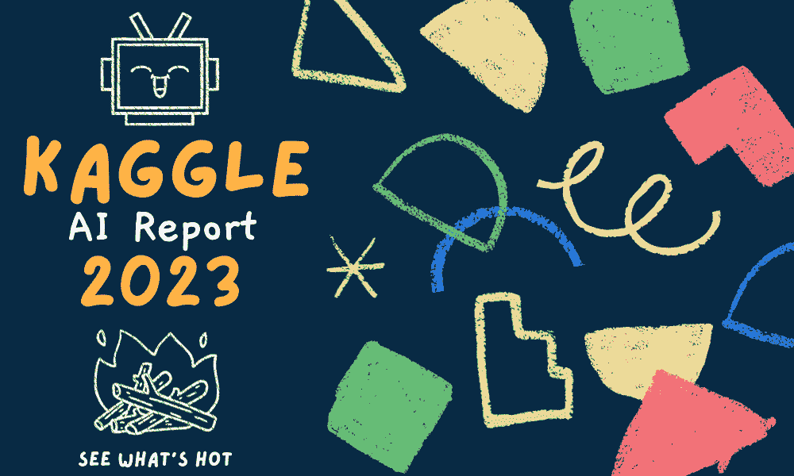

# 与 Kaggle 的 AI 报告 2023 一起深入未来 – 了解最新热点

> 原文：[`www.kdnuggets.com/dive-into-the-future-with-kaggle-ai-report-2023-see-what-hot`](https://www.kdnuggets.com/dive-into-the-future-with-kaggle-ai-report-2023-see-what-hot)

编辑提供的图片

2023 年 5 月 12 日，Kaggle 开启了一个[竞赛](https://www.kaggle.com/competitions/2023-kaggle-ai-report/overview/timeline)，Kaggle 社区可以参与编写一份总结过去两年 AI 迅猛发展的报告。Kaggle 社区是一个多元化的群体，拥有在 AI 领域深度的各种经验。

参与者被要求根据过去两年的变化和发展写一篇关于特定主题的文章，例如生成式 AI、AI 伦理等。

[报告在这里](https://www.kaggle.com/AI-Report-2023)，包括以下几个部分：

+   生成式 AI

+   文本数据

+   图像与视频数据

+   表格与时间序列数据

+   Kaggle 竞赛

+   AI 伦理

那么，让我们深入了解我们学到了什么……

# 生成式 AI

生成式 AI 最近成为热门话题。本部分深入探讨了过去两年生成式 AI 的快速进展和应用。我们见证了文本生成、图像创建和音乐开发等进展，使用了如 GANs 和 LLMs 等工具和技术。

这仅仅依靠了更大数据集和改进的硬件来增强算法在训练阶段的效果。尽管生成式 AI 仍处于初期阶段，但在过去的一年里，它已经展示了如何彻底改变不同的行业。仍需考虑伦理问题，例如隐私问题、虚假信息以及这些 AI 系统的使用。

继续阅读不同的文章：

1.  [生成式 AI](https://www.kaggle.com/code/trushk/2023-kaggle-ai-report-generative-ai)

1.  [理解、生成与改变世界](https://www.kaggle.com/code/jay2333/understand-generate-and-transform-the-world)

1.  [窥探生成式 AI 的领域](https://www.kaggle.com/code/pranavbelhekar/a-glimpse-into-the-realm-of-generative-ai)

# 文本数据

随着生成式 AI 的热潮，自然语言处理（NLP）也因大型语言模型（LLMs）的兴起而引起了极大的兴趣。Kaggle AI 报告的下一部分聚焦于 NLP 技术及其在各种任务中的应用，如总结和翻译。

如果回顾早期的方法，文本任务的早期方法包括基于术语频率的特征工程与非神经网络的机器学习方法相结合。现在我们处理的是更大的数据集，这些数据集经过学习词表示以进行模型解释。

互联网数据作为训练语料库的使用，使这些模型能够更好地学习，并在迁移学习等领域取得更好的性能。在 Kaggle 竞赛中，微调公开可用的模型已经显示出超越人类水平的表现。

以下顶级论文关注于 LLMs 的出现和最新技术：

1.  [当代大型语言模型 LLMs](https://www.kaggle.com/code/abireltaief/contemporary-large-language-models-llms)

1.  [大型语言模型：推理能力](https://www.kaggle.com/code/flaussy/large-language-models-reasoning-ability)

1.  [迷你巨人：“小型”语言模型](https://www.kaggle.com/code/mistylight/mini-giants-small-language-models)

# 图像与视频数据

就像文本数据被用于内容生成任务一样，图像和视频生成也非常流行。计算机视觉已存在很长时间，但近年来其发展迅速。我们现在能够处理如物体检测等任务。

本部分探讨了模型架构以及计算机视觉中的常见实践，如数据增强。计算机视觉在医疗成像等多个行业中得到了应用，但在深度伪造、伦理和哲学考量、多模态模型的局限性等领域仍面临挑战。

我们有如 Segment Anything Model (SAM)和 YOLO（You Only Look Once）等模型，这些模型展示了如何将通用的开源模型适应于不同且独特的任务。

通过以下论文深入了解图像和视频数据的进展：

1.  [过去两年 AI 视觉模型的进展](https://www.kaggle.com/code/radbear/advances-in-ai-vision-models-in-the-last-two-years)

1.  [图像与视频数据](https://www.kaggle.com/code/dokster/image-and-video-data-kaggle-ai-report)

# 表格与时间序列数据

下一部分将深入探讨表格数据和时间序列数据的历史意义。这些数据在过去几年并未广泛流行，因为它们未能像深度学习革命那样产生同样的影响。然而，它们仍然被广泛使用且非常有效，在以下领域中尤为流行：

+   针对特定数据集/问题的独特方法

+   数据预处理和特征工程的重要性

+   梯度提升树的主导地位

在 Kaggle 社区，这些趋势得到了高度认可，以下论文将深入探讨这些趋势以及表格和时间序列数据所面临的独特挑战。

1.  [典型表格管道的学习](https://www.kaggle.com/code/rhysie/learnings-from-the-typical-tabular-pipeline)

1.  [时间序列与表格数据](https://www.kaggle.com/code/kensverse/ai-report)

1.  [AI 时代的表格数据](https://www.kaggle.com/code/kobbiemanrique/tabular-data-in-the-age-of-ai?scriptVersionId=141645554)

# Kaggle 竞赛

这份来自 Kaggle 社区的报告还分析了 Kaggle 竞赛，考察了过去两年中的发展及社区对这些变化的观察。多年来，Kaggle 竞赛广受欢迎，社区成员利用这一平台测试技能，建立作品集，为现实世界做好准备。

对 Kaggle 竞赛变化的观察包括诸如伪标签、种子平均和爬山算法等技术，这些曾经被视为“技巧”的方法现在已经成为常见做法。过去两年，Kaggle 竞赛变得更加激烈，RSNA、学习机构等竞赛非常受欢迎。

探索 Kaggle 竞赛的获胜技巧：

1.  [迈向绿色人工智能](https://www.kaggle.com/code/iamleonie/towards-green-ai/notebook)

1.  [如何赢得 Kaggle 竞赛](https://www.kaggle.com/code/thedrcat/how-to-win-a-kaggle-competition)

1.  [医学影像竞赛](https://www.kaggle.com/code/nghihuynh/kaggle-ai-report-medical-imaging-competitions)

# 人工智能伦理

关于人工智能的伦理也是一个关注点，社会上许多人对人工智能系统的使用和实施有着复杂的情感。组织正在研究人工智能的伦理原则，并制定新策略，以确保他们不仅能够理解人工智能系统，还能够监控和缓解风险。

这不是一项学术研究，而是一项社会研究，其中包含许多重要的观点，帮助我们理解人工智能的世界以及如何在保护社会价值观的同时继续使用人工智能。我们看到组织在采用伦理设计的过程中对其人工智能系统进行了持续审计。

了解更多关于人工智能的挑战及其对社会的影响：

1.  [探索人工智能伦理的全景](https://www.kaggle.com/code/patrikkenfack/exploring-the-landscape-of-ai-ethics/notebook)

1.  [过去两年人工智能和伦理的发展](https://www.kaggle.com/code/antongc/developments-in-ai-and-ethics-in-the-past-2-years)

1.  [伦理人工智能就是我们所需的一切！！](https://www.kaggle.com/code/shreyamishra610/ethical-ai-is-all-we-need#contextual)

# 总结

Kaggle 团队创建了一份独特的报告，让社区成员表达他们对人工智能及其在过去两年变化的看法和经验。如果你发现某个特定部分或文章特别有趣，请告诉我们！

****[Nisha Arya](https://www.linkedin.com/in/nisha-arya-ahmed/)**** 是一名数据科学家，自由撰稿人，以及 KDnuggets 的编辑和社区经理。她特别感兴趣于提供数据科学职业建议或教程，以及围绕数据科学的理论知识。Nisha 涵盖了广泛的话题，并希望探索人工智能如何促进人类寿命的不同方式。作为一个热衷学习者，Nisha 致力于拓展她的技术知识和写作技能，同时帮助指导他人。

### 更多相关话题

+   [2023 AI 指数报告：未来我们可以期待的 AI 趋势](https://www.kdnuggets.com/2023/06/2023-ai-index-report-ai-trends-expect-future.html)

+   [2023 年上半年分析与数据科学支出及趋势报告](https://www.kdnuggets.com/2023/07/h1-2023-analytics-data-science-spend-trends-report.html)

+   [Burtch Works 2023 数据科学与 AI 专业人员薪资报告…](https://www.kdnuggets.com/2023/08/burtch-works-2023-data-science-ai-professionals-salary-report.html)

+   [优化 Python 代码性能：深入探讨 Python 分析器](https://www.kdnuggets.com/2023/02/optimizing-python-code-performance-deep-dive-python-profilers.html)

+   [深入探讨 GPT 模型：演变与性能比较](https://www.kdnuggets.com/2023/05/deep-dive-gpt-models.html)

+   [揭示神经魔法：深入了解激活函数](https://www.kdnuggets.com/unveiling-neural-magic-a-dive-into-activation-functions)
