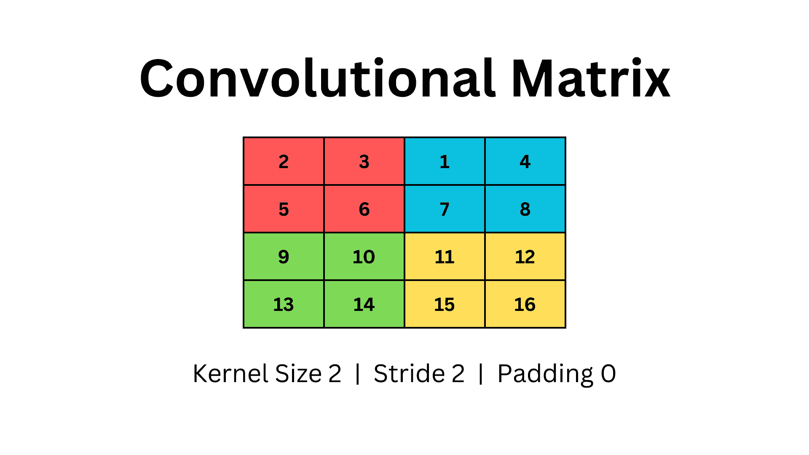
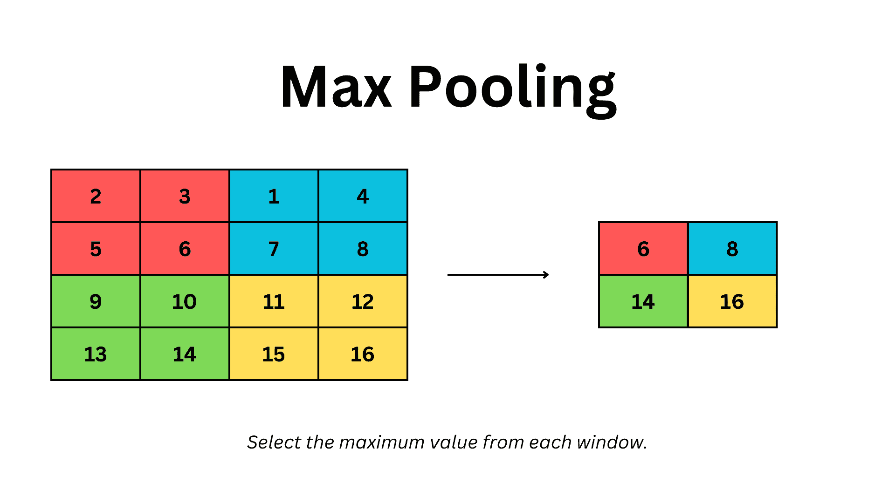
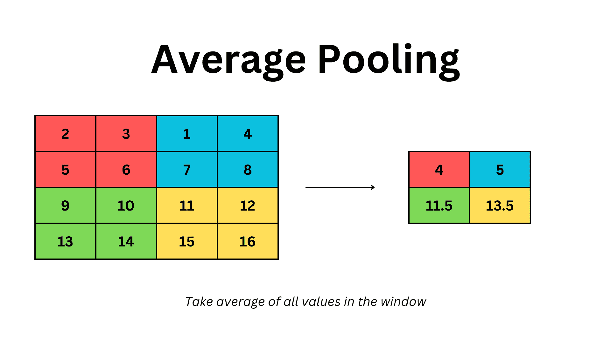
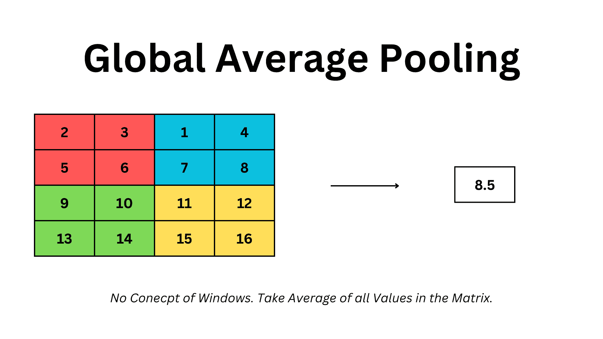

# 深入池化：揭示 CNN 池化层的魔力

> 原文：[`www.kdnuggets.com/diving-into-the-pool-unraveling-the-magic-of-cnn-pooling-layers`](https://www.kdnuggets.com/diving-into-the-pool-unraveling-the-magic-of-cnn-pooling-layers)

# 动机

* * *

## 我们的前三个课程推荐

 1\. [谷歌网络安全证书](https://www.kdnuggets.com/google-cybersecurity) - 快速进入网络安全职业生涯。

 2\. [谷歌数据分析专业证书](https://www.kdnuggets.com/google-data-analytics) - 提升您的数据分析技能

 3\. [谷歌 IT 支持专业证书](https://www.kdnuggets.com/google-itsupport) - 支持您的组织的 IT 需求

* * *

池化层在所有最先进的深度学习模型中使用的 CNN 架构中非常常见。它们在计算机视觉任务中广泛存在，包括分类、分割、目标检测、自编码器等；只要有卷积层的地方就会用到它们。

在这篇文章中，我们将深入探讨使池化层有效的数学原理，并学习何时使用不同类型的池化层。我们还将弄清楚每种类型的特点以及它们之间的不同之处。

# 为什么使用池化层

池化层提供了各种好处，使其成为 CNN 架构的常见选择。它们在管理空间维度方面发挥了关键作用，并使模型能够从数据集中学习不同的特征。

这里是使用池化层在模型中的一些好处：

+   **维度减少**

所有池化操作从完整的卷积输出网格中选择一个子样本。这会减少输出，从而减少随后的层的参数和计算，这是卷积架构相对于全连接模型的一个重要好处。

+   **平移不变性**

池化层使机器学习模型对输入中的小变化（如旋转、平移或增强）具有不变性。这使得模型适用于基本的计算机视觉任务，使其能够识别类似的图像模式。

现在，让我们看看在实践中常用的各种池化方法。

# 常见示例

为了方便比较，我们使用一个简单的二维矩阵，并应用相同参数的不同技术。

池化层继承了与卷积层相同的术语，内核大小、步幅和填充的概念得到保留。

所以，我们在这里定义一个四行四列的二维矩阵。为了使用池化，我们将使用大小为二的内核和步幅为二的设置，没有填充。我们的矩阵如下所示。

作者图片

**需要注意的是，池化是按通道进行的。** 因此，在特征图的每个通道上重复相同的池化操作。即使输入特征图被降采样，通道数量也保持不变。

# 最大池化

我们在矩阵上遍历内核，并从每个窗口中选择最大值。在上述示例中，我们使用一个 2x2 的内核，步长为二，并在矩阵上遍历，形成四个不同的窗口，由不同颜色表示。

**在最大池化中，我们只保留每个窗口中的最大值。** 这会对矩阵进行降采样，我们得到一个较小的 2x2 网格作为最大池化输出。

作者提供的图片

## 最大池化的好处

+   **保留高激活值**

当应用于卷积层的激活输出时，我们实际上只捕捉了较高的激活值。这在高激活值至关重要的任务中很有用，例如目标检测。实际上，我们在降采样矩阵，但仍然可以保留数据中的关键信息。

+   **保留主要特征**

最大值通常表示我们数据中的重要特征。当我们保留这些值时，我们保存了模型认为重要的信息。

+   **抗噪声**

由于我们基于窗口中的单个值做决策，其他值的小变化可以被忽略，使其对噪声更具鲁棒性。

## 缺点

+   **可能的信息丢失**

基于最大值的决策忽略了窗口中的其他激活值。丢弃这些信息可能导致有价值的信息丧失，在后续层中无法恢复。

+   **对小的位移不敏感**

在最大池化中，非最大值的小变化将被忽略。这种对小变化的不敏感可能是一个问题，并可能偏倚结果。

+   **对高噪声敏感**

尽管会忽略值的小变化，但单个激活值的高噪声或错误可能导致选择一个异常值。这可能会显著改变最大池化的结果，导致结果退化。

# 平均池化

在平均池化中，我们以类似的方式遍历窗口。然而，**我们考虑窗口中的所有值，取平均值，然后将其作为结果输出。**

作者提供的图片

## 平均池化的好处

+   **保留空间信息**

从理论上讲，我们保留了窗口中所有值的一些信息，以捕捉激活值的集中趋势。实际上，我们丢失的信息更少，可以保留更多的卷积激活值的空间信息。

+   **对异常值的鲁棒性**

对所有值进行平均使这种方法相对于最大池化更能抵抗异常值，因为单个极端值不会显著改变池化层的结果。

+   **更平滑的过渡**

当取平均值时，我们获得的输出之间的过渡更为平滑。这提供了数据的通用表示，减少了后续层之间的对比度。

## 缺点

+   **无法捕捉显著特征**

应用平均池化层时，窗口中的所有值被平等对待。这无法捕捉卷积层的主要特征，这在某些问题领域可能是个问题。

+   **特征图之间的区分度降低**

当所有值被平均时，我们只能捕捉区域之间的共同特征。因此，我们可能会丧失图像中某些特征和模式之间的区别，这对于目标检测等任务确实是一个问题。

# 全局平均池化

**全局池化不同于普通池化层。它没有窗口、卷积核大小或步幅的概念。** 我们将整个矩阵视为一个整体，并考虑网格中的所有值。在上述示例中，我们对 4x4 矩阵中的所有值取平均，得到一个单一的值作为结果。

作者提供的图像

## 使用时机

全局平均池化允许构建简单而稳健的 CNN 架构。**通过使用全局池化，我们可以实现通用模型，适用于任何大小的输入图像。** 全局池化层直接在密集层之前使用。

卷积层对每张图像进行降采样，具体取决于卷积核迭代次数和步幅。然而，对不同大小的图像应用相同的卷积会导致不同形状的输出。所有图像都按相同的比例降采样，因此较大的图像会有较大的输出形状。当将其传递给密集层进行分类时，尺寸不匹配可能会导致运行时异常。

在没有修改超参数或模型架构的情况下，实现适用于所有图像形状的模型可能会很困难。这个问题通过使用全局平均池化得以缓解。

当全局池化应用在密集层之前时，所有输入大小都会被缩减到 1x1 的大小。因此，(5,5)或(50,50)的输入都会被降采样到 1x1 的大小。它们可以被展平并发送到密集层，而无需担心大小不匹配。

# 关键要点

我们讨论了一些基本的池化方法及其适用场景。选择适合我们特定任务的方法至关重要。

**澄清一点，池化层中没有可学习的参数**。它们只是执行基本数学操作的滑动窗口。池化层不可训练，但它们能够加速 CNN 架构的计算，并在学习输入特征时增强鲁棒性。

**[穆罕默德·阿赫曼](https://www.linkedin.com/in/muhammad-arham-a5b1b1237/)** 是一位从事计算机视觉和自然语言处理的深度学习工程师。他曾参与多个生成式 AI 应用的部署和优化，这些应用在 Vyro.AI 上进入了全球排行榜。他对构建和优化智能系统的机器学习模型感兴趣，并相信持续改进。

### 更多相关主题

+   [揭示大型语言模型中的链式思维提示的力量](https://www.kdnuggets.com/2023/07/power-chain-thought-prompting-large-language-models.html)

+   [语义层是 AI 驱动分析的缺失环节](https://www.kdnuggets.com/2024/02/cube-semantic-layers-missing-piece-ai-enabled-analytics)

+   [揭示神经魔法：深入探讨激活函数](https://www.kdnuggets.com/unveiling-neural-magic-a-dive-into-activation-functions)

+   [理解 Python 的迭代和成员关系：__contains__ 和 __iter__ 魔法方法指南](https://www.kdnuggets.com/understanding-pythons-iteration-and-membership-a-guide-to-__contains__-and-__iter__-magic-methods)

+   [__getitem__ 介绍：Python 中的魔法方法](https://www.kdnuggets.com/2023/03/introduction-getitem-magic-method-python.html)

+   [Python f-Strings 魔法：每个编码者都需要知道的 5 个颠覆性技巧](https://www.kdnuggets.com/python-fstrings-magic-5-gamechanging-tricks-every-coder-needs-to-know)
