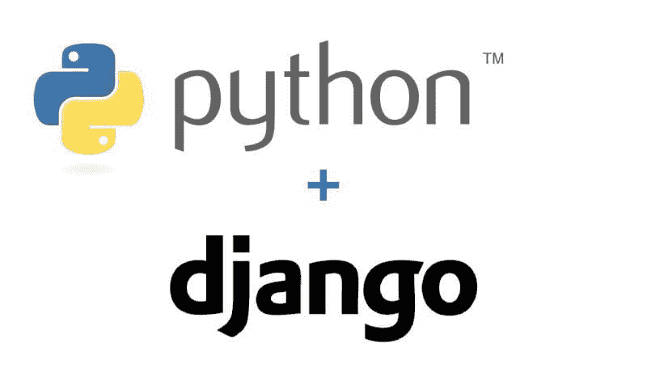

# Django 的 9 种最常见的应用

> 原文：[`www.kdnuggets.com/2021/08/django-9-common-applications.html`](https://www.kdnuggets.com/2021/08/django-9-common-applications.html)

评论

**由 [Aakash Bijwe](https://www.linkedin.com/in/akash-bijwe-79ba89195/?originalSubdomain=in)，Scalex 技术解决方案的 AVP, IT 解决方案提供**

在为项目选择新语言或框架时，大多数开发者关注的是安全性、快速开发、可扩展性、多功能性和支持。对于许多公司和独立开发者来说，Django 框架是一个简单的选择，因为它是市场上最受欢迎的 web 开发框架之一。鉴于 Django 框架提供的功能，许多开发者已开始选择 Django 作为他们所有开发任务的首选框架。

## **关于 Django 框架**

Django 是一个免费的、开源的、高级 Python web 框架，促进了快速开发和务实且简洁的代码。它旨在支持 [web 应用开发](https://scalexcloud.com/digital-applications/web-app-development/)、web API 和 web 服务。它采用了 MVC（模型-视图-控制器）架构的原则，其主要目标是简化复杂且数据库驱动的网站的开发。通过 Django 框架，web 开发者可以专注于创建功能丰富、快速、安全和可扩展的独特应用，并且比使用其他 web 开发工具具有更大的灵活性。Django 处理了许多 web 开发中的麻烦，使用户能够专注于开发应用所需的组件，而不是花费时间在已经开发的组件上。

由于 Python 的日益流行，Django 已成为许多[Python 开发公司](https://scalexcloud.com/python-development-services/)的首选框架。但是，为什么是 Django？为什么它在开发者中如此受欢迎？让我们来探讨一下为什么全球如此多的开发者使用它，以及你如何也能做到这一点。

## **使用 Django 框架的好处**

**基于 Python 构建**

由于 Django 框架是基于 Python 构建的，它继承了这种编程语言的主要优点。它被认为相当容易使用和阅读，且非常适合机器学习。Python 非常易学，通常是开发者的首选语言。许多科技巨头，包括 Google，都在其技术栈中广泛使用 Python。

**Django 的内置功能**

Django 以“开箱即用”而闻名，这意味着开发者几乎可以找到开发一个完整应用程序所需的一切。这些功能包括 ORM、认证、会话管理支持、HTML 模板、URL 路由、中间件、HTTP 库、多站点支持、模板引擎、表单、视图层、模型层、Python 兼容性等。这一特性加快了开发进程，因为开发者无需实现这些基本功能。

**高度安全**

Django 在安全性方面没有妥协，并且默认提供保护应用程序和用户的功能。它通过提供一个经过工程设计的框架来帮助开发者避免许多常见的安全错误，从而自动保护网站。Django 通常是第一个响应漏洞并提醒其他框架的。

**高度可扩展和可靠**

显然，你需要一个能够处理大量数据和流量的框架。Django 使任何应用程序都能够高效地处理任何观众体量的增长。它包括一系列的默认组件，可以被拆卸和替换为更具体的解决方案。由于 Django 是各行业广泛使用的热门 Web 应用框架，许多云服务提供商正在采取一切措施，以便在他们的平台上快速、轻松地部署应用程序。这使得开发者能够开发出更具功能性、可靠性和效率的应用程序。

**DRY 原则**

DRY（不要重复自己）原则鼓励开发者不仅使用现有代码，还要避免不必要的代码行、错误或应用程序中的缺陷。这使得 Django 在时间上高效，非常适合高负载系统，同时也简化了维护。

**丰富的库集**

另一个从 Python 及其优秀社区继承的巨大优势是 Django 拥有许多有用的库。一些最受欢迎的库包括用于构建 API（应用程序编程接口）的 Django REST 框架和专注于网站内容管理的 CMS 框架。

**优秀的社区和文档**

Django 由一个大型且活跃的开发者社区支持，这些开发者帮助解决开发过程中遇到的问题。还提供了大量的材料和资源，从文档、教程、博客到见面会和研讨会应有尽有。

## **Django 框架的 9 种最常见应用**

以下是使用 Django 框架开发的一些应用或项目类型

1.  **构建跨平台应用程序** - 该框架的跨平台特性使开发者能够支持各种操作系统和用户设备的整个开发和生产环境，从而接触更广泛的受众。Django 允许在跨平台设备上运行应用程序的灵活性。

1.  **可扩展的网络应用** - Django 最适合构建可扩展的网络应用，因为该框架提供了程序员希望在网络应用中包含的功能。此外，使用 Django 提供的组件来构建应用程序比构建自定义组件更为容易。

1.  **具有多个用户角色的应用程序** - Django 最适合构建具有多个用户角色的网络应用仪表板。它提供了一个在构建网络应用时自动生成的广泛的 web 管理界面。

1.  **构建 SaaS 和企业应用** - Django 允许你更快地构建应用程序，因为它支持异步视图。对于 SaaS 或企业应用，异步视图还可以用于调用第三方 API、发送电子邮件以及执行读写操作。

1.  **构建成本高效的 MVP** - Django 使初创公司和企业家能够迅速将他们的想法转化为有效的概念验证。它支持快速开发，并且使用现成的库可以显著减少开发时间。

1.  **构建内容管理系统（CMS）** - 它也非常适合需要内容管理系统的应用，例如报纸网站、在线杂志或博客，这些应用往往吸引大量流量。

1.  **安全的电子商务应用** - Django 的电子商务框架具备用户体验、安全性、可扩展性、功能丰富性和可靠性等所有特性。使用 Django 构建电子商务市场是处理流量的第一步。

1.  **金融平台** - 框架的安全性以及 Django 扩展和库使得创建强大的支付解决方案成为可能，这些解决方案具有基于个人数据、风险承受能力等计算结果的功能。

1.  **社交网络和书签网站** - 它可以用于创建促进交流的社交网络网站，其中安全性和多用户角色至关重要。

Django 还适用于创建文档管理系统、CRM 系统、算法生成器、处理法律问题的平台（如验证抵押贷款条件或租赁状态）、房地产评估系统、验证系统、电子邮件新闻通讯平台、具有动态规则和复杂参数的过滤系统、数据分析和复杂计算平台，以及机器学习。

## **总结**

Django 为全球数以千计的网站提供支持，是初创公司和大型企业的完美解决方案。我们希望你在阅读这些使用案例后，能对 Django 框架有一个良好的理解。如果你希望快速且高效地交付产品，那么你应该考虑在下一个项目中使用 Django 框架。

**简介： [Aakash Bijwe](https://www.linkedin.com/in/akash-bijwe-79ba89195/?originalSubdomain=in)** 是 [Scalex Technology Solutions](http://www.scalexcloud.com/) 的一位充满热情且专注的商业领袖，他利用移动、云和分析的力量帮助企业保持领先和可持续。Aakash 对移动/网络技术和云的广泛知识使他能够塑造客户的想法并更好地服务他们。

**相关：**

+   Python 数据结构对比

+   数据科学家的高效 Python 编程指南

+   Prefect: 如何用 Python 编写和调度你的第一个 ETL 管道

* * *

## 我们的三大课程推荐

 1\. [Google 网络安全证书](https://www.kdnuggets.com/google-cybersecurity) - 快速进入网络安全职业道路。

 2\. [Google 数据分析专业证书](https://www.kdnuggets.com/google-data-analytics) - 提升你的数据分析技能

 3\. [Google IT 支持专业证书](https://www.kdnuggets.com/google-itsupport) - 支持你所在组织的 IT

* * *

### 更多相关内容

+   [成为优秀数据科学家的 5 个关键技能](https://www.kdnuggets.com/2021/12/5-key-skills-needed-become-great-data-scientist.html)

+   [每个初学者数据科学家应掌握的 6 个预测模型](https://www.kdnuggets.com/2021/12/6-predictive-models-every-beginner-data-scientist-master.html)

+   [2021 年最佳 ETL 工具](https://www.kdnuggets.com/2021/12/mozart-best-etl-tools-2021.html)

+   [Django 框架中的社交用户认证](https://www.kdnuggets.com/2023/01/social-user-authentication-django-framework.html)

+   [停止学习数据科学以寻找目标，并寻找目标去…](https://www.kdnuggets.com/2021/12/stop-learning-data-science-find-purpose.html)

+   [一个 90 亿美元的 AI 失败，解析](https://www.kdnuggets.com/2021/12/9b-ai-failure-examined.html)
