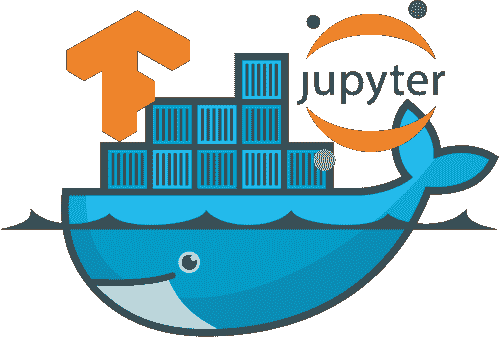

# 数据科学中的 Docker

> 原文：[`www.kdnuggets.com/2018/01/docker-data-science.html`](https://www.kdnuggets.com/2018/01/docker-data-science.html)

 评论

**由 [Sachin Abeywardana](https://www.linkedin.com/in/sachinabeywardana/)，[DeepSchool.io](http://DeepSchool.io) 的创始人**



数据科学中的 Docker

* * *

## 我们的前三个课程推荐

 1\. [谷歌网络安全证书](https://www.kdnuggets.com/google-cybersecurity) - 快速进入网络安全职业生涯。

 2\. [谷歌数据分析专业证书](https://www.kdnuggets.com/google-data-analytics) - 提升你的数据分析技能

 3\. [谷歌 IT 支持专业证书](https://www.kdnuggets.com/google-itsupport) - 支持你所在组织的 IT

* * *

Docker 是一个简化软件工程师安装过程的工具。作为一个统计学背景的人，我曾经很少关心如何安装软件，并且偶尔会花费几天时间解决系统配置问题。然后 Docker 出现了，真是天赐良机。

把 Docker 想象成一个轻量级虚拟机（我为使用这个术语向 Docker 专家道歉）。一般来说，有人会编写一个 *Dockerfile* 来构建一个 *Docker 镜像*，其中包含了你项目所需的大部分工具和库。你可以用它作为基础，并添加任何其他项目所需的依赖项。其**基本理念是，如果在我的机器上能工作，就能在你的机器上工作**。

**数据科学家能得到什么？**

1.  时间：你在安装软件包时节省的时间本身就使这个框架值得使用。

1.  **可重复研究**：我认为 Docker 就像是报告中的随机数种子。你在机器上使用的相同依赖和库版本也会被用在其他人的机器上。这确保了你生成的分析在其他分析师的机器上也能运行。

1.  分发：你不仅在分发你的代码，还在分发运行这些代码的环境。

**它是如何工作的？**

Docker 采用了（可重用的）层的概念。所以你在 `Dockerfile` 中写的每一行都被视为一个层。例如，你通常会从以下内容开始：

```py
FROM ubuntu
RUN apt-get install python3
```

这个 Dockerfile 会在 `Ubuntu` 层之上安装 `python3`（作为一个层）。

实际上，你对每个项目所做的就是把所有的 `apt-get install`、`pip install` 等命令写入你的 Dockerfile，而不是在本地执行它们。

我推荐阅读教程 [`docs.docker.com/get-started/`](https://docs.docker.com/get-started/) 来开始使用 Docker。**学习曲线最小**（最多 2 天的工作量），收益巨大。

**Dockerhub**

最后，Dockerhub 值得特别提及。就我个人而言，Dockerhub 是让 Docker 真正强大的原因。它就像**github 对 git 的作用，是一个分享 Docker 镜像的开放平台。** 你总是可以使用`docker build ...`在本地构建 Docker 镜像，但将这个镜像`push`到 Dockerhub 上总是好的，以便下一个人可以简单地`pull`进行个人使用。

我用于机器学习和数据科学的 Docker 镜像可以在[这里](https://hub.docker.com/r/sachinruk/ml_class/)找到，以及它的[源文件](https://github.com/sachinruk/Dockerfiles/blob/master/ML_class/Dockerfile)。

**总结**

就我个人而言，我已经开始在我大多数甚至所有的 github 仓库中加入 Dockerfile。特别是考虑到这意味着我将不再遇到安装问题。

Docker 是软件工程师（以及现在的数据科学家/分析师）应该在工具箱中拥有的工具之一（几乎与 git 同样重要和受到尊重）。长期以来，统计学家和数据科学家忽视了数据分析的软件方面。考虑到 Docker 的使用变得如此简单直观，实际上没有理由不将其纳入你的软件开发流程。

****编辑 1****

如果你想要比上面提供的快速提示更为详细的教程，请查看这个视频（跳转到 4:30 左右）：

**编辑 2（关于 python 的 virtualenvs，R 的 packrat 等的简要说明）：**

就我个人而言，我没有使用过其他容器化工具，但应该注意到，Docker 独立于 python 和 R，且超越了为特定编程语言容器化应用程序的范畴。

如果你喜欢我的教程/博客文章，**考虑支持我** 在[`www.patreon.com/deepschoolio`](https://www.patreon.com/deepschoolio) 或通过订阅我的 YouTube 频道[`www.youtube.com/user/sachinabey`](https://www.youtube.com/user/sachinabey)（或者两者都订阅！）。**哦，还有点赞！:)**

**简介: [Sachin Abeywardana](https://www.linkedin.com/in/sachinabeywardana/)** 是一位机器学习博士和[DeepSchool.io](http://DeepSchool.io)的创始人。

[原文](https://towardsdatascience.com/docker-for-data-science-4901f35d7cf9)。经许可转载。

**相关:**

+   DeepSchool.io: 深度学习学习

+   使用 Docker 的数据科学部署

+   Jupyter+Spark+Mesos: 一种“主观”的 Docker 镜像

### 更多相关主题

+   [成为优秀数据科学家所需的 5 项关键技能](https://www.kdnuggets.com/2021/12/5-key-skills-needed-become-great-data-scientist.html)

+   [每个初学数据科学家都应掌握的 6 种预测模型](https://www.kdnuggets.com/2021/12/6-predictive-models-every-beginner-data-scientist-master.html)

+   [2021 年最佳 ETL 工具](https://www.kdnuggets.com/2021/12/mozart-best-etl-tools-2021.html)

+   [停止学习数据科学以寻找目标，并通过寻找目标来……](https://www.kdnuggets.com/2021/12/stop-learning-data-science-find-purpose.html)

+   [数据科学统计学习的最佳资源](https://www.kdnuggets.com/2021/12/springboard-top-resources-learn-data-science-statistics.html)

+   [建立一个坚实的数据团队](https://www.kdnuggets.com/2021/12/build-solid-data-team.html)
