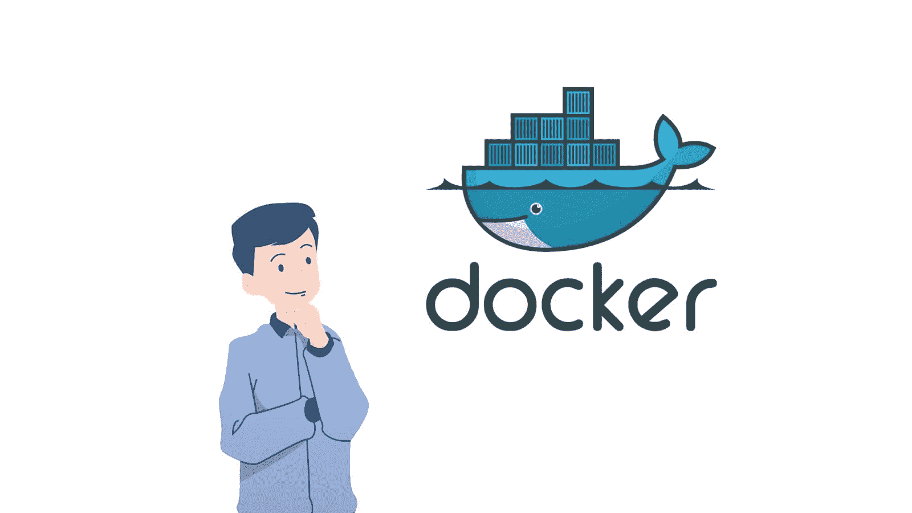
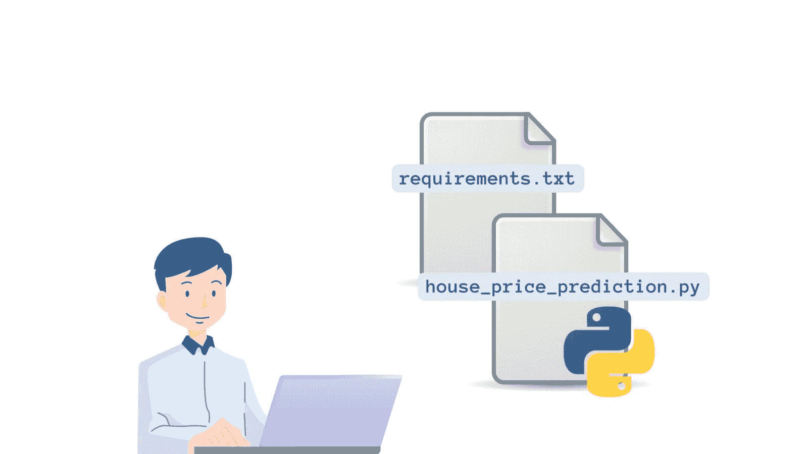
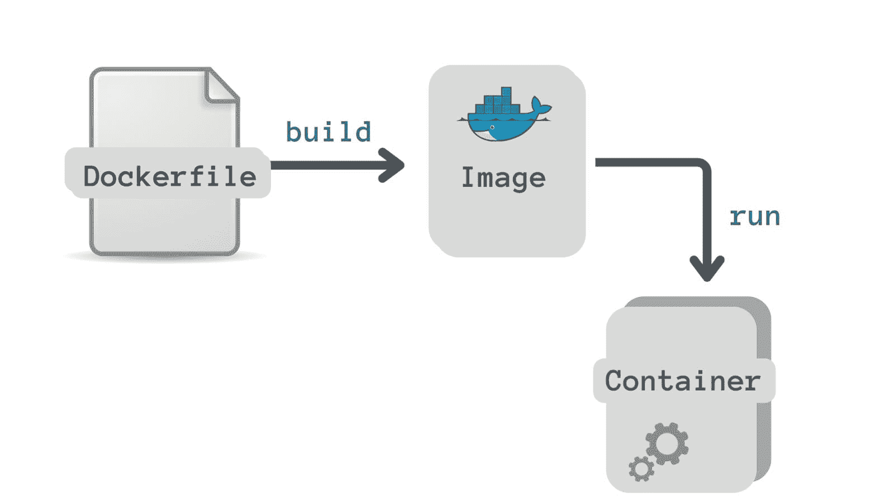
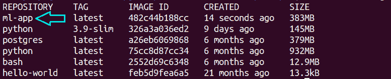
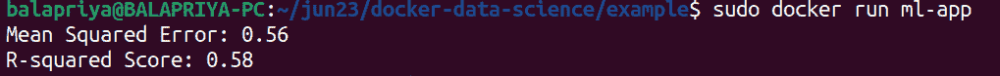

# 数据科学家的 Docker 教程

> 原文：[`www.kdnuggets.com/2023/07/docker-tutorial-data-scientists.html`](https://www.kdnuggets.com/2023/07/docker-tutorial-data-scientists.html)


图片来源：作者

Python 和一系列 Python 数据分析和机器学习库，如 pandas 和 scikit-learn，帮助你轻松开发数据科学应用程序。然而，Python 的依赖管理是一个挑战。在进行数据科学项目时，你需要花费大量时间安装各种库，并跟踪你所使用的库的版本等。

* * *

## 我们的三大课程推荐

 1\. [Google 网络安全证书](https://www.kdnuggets.com/google-cybersecurity) - 快速进入网络安全职业道路。

 2\. [Google 数据分析专业证书](https://www.kdnuggets.com/google-data-analytics) - 提升你的数据分析技能

 3\. [Google IT 支持专业证书](https://www.kdnuggets.com/google-itsupport) - 支持你的组织 IT

* * *

如果其他开发者想要运行你的代码并为项目做贡献呢？其他希望复制你的数据科学应用程序的开发者首先需要*设置*他们机器上的项目环境——然后才能运行代码。即使是小的差异，如库版本不同，也可能引入破坏性更改。**Docker** 来拯救你。Docker 简化了开发过程并促进了无缝的协作。

本指南将向你介绍 Docker 的基础知识，并教你如何使用 Docker 对数据科学应用程序进行容器化。

# 什么是 Docker？



图片来源：作者

[Docker](https://www.docker.com/) 是一个容器化工具，让你可以将应用程序构建和分享为称为**镜像**的可移植工件。

除了源代码外，你的应用程序还会有一组依赖项、所需的配置、系统工具等。例如，在数据科学项目中，你会在开发环境中安装所有必要的库（最好是在虚拟环境中）。你还会确保使用库所支持的最新版本的 Python。

然而，当你尝试在另一台机器上运行你的应用程序时，仍然可能会遇到问题。这些问题通常源于两台机器之间开发环境中的配置和库版本不匹配。

使用 Docker，你可以打包你的应用程序——连同依赖项和配置一起。这样，你可以定义一个隔离、可重现且一致的环境，适用于各种主机机器上的应用程序。

# Docker 基础知识：镜像、容器和注册表

我们来回顾一些概念/术语：

## Docker 镜像

Docker 镜像是你应用程序的便携式工件。

## Docker 容器

当你运行一个镜像时，你实际上是在容器环境中运行应用程序。因此，镜像的运行实例就是容器。

## Docker 注册表

Docker 注册表是一个*存储*和*分发* Docker 镜像的系统。在将应用程序容器化为 Docker 镜像后，你可以通过将其推送到镜像注册表来使其对开发者社区可用。 DockerHub 是最大的公共注册表，所有镜像默认都从 DockerHub 拉取。

# Docker 如何简化开发？

由于容器为你的应用程序提供了隔离的环境，因此其他开发人员现在只需在他们的机器上设置 Docker。他们可以拉取 Docker 镜像并使用单个命令启动容器——*无需担心复杂的安装*——在远程机器上。

在开发应用程序时，常常需要构建和测试多个版本的相同应用程序。如果使用 Docker，你可以在同一环境中运行多个相同应用程序的不同版本——*没有*任何冲突。

除了简化开发，Docker 还简化了部署，并帮助开发和运维团队有效协作。在服务器端，运维团队不必花时间解决复杂的版本和依赖冲突。他们只需要设置一个 docker 运行时环境。

# 基本 Docker 命令

让我们快速回顾一些基本的 Docker 命令，其中大多数将在本教程中使用。有关更详细的概述，请阅读：12 个每个数据科学家都应该知道的 Docker 命令。

| **命令** | **功能** |
| --- | --- |
| `docker ps` | 列出所有正在运行的容器 |
| `docker pull image-name` | 默认从 DockerHub 拉取 image-name |
| `docker images` | 列出所有可用的镜像 |
| `docker run image-name` | 从镜像启动容器 |
| `docker start container-id` | 重新启动已停止的容器 |
| `docker stop container-id` | 停止正在运行的容器 |
| `docker build path` | 使用 Dockerfile 中的指令在指定路径构建镜像 |

**注意**：如果你没有创建**docker**组，则需要在所有命令前加上`sudo`。

# 如何使用 Docker 容器化数据科学应用程序

我们已经了解了 Docker 的基础知识，现在是应用所学的知识的时候了。在这一部分，我们将使用 Docker 容器化一个简单的数据科学应用程序。

## 房价预测模型

让我们以以下线性回归模型为例，该模型根据输入特征预测目标值：中位数房价。该模型是使用 [加州住房数据集](https://scikit-learn.org/stable/modules/generated/sklearn.datasets.fetch_california_housing.html) 构建的：

```py
# house_price_prediction.py
from sklearn.datasets import fetch_california_housing
from sklearn.model_selection import train_test_split
from sklearn.preprocessing import StandardScaler
from sklearn.linear_model import LinearRegression
from sklearn.metrics import mean_squared_error, r2_score

# Load the California Housing dataset
data = fetch_california_housing(as_frame=True)
X = data.data
y = data.target

# Split the dataset into training and test sets
X_train, X_test, y_train, y_test = train_test_split(X, y, test_size=0.2, random_state=42)

# Standardize features
scaler = StandardScaler()
X_train = scaler.fit_transform(X_train)
X_test = scaler.transform(X_test)

# Train the model
model = LinearRegression()
model.fit(X_train, y_train)

# Make predictions on the test set
y_pred = model.predict(X_test)

# Evaluate the model
mse = mean_squared_error(y_test, y_pred)
r2 = r2_score(y_test, y_pred)

print(f"Mean Squared Error: {mse:.2f}")
print(f"R-squared Score: {r2:.2f}")
```

我们知道 scikit-learn 是一个必需的依赖项。如果你查看代码，我们在加载数据集时将 `as_frame` 设置为 True。因此，我们还需要 pandas。`requirements.txt` 文件看起来是这样的：

```py
pandas==2.0
scikit-learn==1.2.2
```



作者提供的图片

## 创建 Dockerfile

到目前为止，我们有源代码文件 `house_price_prediction.py` 和 `requirements.txt` 文件。现在我们应该定义 *如何* 从我们的应用程序构建镜像。**Dockerfile** 用于创建这种从应用程序源代码文件构建镜像的定义。

那么 Dockerfile 是什么？它是一个包含逐步指令以构建 Docker 镜像的文本文件。



作者提供的图片

这是我们示例的 Dockerfile：

```py
# Use the official Python image as the base image
FROM python:3.9-slim

# Set the working directory in the container
WORKDIR /app

# Copy the requirements.txt file to the container
COPY requirements.txt .

# Install the dependencies
RUN pip install --no-cache-dir -r requirements.txt

# Copy the script file to the container
COPY house_price_prediction.py .

# Set the command to run your Python script
CMD ["python", "house_price_prediction.py"]
```

让我们详细分析一下 Dockerfile 的内容：

+   所有 Dockerfile 都以 `FROM` 指令开始，指定基础镜像。基础镜像是你的镜像所基于的镜像。在这里，我们使用一个可用的 Python 3.9 镜像。`FROM` 指令告诉 Docker 从指定的基础镜像构建当前镜像。

+   `WORKDIR` 命令用于为所有后续命令设置工作目录（在这个例子中是 *app*）。

+   然后，我们将 `requirements.txt` 文件复制到容器的文件系统中。

+   `RUN` 指令在容器内的 shell 中执行指定的命令。在这里，我们使用 `pip` 安装所有必需的依赖项。

+   然后，我们将源代码文件——Python 脚本 `house_price_prediction.py`——复制到容器的文件系统中。

+   最后，`CMD` 指令指的是在容器启动时要执行的指令。这里我们需要运行 `house_price_prediction.py` 脚本。Dockerfile 应该只包含一个 `CMD` 指令。

## 构建镜像

现在我们已经定义了 Dockerfile，可以通过运行 `docker build` 来构建 Docker 镜像：

```py
docker build -t ml-app .
```

选项 **-t** 允许我们为镜像指定名称和标签，格式为 **name:tag**。默认标签是 *latest*。

构建过程需要几分钟：

```py
Sending build context to Docker daemon  4.608kB
Step 1/6 : FROM python:3.9-slim
3.9-slim: Pulling from library/python
5b5fe70539cd: Pull complete 
f4b0e4004dc0: Pull complete 
ec1650096fae: Pull complete 
2ee3c5a347ae: Pull complete 
d854e82593a7: Pull complete 
Digest: sha256:0074c6241f2ff175532c72fb0fb37264e8a1ac68f9790f9ee6da7e9fdfb67a0e
Status: Downloaded newer image for python:3.9-slim
 ---> 326a3a036ed2
Step 2/6 : WORKDIR /app
...
...
...
Step 6/6 : CMD ["python", "house_price_prediction.py"]
 ---> Running in 7fcef6a2ab2c
Removing intermediate container 7fcef6a2ab2c
 ---> 2607aa43c61a
Successfully built 2607aa43c61a
Successfully tagged ml-app:latest
```

Docker 镜像构建完成后，运行 `docker images` 命令。你也应该看到 `ml-app` 镜像被列出。

```py
docker images
```



你可以使用 `docker run` 命令运行 Docker 镜像 `ml-app`：

```py
docker run ml-app
```



恭喜！你刚刚将你的第一个数据科学应用程序容器化。通过创建 DockerHub 账户，你可以将镜像推送到 DockerHub（或推送到组织内的私有仓库）。

# 结论

希望你觉得这个入门级的 Docker 教程对你有帮助。你可以在 [这个 GitHub 仓库](https://github.com/balapriyac/docker-data-science) 中找到本教程使用的代码。下一步，设置 Docker 并尝试这个示例，或者将你选择的应用进行容器化。

在你的机器上安装 Docker 的最简单方法是使用 [Docker Desktop](https://www.docker.com/products/docker-desktop/): 你将同时获得 Docker CLI 客户端以及一个用于轻松管理容器的 GUI。快来设置 Docker，立刻开始编码吧！

**[Bala Priya C](https://www.linkedin.com/in/bala-priya/)** 是来自印度的开发者和技术作家。她喜欢在数学、编程、数据科学和内容创作的交汇处工作。她的兴趣和专长领域包括 DevOps、数据科学和自然语言处理。她喜欢阅读、写作、编码和咖啡！目前，她正致力于通过撰写教程、操作指南、观点文章等与开发者社区分享她的知识。

### 更多相关话题

+   [每个数据科学家都应该知道的 12 个 Docker 命令](https://www.kdnuggets.com/2023/01/12-docker-commands-every-data-scientist-know.html)

+   [数据科学的 Docker 备忘单](https://www.kdnuggets.com/2023/02/docker-data-science-cheat-sheet.html)

+   [创建一个简单的 Docker 数据科学镜像](https://www.kdnuggets.com/2023/08/simple-docker-data-science-image.html)

+   [如何使用 Docker 卷进行持久数据存储](https://www.kdnuggets.com/how-to-use-docker-volumes-for-persistent-data-storage)

+   [Kubernetes 中的高可用性 SQL Server Docker 容器](https://www.kdnuggets.com/2022/04/high-availability-sql-server-docker-containers-kubernetes.html)

+   [用 Docker 在 5 个简单步骤中容器化 Python 应用](https://www.kdnuggets.com/containerize-python-apps-with-docker-in-5-easy-steps)
