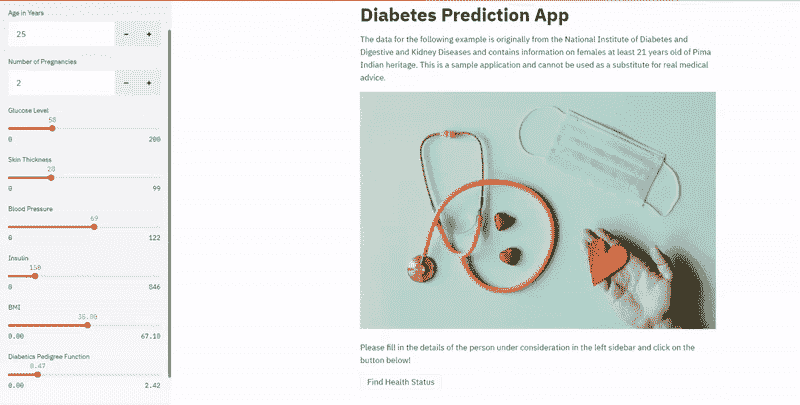

# 如何 Docker 化任何机器学习应用程序

> 原文：[`www.kdnuggets.com/2021/04/dockerize-any-machine-learning-application.html`](https://www.kdnuggets.com/2021/04/dockerize-any-machine-learning-application.html)

评论

**作者 [Arunn Thevapalan](https://www.linkedin.com/in/arunn-thevapalan/)，Octave 的高级数据科学家、导师和作家。**


* * *

## 我们的前三个课程推荐

 1\. [Google 网络安全证书](https://www.kdnuggets.com/google-cybersecurity) - 快速开启网络安全职业生涯。

 2\. [Google 数据分析专业证书](https://www.kdnuggets.com/google-data-analytics) - 提升你的数据分析技能

 3\. [Google IT 支持专业证书](https://www.kdnuggets.com/google-itsupport) - 支持你的组织 IT

* * *

*容器化并部署模型！（照片由 [Andy Li](https://unsplash.com/@andasta?utm_source=medium&utm_medium=referral) 供图，来自 [Unsplash](https://unsplash.com/?utm_source=medium&utm_medium=referral)）*

刚入职一个月，作为一名应届毕业生，我们的 AI 创始人走到我面前问：*“Arunn，我希望你能成为 Docker 专家。你需要多长时间？”* 我不确定 Docker 是什么，但又无法回避这个问题。最后，我回答说：*“两周，1 个冲刺。”*

我的经理，也在场，试图打断以拯救我，但我已经造成了损害，我只有接下来的两周时间。

回顾过去，我从来不是专家（*现在也不是！*），但我学到的足以完成所需的工作。在这篇文章中，我将告诉你如何将任何机器学习网络应用程序 Docker 化的基本步骤。

### 什么是 Docker？

**Docker** 是一个旨在通过使用容器来创建、部署和运行应用程序的工具。**容器** 是一个标准化的软件单元，简单来说——就是一个打包的应用程序代码和所需的库及其他依赖项的包。**Docker 镜像** 是一个可执行的软件包，包含运行应用程序所需的一切，并在运行时成为**容器**。

当我尝试理解 Docker 时，有很多新技术术语。但其实这个概念很简单。

可以把它想象成你获得了一台全新的迷你 Ubuntu 机器。然后，你在其上安装一些包。接着，你在其上添加一些代码。最后，你执行这些代码来创建一个应用程序。***所有这一切都发生在你现有的机器上，使用你选择的操作系统*****。** 你只需要在其中安装 Docker 即可。

如果你的机器上没有安装 Docker，请查阅 [这里的安装说明](https://docs.docker.com/get-docker/)。

### 为什么数据科学家需要 Docker？

我明白了。你从事数据科学领域的工作。你认为 DevOps 团队可以处理 Docker。你的老板没有要求你成为专家（*不像我的老板！*）。

你觉得你并不真的需要理解 Docker。

这不是真的，让我告诉你为什么。

> *“不确定为什么在你的机器上不起作用，它在我的机器上可以正常工作。你要我看看吗？”*

在你的工作场所听过这些话吗？一旦你（和你的团队）理解了 Docker，就不会再有人说这些话了。你的代码将顺利运行在 Ubuntu、Windows、AWS、Azure、Google Cloud 或任何地方。

**你构建的应用程序可以在任何地方重复使用。**

你将开始更快地启动环境，并以正确的方式分发应用程序，这将节省大量时间。你（最终）将被认为是一位具备软件工程最佳实践的数据科学家。

### 3 个简单步骤

正如承诺的，我已将过程简化为 3 个简单步骤。在这里，我们以糖尿病预测应用程序的用例为例，该应用程序可以根据诊断措施预测糖尿病的发作。这将帮助你理解我们如何在现实世界的用例场景中接近容器化。

我强烈建议你阅读 [这篇文章](https://medium.com/towards-artificial-intelligence/how-i-build-machine-learning-apps-in-hours-a1b1eaa642ed?source=friends_link&sk=66a5df0a2570e1cf0f12211f3b4f2fc2)，其中我们使用 Streamlit 从头开始逐步构建这个机器学习应用程序。



*作者制作的糖尿病预测应用程序的屏幕录制。*

请查看这个 [GitHub 仓库](https://github.com/arunnthevapalan/diabetes-prediction-app) ，其中包含完整的实现，可以跟随示例进行操作。既然我们知道了背景，接下来让我们解决这 3 个步骤！

**1. 定义环境**

第一步是确保应用程序正常运行所需的准确环境。有很多方法可以做到这一点，但其中一个最简单的想法是为项目定义一个 *requirements.txt* 文件。

请查看你代码中使用的所有库，并将它们列在一个名为 *requirements.txt* 的文本文件中。列出库的确切版本是一种好习惯，你可以在环境的终端上运行 *pip freeze* 来找到这些版本。我为糖尿病预测示例准备的 [requirements](https://github.com/arunnthevapalan/diabetes-prediction-app/blob/master/requirements.txt) 文件如下所示，

```py
joblib==0.16.0
numpy==1.19.1
pandas==1.1.0
pandas-profiling==2.8.0
scikit-learn==0.23.2
streamlit==0.64.0

```

**2. 编写 Dockerfile**

这里的想法是，我们尝试创建一个名为 *Dockerfile* 的文件，该文件可用于构建我们应用程序运行所需的虚拟环境。把它当作在任何系统上构建所需环境的说明手册！

让我们为手头的示例编写 Dockerfile，

```py
FROM python:3.7
EXPOSE 8501
WORKDIR /app
COPY . .
RUN pip install -r requirements.txt
CMD streamlit run app.py

```

就这些了。6 行代码。按顺序排列。每一行都在构建在前一行之上。让我们逐行解析。

1.  每个 Dockerfile 必须以 ***FROM*** 开头。紧接着 ***FROM ***的内容必须是一个已存在的镜像（本地或来自 [DockerHub 仓库](https://hub.docker.com/search?type=image)）。由于我们的环境基于 Python，我们使用*python:3.7*作为基础镜像，并最终使用此 Dockerfile 创建一个新镜像。

1.  Streamlit 默认运行在 8501 端口。因此，为了使应用程序运行，重要的是要暴露该端口。我们使用 ***EXPOSE ***命令来实现。

1.  ***WORKDIR ***设置应用程序的工作目录。其余命令将从这个路径执行。

1.  这里的 ***COPY ***命令将 Docker 客户端当前目录中的所有文件复制到镜像的工作目录。

1.  ***RUN ***命令确保我们在*requirements.txt*中定义的库已正确安装。

1.  ***CMD ***指定在容器启动时运行的命令。因此，*streamlit run app.py*确保 Streamlit 应用程序在容器启动后立即运行。

编写 Dockerfiles 需要一些实践，除非你花费大量时间在 Docker 上，否则无法掌握所有可用命令。我建议先熟悉一些基本命令，然后参考 [Docker 的官方文档](https://docs.docker.com/engine/reference/commandline/docker/) 。

**3\. 构建镜像**

现在我们已经定义了 Dockerfile，是时候构建它并创建一个镜像了。这个镜像的目的是创建一个与底层系统无关的可重复环境。

```py
docker build --tag app:1.0 .

```

如名字所示，*build *命令按 Dockerfile 中定义的逐层构建镜像。最好给镜像标记一个名称和版本号，如*<name>:version.number*。

末尾的点表示 Dockerfile 的路径，即当前目录。

等等，我构建了镜像，但我该如何处理它？根据要求，你可以 [在 DockerHub 上分享构建的镜像](https://docs.docker.com/get-started/part3/) 或 [将其部署到云端](https://docs.docker.com/engine/context/aci-integration/)，等等。但首先，你现在需要运行镜像以获取容器。

如名字所示，*run *命令在主机上运行指定的容器。*--publish 8501:8501* 将容器的 8501 端口映射到主机的 8501 端口，而*-it* 用于运行交互式进程（如 shell/terminal）。

```py
docker run --publish 8501:8501 -it app:1.0

```

现在跟随终端上提示的链接，亲自见证奇迹吧！;)


*你做到了！（照片由 [Nghia Le](https://unsplash.com/@lephunghia?utm_source=medium&utm_medium=referral) 提供，来源于 [Unsplash](https://unsplash.com/?utm_source=medium&utm_medium=referral)）*

[原文](https://towardsdatascience.com/how-to-dockerize-any-machine-learning-application-f78db654c601)。已获许可转载。

**简介：** [Arunn Thevapalan](https://www.linkedin.com/in/arunn-thevapalan/) 是一位总部位于斯里兰卡的高级数据科学家，他的使命是通过分享学习、方法和成为成功数据科学家的全过程，激励热爱者进入并成长于数据科学领域。

**相关：**

+   [5 个原因说明容器将主宰数据科学](https://www.kdnuggets.com/2020/11/gigantum-containers-will-rule-data-science.html)

+   [Docker 镜像优化策略](https://www.kdnuggets.com/2020/10/strategies-docker-images-optimization.html)

+   [使用 Docker 容器将机器学习管道部署到云端](https://www.kdnuggets.com/2020/06/deploy-machine-learning-pipeline-cloud-docker.html)

### 更多相关内容

+   [NExT-GPT 介绍：任意到任意的多模态大型语言模型](https://www.kdnuggets.com/introduction-to-nextgpt-anytoany-multimodal-large-language-model)

+   [SHAP：在 Python 中解释任何机器学习模型](https://www.kdnuggets.com/2022/11/shap-explain-machine-learning-model-python.html)

+   [如何在没有工作经验的情况下获得数据科学的第一份工作](https://www.kdnuggets.com/2021/02/first-job-data-science-without-work-experience.html)

+   [在参加任何免费数据科学课程之前请阅读此内容](https://www.kdnuggets.com/read-this-before-you-take-any-free-data-science-course)

+   [数据科学中的基本数学：特征向量及其在 PCA 中的应用](https://www.kdnuggets.com/2022/06/essential-math-data-science-eigenvectors-application-pca.html)

+   [创建一个从音频中提取主题的 Python Web 应用程序](https://www.kdnuggets.com/2023/01/creating-web-application-extract-topics-audio-python.html)
