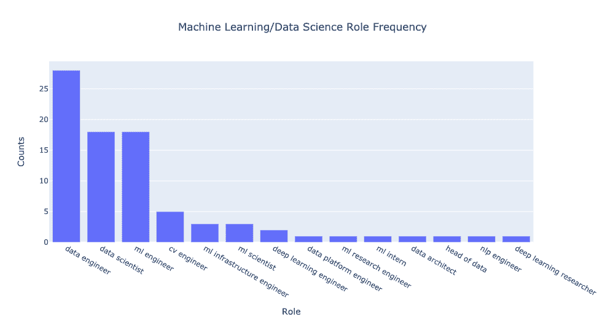
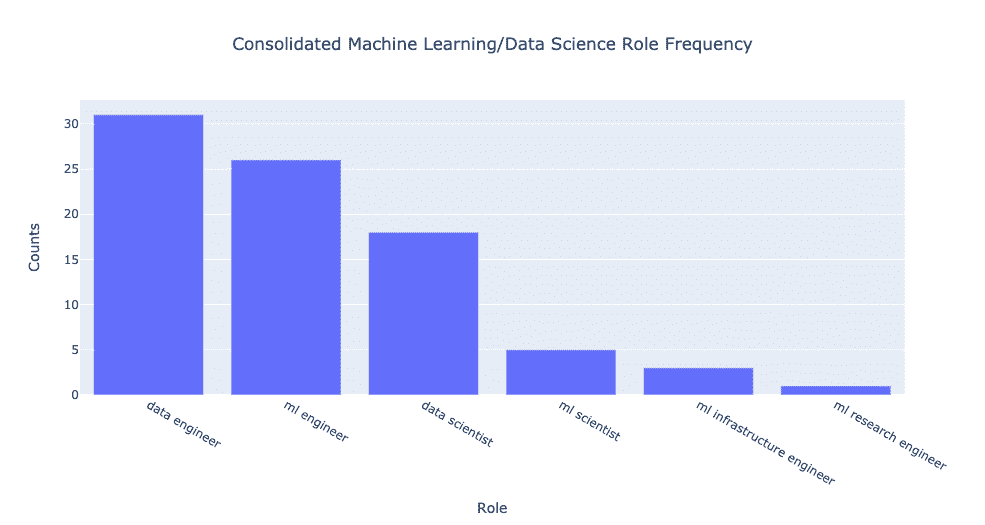
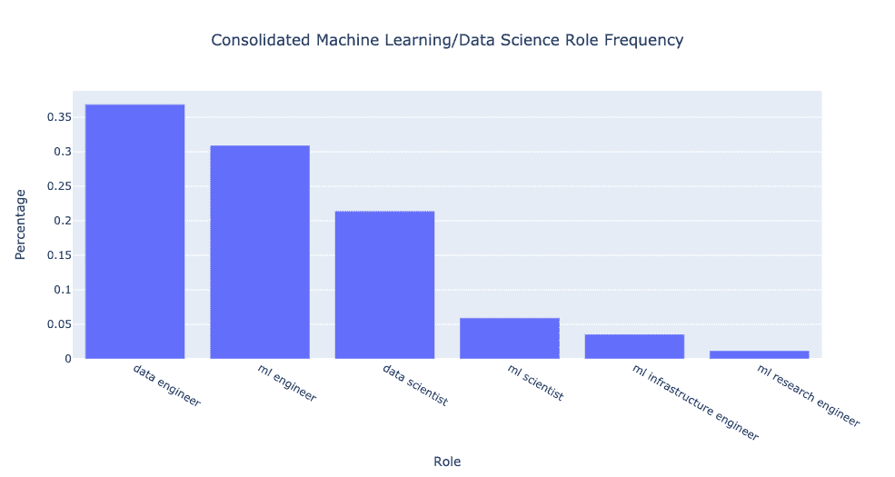
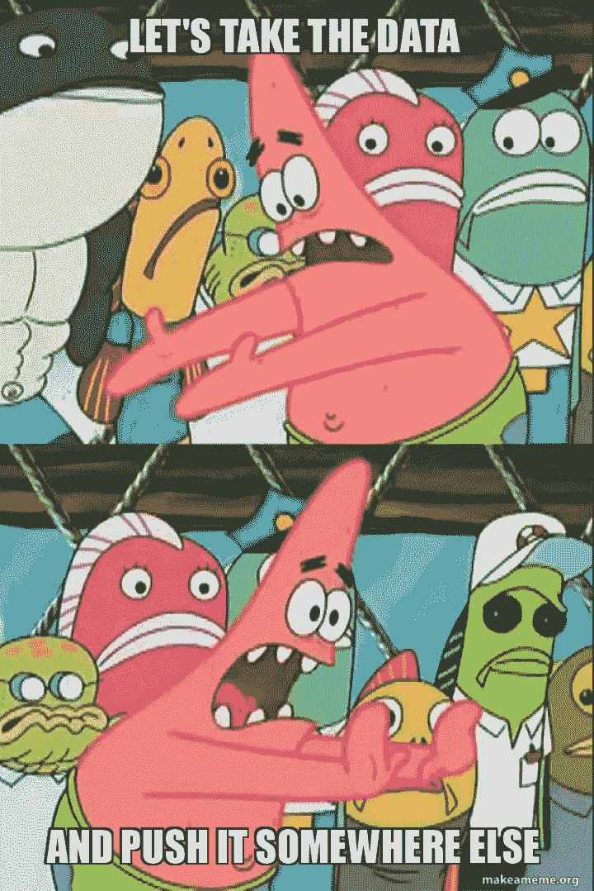

# 我们不需要数据科学家，我们需要数据工程师

> 原文：[`www.kdnuggets.com/2021/02/dont-need-data-scientists-need-data-engineers.html`](https://www.kdnuggets.com/2021/02/dont-need-data-scientists-need-data-engineers.html)
> 
> 这是受到此帖启发的 KDnuggets 漫画
> 
> 

数据。无处不在，我们[每天生成的数据越来越多](https://techjury.net/blog/how-much-data-is-created-every-day/#gref)。在过去的 5-10 年里，*数据科学*吸引了来自四面八方的新手，试图尝到这禁果的滋味。

* * *

## 我们的前三推荐课程

 1\. [谷歌网络安全证书](https://www.kdnuggets.com/google-cybersecurity) - 快速进入网络安全领域的职业生涯。

 2\. [谷歌数据分析专业证书](https://www.kdnuggets.com/google-data-analytics) - 提升你的数据分析技能

 3\. [谷歌 IT 支持专业证书](https://www.kdnuggets.com/google-itsupport) - 支持你的组织的 IT 工作

* * *

但如今*数据科学*招聘的状态如何呢？

对于忙碌的读者来说，本文的要点用两句话总结如下。

> **总结**：相比*数据科学*，公司中**数据工程**的职位空缺多出**70%**。在培养下一代数据和机器学习从业者时，让我们更多地强调工程技能。

作为我开发[教育平台](https://www.confetti.ai/)的一部分，我经常思考数据驱动（机器学习和数据科学）角色的市场如何演变。

与众多有意进入数据领域的潜在候选人，包括世界顶尖机构的学生交谈时，我看到对哪些技能最重要以帮助候选人脱颖而出并为其职业生涯做准备的困惑。

当你仔细考虑时，一个*数据科学家*可以负责以下任何子集：机器学习建模、可视化、数据清洗和处理（即 SQL 操作）、工程以及生产部署。

你如何开始为新手推荐学习课程呢？

数据胜于言辞。因此，我决定对自 2012 年以来每个来自[Y-Combinator](https://www.ycombinator.com/)的公司招聘的数据角色进行分析。指导我研究的问题是：

+   公司最常招聘哪些数据角色？

+   我们谈论得很多的传统*数据科学家*有多么抢手？

+   开创数据革命的那些技能在今天仍然相关吗？

如果你想了解完整的细节和分析，请继续阅读。

# 方法论

我选择对那些声称将某种数据工作作为其价值主张的一部分的 YC 投资组合公司进行分析。

为什么专注于 YC？首先，他们提供了一个易于搜索（和抓取）的[公司目录](https://www.ycombinator.com/companies/)。

此外，作为一个特别前瞻性的孵化器，他们在过去十多年里资助了来自全球各领域的公司，我认为他们提供了一个代表性的市场样本以供我进行分析。也就是说，请对我的说法持保留态度，因为我没有分析超级大型科技公司。

我抓取了自 2012 年以来每个 YC 公司的主页 URL，初步筛选出约 1400 家公司。

为什么不从 2012 年开始？2012 年是[AlexNet](https://en.wikipedia.org/wiki/AlexNet)赢得 ImageNet 竞赛的年份，这实际上启动了我们现在所经历的机器学习和数据建模浪潮。可以说，这催生了数据优先公司的一些早期世代。

从这个初始池中，我进行了关键词过滤，以减少需要查看的相关公司数量。特别是，我只考虑了其网站上至少包含以下术语之一的公司：AI、CV、NLP、自然语言处理、计算机视觉、人工智能、机器、ML、数据。我还忽略了那些网站链接损坏的公司。

这是否产生了大量的虚假积极结果？绝对是！但在这里，我尽量优先考虑高召回率，同时意识到我会对相关角色的各个网站进行更细致的手动检查。

在这个缩小的范围内，我浏览了每个网站，找到他们发布招聘信息的地方（通常是*Careers*、*Jobs*或*We’re Hiring*页面），并记录了每个职位标题中包含数据、机器学习、自然语言处理（NLP）或计算机视觉（CV）的角色。这给我提供了大约 70 个招聘数据岗位的不同公司。

这里有一点说明：有可能我遗漏了一些公司，因为有些网站信息非常少（通常是那些在隐形状态中的公司），这些公司实际上可能正在招聘。此外，还有些公司没有正式的*Careers*页面，而是要求潜在候选人直接通过电子邮件联系。

我忽略了这两类公司，而不是联系他们，因此它们不在此次分析之内。

另外一点：这项研究的大部分工作是在 2020 年最后几周完成的。随着公司定期更新其页面，开放职位可能已经发生变化。然而，我认为这不会对得出的结论产生重大影响。

# 数据从业者负责什么？

在深入结果之前，值得花一些时间澄清每个数据角色通常负责的职责。以下是我们将要重点查看的四个角色，并简要描述了他们的工作内容：

+   *数据科学家*：使用各种统计和机器学习技术来处理和分析数据。通常负责建立模型以探测从某些数据源中可以学到的东西，尽管通常是在原型阶段而非生产阶段。

+   *数据工程师*：开发一个强大且可扩展的数据处理工具/平台。必须熟悉 SQL/NoSQL 数据库操作和构建/维护 ETL 管道。

+   *机器学习（ML）工程师*：通常负责模型训练和生产化。需要熟悉一些高级 ML 框架，并且必须能够构建可扩展的训练、推理和部署管道。

+   *机器学习（ML）科学家*：从事前沿研究。通常负责探索可以在学术会议上发布的新想法。往往只需原型化新型最先进模型，然后将其交给机器学习工程师进行生产化。

# 有多少数据角色？

那么当我们绘制公司招聘的每种数据角色的频率时会发生什么？图表如下：

令人印象深刻的是，与传统的*数据科学家*角色相比，开放的*数据工程师*职位明显更多。在这种情况下，原始数据表明公司招聘的**数据工程师**比数据科学家多**约 55%**，而机器学习工程师的数量与数据科学家大致相同。

但我们还可以做得更多。如果你查看各种角色的标题，似乎存在一些重复。

我们只提供通过角色整合的粗略分类。换句话说，我将描述大致相同的角色合并在一个标题下。

包括以下一组等价关系：

+   *NLP 工程师* ≈ *CV 工程师* ≈ *ML 工程师* ≈ *深度学习工程师*（尽管领域可能不同，但职责大致相同）

+   *ML 科学家* ≈ *深度学习研究员* ≈ *ML 实习生*（实习描述看起来非常注重研究）

+   *数据工程师* ≈ *数据架构师* ≈ *数据主管* ≈ *数据平台工程师*

如果我们不喜欢处理原始数据，这里有一些百分比可以让我们安心：

我可能本可以将*ML 研究工程师*归入*ML 科学家*或*ML 工程师*类别，但由于这是一个混合角色，我将其保持原样。

整体上，整合使差异更加显著！开放的*数据工程师*职位比*数据科学家*多**约 70%**。此外，开放的*ML 工程师*职位比*数据科学家*多**约 40%**。而*ML 科学家*的职位只有*数据科学家*的**约 30%**。

# 主要收获

与其他数据驱动职业相比，*数据工程师*的需求越来越高。从某种意义上说，这代表了更广泛领域的演变。

当机器学习在 5-8 年前变得热门时，公司决定他们需要能够对数据进行分类的人。但随后像[Tensorflow](https://www.tensorflow.org/)和[PyTorch](https://pytorch.org/)这样的框架变得非常优秀，使得开始进行深度学习和机器学习变得民主化。

这使得数据建模技能变得商品化。

今天，帮助公司将机器学习和建模洞察力投入生产的瓶颈在于数据问题。

你如何标注数据？你如何处理和清洗数据？你如何将数据从 A 移动到 B？你如何尽可能快地每天做到这些？

这一切都归结为拥有良好的工程技能。

这听起来可能有些乏味和不够吸引人，但将老派的软件工程与数据相结合，可能正是我们现在真正需要的。

多年来，我们一直对数据专业人士能够将生机注入原始数据的想法充满热情，归功于炫酷的演示和媒体炒作。毕竟，上一次你看到关于 ETL 管道的[TechCrunch](https://techcrunch.com/)文章是什么时候？

如果没有别的，我相信在数据科学工作培训或教育项目中，我们对扎实工程能力的重视还远远不够。除了学习如何使用*linear_regression.fit()*，还要学会如何编写单元测试！

所以这是否意味着你不应该学习数据科学？不。

这意味着竞争将会更加激烈。市场上对数据科学的新人训练过剩，职位会变得更少。

总会有需要能够有效分析和提取数据中可操作见解的人。但他们必须要优秀。

从 Tensorflow 网站下载一个预训练模型以使用[Iris 数据集](https://scikit-learn.org/stable/auto_examples/datasets/plot_iris_dataset.html)可能已经不足以获得数据科学职位。

然而，很明显，随着大量的*机器学习工程师*职位空缺，公司往往希望拥有混合型数据从业者：既能构建和部署模型的人。简而言之，就是既能使用 Tensorflow 又能从源代码构建它的人。

另一个结论是，机器学习研究职位其实并不多。

机器学习研究往往受到大量炒作，因为那是所有前沿技术的发生地，比如所有的[AlphaGo](https://deepmind.com/research/case-studies/alphago-the-story-so-far)和[GPT-3](https://openai.com/blog/openai-api/)等等。

但对于许多公司，特别是初创公司来说，前沿的尖端技术可能已经不再是他们所需要的。获得一个达到 90% 的模型，但能扩展到 1000+ 用户，往往对他们来说更有价值。

这并不是说机器学习研究没有重要的地位。绝对不是。

但你可能会在能够承担长期资本密集型投资的行业研究实验室找到更多这样的角色，而不是在种子阶段的初创公司，该公司试图向投资者展示产品市场适配性，并在筹集 A 轮融资时。

如果没有别的，我认为使新进入数据领域的人的期望合理且精准是很重要的。我们必须承认，[数据科学现在有所不同](https://veekaybee.github.io/2019/02/13/data-science-is-different/)。我希望这篇文章能够揭示今天领域的现状。只有当我们知道自己在哪里时，我们才知道需要去哪里。

**[Mihail Eric](https://twitter.com/mihail_eric)** 是 Confetti 的机器学习研究员和创始人。

[原文](https://www.mihaileric.com/posts/we-need-data-engineers-not-data-scientists/)。已获许可转载。

### 更多相关话题

+   [适用于数据工程师和数据科学家的高保真合成数据](https://www.kdnuggets.com/2022/tonic-high-fidelity-synthetic-data-engineers-scientists-alike.html)

+   [数据科学家和数据工程师如何协作？](https://www.kdnuggets.com/2022/08/data-scientists-data-engineers-work-together.html)

+   [初级机器学习工程师实际需要知道什么才能被录用？](https://www.kdnuggets.com/what-junior-ml-engineers-actually-need-to-know-to-get-hired)

+   [关于数据工程师的 11 个问题：这个职业到底是什么，等等…](https://www.kdnuggets.com/2022/10/11-questions-data-engineers-profession-heading.html)

+   [5 种数据工程师的 SQL 可视化工具](https://www.kdnuggets.com/2023/02/5-sql-visualization-tools-data-engineers.html)

+   [如何获得 ML 职位：来自 Meta、Google Brain 和 SAP 工程师的建议](https://www.kdnuggets.com/2022/08/corise-land-ml-job-advice-engineers-meta-google-brain-sap.html)
