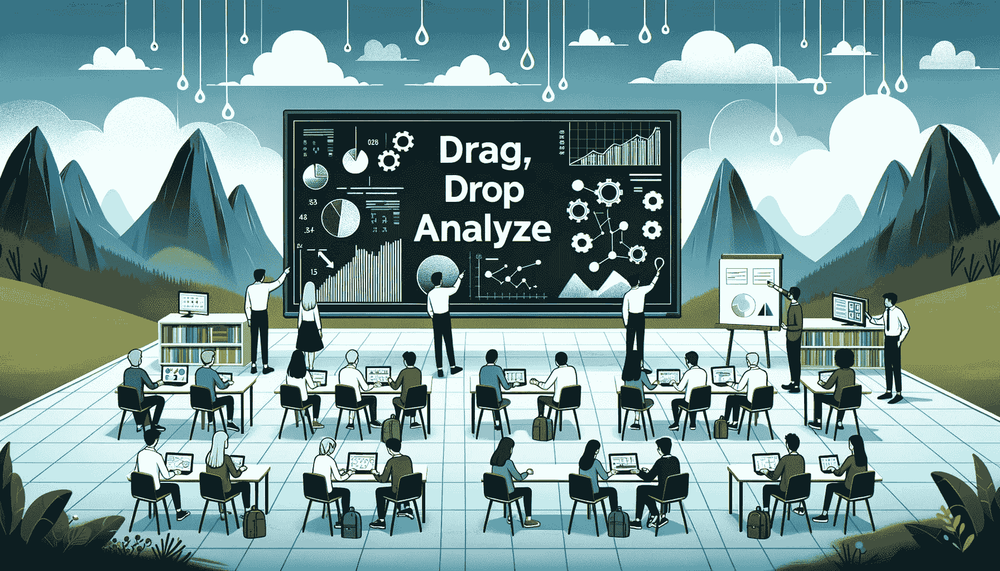

# 拖拽、放置、分析：无代码数据科学的兴起

> 原文：[`www.kdnuggets.com/drag-drop-analyze-the-rise-of-nocode-data-science`](https://www.kdnuggets.com/drag-drop-analyze-the-rise-of-nocode-data-science)

图像由 DALLE 3 生成

数据从业人员面临的挑战之一是每个新的使用案例都必须从头开始编码。这可能是一个耗时且低效的过程。无代码或低代码解决方案帮助数据科学家创建可重用的解决方案，适用于各种使用案例。这可以节省时间和精力，并提高数据科学项目的质量。

* * *

## 我们的前三大课程推荐

 1\. [Google 网络安全证书](https://www.kdnuggets.com/google-cybersecurity) - 快速开启网络安全职业生涯

 2\. [Google 数据分析专业证书](https://www.kdnuggets.com/google-data-analytics) - 提升您的数据分析技能

 3\. [Google IT 支持专业证书](https://www.kdnuggets.com/google-itsupport) - 支持您的组织的 IT

* * *

你几乎可以在数据科学中完成所有事情而无需编写一行代码。“无代码或低代码解决方案是数据科学的未来，”[Ingo Mierswa](https://www.linkedin.com/in/ingomierswa) 评论道，他是 Altair 的产品开发高级副总裁及 [RapidMiner](https://rapidminer.com/) 数据科学平台的创始人。作为无代码数据科学领域的杰出发明家，他的专业知识和贡献影响了这些功能在行业中的采纳和实施。“这些功能，”Mierswa 在我们的采访电话中提到，“使没有很多编程经验的人能够构建和部署数据科学模型。这可以帮助民主化数据科学，并使其对每个人更加可及。”

“当我发现自己作为计算机科学家时，市场上没有无代码或低代码平台，我不得不为每一个新的使用案例重新创建非常相似的解决方案。这是一个低效的过程，感觉像是在浪费大量时间，”Mierswa 分享道。他以基础知识为例，阐述道：“如果你第二次解决一个问题时仍在编程，那意味着你第一次没有正确解决问题。你应该创建一个可以重复使用的解决方案来解决相同或类似的问题。”他断言，“人们常常没有意识到他们的问题有多么相似，结果是，他们不断重复编写相同的代码。他们应该问的问题是，‘我为什么还在编程？’也许他们不应该这样做，以节省时间和精力。”

# 多样化加速

无代码或低代码的数据科学解决方案可能非常有价值。**Mierswa** 强调说：“第一个也是最重要的好处是，它们可以促进更好的协作。如果有人解释了视觉工作流或模型，每个人都可以理解，但并不是每个人都是计算机科学家或程序员，也不是每个人都能理解代码。”因此，为了有效协作，你需要理解团队共同生产的资产。“数据科学归根结底是一项团队运动。你需要理解业务问题的人，无论他们是否会编程，因为编程可能不是他们的日常工作。”

然后你会有其他有数据访问权限、充满计算思维的人，他们会想，“好吧，如果我想建立一个机器学习模型，我需要以特定方式转换我的数据。”这是一个很好的技能，他们也需要协作，但同样，对于这些技能，我们知道 ETL 产品已经存在了很长时间。“是的，在少数情况下，在特别、非常定制的情况下，你仍然需要编程。即使在那些情况下，这也是一百分之一的例外，”**Mierswa** 指出。“这不应该成为常态，但真正的魔力发生在你将所有不同的技能、数据、人和专业知识结合在一起的时候。”

**Mierswa** 理论道：“你永远不会看到纯代码方法能做到这一点。你永远得不到利益相关者的支持。这通常会导致我所说的死项目。我们应该把数据科学视为解决问题的工具。我们不应该把它当作一种科学方法，在这里是否实际创建解决方案并不重要。”他说：“这很重要。我们正在解决数百万美元的业务问题。我们实际上应该朝着有效解决方案的方向努力，获得支持，部署解决方案，并真正改善我们的情况。不是说‘是的，我知道，如果失败了，我不在乎。’所以协作是一个巨大的好处。”

**Mierswa** 解释说，加速是另一个好处。当你通过编程执行重复任务时，你并没有以最快的方式工作。例如，如果我创建了一个包含五个或十个操作符的 RapidMiner 工作流，那通常相当于成千上万行代码。复制和粘贴代码可能会拖慢速度，但低代码平台可以帮助你更快地创建自定义解决方案。

责任，往往被忽视，却是最重要的好处。当你创建基于代码的解决方案时，可能很难追踪谁做了哪些更改以及原因。“这可能会导致在其他人需要接手项目或代码中出现漏洞时出现问题。另一方面，低代码平台是自带文档的。这意味着你创建的视觉工作流也附有解释工作流功能的文档。“这使得理解和维护代码变得更容易，也有助于确保责任感，”Mierswa 说。“人们理解它。他们接受这个观点，但他们也能对这些结果负责。作为团队的一部分。”

# 开放生态系统

AI 的快速发展正在改变数据科学领域，那些希望保持领先的公司保持开放，使用开源和开放标准，不隐藏数据科学市场中非常重要的任何东西。

保持开放的公司因市场的快速变化和不断迭代而处于有利位置。“过去 10 到 20 年间的数据科学市场就是这样，”Mierswa 反思道，“市场的快速变化要求不断迭代，这使得关闭生态系统极为不明智。这也是一些传统上封闭的公司开放并采用供应商中立的方法以支持更多编程语言和集成的原因之一。”

虽然可选编码的方法允许研究人员在不编写任何代码的情况下执行复杂的数据分析任务，但在某些情况下，编码可能是必要的。在这些情况下，大多数低代码平台与编程语言、[机器学习库](https://kanger.dev/article/machine-learning-libraries)和深度学习环境集成。它们还提供用户探索第三方解决方案市场的能力，Mierswa 指出。“RapidMiner 甚至提供了一个操作框架，允许用户创建自己的视觉工作流。这个操作框架使得扩展和重用工作流变得容易，为数据分析提供了灵活和可定制的方法。”

# 前景

Altair，一家计算科学和 AI 领域的领导者，进行了一项调查，揭示了全球组织广泛采用数据和 AI 策略的情况。

这项研究涉及了来自不同产业和 10 个不同国家的 2000 多名专业人士，揭示了在组织内部不同部门之间存在摩擦时，AI 和数据分析项目的失败率显著（从 36%到 56%）。

研究确定了三大摩擦来源，这些摩擦阻碍了数据和 AI 项目的成功：组织性、技术性和财务性。

+   组织摩擦源于在找到合格的人员填补数据科学职位方面的挑战以及员工缺乏 AI 知识。

+   技术摩擦源于数据处理速度的限制和数据质量问题。

+   财务摩擦是由于资金限制、领导层对前期成本的关注以及对高实施成本的认知造成的。

Altair 的创始人兼 CEO James R. Scapa 在[新闻发布会](https://altair.com/newsroom/news-releases/altair-global-survey-reveals-significant-opportunities-to-improve-efficiency-scale-and-success-of-enterprise-ai-and-data-projects)上强调了组织将数据作为战略资产来获得竞争优势的重要性。

摩擦会使关键任务项目陷入瘫痪。为了克服这些挑战并实现 Altair 称之为“无摩擦 AI”的目标，企业必须采用自助数据分析工具。Scapa 强调，这些工具使非技术用户能够轻松且经济高效地导航复杂的技术系统，消除阻碍进展的摩擦。

他还承认，人、技术和投资方面的障碍存在，阻碍了组织有效利用数据驱动的洞察。通过缩小技能差距，组织可以帮助在跨职能团队之间建立良好的知识，从而克服摩擦。

****[Saqib Jan](https://www.linkedin.com/in/s-jan/)**** 是一位作家和技术分析师，对数据科学、自动化和云计算充满热情。

### 更多相关主题

+   [构建 LLM 流程的拖放 UI：Flowise AI](https://www.kdnuggets.com/2023/07/draganddrop-ui-building-llm-flows-flowise-ai.html)

+   [为什么 Emily Ekdahl 选择 co:rise 以提升她在工作的表现……](https://www.kdnuggets.com/2022/08/corise-emily-ekdahl-chose-corise-level-job-performance-machine-learning-engineer.html)

+   [Prompt 工程的兴衰：潮流还是未来？](https://www.kdnuggets.com/the-rise-and-fall-of-prompt-engineering-fad-or-future)

+   [超越人类界限：超级智能的崛起](https://www.kdnuggets.com/beyond-human-boundaries-the-rise-of-superintelligence)

+   [ChatOps/LMOps 的崛起](https://www.kdnuggets.com/2023/05/rise-chatopslmops.html)

+   [首席 AI 官的崛起](https://www.kdnuggets.com/the-rise-of-chief-ai-officer)
