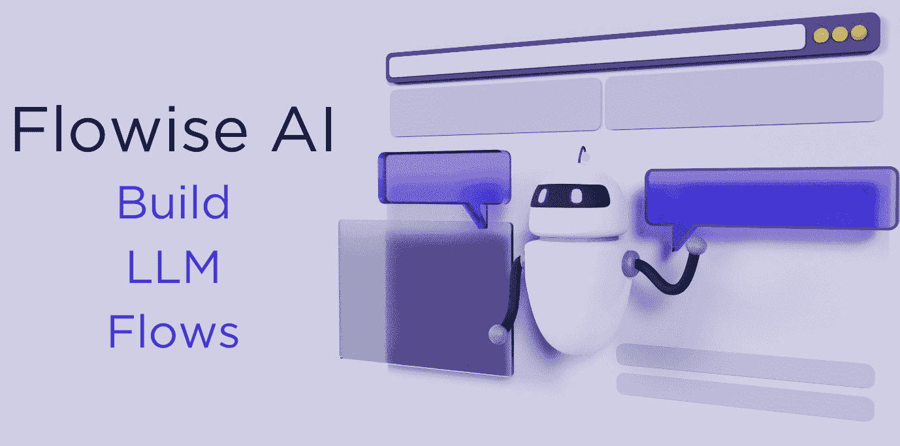
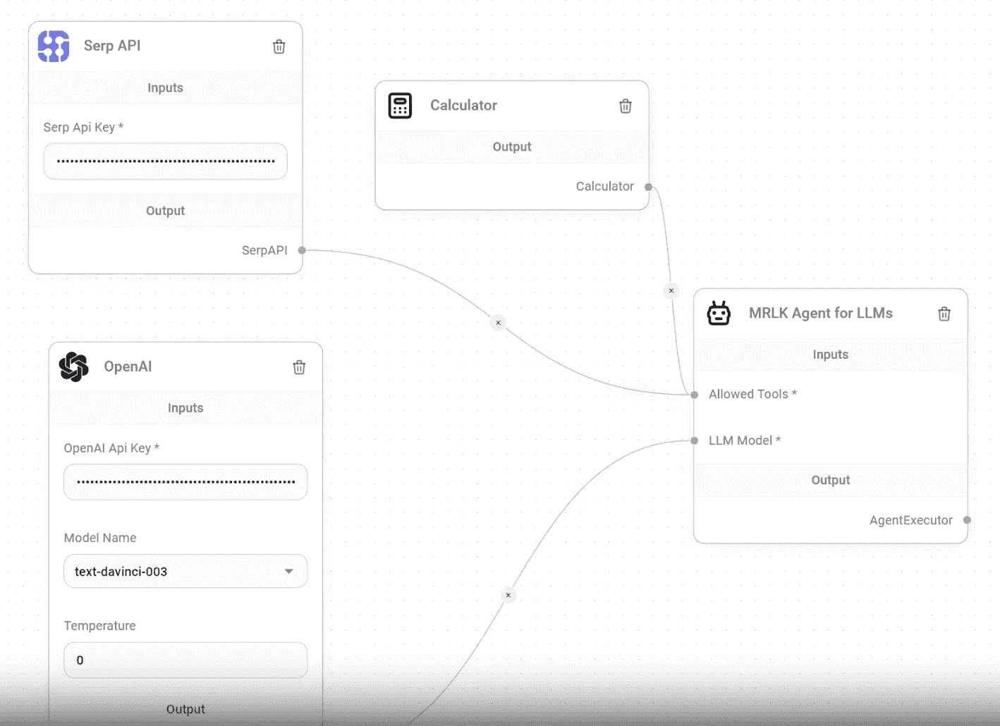

# 构建 LLM 流程的拖放 UI：Flowise AI

> 原文：[`www.kdnuggets.com/2023/07/draganddrop-ui-building-llm-flows-flowise-ai.html`](https://www.kdnuggets.com/2023/07/draganddrop-ui-building-llm-flows-flowise-ai.html)



图片由作者提供

关于大语言模型（LLMs）的热度不断上升，越来越多的公司推出工具以便于人们的生活。那么这些工具到底是什么呢？其中之一就是 Flowise AI。

* * *

## 我们的前三名课程推荐

 1\. [谷歌网络安全证书](https://www.kdnuggets.com/google-cybersecurity) - 快速进入网络安全职业轨道。

 2\. [谷歌数据分析专业证书](https://www.kdnuggets.com/google-data-analytics) - 提升你的数据分析技能

 3\. [谷歌 IT 支持专业证书](https://www.kdnuggets.com/google-itsupport) - 支持你的组织 IT

* * *

# Flowise AI 是什么？

[Flowise AI](https://flowiseai.com/)是一个开源的 UI 可视化工具，用于帮助开发 LangChain 应用。在我们深入了解 Flowise AI 之前，让我们快速定义一下 LangChain。LangChain 是一个框架/ python 库，帮助你利用 LLMs 构建自己的定制 NLP 应用。

Flowise 使用 LangChain 作为其代理执行器，Chroma 作为其向量存储，OpenAI 进行嵌入，HuggingFace 的推理模型，GitHub 作为文档加载器，SERP 作为查询 API。其图形用户界面对基于 LangChain.js 的 LLM 应用构建非常有帮助。

那么是什么让它如此简单和有用呢？拖放工具。每个人都喜欢拖放，尤其是在自定义 NLP 应用时。更大的优点是它不需要任何编码经验！



图片由[Flowise AI](https://flowiseai.com/)提供

# 我可以用 Flowise AI 构建什么？

你可以使用 Flowise AI 构建多个应用，例如：

+   聊天机器人

+   虚拟助手

+   数据分析工具

+   教育工具

+   游戏

+   艺术

# 我为什么要使用 Flowise AI？

+   **简洁：** 拖放工具使构建自己的 LLM 流程变得容易。

+   **无需编码技能：** 对于行业新人和没有开发人员的组织，这一点非常有用。

+   **开源：** 免费使用和修改，允许根据自己的需求进行调整。

+   **强大：** 该工具可以用于开发广泛的 LLM 应用。

+   **社区：** Flowise 由一个支持性的开发社区支持，可以帮助你充分利用 Flowise。

# Flowise AI 安装

那么，我如何安装这个简单的拖放可定制 NLP 工具呢？你可以通过三种不同的方式安装 Flowise AI。让我们逐一介绍。

## 快速安装

1.  首先，你需要下载并安装 [NodeJS](https://nodejs.org/en/download) >= 18.15.0。

1.  完成后，你需要安装 Flowise

```py
npm install -g flowise
```

1.  下一步是启动 Flowise

```py
npx flowise start
```

你需要输入用户名和密码：

```py
npx flowise start --FLOWISE_USERNAME=user --FLOWISE_PASSWORD=1234
```

1.  完成后，你可以通过打开以下网址在网页上查看：

[`localhost:3000`](http://localhost:3000/)

如果你更愿意使用 Docker，请继续以下部分。

## Docker

### Docker Compose

1.  首先，你需要进入项目根目录下的 docker 文件夹

1.  然后你需要创建 .env 文件并指定 PORT（参见 .env.example）

1.  然后你需要执行：docker-compose up -d

1.  然后你需要打开 [`localhost:3000`](http://localhost:3000/)

1.  你可以通过 docker-compose stop 停止容器

### Docker 镜像

1.  首先，你需要在本地构建镜像：

```py
docker build --no-cache -t flowise .
```

1.  然后你需要运行镜像：

```py
docker run -d --name flowise -p 3000:3000 flowise
```

1.  要停止镜像，你需要：

```py
docker stop flowise
```

## 开发人员的本地设置

1.  首先，你需要通过以下方式安装 [Yarn v1](https://classic.yarnpkg.com/en/docs/install)：

```py
npm i -g yarn
```

1.  然后你需要克隆该仓库：

```py
git clone https://github.com/FlowiseAI/Flowise.git
```

1.  进入仓库文件夹：

```py
cd Flowise
```

1.  确保安装所有模型的所有依赖项：

```py
yarn install
```

1.  然后你需要构建所有代码：

```py
yarn build
```

1.  然后你可以启动应用程序：

```py
yarn start
```

1.  你可以在以下位置访问应用程序：

[`localhost:3000`](http://localhost:3000/)

1.  对于开发构建，请使用：

```py
yarn dev
```

# 总结

所以，如果你是刚刚进入技术行业的新手，没有编码经验，或者你的组织缺乏开发人员 - Flowise AI 是你最佳的选择。如果有任何当前或以前的 Flowise 用户在阅读这篇文章，请在评论中告诉我们你的经验！

**[Nisha Arya](https://www.linkedin.com/in/nisha-arya-ahmed/)** 是一位数据科学家、自由技术写作者以及 KDnuggets 的社区经理。她特别关注提供数据科学职业建议或教程，以及与数据科学相关的理论知识。她还希望探索人工智能如何或能如何有益于人类寿命的不同方式。作为一个热衷学习者，她寻求拓宽自己的技术知识和写作技能，同时帮助指导他人。

### 了解更多相关话题

+   [Web LLM：将 LLM 聊天机器人带到浏览器](https://www.kdnuggets.com/2023/05/webllm-bring-llm-chatbots-browser.html)

+   [构建 LLM 应用程序时需要了解的 5 件事](https://www.kdnuggets.com/2023/08/5-things-need-know-building-llm-applications.html)

+   [初学者指南：使用 Python 构建 LLM 应用程序](https://www.kdnuggets.com/beginners-guide-to-building-llm-apps-with-python)

+   [使用 LM Studio 在本地运行 LLM](https://www.kdnuggets.com/run-an-llm-locally-with-lm-studio)

+   [Falcon LLM：开源 LLM 新霸主](https://www.kdnuggets.com/2023/06/falcon-llm-new-king-llms.html)

+   [认识 Gorilla：加州大学伯克利分校和微软的 API 增强型 LLM…](https://www.kdnuggets.com/2023/06/meet-gorilla-uc-berkeley-microsoft-apiaugmented-llm-outperforms-gpt4-chatgpt-claude.html)
