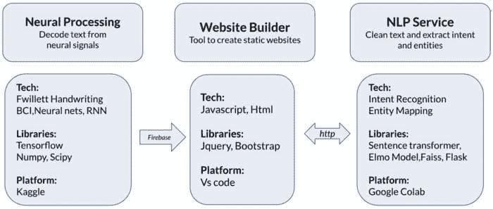
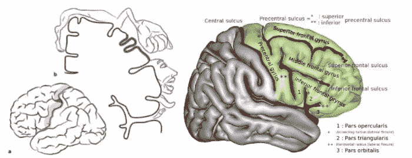
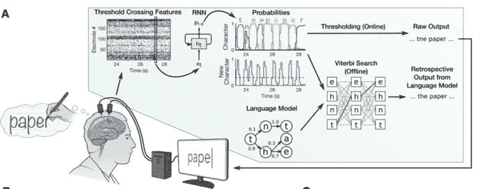

# 梦想成真：通过思考构建网站

> 原文：[`www.kdnuggets.com/2021/11/dream-come-true-allennlp-hacks-21.html`](https://www.kdnuggets.com/2021/11/dream-come-true-allennlp-hacks-21.html)

评论

**由 [Sreeram Ajay](https://twitter.com/ajay_sreeram)、[Anjali Agarwal](https://www.linkedin.com/in/anjaliagarwal8/) 和 [Vatsala Nema](https://twitter.com/NemaVatsala)**

脑-机接口已成为一种最有前途的技术之一，用于帮助那些因中风、脊髓损伤、瘫痪或 ALS 而失去运动控制的人进行交流和执行之前无法实现的动作。利用这项技术，他们现在可以仅通过想象用自己的手书写来打字、行走和抓取物体。借助这项技术，我们在这里展示了我们的神经网站，这是我们作为 AllenNLP Hacks 2021 的一部分进行展示的。在这个项目中，我们使用了 BCI 和 NLP 技术，使失去运动控制的人可以仅通过想象编写指令来创建网站。

该项目有三个组成部分，

1.  解码想象中的手写文字

1.  自然语言处理

1.  网站构建器

让我们进一步深入了解每个部分，以理解该项目。

### 解码想象中的手写文字

项目的第一部分包括将与手写相关的神经信号实时转换为文本。斯坦福大学的研究人员通过使用植入有皮层阵列电极的参与者左半球（主导）中央前回手“旋钮”区域记录的神经信号实现了这一点。

来源：[1][中风变色龙表现为不同的放射状神经病：专业知识可以加快诊断](https://www.researchgate.net/publication/321733691/figure/fig2/AS:570551548604417@1513041497679/Cortical-representation-of-hand-motor-function-in-the-hand-knob-area-Lateral-view-of.png)

[2][维基百科](https://en.wikipedia.org/wiki/Precentral_gyrus)

在对神经信号进行预处理后，使用多单元阈值交叉率（神经信号每秒交叉某一阈值的次数平均值）作为神经特征。这些神经特征被输入到递归神经网络模型中，该模型将神经时间序列信号转换为概率时间序列。这些概率反过来告诉我们新字符的开始和后续字符的可能性（如下图所示）。在在线模式下，原始输出在其概率越过阈值时给出每个字符。在离线模式下，字符概率与大词汇量语言模型结合，以解码最可能的句子。

来源：[`www.nature.com/articles/s41586-021-03506-2`](https://www.nature.com/articles/s41586-021-03506-2)

这个 BCI 通信系统的打字速度为每分钟 90 个字符，比之前使用光标移动的打字记录更快。在在线模式下，单词错误率为 5.4%，而在离线模式下使用语言模型则将单词错误率降低至 3.4%。

由于缺乏收集原始数据以构建网站的资源，我们创建了合成神经信号数据，可用于展示我们的项目。（与原始研究中用于数据增强的技术相同。）

### 自然语言处理

在从神经信号中获取解码文本后，我们使用自然语言处理技术清理和处理文本，以解读参与者在网站上的指令。我们使用类似于语音识别中的自动更正技术来清理解码文本，如使用二元模型获取候选句子，以及使用语言模型对输出进行重新评分。为了从清理后的文本中提取相关信息，我们使用了 NLP 技术。这项技术将参与者所写文本中的意图和实体分类。

### 意图识别

为了找到意图，即用户想要采取的行动，我们首先定义了一组已知的意图，这些意图可以用于在新句子中搜索相似的意图。我们使用 BERT 模型将这些原始文本示例转换为句子嵌入，以获得每个示例句子的向量表示。对于新句子，我们使用相同的训练模型来获取相应的嵌入。为了找到与输入文本最相似的句子，我们使用了 FAISS（Facebook AI 相似度搜索）库的 IndexFlatIP 算法，该算法使用向量之间的内积来查找它们的相似性。

### 实体映射

在获取意图后，我们需要在句子中找到实体或槽位。实体可以是字段、数据或文本描述（在我们的案例中，它是 HTML 元素）。我们使用了 ELMo 模型来获取上下文词嵌入。上下文词嵌入包含有关单个词及其在句子中使用的上下文意义的信息。例如，在句子“我把手机放在房间的左侧”中，词语“左”根据在句子中的出现情况可以有不同的含义。

我们还定义了一些需要在句子中查找的实体，如图像实体、位置实体等。句子中的各种实体使用相似度搜索算法进行解码。模型还给出了解码实体的值。我们使用了 BIO（开始-内部-外部）标记法（一种常见的标记格式）来获取多词实体。

例如，对于新句子“将背景更改为池塘附近的大象”，模型将输出如下结果，

意图：更改

实体：背景图像

值：池塘附近的大象

### 网站构建器

我们终于进入了项目的最终阶段，在收集并处理了用户提供的所有相关信息后，我们可以构建主网站。

现在提取的意图和实体用于更新用户界面。意图代表要采取的行动（添加、删除、更改、增加）。实体代表元素（标题、图片、边框）和属性（大小、颜色、样式、位置、图片描述）。例如，网站构建器将从图像搜索 API（在这种情况下为 pixabay API）中搜索大象的图像，并将最顶级的结果添加为当前视图的背景图像。如果用户不喜欢，他们可以输入下一张图像/更改图像等。然后背景将被第二个顶级结果替换。用户可以继续使用更多此类命令，如下一节/添加幻灯片，继续添加内容以增强和自定义页面以符合自己的喜好。最后，他们可以保存、托管并以链接形式分享他们的作品。

以下是使用该工具时的用户视图示例：

我们计划进一步扩展我们的项目到：

+   解读自然思维，并与更自然的语言接口连接，构建更好、更强大的设计和开发工具。

+   连接到物联网，主要是语音助手如 Alexa。

+   利用像 DALL.E 这样的语言模型，通过文本描述生成用于编辑网站的更具体的图像（从文本创建图像）。

通过这个项目，我们希望帮助面临困境的不同能力人士（如 ALS、中风等），让他们能够创建自己的网站、演示文稿或任何展示技能、活动或市场创业项目所需的内容。

你可以在这里查看我们项目的演示和介绍：

[Neural Website - AllenNLP Hacks 2021 - YouTube](https://www.youtube.com/watch?v=UsyiS9gooNo)。

### 参考文献

+   Willett, F.R., Avansino, D.T., Hochberg, L.R.等人。通过手写实现高性能脑对文本通信。自然 593, 249–254 (2021)。 [`doi.org/10.1038/s41586-021-03506-2`](https://doi.org/10.1038/s41586-021-03506-2)

+   Reimers, Nils 和 Iryna Gurevych。“Sentence-BERT: Sentence Embeddings using Siamese BERT-Networks。” ArXiv abs/1908.10084 (2019): n. Pag.

+   Peters, Matthew E., Mark Neumann, Mohit Iyyer, Matt Gardner, Christopher Clark, Kenton Lee, 和 Luke Zettlemoyer。“深度上下文化词表示。” NAACL (2018)。

— **Ajay Sreeram, Anjali Agarwal & Vatsala Nema**

梦想成真团队

**[Sreeram Ajay](https://twitter.com/ajay_sreeram)** 在 Target 担任高级 NLP 工程师。

**[Anjali Agarwal](https://www.linkedin.com/in/anjaliagarwal8/)** 在 Tata 研究、开发和设计中心担任研究员。

**[Vatsala Nema](https://twitter.com/NemaVatsala)** 是印度科学教育与研究学院 Bhopal 的 EECS 三年级学生。

**相关：**

+   介绍 Brain Simulator II：一个新的 AGI 实验平台

+   模拟一个脑神经元需要多少 AI 神经元？

+   为有志的数据科学家提供的黑客马拉松指南

* * *

## 我们的前三个课程推荐

 1\. [Google 网络安全证书](https://www.kdnuggets.com/google-cybersecurity) - 快速进入网络安全职业的快车道

 2\. [Google 数据分析专业证书](https://www.kdnuggets.com/google-data-analytics) - 提升你的数据分析技能

 3\. [Google IT 支持专业证书](https://www.kdnuggets.com/google-itsupport) - 支持你组织的 IT

* * *

### 更多相关内容

+   [从虚构到现实：ChatGPT 与真正人工智能的科幻梦想…](https://www.kdnuggets.com/from-fiction-to-reality-chatgpt-and-the-sci-fi-dream-of-true-ai-conversation)

+   [获取数据科学项目的 10 个绝佳数据网站](https://www.kdnuggets.com/2023/04/10-websites-get-amazing-data-data-science-projects.html)

+   [无需编码轻松抓取网站上的图片](https://www.kdnuggets.com/2022/06/octoparse-scrape-images-easily-websites-nocoding-way.html)

+   [数据来自哪里？](https://www.kdnuggets.com/2022/08/data-come.html)

+   [学术界是否过于执着于方法论而忽视真正的洞见？](https://www.kdnuggets.com/is-academia-obsessing-over-methodology-at-the-cost-of-true-insights)

+   [提示工程：一个综合梦想](https://www.kdnuggets.com/prompt-engineering-an-integrated-dream)
