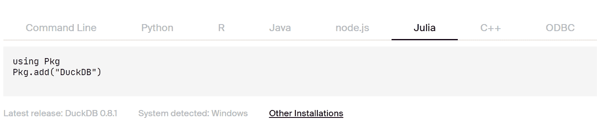

# 为什么 DuckDB 越来越受欢迎？

> 原文：[`www.kdnuggets.com/2023/07/duckdb-getting-popular.html`](https://www.kdnuggets.com/2023/07/duckdb-getting-popular.html)


作者提供的图片

# 什么是 DuckDB？

* * *

## 我们的前三大课程推荐

 1\. [Google 网络安全证书](https://www.kdnuggets.com/google-cybersecurity) - 快速进入网络安全职业生涯。

 2\. [Google 数据分析专业证书](https://www.kdnuggets.com/google-data-analytics) - 提升你的数据分析技能

 3\. [Google IT 支持专业证书](https://www.kdnuggets.com/google-itsupport) - 支持你的组织 IT

* * *

[DuckDB](https://duckdb.org/) 是一个免费的开源嵌入式数据库管理系统，旨在用于数据分析和在线分析处理。这意味着几个方面：

1.  它是免费的开源软件，所以任何人都可以使用和修改代码。

1.  它是嵌入式的，这意味着 DBMS（数据库管理系统）与使用它的应用程序在同一个进程中运行。这使得它快速且易于使用。

1.  它针对数据分析和在线分析处理（OLAP）进行了优化，而不仅仅是像典型数据库那样的事务数据。这意味着数据按列而非按行组织，以优化聚合和分析。

1.  它支持标准 SQL，因此你可以对数据执行查询、聚合、连接和其他 SQL 函数。

1.  它在进程内运行，在应用程序内部，而不是作为单独的进程运行。这消除了进程间通信的开销。

1.  像 SQLite 一样，它是一个简单的基于文件的数据库，因此不需要单独安装服务器。你只需在应用程序中包含该库即可。

总之，DuckDB 提供了一种易于使用的嵌入式分析数据库，适用于需要快速和简单数据分析能力的应用程序。它填补了分析处理中的一个利基市场，在这种情况下，完整的数据库服务器会显得过于庞大。

# 为什么 DuckDB 越来越受欢迎？

现在有许多公司在 DuckDB 上构建产品。这是因为数据库被设计用于快速分析查询，这意味着它优化了聚合、连接和对大型数据集的复杂查询 - 这些查询通常用于分析和报告。此外：

1.  安装、部署和使用都很简单。无需配置服务器 - DuckDB 嵌入在你的应用程序中。这使得它易于集成到不同的编程语言和环境中。

1.  尽管其简单，但 DuckDB 具有丰富的功能集。它支持完整的 SQL 标准、事务、辅助索引，并且与流行的数据分析编程语言如 Python 和 R 的集成良好。

1.  DuckDB 对任何人免费使用和修改，这降低了开发人员和数据分析师采用它的门槛。

1.  DuckDB 已经过充分测试且稳定。它具有广泛的测试套件，并在各种平台上进行持续集成和测试以确保稳定性。

1.  DuckDB 提供了与专业 OLAP 数据库相媲美的性能，同时更易于部署。这使其适用于对小到中型数据集以及大型企业数据集的分析查询。

简而言之，DuckDB 将 SQLite 的简单性和易用性与专业列式数据库的分析性能结合起来。这些因素——性能、简单性、功能和开源许可证——共同促成了 DuckDB 在开发人员和数据分析师中日益增长的受欢迎程度。

# DuckDB Python 示例

让我们使用 Python API 测试 DuckDB 的一些功能。

你可以使用 Pypi 安装 DuckDB：

```py
pip install duckdb
```

对于其他编程语言，请查看 DuckDB 的 [安装指南](https://duckdb.org/#Installation:~:text=of%20the%20hassle.-,Installation,-Choose%20your%20environment)。



在这个示例中，我们将使用 [2023 年数据科学薪资](https://www.kaggle.com/datasets/arnabchaki/data-science-salaries-2023) Kaggle 上的 CSV 数据集，并尝试测试 DuckDB 的各种功能。

# 关系 API

你可以像使用 pandas 一样将 [CSV](https://duckdb.org/docs/data/csv/overview) 文件加载到关系中。DuckDB 提供了一种关系 API，允许用户将查询操作链接在一起。这些查询是延迟计算的，这使得 DuckDB 能够优化它们的执行。

我们已经加载了数据科学薪资数据集并显示了别名。

```py
import duckdb
rel = duckdb.read_csv('ds_salaries.csv')
rel.alias
```

```py
'ds_salaries.csv'
```

要显示列名，我们将使用 `.columns`，类似于 pandas。

```py
rel.columns
```

```py
['work_year',
 'experience_level',
 'employment_type',
 'job_title',
 'salary',
 'salary_currency',
 'salary_in_usd',
 'employee_residence',
 'remote_ratio',
 'company_location',
 'company_size']
```

你可以对关系应用多个函数以获得特定结果。在我们的案例中，我们筛选了“work_year”，仅显示了三列，并按薪资排序并限制显示底部五个职位标题。

通过遵循 [指南](https://duckdb.org/docs/api/python/relational_api) 了解更多关于关系 API 的信息。

```py
rel.filter("work_year > 2021").project(
    "work_year,job_title,salary_in_usd"
).order("salary_in_usd").limit(5)
```

```py
┌───────────┬─────────────────┬───────────────┐
│ work_year │    job_title    │ salary_in_usd │
│   int64   │     varchar     │     int64     │
├───────────┼─────────────────┼───────────────┤
│      2022 │ NLP Engineer    │          5132 │
│      2022 │ Data Analyst    │          5723 │
│      2022 │ BI Data Analyst │          6270 │
│      2022 │ AI Developer    │          6304 │
│      2022 │ Data Analyst    │          6359 │
└───────────┴─────────────────┴───────────────┘
```

你也可以使用关系 API 连接两个数据集。在我们的案例中，我们通过在“job_title”上更改别名来连接相同的数据集。

```py
rel2 = duckdb.read_csv('ds_salaries.csv')
rel.set_alias('a').join(rel.set_alias('b'), 'job_title').limit(5)
```

```py
┌───────────┬──────────────────┬─────────────────┬───┬──────────────┬──────────────────┬──────────────┐
│ work_year │ experience_level │ employment_type │ ... │ remote_ratio │ company_location │ company_size │
│   int64   │     varchar      │     varchar     │   │    int64     │     varchar      │   varchar    │
├───────────┼──────────────────┼─────────────────┼───┼──────────────┼──────────────────┼──────────────┤
│      2023 │ SE               │ FT              │ ... │          100 │ US               │ L            │
│      2023 │ MI               │ CT              │ ... │          100 │ US               │ S            │
│      2023 │ MI               │ CT              │ ... │          100 │ US               │ S            │
│      2023 │ SE               │ FT              │ ... │          100 │ US               │ S            │
│      2023 │ SE               │ FT              │ ... │          100 │ US               │ S            │
├───────────┴──────────────────┴─────────────────┴───┴──────────────┴──────────────────┴──────────────┤
│ 5 rows                                                                         21 columns (6 shown) │
└─────────────────────────────────────────────────────────────────────────────────────────────────────┘
```

## 直接 SQL 方法

也有直接的方法。你只需编写 SQL 查询来对数据集进行分析。你将写入 CSV 文件的位置和名称，而不是表名。

```py
duckdb.sql('SELECT * FROM "ds_salaries.csv" LIMIT 5')
```

```py
┌───────────┬──────────────────┬─────────────────┬───┬──────────────┬──────────────────┬──────────────┐
│ work_year │ experience_level │ employment_type │ ... │ remote_ratio │ company_location │ company_size │
│   int64   │     varchar      │     varchar     │   │    int64     │     varchar      │   varchar    │
├───────────┼──────────────────┼─────────────────┼───┼──────────────┼──────────────────┼──────────────┤
│      2023 │ SE               │ FT              │ ... │          100 │ ES               │ L            │
│      2023 │ MI               │ CT              │ ... │          100 │ US               │ S            │
│      2023 │ MI               │ CT              │ ... │          100 │ US               │ S            │
│      2023 │ SE               │ FT              │ ... │          100 │ CA               │ M            │
│      2023 │ SE               │ FT              │ ... │          100 │ CA               │ M            │
├───────────┴──────────────────┴─────────────────┴───┴──────────────┴──────────────────┴──────────────┤
│ 5 rows                                                                         11 columns (6 shown) │
└─────────────────────────────────────────────────────────────────────────────────────────────────────┘
```

## 持久存储

默认情况下，DuckDB 在内存数据库上运行。这意味着创建的任何表都存储在内存中，而不是持久化到磁盘。然而，通过使用 `.connect()` 方法，可以连接到磁盘上的持久数据库文件。写入该数据库连接的任何数据将保存到磁盘文件中，并在重新连接到相同文件时重新加载。

1.  我们将使用 `.connect()` 方法创建一个数据库。

1.  运行 SQL 查询以创建一个表。

1.  使用查询添加两个记录。

1.  显示新创建的测试表。

```py
import duckdb

con = duckdb.connect('kdn.db')

con.sql("CREATE TABLE test_table (i INTEGER, j STRING)")
con.sql("INSERT INTO test_table VALUES (1, 'one'),(9,'nine')")
con.table('test_table').show()
```

```py
┌───────┬─────────┐
│   i   │    j    │
│ int32 │ varchar │
├───────┼─────────┤
│     1 │ one     │
│     9 │ nine    │
└───────┴─────────┘
```

我们也可以使用数据科学薪资 CSV 文件来创建新表。

```py
con.sql('CREATE TABLE ds_salaries AS SELECT * FROM "ds_salaries.csv";')
con.table('ds_salaries').limit(5).show()
```

```py
┌───────────┬──────────────────┬─────────────────┬───┬──────────────┬──────────────────┬──────────────┐
│ work_year │ experience_level │ employment_type │ ... │ remote_ratio │ company_location │ company_size │
│   int64   │     varchar      │     varchar     │   │    int64     │     varchar      │   varchar    │
├───────────┼──────────────────┼─────────────────┼───┼──────────────┼──────────────────┼──────────────┤
│      2023 │ SE               │ FT              │ ... │          100 │ ES               │ L            │
│      2023 │ MI               │ CT              │ ... │          100 │ US               │ S            │
│      2023 │ MI               │ CT              │ ... │          100 │ US               │ S            │
│      2023 │ SE               │ FT              │ ... │          100 │ CA               │ M            │
│      2023 │ SE               │ FT              │ ... │          100 │ CA               │ M            │
├───────────┴──────────────────┴─────────────────┴───┴──────────────┴──────────────────┴──────────────┤
│ 5 rows                                                                         11 columns (6 shown) │
└─────────────────────────────────────────────────────────────────────────────────────────────────────┘
```

完成所有任务后，必须关闭与数据库的连接。

```py
con.close()
```

# 结论

为什么我喜欢 DuckDB？它快速且易于学习和管理。我相信简单性是 DuckDB 在数据科学社区广泛使用的主要原因。DuckDB 提供了一个直观的 SQL 接口，数据分析师和科学家很容易上手。安装简便，数据库文件轻巧且易于管理。这些都使 DuckDB 使用起来非常愉快。

查看我之前关于 [使用 DuckDB 的数据科学](https://deepnote.com/@abid/Data-Science-with-DuckDB-f4a2af8f-5128-42b9-a3ea-78f8636a6b92) 的 Deepnote 文章，深入分析功能和使用案例。

DuckDB 提供了强大的数据加载、管理和分析工具，与其他数据库解决方案相比，它是数据科学的一个有吸引力的选择。我相信，随着越来越多的数据专业人士发现其用户友好的特性，DuckDB 将在未来几年继续获得用户。

**[Abid Ali Awan](https://www.polywork.com/kingabzpro)** ([@1abidaliawan](https://twitter.com/1abidaliawan)) 是一位认证的数据科学专业人士，热爱构建机器学习模型。目前，他专注于内容创作和撰写有关机器学习和数据科学技术的技术博客。Abid 拥有技术管理硕士学位和电信工程学士学位。他的愿景是使用图神经网络为那些正在与心理疾病作斗争的学生构建一个 AI 产品。

### 更多相关主题

+   [用 DuckDB 将你的笔记本电脑变成个人分析引擎并…](https://www.kdnuggets.com/turn-your-laptop-into-a-personal-analytics-engine-with-duckdb-and-motherduck)

+   [为什么 TinyML 案例变得越来越受欢迎？](https://www.kdnuggets.com/2022/10/tinyml-cases-becoming-popular.html)

+   [ChatGPT 在学校中的影响及其被禁原因](https://www.kdnuggets.com/2023/06/effects-chatgpt-schools-getting-banned.html)

+   [备受欢迎的 AI 质量免费研讨会](https://www.kdnuggets.com/2022/05/truera-free-workshop-ai-quality-back-popular-demand.html)

+   [哈佛最受欢迎的编程入门课程免费！](https://www.kdnuggets.com/2022/03/popular-intro-programming-course-harvard-free.html)

+   [热门机器学习算法](https://www.kdnuggets.com/2022/05/popular-machine-learning-algorithms.html)
