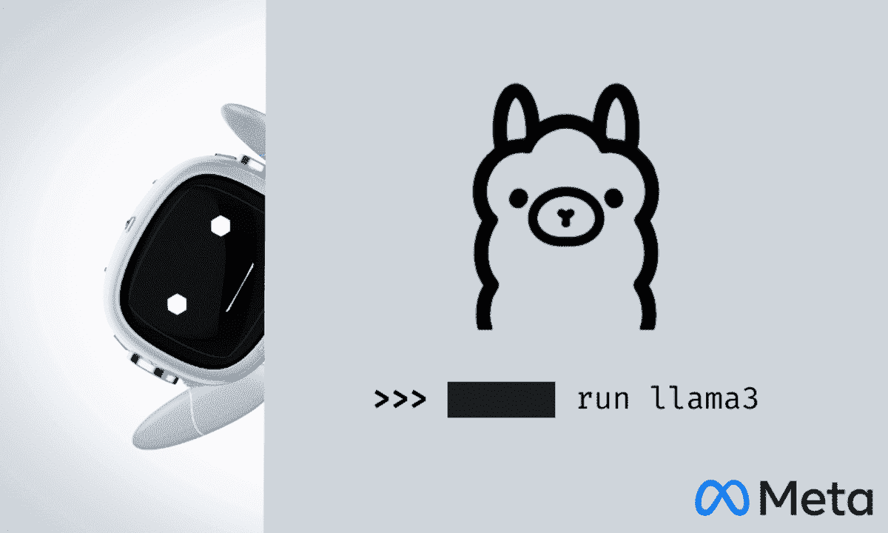
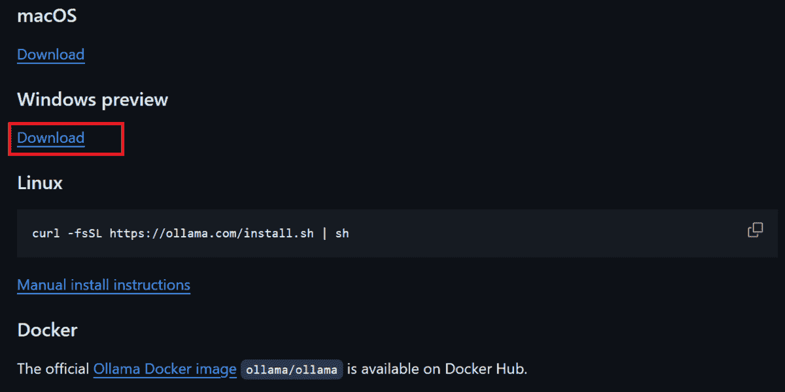
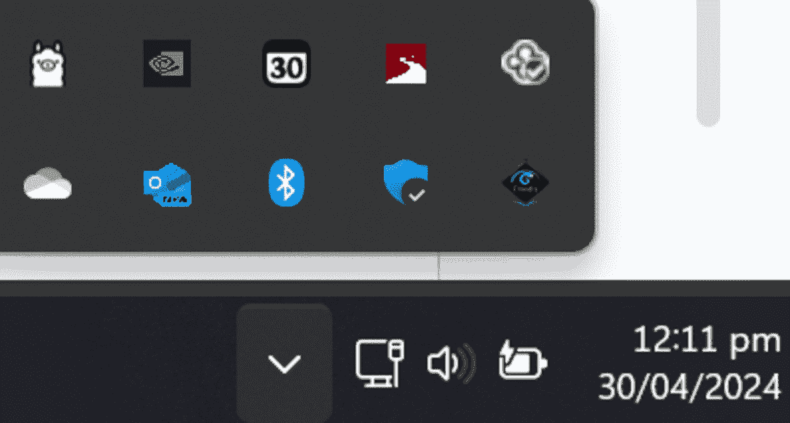
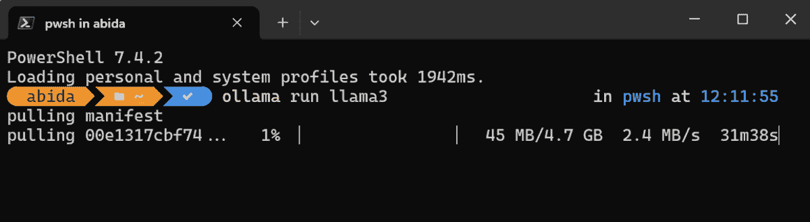
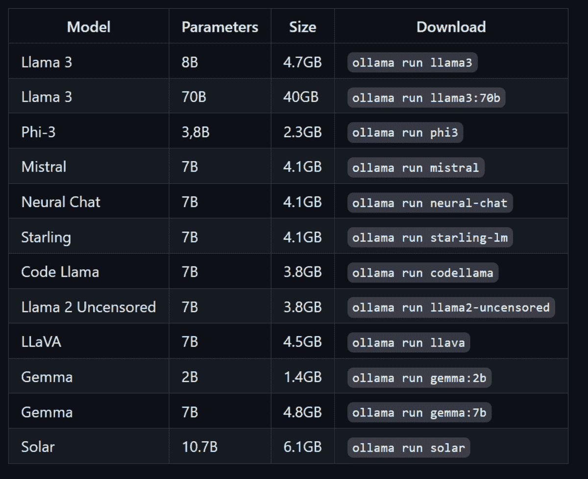
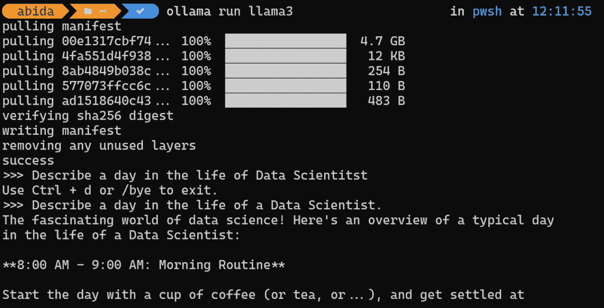
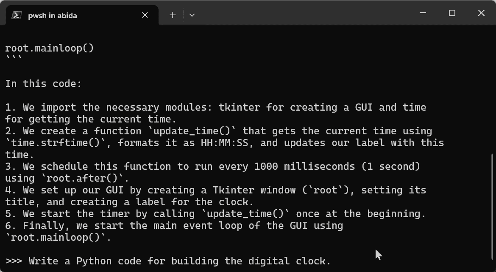

# 在本地运行 Llama 3 的最简单方法

> 原文：[`www.kdnuggets.com/easiest-way-of-running-llama-3-locally`](https://www.kdnuggets.com/easiest-way-of-running-llama-3-locally)



图片来源：作者

在本地运行 LLM（大型语言模型）已变得越来越流行，因为它提供了安全性、隐私性和对模型输出的更多控制。在本教程中，我们将学习下载和使用 Llama 3 模型的最简单方法。

* * *

## 我们的前三个课程推荐

 1\. [Google 网络安全证书](https://www.kdnuggets.com/google-cybersecurity) - 快速进入网络安全职业生涯。

 2\. [Google 数据分析专业证书](https://www.kdnuggets.com/google-data-analytics) - 提升您的数据分析技能

 3\. [Google IT 支持专业证书](https://www.kdnuggets.com/google-itsupport) - 支持您的组织的 IT

* * *

Llama 3 是 Meta AI 最新的 LLM 家族。它是开源的，具有先进的 AI 能力，并且比 Gemma、Gemini 和 Claud 3 改进了响应生成。

## 什么是 Ollama？

[Ollama/ollama](https://github.com/ollama/ollama) 是一个开源工具，用于在本地计算机上使用像 Llama 3 这样的 LLM。通过新的研究和开发，这些大型语言模型不再需要大量的 VRam、计算或存储。相反，它们经过优化，可以在笔记本电脑上使用。

有多种工具和框架可以让您在本地使用 LLM，但 Ollama 是最容易设置和使用的。它允许您直接从终端或 Powershell 使用 LLM。它快速且具有核心功能，使您能够立即开始使用。

Ollama 的最佳部分是它可以与各种软件、扩展和应用程序集成。例如，您可以在 VScode 中使用 CodeGPT 扩展并连接 Ollama，以将 Llama 3 作为您的 AI 代码助手。

## 安装 Ollama

通过访问 GitHub 仓库 [Ollama/ollama](https://github.com/ollama/ollama)，向下滚动并点击适合您操作系统的下载链接来下载和安装 Ollama。



图片来自 [ollama/ollama](https://github.com/ollama/ollama) | 各种操作系统的下载选项

成功安装 Ollama 后，它将在系统托盘中显示如下图所示。



## 下载和使用 Llama 3

要下载 Llama 3 模型并开始使用它，您需要在终端/命令行中输入以下命令。

```py
ollama run llama3
```

根据您的互联网速度，下载 4.7GB 模型大约需要 30 分钟。



除了 Llama 3 模型，你还可以通过输入下面的命令来安装其他 LLMs。



图片来自 [ollama/ollama](https://github.com/ollama/ollama) | 使用 Ollama 运行其他 LLMs

一旦下载完成，你就可以像在线使用一样在本地使用 LLama 3。

**提示：** *“描述数据科学家的一天。”*



为了展示响应生成的速度，我附上了一个 GIF，显示了 Ollama 生成 Python 代码并解释它的过程。

> **注意：** 如果你的笔记本电脑上有 Nvidia GPU 和 CUDA 安装，Ollama 会自动使用 GPU 而不是 CPU 来生成响应。效果提高了 10 倍。

**提示：** *“编写一个构建数字时钟的 Python 代码。”*



你可以通过输入 `/bye` 来退出聊天，然后通过输入 `ollama run llama3` 重新开始。

## 最后的想法

开源框架和模型使 AI 和 LLMs 对每个人都变得可用。与少数公司控制不同，这些本地运行的工具如 Ollama 使任何拥有笔记本电脑的人都能使用 AI。

在本地使用 LLMs 提供了隐私、安全性以及对响应生成的更多控制。此外，你不需要支付任何服务费用。你甚至可以创建自己的 AI 驱动编码助手，并在 VSCode 中使用它。

如果你想了解其他在本地运行 LLMs 的应用程序，那么你应该阅读 在你的笔记本电脑上使用 LLMs 的 5 种方法。

[](https://www.polywork.com/kingabzpro)****[Abid Ali Awan](https://www.polywork.com/kingabzpro)**** ([@1abidaliawan](https://www.linkedin.com/in/1abidaliawan)) 是一位认证的数据科学专业人士，热衷于构建机器学习模型。目前，他专注于内容创作，并撰写关于机器学习和数据科学技术的技术博客。Abid 拥有技术管理硕士学位和电信工程学士学位。他的愿景是使用图神经网络构建一款 AI 产品，帮助那些在精神健康方面挣扎的学生。

### 更多相关内容

+   [在本地运行 LlaMA 2 的简单指南](https://www.kdnuggets.com/a-simple-guide-to-running-llama-2-locally)

+   [用 Pandas 制作美丽交互式可视化的最简单方法](https://www.kdnuggets.com/2021/12/easiest-way-make-beautiful-interactive-visualizations-pandas.html)

+   [Llama、Llama、Llama：与您的内容本地 RAG 的 3 个简单步骤](https://www.kdnuggets.com/3-simple-steps-to-local-rag-with-your-content)

+   [Ollama 教程：让本地运行 LLMs 变得超级简单](https://www.kdnuggets.com/ollama-tutorial-running-llms-locally-made-super-simple)

+   [本地使用 Groq Llama 3 70B：逐步指南](https://www.kdnuggets.com/using-groq-llama-3-70b-locally-step-by-step-guide)

+   [在本地使用 LM Studio 运行 LLM](https://www.kdnuggets.com/run-an-llm-locally-with-lm-studio)
