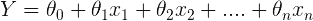
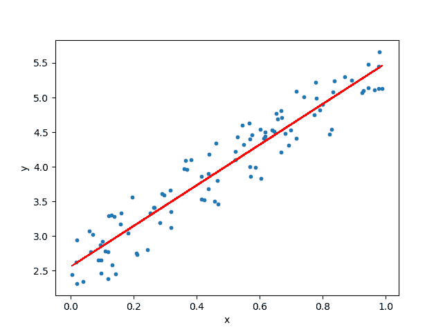
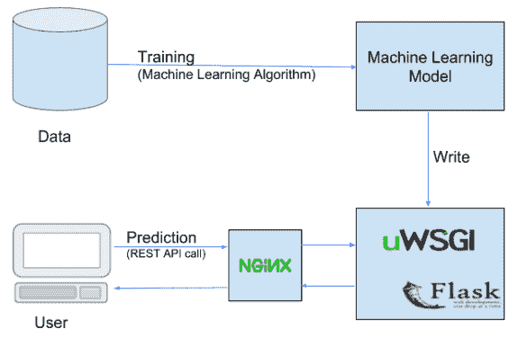
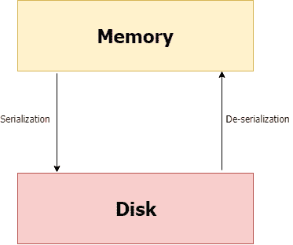
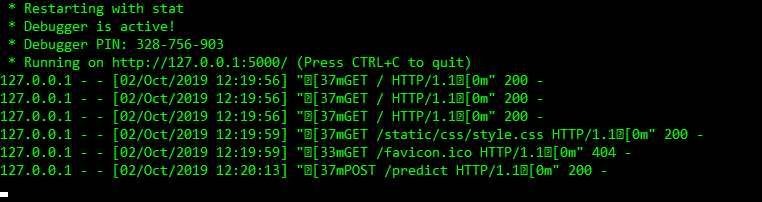
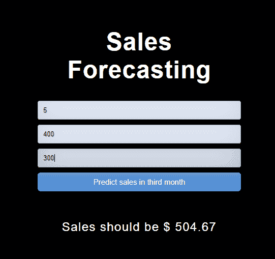

# 如何轻松部署机器学习模型使用 Flask

> 原文：[`www.kdnuggets.com/2019/10/easily-deploy-machine-learning-models-using-flask.html`](https://www.kdnuggets.com/2019/10/easily-deploy-machine-learning-models-using-flask.html)

评论

当数据科学家/机器学习工程师使用 Scikit-Learn、TensorFlow、Keras、PyTorch 等开发机器学习模型时，最终目标是使模型能够投入生产。在机器学习项目中，我们往往会重点关注探索性数据分析（EDA）、特征工程、调整超参数等。然而，我们往往会忘记我们的主要目标，即从模型预测中提取实际价值。

机器学习模型的部署或将模型投入生产意味着使你的模型可供最终用户或系统使用。然而，机器学习模型的部署存在复杂性。本文旨在帮助你开始使用 Flask API 将训练好的机器学习模型投入生产。

* * *

## 我们的三大推荐课程

 1\. [谷歌网络安全证书](https://www.kdnuggets.com/google-cybersecurity) - 快速进入网络安全职业生涯。

 2\. [谷歌数据分析专业证书](https://www.kdnuggets.com/google-data-analytics) - 提升你的数据分析技能

 3\. [谷歌 IT 支持专业证书](https://www.kdnuggets.com/google-itsupport) - 支持你的组织 IT

* * *

我将使用线性回归根据利率和前两个月的销售额预测第三个月的销售额。

### 什么是线性回归

线性回归模型的目标是找到一个或多个特征（自变量）与连续目标变量（因变量）之间的关系。当只有一个特征时称为*单变量*线性回归，当有多个特征时称为*多元*线性回归。

### 线性回归假设

线性回归模型可以用以下方程表示



+   *Y* 是预测值

+   *θ*₀ 是偏置项。

+   *θ*₁，…，*θ*ₙ 是模型参数

+   *x*₁，*x*₂，…，*x*ₙ 是特征值。



线性回归示意图

### 为什么选择 Flask？

+   易于使用。

+   内置开发服务器和调试器。

+   集成单元测试支持。

+   RESTful 请求调度。

+   有详尽的文档。

### 项目结构

本项目有四个部分：

1.  model.py — 其中包含用于预测第三个月销售额的机器学习模型代码，基于前两个月的销售额。

1.  app.py — 这包含 Flask API，通过 GUI 或 API 调用接收销售细节，基于我们的模型计算预测值并返回。

1.  request.py — 这使用 requests 模块调用在 app.py 中定义的 API，并显示返回的值。

1.  HTML/CSS — 这包含了 HTML 模板和 CSS 样式，以允许用户输入销售细节并在第三个月显示预测销售额。



机器学习模型的部署管道

### 环境和工具

1.  scikit-learn

1.  pandas

1.  numpy

1.  flask

### 代码在哪里？

不多说，让我们开始代码吧。完整的项目可以在[这里](https://github.com/abhinavsagar/Machine-Learning-Deployment-Tutorials)找到。

让我们开始使用 HTML 制作前端，以便用户输入值。用户需要填写三个字段——利率、第一月销售额和第二月销售额。

接下来，我使用 CSS 对输入按钮、登录按钮和背景进行了样式调整。

我为这个项目创建了一个自定义销售数据集，包含四列——利率、第一月销售额、第二月销售额和第三月销售额。

现在让我们制作一个机器学习模型来预测第三个月的销售额。首先，使用 Pandas 处理缺失值。当没有提供一个或多个项目的信息时，会出现缺失数据。我用零填充利率列，如果未提供第一月的销售额，则用该列的均值填充。我使用了线性回归作为机器学习算法。

### 序列化/反序列化

简单来说，序列化是一种将 python 对象写入磁盘的方法，可以传输到任何地方，后来由 python 脚本反序列化（读取）回来。



序列化，反序列化

我将模型从 python 对象的形式转换为字符流，使用 pickle。这个字符流包含了重建对象所需的所有信息，可以在另一个 python 脚本中进行重建。

下一步是创建一个 API，该 API 通过 GUI 接收销售细节，并根据我们的模型计算预测的销售值。为此，我将 pickle 模型反序列化为 python 对象。我使用`index.html`设置了主页。在使用 POST 请求提交表单值到`/predict`时，我们得到预测的销售值。

结果可以通过向`/results`发出另一个 POST 请求来显示。它接收 JSON 输入，使用训练好的模型进行预测，并以 JSON 格式返回该预测，可以通过 API 端点访问。

最后，我使用 requests 模块调用`app.py`中定义的 API。它显示第三个月返回的销售值。

### 结果

使用以下命令运行 Web 应用程序。

```py
$ python app.py
```



在你的网页浏览器中打开 [`127.0.0.1:5000/`](http://127.0.0.1:5000/)，并且应出现如下所示的图形用户界面。



图形用户界面

### 结论

这篇文章展示了一种非常简单的机器学习模型部署方式。我使用线性回归来预测第三个月的销售值，依据是利率和前两个月的销售额。你可以运用在这篇博客中获得的知识，创建一些很酷的模型并将其投入生产，以便让他人欣赏你的工作。

### 参考文献/进一步阅读

**[用 80 行代码编写简单的 Flask Web 应用程序](https://towardsdatascience.com/writing-a-simple-flask-web-application-in-80-lines-cb5c386b089a?source=post_page-----b95af8fe34d4----------------------)**

开始使用 Flask 的示例教程

[**部署机器学习模型 | Coursera**](https://www.coursera.org/learn/deploying-machine-learning-models?source=post_page-----b95af8fe34d4----------------------)

从加州大学圣地亚哥分校学习机器学习模型的部署。在本课程中，我们将学习……

**[**将机器学习模型简单地部署到云端**](https://towardsdatascience.com/simple-way-to-deploy-machine-learning-models-to-cloud-fd58b771fdcf?source=post_page-----b95af8fe34d4----------------------)**

使用简单的技术栈将你的第一个机器学习模型投入生产

[**机器学习模型在生产中部署的不同方法概述 - KDnuggets**](https://www.kdnuggets.com/2019/06/approaches-deploying-machine-learning-production.html?source=post_page-----b95af8fe34d4----------------------)

有不同的方法将模型投入生产，每种方法的优点可能有所不同……

### 离开之前

对应的源代码可以在这里找到。

**[abhinavsagar/机器学习部署教程](https://github.com/abhinavsagar/Machine-Learning-Deployment-Tutorials?source=post_page-----b95af8fe34d4----------------------)**

从数据收集到将模型投入生产的完整示例项目……

### 联系方式

如果你想及时了解我的最新文章和项目，[请在 Medium 上关注我](https://medium.com/@abhinav.sagar)。以下是我的一些联系信息：

+   [个人网站](https://abhinavsagar.github.io/)

+   [Linkedin](https://in.linkedin.com/in/abhinavsagar4)

+   [Medium 个人主页](https://medium.com/@abhinav.sagar)

+   [GitHub](https://github.com/abhinavsagar)

+   [Kaggle](https://www.kaggle.com/abhinavsagar)

**简历：[Abhinav Sagar](https://www.linkedin.com/in/abhinavsagar4)** 是 VIT Vellore 的大四本科生。他对数据科学、机器学习及其在现实世界问题中的应用感兴趣。

[原文](https://towardsdatascience.com/how-to-easily-deploy-machine-learning-models-using-flask-b95af8fe34d4)。经许可转载。

**相关：**

+   构建一个 Flask API 来自动提取命名实体，使用 SpaCy

+   将您的 PyTorch 模型部署到生产环境

+   为有志数据科学家准备的黑客马拉松指南

### 更多相关话题

+   [以无编码方式轻松从网站抓取图片](https://www.kdnuggets.com/2022/06/octoparse-scrape-images-easily-websites-nocoding-way.html)

+   [在您的笔记本电脑上轻松探索 LLMs，使用 openplayground](https://www.kdnuggets.com/2023/04/explore-llms-easily-laptop-openplayground.html)

+   [轻松将 LLMs 集成到您的 Scikit-learn 工作流中，使用 Scikit-LLM](https://www.kdnuggets.com/easily-integrate-llms-into-your-scikit-learn-workflow-with-scikit-llm)

+   [调查：机器学习项目仍然经常无法部署](https://www.kdnuggets.com/survey-machine-learning-projects-still-routinely-fail-to-deploy)

+   [使用 Heroku 部署机器学习 Web 应用程序](https://www.kdnuggets.com/2022/04/deploy-machine-learning-web-app-heroku.html)

+   [如何成功部署数据科学项目](https://www.kdnuggets.com/2022/01/successfully-deploy-data-science-projects.html)
