# Python 数据预处理简易指南

> 原文：[`www.kdnuggets.com/2020/07/easy-guide-data-preprocessing-python.html`](https://www.kdnuggets.com/2020/07/easy-guide-data-preprocessing-python.html)


[图片来源于 rawpixel.com](https://www.freepik.com/free-photo/businesswoman-networking-using-digital-devices_15440982.htm#query=data&from_query=Data%20Preprocessing&position=0&from_view=search&track=sph) 在 Freepik 上

> 机器学习中 80%是数据预处理，20%是模型制作。

* * *

## 我们的前三个课程推荐

 1\. [谷歌网络安全证书](https://www.kdnuggets.com/google-cybersecurity) - 快速进入网络安全职业生涯。

 2\. [谷歌数据分析专业证书](https://www.kdnuggets.com/google-data-analytics) - 提升你的数据分析技能

 3\. [谷歌 IT 支持专业证书](https://www.kdnuggets.com/google-itsupport) - 支持你的组织的 IT

* * *

如果你曾遇到过高级 Kaggle 数据科学家或机器学习工程师，你一定听过这个说法。事实上，这句话是正确的。在真实的数据科学项目中，数据预处理是最重要的工作之一，它也是模型成功的共同因素之一。也就是说，如果数据预处理和特征工程做得正确，该模型更可能产生显著更好的结果，而相比之下，数据没有经过良好预处理的模型效果会较差。

# 重要步骤

数据预处理有 4 个主要的关键步骤。

+   数据集的训练和验证集拆分

+   处理缺失值

+   处理分类特征

+   数据集的归一化

让我们来看看这些要点。

# 1\. 训练测试拆分

训练测试拆分是机器学习中一个重要的步骤。这一点非常重要，因为你的模型需要在部署之前进行评估。而这种评估需要在未见过的数据上进行，因为一旦部署，所有接收到的数据都是未见过的。

训练测试拆分的主要思想是将原始数据集转换为两个部分

+   train

+   test

其中训练集包括训练数据和训练标签，而测试集包括测试数据和测试标签。

最简单的方法是使用*scikit-learn*，它有一个内置函数*train_test_split*。让我们编写代码。

```py
from sklearn.model_selection import train_test_split

X_train, X_test, y_train, y_test = train_test_split(X, y, test_size = 0.2)
```

在这里，我们传入了*X*和*y*作为*train_test_split*中的参数，这样会将*X*和*y*拆分为 20%的测试数据和 80%的训练数据，并成功分配到*X_train*、*X_test*、*y_train*和*y_test*中。

# 2\. 处理缺失值

有一个著名的机器学习说法，你可能听过，那就是

> 垃圾进，垃圾出

如果你的数据集中充满了 NaN 和垃圾值，那么你的模型表现也肯定会很差。因此，处理这些缺失值非常重要。我们可以用一个示例数据集来看一下如何解决这个垃圾值问题。你可以在[这里](https://docs.google.com/spreadsheets/d/1I6IQUtp_x4ZAjY8q3VdiTiTrd-w0p8zGvCn-FD_Ae70/edit?usp=sharing)获取该数据集。

让我们查看数据集中的缺失值。

```py
df.isna().sum()
```

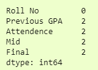

在这里，我们可以看到 4 列中有 2 个缺失值。一种填补缺失值的方法是用该列的均值来填补，即该列的平均值。例如，我们可以用*Final*列中所有学生的平均值来填补缺失值。

为此，我们可以使用**SimpleImputer**来自**sklearn.impute**。

```py
from sklearn.impute import SimpleImputer

imputer = SimpleImputer(fill_value=np.nan, startegy='mean')
X = imputer.fit_transform(df)
```

这将使用*mean*填补数据框*df*中的所有缺失值。我们使用*fit_transform*函数来做到这一点。

因为它返回的是一个 numpy 数组，我们可以将其转换回数据框以读取。

```py
X = pd.DataFrame(X, columns=df.columns)
print(X)
```

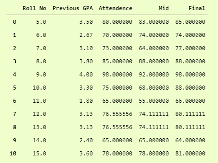

现在，我们可以看到我们已经用所有值的均值填补了所有缺失值。

我们可以通过以下方法确认

```py
X.isna().sum()
```

输出结果为

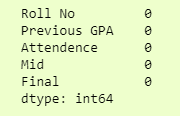

我们可以在**SimpleImputer**中使用*mean*、*median*、*mode*等。

如果我们有缺失值的行数较少，或者我们的数据不建议填补缺失值，那么我们可以使用*pandas*中的*dropna*来删除缺失行。

```py
dropedDf = df.dropna()
```

在这里，我们删除了数据框中的所有空行，并将其存储到另一个数据框中。

现在我们已经删除了所有的空行，所以行数为 0。我们可以确认这一点为

```py
dropedD.isna().sum()
```


# 3\. 处理分类特征

我们可以通过将分类特征转换为整数来处理它们。有两种常见的方法来实现。

1.  标签编码

1.  一键编码

在**标签编码器**中，我们可以将分类值转换为数值标签。假设这是我们的数据集

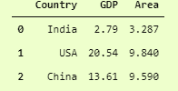

使用标签编码器处理 Country 列将把印度转换为 1，美国转换为 2，中国转换为 0。这种技术有一个缺点，它由于标签值高而将美国优先级最高，将中国标签为 0，因此中国优先级最低，但它在很多情况下仍然非常有用。

让我们开始编码吧。

```py
from sklearn.preprocessing import LabelEncoder

l1 = LabelEncoder()
l1.fit(catDf['Country'])
catDf.Country = l1.transform(catDf.Country)
print(catDf)
```

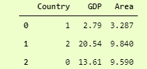

标签编码器后的输出

在这里，我们实例化了一个 LabelEncoder 对象，然后使用*fit*方法将其拟合到我们的分类列上，接着使用*transform*方法进行应用。

请注意，它不是 *inplace* 的，因此为了使更改永久生效，我们必须将值返回到我们的分类列中，即，

```py
catDf['Country'] = l1.transform(catDf['Country'])
```

在 **OneHotEncoder** 中，我们为每个唯一的分类值创建一列，如果实际数据框中存在该值，则该列的值为 1，否则为 0。

让我们看一下相同的示例，但稍作修改。我们将添加另一列分类数据，即“Continent”，它包含了相应国家的大陆名称。我们可以通过

```py
catDf['Continent'] = ['Asia', 'North America', 'Asia']
```

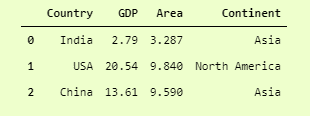

现在由于我们有 2 个分类列，即 *[['Country', 'Continent']] *，我们可以对它们进行 one-hot 编码。

有两种方法可以做到这一点。

## 1\. DataFrame.get_dummies

这是一种相当常见的方法，我们使用 pandas 内置的 *get_dummies* 函数将数据框中的分类值转换为 one-hot 向量。

让我们开始吧。

```py
pd.get_dummies(data=catDf)
```

这将 **返回** 一个数据框，所有的分类值都以 one-hot 向量格式编码。

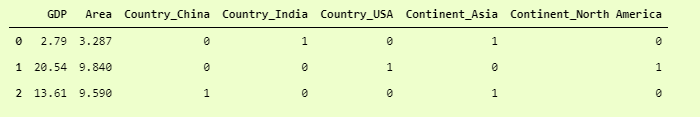

在这里我们可以看到，它将 Country 列的唯一值转换为 3 列，分别是 Country_China、Country_India 和 Country_USA。类似地，Continent 列的 2 个唯一值已被转换为 2 列，分别命名为 Continent_Asia 和 Continent_North America。

因为它不是就地操作的，我们必须将其存储在数据框中，即，

```py
catDf = pd.get_dummies(data=catDf)
```

## 2\. OneHotEncoder

使用 Sci-Kit Learning 的 OneHotEncoder 也是一种常见的做法。它提供了更多的灵活性和选项，但使用起来有点复杂。让我们看看如何在我们的数据集上实现它。

```py
from sklearn.preprocessing import OneHotEncoder

oh = OneHotEncoder()
s1 = pd.DataFrame(oh.fit_transform(catDf.iloc[:, [0,3]]))
pd.concat([catDf, s1], axis=1)
```

在这里，我们初始化了 OneHotEncoder 对象，并在数据框中对我们所需的列（列号 0 和列号 3）使用了它的 *fit_transform* 方法。

*fit_transform* 的返回类型是 *numpy.ndarray*，因此我们将其转换为数据框 *pd.DataFrame* 并存储在一个变量中。然后，为了将其加入到原始数据框中，我们可以使用 *pd.concat* 函数，它用于连接两个不同的数据框。我们使用了 *axis=1*，这意味着它将基于列而不是行进行连接。

另外，请记住 *pd.concat* 不是 *inplace* 的，因此我们必须将返回的数据框存储在某个地方。

```py
catDf = pd.concat([catDf, s1], axis=1)
```

得到的 dataframe 是


OneHotEncoded DataFrame

你可以看到，与 *pd.get_dummies* 相比，它的可读性不那么清晰，但如果你比较最后 5 列，我们使用 *pd.get_dummies* 和 *OneHotEncoder* 得到的结果，它们是相等的。

当然，你可以根据自己的需要在 *OneHotEncoder* 中修改列名，你可以通过 [这个](https://stackoverflow.com/questions/54570947/feature-names-from-onehotencoder) 问题在 [StackOverflow](http://www.stackoverflow.com/) 上学习如何操作。

# 4\. 数据集归一化

这将我们带到了数据预处理的最后部分，即数据集的标准化。通过某些实验已证明，机器学习和深度学习模型在标准化数据集上的表现远远优于未标准化的数据集。

标准化的目标是将值更改为统一的尺度，而不扭曲值范围之间的差异。

有几种方法可以实现。我将讨论两种常见的标准化数据集的方法。

## 标准化器

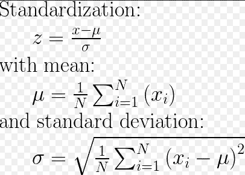

参考: [`stackoverflow.com/a/50879522/10342778`](https://stackoverflow.com/a/50879522/10342778)

使用这种技术，我们的数据集将具有均值 0 和标准差 1。我们可以通过结合 numpy 中的不同函数来实现这一点，即，

```py
z = (x.values - np.mean(x.values)) / np.std(x.values)
```

其中 *x* 是一个包含所有数值索引的数据框。如果我们希望保留数据框中的值，那么我们可以简单地去掉 *.values*。

**StandardScaler 之前的方差**

```py
catDf.var(ddof=0)

```

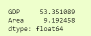

StandardScaler 之前的方差。

这里，我使用了*ddof=0*，默认情况下在*pandas.DataFrame.var()*中为 1，而在*numpy.ndarray.var()*中为 0。Ddof 表示自由度的增量，计算中使用的除数是*N - ddof*，其中*N*表示元素的数量。

*ddof=0* 为正态分布变量提供了方差的最大似然估计。

你可以在[这里](https://stackoverflow.com/questions/62938495/difference-between-numpy-var-and-pandas-var)阅读更多关于*ddof=0*的内容。

## StandardScaler 后的方差

另一种好的方法是使用来自*sklearn.preprocessing*的**StandardScaler**。让我们先看代码，然后再查看方差。

```py
from sklearn.preprocessing import StandardScaler

ss = StandardScaler()
catDf.iloc[:,1:-1] = ss.fit_transform(catDf.iloc[:,1:-1])
print(catDf)
```

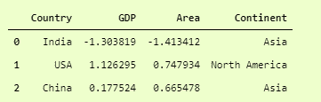

StandardScaler 后的 catDf。

在这里，我们对所有数值列（从第 1 列到最后一列（不包括））应用了*StandardScaler*，现在你可以看到*GDP*和*Area*的值。

现在我们可以通过 *方差* 来检查数据集的变异性

```py
catDf.var(ddof=0)
```

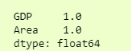

StandardScaler 后的方差

我们可以看到方差从 80 和 13 大幅降低到 1。在现实世界的数据集中，通常改善从几千降到 1。

## 标准化

根据*[sklearn 官方文档](https://scikit-learn.org/stable/modules/preprocessing.html#normalization)*，标准化是“将个体样本缩放到单位范数的过程。如果你计划使用二次形式如点积或其他内核来量化任何样本对的相似性，这个过程可能会有用。”

使用它的过程非常简单，类似于 StandardScaler。

```py
from sklearn.preprocessing import Normalizer

norm = Normalizer()
catDf.iloc[:,1:-1] = norm.fit_transform(catDf.iloc[:,1:-1])
catDf
```

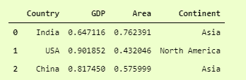

使用归一化器后的 catDf

还有几种其他的数据归一化方法，它们在特定情况下都非常有用。你可以在官方文档中了解更多信息，[点击这里](https://scikit-learn.org/stable/modules/preprocessing.html#normalization)。

# 学习成果

+   划分数据集

+   填充缺失值

+   处理分类数据

+   数据集的归一化以提高结果

希望这些技巧能提升你作为数据科学家或机器学习工程师的一般技能，并改进你的机器学习模型。

**[Ahmad Anis](https://twitter.com/AhmadMustafaAn1)** 对机器学习、深度学习和计算机视觉感兴趣。目前在 Redbuffer 担任初级机器学习工程师。

### 更多相关话题

+   [选择合适的机器学习算法的简易指南](https://www.kdnuggets.com/2020/05/guide-choose-right-machine-learning-algorithm.html)

+   [OpenAI API 初学者指南：简单易懂的入门指南](https://www.kdnuggets.com/openai-api-for-beginners-your-easy-to-follow-starter-guide)

+   [通过这本免费电子书学习数据清理和预处理，助力数据科学](https://www.kdnuggets.com/2023/08/learn-data-cleaning-preprocessing-data-science-free-ebook.html)

+   [掌握数据清理和预处理技术的 7 个步骤](https://www.kdnuggets.com/2023/08/7-steps-mastering-data-cleaning-preprocessing-techniques.html)

+   [利用 ChatGPT 进行自动数据清理和预处理](https://www.kdnuggets.com/2023/08/harnessing-chatgpt-automated-data-cleaning-preprocessing.html)

+   [在 Pandas 中清理和预处理文本数据，用于 NLP 任务](https://www.kdnuggets.com/cleaning-and-preprocessing-text-data-in-pandas-for-nlp-tasks)
