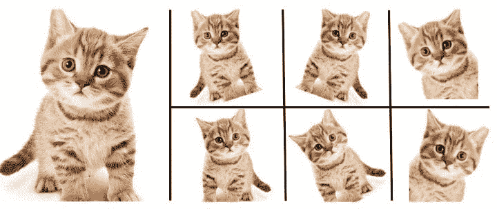

# 使用 TensorFlow 进行简单的图像数据集增强

> 原文：[`www.kdnuggets.com/2020/02/easy-image-dataset-augmentation-tensorflow.html`](https://www.kdnuggets.com/2020/02/easy-image-dataset-augmentation-tensorflow.html)

评论

图片来源：[Nanonets](https://nanonets.com/blog/data-augmentation-how-to-use-deep-learning-when-you-have-limited-data-part-2/)

* * *

## 我们的前三大课程推荐

 1\. [Google 网络安全证书](https://www.kdnuggets.com/google-cybersecurity) - 快速开启网络安全职业生涯

 2\. [Google 数据分析专业证书](https://www.kdnuggets.com/google-data-analytics) - 提升你的数据分析技能

 3\. [Google IT 支持专业证书](https://www.kdnuggets.com/google-itsupport) - 支持组织的 IT 工作

* * *

图像分类的成功，至少在很大程度上，取决于大量可用的训练数据。暂且不谈诸如过拟合等问题，训练数据越多，你建立一个有效模型的机会就越大。

但当我们没有大量训练数据时，我们该怎么办？对于这个特定问题，立刻想到的几种广泛方法是迁移学习和数据增强。

**迁移学习** 是将现有机器学习模型应用于原本不打算用于这些场景的过程。这种利用可以节省训练时间，并扩展现有机器学习模型的实用性，这些模型可能在大数据集上经过了长时间的训练。如果我们在大数据集上训练一个模型，然后可以将结果调整为在我们较小的数据集上有效。至少，这就是我们的想法。

**数据增强** 是在不需要手动收集任何新数据的情况下，增加现有训练数据集的大小和多样性。这些增强的数据是通过对现有数据执行一系列预处理转换来获取的，这些转换可以包括水平和垂直翻转、倾斜、裁剪、旋转等，尤其是在图像数据的情况下。总的来说，这些增强的数据能够模拟各种微妙不同的数据点，而不仅仅是重复相同的数据。这些“附加”图像的微小差异应该足够帮助训练出一个更强大的模型。再说一次，这就是我们的想法。

本文重点介绍了在 TensorFlow 中解决图像训练数据量不足问题的第二种方法——数据增强的实际实施，而迁移学习的类似实际处理将在稍后时间进行。

### 图像增强的帮助

由于卷积神经网络学习图像特征，我们希望确保这些特征以各种方向出现，以便经过训练的模型能够识别出人的腿在图像中可以呈现为垂直或水平。例如。数据增强除了增加原始数据点的数量外，还能通过使用图像旋转等变换来帮助我们。另一个例子，我们还可以使用水平翻转来帮助模型训练，以识别猫是否直立或被倒置拍摄。

数据增强不是万能药；我们不应该期望它解决所有的小数据问题，但在许多情况下它可能是有效的，并且通过将其作为全面模型训练方法的一部分进行扩展，比如与转移学习等其他数据集扩展技术一起使用。

### TensorFlow 中的图像增强

在 TensorFlow 中，数据增强是通过[ImageDataGenerator](https://www.tensorflow.org/api_docs/python/tf/keras/preprocessing/image/ImageDataGenerator)类完成的。这非常简单易懂。每个周期都会循环整个数据集，并根据所选选项和数值对数据集中的图像进行变换。这些变换是在内存中执行的，因此不需要额外的存储（尽管可以使用`save_to_dir`参数将增强图像保存到磁盘，如果需要的话）。

如果你在使用 TensorFlow，你可能已经在使用`ImageDataGenerator`仅用于缩放现有图像，而没有进行额外的数据增强。这可能如下所示：

```py` ``` train_datagen = ImageDataGenerator(rescale=1./255) ```py ````

一个更新的`ImageDataGenerator`，其执行数据增强，可能如下所示：

```py` ``` train_datagen = ImageDataGenerator(        rotation_range=20,        width_shift_range=0.2,        height_shift_range=0.2,        shear_range=0.2,        zoom_range=0.2,        horizontal_flip=True,        vertical_flip=True,        fill_mode='nearest') ```py ````

这都意味着什么？

+   `**rotation_range**` - 随机旋转的度数范围；在上述示例中为 20 度

+   `**width_shift_range**` - 总宽度的比例（如果值<1，如此处所示），用于随机水平平移图像；在上述示例中为 0.2

+   `**height_shift_range**` - 总高度的比例（如果值<1，如此处所示），用于随机垂直平移图像；在上述示例中为 0.2

+   `**shear_range**` - 用于剪切变换的逆时针剪切角度，单位为度；在上述示例中为 0.2

+   `**zoom_range**` - 随机缩放的范围；在上述示例中为 0.2

+   `**horizontal_flip**` - 随机水平翻转图像的布尔值；在上述示例中为 True

+   `**vertical_flip**` - 随机垂直翻转图像的布尔值；在上述示例中为 True

+   `**fill_mode**` - 输入边界外的点根据“constant”，“nearest”，“reflect”或“wrap”填充；在上述示例中为 nearest

然后，你可以指定训练（以及可选的验证，如果你创建了一个验证生成器）数据的位置，例如，使用`ImageDataGenerator`的`flow_from_directory`选项，然后在训练过程中使用`fit_generator`训练模型，将这些增强的图像流入你的网络。以下是一个这样的代码示例：

```py` ``` train_generator = train_datagen.flow_from_directory(          'data/train',          target_size=(150, 150),          batch_size=32,          class_mode='binary')    # 假设模型已定义...    history = model.fit_generator(        train_generator,        steps_per_epoch=100,        epochs=100,        verbose=2) ```py ````

这就是全部内容。TensorFlow 中轻松图像数据集增强的简介。

**相关**:

+   高级特征工程和预处理的 4 个技巧

+   最新 Scikit-learn 版本中的 5 个伟大新功能

+   使用非最大抑制算法的行人检测

### 更多相关内容

+   [IT 人员扩展：AI 如何改变软件开发行业](https://www.kdnuggets.com/2023/05/staff-augmentation-ai-changing-software-development-industry.html)

+   [TensorFlow 用于计算机视觉 - 转移学习简化版](https://www.kdnuggets.com/2022/01/tensorflow-computer-vision-transfer-learning-made-easy.html)

+   [使用 Tensorflow 训练图像分类模型的指南](https://www.kdnuggets.com/2022/12/guide-train-image-classification-model-tensorflow.html)

+   [如何从巨大的数据集中正确选择样本进行机器学习](https://www.kdnuggets.com/2019/05/sample-huge-dataset-machine-learning.html)

+   [为你的数据集选择正确的聚类算法](https://www.kdnuggets.com/2019/10/right-clustering-algorithm.html)

+   [如何创建机器学习数据集](https://www.kdnuggets.com/2022/02/create-dataset-machine-learning.html)
