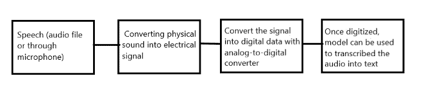
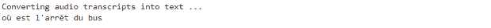

# 使用 Python 进行简单的语音转文本

> 原文：[`www.kdnuggets.com/2020/06/easy-speech-text-python.html`](https://www.kdnuggets.com/2020/06/easy-speech-text-python.html)

评论

**作者：[Dhilip Subramanian](https://medium.com/@sdhilip)，数据科学家和 AI 爱好者**


来源：[信息时代](https://www.information-age.com/think-you-speak-voice-recognition-replacing-password-123461752/)

* * *

## 我们的前三大课程推荐

 1\. [谷歌网络安全证书](https://www.kdnuggets.com/google-cybersecurity) - 快速进入网络安全职业的快车道。

 2\. [谷歌数据分析专业证书](https://www.kdnuggets.com/google-data-analytics) - 提升你的数据分析技能

 3\. [谷歌 IT 支持专业证书](https://www.kdnuggets.com/google-itsupport) - 支持你的组织 IT 需求

* * *

语音是最常见的交流方式，世界上大多数人依赖语音进行沟通。语音识别系统基本上将口语语言翻译成文本。现实生活中有许多语音识别系统的例子。例如，苹果的 SIRI 能够识别语音并将其转换为文本。

### 语音识别是如何工作的？



语音识别过程

隐马尔可夫模型（HMM）和深度神经网络模型用于将音频转换为文本。详细的过程超出了本博客的范围。在本博客中，我展示了如何使用 Python 将语音转换为文本。这可以通过“***Speech Recognition***” API 和 “***PyAudio***” 库来完成。

语音识别 API 支持多个 API，在本博客中我使用了谷歌语音识别 API。更多详情，请查看[这里](https://pypi.org/project/SpeechRecognition/)。它有助于将语音转换为文本。

### Python 库

```py
!pip install SpeechRecognition
```

### 将音频文件转换为文本

**步骤：**

1.  导入语音识别库

1.  初始化识别器类以识别语音。我们正在使用谷歌语音识别。

1.  语音识别支持的音频文件格式：*wav, AIFF, AIFF-C, FLAC*。在这个例子中我使用了‘*wav*’文件

1.  我使用了《*特工绍特*》电影音频片段，内容为*“我不知道你是谁，我不知道你想要什么。如果你在寻找赎金，我可以告诉你，我没有钱”*

1.  默认情况下，谷歌识别器读取英语。它支持不同的语言，更多细节请查看[文档](https://cloud.google.com/speech-to-text/docs/languages)。

### 代码

```py
#import library
import speech_recognition as sr

# Initialize recognizer class (for recognizing the speech)
r = sr.Recognizer()

# Reading Audio file as source
# listening the audio file and store in audio_text variable

with sr.AudioFile('I-dont-know.wav') as source:

    audio_text = r.listen(source)

# recoginize_() method will throw a request error if the API is unreachable, hence using exception handling
    try:

        # using google speech recognition
        text = r.recognize_google(audio_text)
        print('Converting audio transcripts into text ...')
        print(text)

    except:
         print('Sorry.. run again...')
```

**输出**


### 那么如何转换不同的音频语言呢？

例如，如果我们要读取法语音频文件，则需要在 recogonize_google 中添加语言选项。其余代码保持不变。请参阅更多[文档](https://cloud.google.com/speech-to-text/docs/languages)

```py
#Adding french langauge option
text = r.recognize_google(audio_text, language = "fr-FR")
```

**输出**



### 麦克风语音转文本

**步骤:**

1.  我们需要安装 PyAudio 库，它用于通过麦克风和扬声器接收音频输入和输出。基本上，它帮助我们通过麦克风获取声音。

```py
!pip install PyAudio
```

1.  我们需要使用 Microphone 类，而不是音频文件源。其余步骤相同。

### 代码

```py
#import library

import speech_recognition as sr

# Initialize recognizer class (for recognizing the speech)

r = sr.Recognizer()

# Reading Microphone as source
# listening the speech and store in audio_text variable

with sr.Microphone() as source:
    print("Talk")
    audio_text = r.listen(source)
    print("Time over, thanks")
# recoginize_() method will throw a request error if the API is unreachable, hence using exception handling

    try:
        # using google speech recognition
        print("Text: "+r.recognize_google(audio_text))
    except:
         print("Sorry, I did not get that")
```

我刚刚说了“你好吗？”

**输出**


### 试试说其他语言怎么样？

再次，我们需要在 recognize_google()中添加所需的语言选项。我用泰米尔语（印度语言）说话，并在语言选项中添加“ta-IN”。

```py
# Adding "tamil language"
print(“Text: “+r.recognize_google(audio_text, language = “ta-IN”))
```

我刚刚用泰米尔语说了“你好吗”，它准确地打印了泰米尔语文本。

**输出**


### 注意:

Google 语音识别 API 是一种将语音转换为文本的简单方法，但它需要互联网连接才能操作。

在这篇博客中，我们看到如何使用 Google 语音识别 API 将语音转换为文本。这对于 NLP 项目尤其是处理音频转录数据非常有帮助。如果你有任何补充，请随时留言！

感谢阅读。继续学习，敬请关注更多内容！

**个人简介: [Dhilip Subramanian](https://medium.com/@sdhilip)** 是一名机械工程师，并完成了分析学硕士学位。他在数据相关的多个领域，包括 IT、市场营销、银行、电力和制造业，拥有 9 年的专业经验。他对自然语言处理和机器学习充满热情。他是[SAS 社区](https://communities.sas.com/t5/user/viewprofilepage/user-id/271305)的贡献者，并喜欢在 Medium 平台上撰写关于数据科学各个方面的技术文章。

[原文](https://towardsdatascience.com/easy-speech-to-text-with-python-3df0d973b426)。已获得许可转载。

**相关:**

+   使用 Python 轻松进行语音合成

+   数据科学的五个酷炫 Python 库

+   Docker: 数据科学家的容器化

### 更多相关内容

+   [使用管道编写干净的 Python 代码](https://www.kdnuggets.com/2021/12/write-clean-python-code-pipes.html)

+   [建立一个坚实的数据团队](https://www.kdnuggets.com/2021/12/build-solid-data-team.html)

+   [是什么让 Python 成为初创公司的理想编程语言](https://www.kdnuggets.com/2021/12/makes-python-ideal-programming-language-startups.html)

+   [每位数据科学家都应该知道的三个 R 库（即使你使用 Python）](https://www.kdnuggets.com/2021/12/three-r-libraries-every-data-scientist-know-even-python.html)

+   [停止学习数据科学以寻找目标，并通过寻找目标来…](https://www.kdnuggets.com/2021/12/stop-learning-data-science-find-purpose.html)

+   [成为伟大数据科学家所需的 5 项关键技能](https://www.kdnuggets.com/2021/12/5-key-skills-needed-become-great-data-scientist.html)
