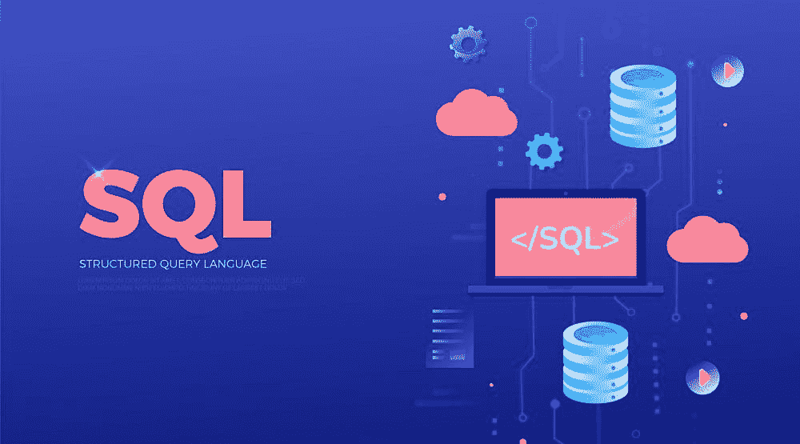

# 如何用原生 Python 编写 SQL

> 原文：[`www.kdnuggets.com/2022/02/easy-sql-native-python.html`](https://www.kdnuggets.com/2022/02/easy-sql-native-python.html)



[技术矢量图由 freepik 创建 - www.freepik.com](https://www.freepik.com/vectors/technology)

你经常编写 SQL 吗？你是否经常从 Python 中调用这些 SQL？能够通过 Python 链接 SQL 数据库并定义、操作和查询它们的想法是否吸引你？

* * *

## 我们的前三大课程推荐

 1\. [Google 网络安全证书](https://www.kdnuggets.com/google-cybersecurity) - 快速进入网络安全职业的快车道。

 2\. [Google 数据分析专业证书](https://www.kdnuggets.com/google-data-analytics) - 提升你的数据分析技能

 3\. [Google IT 支持专业证书](https://www.kdnuggets.com/google-itsupport) - 支持你的组织的 IT 工作

* * *

[SQLModel](https://github.com/tiangolo/sqlmodel) 是一个用于在纯 Python 中与 SQL 数据库交互的 Python 库。它的设计动机包括直观性、易用性、兼容性和健壮性。SQLModel 使用 Python 的 [类型注解](https://docs.python.org/3/library/typing.html)，由 [Pydantic](https://pydantic-docs.helpmanual.io/) 强制和管理，以及 [SQLAlchemy](https://www.sqlalchemy.org/)，即“Python SQL 工具包和对象关系映射器”，用于其 SQL 交互。

这个库是由 [Sebastián Ramírez](https://github.com/tiangolo)，即 [FastAPI](https://fastapi.tiangolo.com/) 的作者编写的，这两个库设计上无缝协作。

SQLModel 的关键特性，直接取自项目的 GitHub 仓库，包含：

> +   **编写直观**：编辑器支持优秀。处处有自动完成。减少调试时间。设计上易于使用和学习。减少阅读文档的时间。
> +   
> +   **易于使用**：它具有合理的默认值，并且在底层做了大量工作，以简化你编写的代码。
> +   
> +   **兼容**：设计上与 FastAPI、Pydantic 和 SQLAlchemy 兼容。
> +   
> +   **可扩展**：你拥有 SQLAlchemy 和 Pydantic 所提供的所有强大功能。
> +   
> +   **简短**：最小化代码重复。一个类型注解可以完成大量工作。不需要在 SQLAlchemy 和 Pydantic 中重复模型。

让我们快速看看 SQLModel 是如何工作的。

### 创建 SQLModel 模型（SQL 表）

想要使用 SQLModel 创建一个表格吗？

这是一个简单的 [示例](https://github.com/tiangolo/sqlmodel#create-a-sqlmodel-model)，来自库的 GitHub 仓库中的代码片段。

```py
from typing import Optional

from sqlmodel import Field, SQLModel

class Hero(SQLModel, table=True):
    id: Optional[int] = Field(default=None, primary_key=True)
    name: str
    secret_name: str
    age: Optional[int] = None
```

在上述代码中，`Hero` 类是一个 SQLModel 对象。SQLModel 对象等同于 SQLModel 库中的 SQL 表。类属性，如 `id` 和 `name`，是表中的列。

### 创建行（表实例）

想要在表中创建一行，也就是一个数据实例？

这是一个来自库的 GitHub 仓库的[示例](https://github.com/tiangolo/sqlmodel#create-rows)，演示了如何操作。请注意，每一行都是上面定义模型的一个实例。

```py
hero_1 = Hero(name="Deadpond", secret_name="Dive Wilson")
hero_2 = Hero(name="Spider-Boy", secret_name="Pedro Parqueador")
hero_3 = Hero(name="Rusty-Man", secret_name="Tommy Sharp", age=48)
```

请注意，仅使用了传统的 Python 代码来创建表并逐行输入数据，无需 SQL 代码作为 Python 对象和后端 SQL 数据库之间的中介。

### 写入 SQL 数据库

请注意，目前尚未将任何表或数据写入现有数据库，可以按如下方式实现。以下完整代码[示例](https://github.com/tiangolo/sqlmodel#write-to-the-database)基于上述代码。

```py
from typing import Optional

from sqlmodel import Field, Session, SQLModel, create_engine

class Hero(SQLModel, table=True):
    id: Optional[int] = Field(default=None, primary_key=True)
    name: str
    secret_name: str
    age: Optional[int] = None

hero_1 = Hero(name="Deadpond", secret_name="Dive Wilson")
hero_2 = Hero(name="Spider-Boy", secret_name="Pedro Parqueador")
hero_3 = Hero(name="Rusty-Man", secret_name="Tommy Sharp", age=48)

engine = create_engine("sqlite:///database.db")

SQLModel.metadata.create_all(engine)

with Session(engine) as session:
    session.add(hero_1)
    session.add(hero_2)
    session.add(hero_3)
    session.commit()
```

上述代码将把一个新表写入现有数据库，并添加 3 个“英雄”条目。

当然，SQLModel 还可以做很多其他事情。有关库可以实现的所有内容及其实现方法，请查看[完整文档](https://sqlmodel.tiangolo.com/)。

[**马修·梅奥**](https://www.linkedin.com/in/mattmayo13/) ([**@mattmayo13**](https://twitter.com/mattmayo13)) 是数据科学家以及 KDnuggets 的主编，这是一个开创性的在线数据科学和机器学习资源。他的兴趣包括自然语言处理、算法设计与优化、无监督学习、神经网络以及机器学习的自动化方法。马修拥有计算机科学硕士学位和数据挖掘研究生文凭。他可以通过 editor1 at kdnuggets[dot]com 联系到。

### 更多相关主题

+   [云原生超级计算](https://www.kdnuggets.com/2022/03/nvidia-cloud-native-super-computing.html)

+   [使用管道编写干净的 Python 代码](https://www.kdnuggets.com/2021/12/write-clean-python-code-pipes.html)

+   [如何编写高效的 Python 代码：初学者教程](https://www.kdnuggets.com/how-to-write-efficient-python-code-a-tutorial-for-beginners)

+   [8 个内置 Python 装饰器，编写优雅代码](https://www.kdnuggets.com/8-built-in-python-decorators-to-write-elegant-code)

+   [开始使用 PyTest：轻松编写和运行 Python 测试](https://www.kdnuggets.com/getting-started-with-pytest-effortlessly-write-and-run-tests-in-python)

+   [Pydon'ts - 编写优雅的 Python 代码：免费书评](https://www.kdnuggets.com/2022/05/pydonts-write-elegant-python-code-free-book-review.html)
