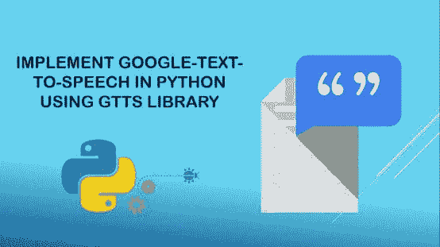
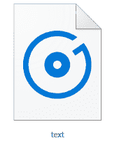
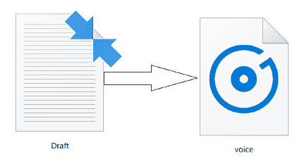

# 使用 Python 进行简单的文本到语音转换

> 原文：[`www.kdnuggets.com/2020/05/easy-text-speech-python.html`](https://www.kdnuggets.com/2020/05/easy-text-speech-python.html)

评论

**作者 [Dhilip Subramanian](https://medium.com/@sdhilip)，数据科学家和 AI 爱好者**


来源：[thenextweb.com](https://thenextweb.com/artificial-intelligence/2018/01/11/ai-learns-how-to-fool-text-to-speech-thats-bad-news-for-voice-assistants/)

文本到语音 (TTS) 技术可以朗读数字文本。它可以将计算机、智能手机、平板电脑上的文字转换为音频。还可以朗读各种文本文件，包括 Word 文档、页面文档、在线网页。TTS 可以帮助那些在阅读上有困难的孩子。许多工具和应用程序可以将文本转换为语音。

Python 附带了许多方便且易于访问的库，本文将探讨如何使用 Python 实现文本到语音的功能。



来源：[`www.youtube.com/watch?v=eiP-12qHM-c`](https://www.youtube.com/watch?v=eiP-12qHM-c)

Python 中提供了不同的 API 以将文本转换为语音。其中一个 API 是 Google 文字转语音，通常称为 gTTS API。该库非常易于使用，它将输入的文本转换为可以保存为 mp3 文件的音频文件。它支持多种语言，并且语音可以以两种可用的音频速度之一传递，即快或慢。更多详情可在 [这里](https://gtts.readthedocs.io/en/latest/module.html) 找到

### 将文本转换为语音

**代码：**

导入 gTTS 库和 “os” 模块以播放转换后的音频

```py
from gtts import gTTS 
import os
```

创建要转换为音频的文本

```py
text = “Global warming is the long-term rise in the average temperature of the Earth’s climate system”
```

gTTS 支持多种语言。请参阅文档 [这里](https://gtts.readthedocs.io/en/latest/module.html)。选择了 ‘en’ -> 英语，并存储在语言变量中

```py
language = ‘en’
```

创建一个名为 speech 的对象，并将文本和语言传递给引擎。标记 slow = False，这告诉模块转换后的音频应具有较高的速度。

```py
speech = gTTS(text = text, lang = language, slow = False)
```

将转换后的音频保存为名为 ‘text.mp3’ 的 mp3 文件

```py
speech.save(“text.mp3”)
```

播放转换后的文件，使用 Windows 命令 ‘start’ 后跟 mp3 文件的名称。

```py
os.system(“start text.mp3”)
```

**输出**



text.mp3 文件

```py
The output of the above program saved as text.mp3 file. Mp3 file should be a voice saying, 'Global warming is the long-term rise in the average temperature of the Earth’s climate system'
```

### 将文本文件转换为语音

在这里，将文本文件转换为语音。读取文本文件并传递给 gTTS 模块

**代码**

导入 gTTS 和 os 库

```py
from gtts import gTTS 
import os
```

读取文本文件并存储到名为 text 的对象中。我的文件名是 “draft.txt”

```py
file = open("draft.txt", "r").read().replace("\n", " ")
```

选择语言为英语

```py
language = ‘en’
```

将文本文件传递给 gTTS 模块并存储到 speech 中

```py
speech = gTTS(text = str(file), lang = language, slow = False)
```

将转换后的音频保存为名为 ‘voice.mp3’ 的 mp3 文件

```py
speech.save("voice.mp3")
```

播放 mp3 文件

```py
os.system("start voice.mp3")
```

**输出**



将 draft.txt 文件转换为 voice.mp3

```py
Draft.txt file saved as a voice.mp3 file.Play the Mp3 file to listen the text presented in the draft.txt file
```

### 注意：

GTTS 是一个简单的文本转语音工具，但它需要互联网连接，因为它完全依赖 Google 来获取音频数据。

感谢阅读。继续学习，敬请关注更多内容！

**简介: [Dhilip Subramanian](https://medium.com/@sdhilip)** 是一位机械工程师，拥有分析学硕士学位。他在 IT、营销、银行、电力和制造等多个数据相关领域拥有 9 年的经验。他对 NLP 和机器学习充满热情。 他是 [SAS 社区](https://communities.sas.com/t5/user/viewprofilepage/user-id/271305)的贡献者，并且喜欢在 Medium 平台上撰写有关数据科学各个方面的技术文章。

[原文](https://towardsdatascience.com/easy-text-to-speech-with-python-bfb34250036e)。经授权转载。

**相关:**

+   五款酷炫的 Python 数据科学库

+   Python 中文本挖掘：步骤和示例

+   2019 深度学习语音合成指南

* * *

## 我们的前三个课程推荐

 1\. [Google 网络安全证书](https://www.kdnuggets.com/google-cybersecurity) - 快速进入网络安全职业生涯。

 2\. [Google 数据分析专业证书](https://www.kdnuggets.com/google-data-analytics) - 提升你的数据分析能力

 3\. [Google IT 支持专业证书](https://www.kdnuggets.com/google-itsupport) - 支持组织的 IT 工作

* * *

### 更多相关内容

+   [用 Python 在 5 分钟内构建语音合成转换器](https://www.kdnuggets.com/2022/09/build-texttospeech-converter-python-5-minutes.html)

+   [语音识别指标的演变](https://www.kdnuggets.com/2022/10/evolution-speech-recognition-metrics.html)

+   [Python 数据预处理简易指南](https://www.kdnuggets.com/2020/07/easy-guide-data-preprocessing-python.html)

+   [用 Python 在 10 个简单步骤中构建 AI 应用](https://www.kdnuggets.com/build-an-ai-application-with-python-in-10-easy-steps)

+   [用 Python 在 7 个简单步骤中构建命令行应用](https://www.kdnuggets.com/build-a-command-line-app-with-python-in-7-easy-steps)

+   [用 Docker 在 5 个简单步骤中容器化 Python 应用](https://www.kdnuggets.com/containerize-python-apps-with-docker-in-5-easy-steps)
