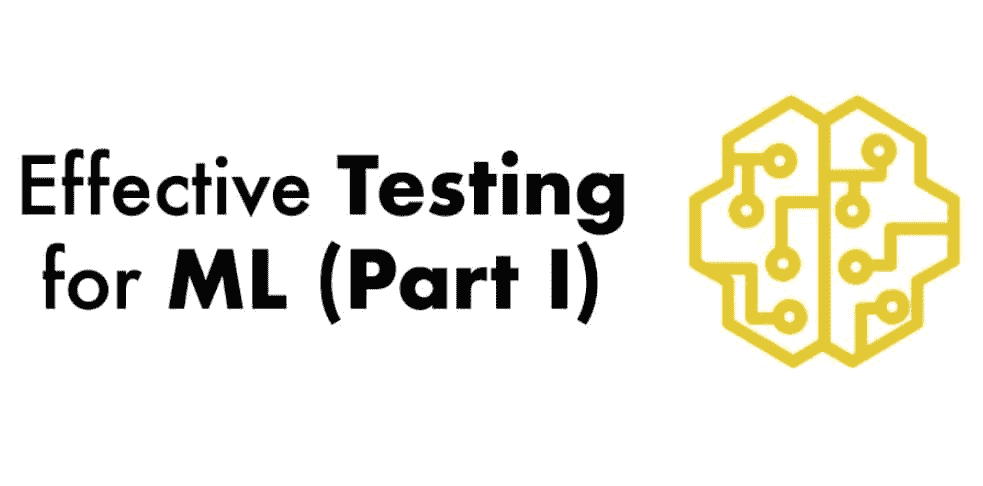
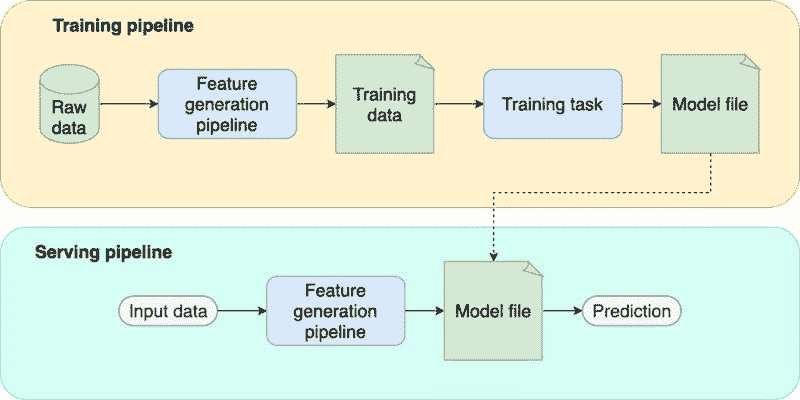
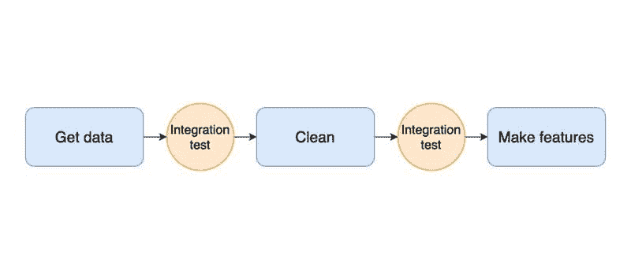

# 机器学习的有效测试

> 原文：[`www.kdnuggets.com/2022/01/effective-testing-machine-learning.html`](https://www.kdnuggets.com/2022/01/effective-testing-machine-learning.html)
> 
> 我们在[PyData Global 2021](https://www.youtube.com/watch?v=Oc5x0qrB0FA)上展示了这个博客系列的简短版本。
> 
> * * *
> 
> ## 我们的前三个课程推荐
> ## 
>  1\. [谷歌网络安全证书](https://www.kdnuggets.com/google-cybersecurity) - 快速进入网络安全职业的捷径。
> 
>  2\. [谷歌数据分析专业证书](https://www.kdnuggets.com/google-data-analytics) - 提升你的数据分析技能
> 
>  3\. [谷歌 IT 支持专业证书](https://www.kdnuggets.com/google-itsupport) - 支持你组织的 IT 需求
> 
> * * *
> 
> [点击这里查看第二部分](https://ploomber.io/blog/ml-testing-ii)，[点击这里查看第三部分](https://ploomber.io/blog/ml-testing-iii)。



本博客系列描述了一种我在过去几年中开发的策略，用于有效测试机器学习项目。鉴于机器学习项目的不确定性，这是一种逐步的策略，你可以随着项目的成熟而采纳；它包括测试示例，以提供这些测试在实践中的清晰概念，并且完整的项目实现[可在 GitHub 上获取](https://github.com/edublancas/ml-testing)。到文章末尾，你将能够开发出更强健的机器学习管道。

### 测试机器学习项目的挑战

测试机器学习项目是具有挑战性的。训练一个模型是一个长时间运行的任务，可能需要数小时，并且具有非确定性的输出，这与我们测试软件所需的快速和确定性过程正好相反。一年前，我发布了一篇关于测试数据密集型项目的[帖子](https://ploomber.io/posts/ci-for-ds/)，以使持续集成成为可能。我后来将这篇博客文章转化为演讲，并在[PyData 2020](https://www.youtube.com/watch?v=zvnjOzvsvXw)上进行了展示。但之前的工作仅涵盖了数据管道测试的通用方面，并没有涉及机器学习模型的测试。

需要明确的是，*测试和监控是两回事*。测试是一个离线过程，允许我们评估代码是否按预期工作（即，生成高质量的模型）。相反，监控涉及检查*已部署*的模型，以确保它正常工作。因此，*测试发生在部署之前；监控发生在部署之后*。

我在本文中使用了*pipeline* 和 *task* 这两个术语。任务是一个工作单元（通常是一个函数或脚本）；例如，一个任务可以是下载原始数据的脚本，另一个任务可以是清理这些数据。另一方面，管道只是按预定义顺序执行的一系列任务。构建由小任务组成的管道的动机是使我们的代码更具可维护性和更易于测试；这与我们[开源框架](https://github.com/ploomber/ploomber)的目标一致，旨在帮助数据科学家使用 Jupyter 构建更具可维护性的项目。在接下来的部分中，你将看到一些示例 Python 代码；我们使用[pytest](https://pytest.org/)、pandas 和[Ploomber](https://github.com/ploomber/ploomber)。

### 机器学习管道的各个部分

在我们描述测试策略之前，让我们分析一个典型的 ML 管道的样子。通过分别分析每个部分，我们可以清楚地阐明其在项目中的作用，并相应地设计测试策略。一个标准的 ML 管道具有以下组件：

1.  **特征生成管道。** 一系列计算，用于处理*原始数据*并将每个数据点映射到特征向量。请注意，我们在训练和服务时都会使用这个组件。

1.  **训练任务。** 接收训练集并生成模型文件。

1.  **模型文件。** 来自训练任务的输出。它是一个包含学习到的参数的单一文件。此外，它可能包括预处理程序，如缩放或独热编码。

1.  **训练管道。** 封装了训练逻辑：获取原始数据，生成特征，并训练模型。

1.  **服务管道。**（也称为推理管道）封装了服务逻辑：获取新观察值，生成特征，通过模型传递特征，并返回预测结果。



### 可能会出什么问题？

为了激励我们的测试策略，让我们列举每个部分可能出现的问题：

### 特征生成管道

1.  无法运行管道（例如，设置问题、代码损坏）。

1.  无法重现之前生成的训练集。

1.  管道生成低质量的训练数据。

### 训练任务

1.  无法训练模型（例如，缺少依赖项、代码损坏）。

1.  使用高质量数据运行训练任务生成低质量模型。

### 模型文件

1.  生成的模型质量低于我们当前生产中的模型。

1.  模型文件与服务管道集成不正确。

### 服务管道

1.  无法提供预测（例如，缺少依赖项、代码损坏）。

1.  训练和服务时的预处理不匹配（即[训练-服务偏差](https://ploomber.io/blog/train-serve-skew/)）。

1.  传入无效原始数据时输出预测。

1.  传入有效数据时崩溃。

请注意，这不是一个详尽的列表，但涵盖了最常见的问题。根据你的使用情况，可能还有其他潜在问题，重要的是列出它们以便定制你的测试策略。

### 测试策略

在开发机器学习模型时，我们迭代的速度越快，成功的机会就越大。与传统的软件工程项目不同（例如，注册表单），机器学习项目存在很多不确定性：使用哪些数据集？尝试哪些特征？使用什么模型？由于我们事先不知道这些问题的答案，我们必须尝试一些实验并评估它们是否产生更好的结果。由于这种不确定性，我们必须在迭代速度和测试质量之间取得平衡。如果我们迭代 *太快*，可能会编写粗糙的代码；如果我们花太多时间彻底测试每一行代码，就无法足够快地改进我们的模型。

这个框架稳步提高你的测试质量。策略包括五个层级；当达到最后一层时，你的测试已经足够健壮，可以自信地将新的模型版本推送到生产环境。

### 测试层级

1.  **冒烟测试。** 我们通过在每次 `git push` 时运行代码来确保其正常工作。

1.  **集成测试和单元测试。** 测试任务的输出和数据转换。

1.  **分布变化和服务管道。** 测试数据分布的变化以及测试我们能否加载模型文件并进行预测。

1.  **训练与服务偏差。** 测试训练和服务逻辑的一致性。

1.  **模型质量。** 测试模型质量。

### 简要介绍如何使用 `pytest` 进行测试

*如果你之前使用过 `pytest`，可以跳过此部分。*

测试是检查我们的代码是否正常工作的短程序。例如：

```py
# test_math.py
from my_math_project import add, subtract

def test_add():
    assert add(1, 1) == 2

def test_subtract():
    assert subtract(43, 1) == 42 
```

测试是一个运行一些代码并 *断言* 其输出的函数。例如，上一个文件有两个测试：`test_add` 和 `test_substract`，组织在一个名为 `test_math.py` 的文件中；通常每个模块一个文件（例如，`test_math.py` 测试 `math.py` 模块中的所有函数）。测试文件通常放在 `tests/` 目录下：

```py
tests/
    test_math.py
    test_stuff.py
    ...
    test_other.py 
```

测试框架如 [pytest](https://pytest.org/) 允许你收集所有测试，执行它们并报告哪些测试失败，哪些测试成功：

```py
# collect rests, run them, and report results
pytest 
```

一个典型的项目结构如下：

```py
src/
exploratory/
tests/ 
```

`src/` 包含你项目的管道任务和其他实用函数。`exploratory/` 包含探索性笔记本，你的测试放在 `tests/` 目录中。`src/` 中的代码必须可以从其他两个目录中导入。实现这一点的最简单方法是 [打包你的项目](https://ploomber.io/posts/packaging/)。否则，你需要处理 `sys.path` 或 `PYTHONPATH`。

### 如何导航示例代码

示例代码可在 [这里](https://github.com/edublancas/ml-testing)找到。该仓库有五个分支，每个分支实现了我将在接下来的部分中描述的测试级别。由于这是一种渐进策略，你可以通过从 [第一个分支](https://github.com/edublancas/ml-testing/tree/1-smoke-testing)开始，逐步查看项目的演变。

该项目使用了 [Ploomber，我们的开源框架](https://github.com/ploomber/ploomber)来实现管道。因此，你可以在`pipeline.yaml`文件中查看管道规格。要查看我们用于测试管道的命令，请打开 [`.github/workflows/ci.yml`](https://github.com/edublancas/ml-testing/blob/1-smoke-testing/.github/workflows/ci.yml)，这是一个 GitHub Actions 配置文件，用于告诉 GitHub 在每次`git push`时运行特定的命令。

虽然不是严格必要的，但你可能会想查看我们的 [Ploomber 入门教程](https://docs.ploomber.io/en/latest/get-started/spec-api-python.html)以了解基本概念。

请注意，本博客文章中显示的代码片段是通用的（它们不使用任何特定的管道框架），因为我们想要用一般术语解释概念；然而，仓库中的示例代码使用了 Ploomber。

### 一级：冒烟测试

**[示例代码可在这里找到。](https://github.com/edublancas/ml-testing/tree/1-smoke-testing)**

冒烟测试是最基本的测试级别，应在你开始项目时立即实施。冒烟测试不会检查代码的输出，只会确保它能够运行。虽然这看起来过于简单，但比完全没有测试要好得多。

### 记录依赖项

列出外部依赖项是启动任何软件项目的第一步，因此在创建你的 [虚拟环境](https://ploomber.io/posts/python-envs/)时，确保记录运行项目所需的所有依赖项。例如，如果使用`pip`，你的`requirements.txt`文件可能如下所示：

```py
ploomber
scikit-learn
pandas 
```

创建虚拟环境后，创建另一个文件（`requirements.lock.txt`）来记录所有依赖项的已安装版本。你可以使用`pip freeze > requirements.lock.txt`命令（在运行`pip install -r requirements.txt`后执行）生成类似如下内容的文件：

```py
ploomber==0.13
scikit-learn==0.24.2
pandas==1.2.4
# more packages required by your dependencies... 
```

记录具体的依赖项版本可以确保这些包的更改不会破坏你的项目。

另一个重要的考虑因素是将你的依赖列表保持尽可能简短。通常，你在开发时需要一组依赖项，但在生产环境中不需要。例如，你可能会使用`matplotlib`进行模型评估图，但在进行预测时不需要它。强烈建议将开发和部署的依赖项分开。依赖项过多的项目增加了遇到版本冲突的风险。

### 测试特性生成管道

你项目的第一个里程碑必须是获得一个端到端的特征生成管道。编写一些代码来获取原始数据，进行一些基本清洗，并生成一些特征。一旦你有了一个完整的端到端流程，你必须确保它是可重复的：删除原始数据，并检查你是否可以重新运行该流程并获得相同的训练数据。

一旦你有了这个，就可以实施第一个测试；用原始数据的一个样本（比如 1%）运行管道。目标是使这个测试运行快速（不超过几分钟）。你的测试应如下所示：

```py
from my_project import generate_features_and_label

def test_generate_training_set():
    my_project.generate_features_and_label(sample=True) 
```

请注意，这只是一个基本测试；我们没有检查管道的输出！然而，这个简单的测试允许我们检查代码是否运行。每当我们执行`git push`时，运行此测试是至关重要的。如果你使用 GitHub，可以通过[GitHub Actions](https://github.com/features/actions)完成，其他 git 平台也有类似功能。

### 测试训练任务

在生成特征后，你会训练一个模型。训练任务接受一个训练集作为输入，并输出一个模型文件。测试模型训练过程具有挑战性，因为我们不能轻易定义给定某些输入（训练集）的期望输出（模型文件）——主要因为我们的训练集变化迅速（即添加、删除特征）。因此，在这个阶段，我们的第一个测试只检查任务是否运行。由于我们暂时忽略输出，我们可以使用数据样本来训练模型；记住，这个冒烟测试必须在每次推送时执行。因此，让我们扩展之前的示例，以涵盖特征生成*和*模型训练：

```py
from my_project import generate_features_and_label, train_model

def test_train_model():
    # test we can generate features
    X, y = my_project.generate_features_and_label(sample=True)
    # test we can train a model
    model = train_model(X, y) 
```

**在示例代码库中，我们使用 Ploomber，因此我们通过调用[`ploomber build`](https://github.com/edublancas/ml-testing/blob/1-smoke-testing/.github/workflows/ci.yml#L20)来测试功能管道和训练任务，这会执行管道中的所有任务。**

### 第二级：集成测试和单元测试

**[示例代码可在此处查看。](https://github.com/edublancas/ml-testing/tree/2-integration-and-unit)**

将管道模块化为小任务，以便我们可以单独测试输出，这一点至关重要。在实现了第二个测试级别后，你将实现两件事：

1.  确保用于训练模型的数据达到最低质量水平。

1.  分别测试代码中行为定义明确的部分。

让我们讨论第一个目标。

### 集成测试

测试数据处理代码是复杂的，因为其目标是主观的。例如，假设我让你测试一个接受数据框并*清洗它*的函数。你会如何测试？数据清洗的目的是提高数据质量。然而，这样的概念依赖于数据的具体情况和你的项目。因此，你需要定义*清洁数据*的概念，并将其转化为*集成测试*，尽管在这种情况下，我们可以使用*数据质量测试*这一术语来更精确。

集成测试的理念适用于管道中的所有阶段：从下载数据到生成特征：你需要定义每个阶段的期望。我们可以在下图中看到集成测试的图形表示：



例如，要为数据清理函数（我们称之为`clean`）添加集成测试，我们在函数体的末尾运行一些检查来验证其输出质量。常见的检查包括没有空值、数值列在预期范围内或分类值在预定义的值集合中：

```py
def clean(df)
    # clean data frame with raw data
    # ...
    # ...

    # integration test: check age column has a minimum value of 0
    assert df.age.min() > 0 
```

这种测试形式与我们在第一部分介绍的测试有所不同。*单元测试存在于`tests/`文件夹中并可以独立运行，但集成测试在你执行训练管道时运行。* 失败的测试意味着你的数据假设不成立，需要重新定义数据假设（这意味着需要相应地更新测试），或者你的清理程序应更改以确保测试通过。

你可以通过在每个任务结束时添加断言语句来编写集成测试，而不需要额外的框架。然而，一些库可以提供帮助。例如，[Ploomber](https://github.com/ploomber/ploomber) 支持在任务完成时运行一个函数。

**[这是实现示例](https://github.com/edublancas/ml-testing/blob/2-integration-and-unit/tests/quality.py)的集成测试在我们的样本代码库中。**

### 单元测试

在你的每个任务中（例如，`clean`内部），你可能会有更小的例程；这些代码部分应作为独立函数编写并进行单元测试（即，在`tests/`目录中添加测试）。

编写单元测试的一个良好候选场景是对列中的单个值进行转换。例如，假设你正在使用[心脏病](https://archive.ics.uci.edu/ml/datasets/heart+disease)数据集，并创建一个函数将`chest_pain_type`分类列中的整数映射到其对应的可读值。你的`clean`函数可能如下所示：

```py
import transform

def clean(df):
    # some data cleaning code...
    # ...

    df['chest_pain_type'] = transform.chest_pain_type(df.chest_pain_type)

    # ...
    # more data cleaning code... 
```

与一般的`clean`过程不同，`transform.chest_pain_type`具有明确的、客观定义的行为：它应将整数映射到对应的可读值。我们可以通过指定输入和预期输出将其转化为单元测试。

```py
def test_transform_chest_pain_type():
    # sample input
    series = pd.Series([0, 1, 2, 3])

    # expected output
    expected = pd.Series([
        'typical angina',
        'atypical angina',
        'non-anginal pain',
        'asymptomatic',
    ])

    # test
    assert transform.chest_pain_type(series).equals(expected) 
```

单元测试必须在所有即将到来的测试级别上持续进行。因此，每当你遇到具有明确目标的逻辑时，将其抽象成函数并单独测试。

**[这是一个实现示例](https://github.com/edublancas/ml-testing/blob/2-integration-and-unit/tests/test_transform.py)的单元测试在样本代码库中。**

### 接下来

到目前为止，我们已经实施了一种基本策略，确保我们的特征生成管道生成的数据具有最低质量标准（集成测试或数据质量测试），并验证数据转换的正确性（单元测试）。在本系列的下一部分中，我们将添加更强大的测试：测试分布变化，确保我们的训练和服务逻辑一致，并检查我们的管道是否生成高质量的模型。

如果你想知道第二部分何时发布，请订阅我们的 [新闻通讯](https://www.getrevue.co/profile/ploomber)，关注我们的 [Twitter](https://twitter.com/ploomber) 或 [LinkedIn](https://https//linkedin.com/company/ploomber/)。

**[爱德华多·布兰卡斯](https://www.linkedin.com/in/edublancas/)** 是 Ploomber 的联合创始人之一。Ploomber 是一家获得 Y Combinator 资助的公司，帮助数据科学家快速构建数据管道。我们通过允许他们开发模块化管道并在任何地方部署它们来实现这一目标。在此之前，他是 Fidelity Investments 的数据科学家，负责部署首个面向客户的资产管理机器学习模型。爱德华多拥有哥伦比亚大学的数据科学硕士学位和蒙特雷科技大学的机电工程学士学位。

[原文](https://ploomber.io/blog/ml-testing-i/)。经许可转载。

### 更多相关主题

+   [假设检验与 A/B 测试](https://www.kdnuggets.com/hypothesis-testing-and-ab-testing)

+   [机器学习中训练数据与测试数据的区别](https://www.kdnuggets.com/2022/08/difference-training-testing-data-machine-learning.html)

+   [机器学习测试初学者指南：使用 DeepChecks](https://www.kdnuggets.com/beginners-guide-to-machine-learning-testing-with-deepchecks)

+   [A/B 测试：综合指南](https://www.kdnuggets.com/ab-testing-a-comprehensive-guide)

+   [像专家一样测试：Python Mock 库的逐步指南](https://www.kdnuggets.com/testing-like-a-pro-a-step-by-step-guide-to-pythons-mock-library)

+   [假设检验详解](https://www.kdnuggets.com/2021/09/hypothesis-testing-explained.html)
