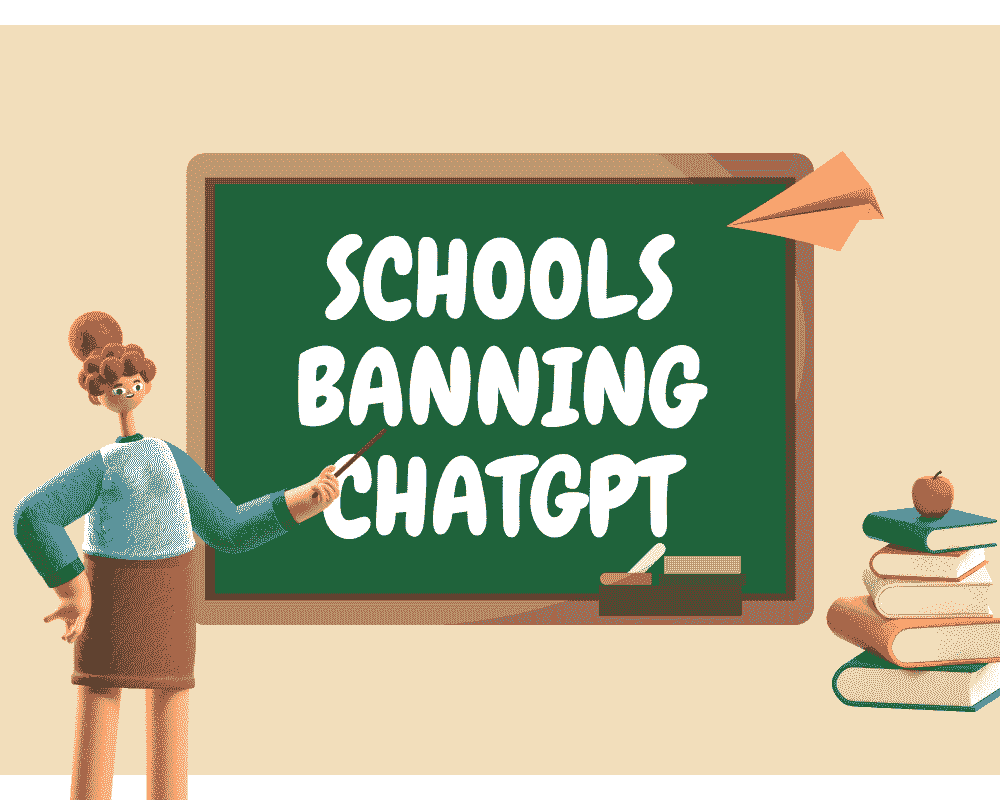

# ChatGPT 在学校的影响以及为什么它被禁止

> 原文：[`www.kdnuggets.com/2023/06/effects-chatgpt-schools-getting-banned.html`](https://www.kdnuggets.com/2023/06/effects-chatgpt-schools-getting-banned.html)

图片由编辑提供

ChatGPT 在许多应用场景中既引起了兴奋也引发了担忧。它最显著——也是最具争议的——用途之一是它在学校中的使用。随着 ChatGPT 的受欢迎程度持续飙升，许多学区正在禁止它，但它对教育的潜在积极作用也在增长。

* * *

## 我们的前三个课程推荐

 1\. [谷歌网络安全证书](https://www.kdnuggets.com/google-cybersecurity) - 快速进入网络安全职业生涯。

 2\. [谷歌数据分析专业证书](https://www.kdnuggets.com/google-data-analytics) - 提升您的数据分析技能

 3\. [谷歌 IT 支持专业证书](https://www.kdnuggets.com/google-itsupport) - 支持您的组织在 IT 方面

* * *

# 学校为什么禁止 ChatGPT

理解这个问题的两个方面很重要。首先，这里列出了学校禁止 ChatGPT 的一些主要原因。

## 抄袭问题

对 ChatGPT 在学校中的最普遍担忧是它的抄袭倾向。像所有 AI 模型一样，ChatGPT 并不一定创造新内容，而是编译、总结和重新表述现有工作。学生可以轻松地使用它来完成他们的作业，就像偷别人的论文并交上去一样。

许多工具可以检测到 ChatGPT 生成的内容，因此发现试图作弊的学生相对容易。然而，即使学生只是将其作为研究工具，他们也可能无法找到 ChatGPT 提供的信息的原始来源，从而导致意外抄袭。模型训练数据背后人员缺乏同意也引发了进一步的抄袭问题。

## 准确性存疑

在学校使用 ChatGPT 也可能妨碍学生教育的质量。ChatGPT 提供的答案并不总是准确的，即使它们很有说服力，这可能导致学生相信误导性或完全错误的信息。

这些事实上的不准确性可能比抄袭更难检测，尤其是当涉及教师不太熟悉的话题时。因此，在研究或作为教学工具中使用它可能会传播错误信息。

## 隐私问题

ChatGPT 还存在一些隐私问题。该平台收集了大量用户数据，其隐私控制有限且不明显。考虑到教育行业在去年[最容易遭受勒索软件攻击](https://assets.sophos.com/X24WTUEQ/at/c949g7693gsnjh9rb9gr8/sophos-state-of-ransomware-2023-wp.pdf)，这确实是一个重大问题。

学生可能不知道在使用 ChatGPT 时，他们正在提供多少个人信息或该网站如何使用这些信息。这使大量高度敏感的数据面临风险。

# ChatGPT 的作弊以外的用途

尽管存在这些担忧，但 ChatGPT 在学校中有几个积极方面。以下是教育系统如何利用这个聊天机器人来使学生和教师都受益。

## 简化行政管理

教师和其他员工可以使用 ChatGPT 来自动化一些行政任务，比如安排时间表和数据录入。这种自动化将使他们有更多时间与学生互动，从而改善教育成果。

近[50%的独立学校](https://www.tads.com/why-your-school-needs-a-technology-checklist/)使用五种或更多在线解决方案来管理行政工作。这会导致很多断层、低效和不必要的成本。利用像 ChatGPT 这样的工具来简化这些幕后工作流程，将有助于减少时间和费用。

## 提高参与度

教育工作者还可以使用 ChatGPT 来使课程对学生更具吸引力。研究发现，当技术在他们的学习中发挥作用时，学生[会更加投入和舒适](https://files.eric.ed.gov/fulltext/EJ1290791.pdf)，而像 ChatGPT 这样的新技术可能特别有用。

学生可以使用 ChatGPT 来制定他们自己充实的研究论文大纲，这有助于他们学习什么是高质量的文章。或者，教师可以使用 ChatGPT 来展示 AI 的工作原理，或强调在在线资源中关注偏见和虚假信息的重要性。

## 为 AI 未来做准备

学校也可以考虑教学生如何使用 ChatGPT 及类似工具。生成性 AI 无疑将在许多未来的业务中发挥作用，因此学习如何负责任地使用 AI 是即将到来的这一代的关键技能。

一些专家预测[58%的现有劳动力](https://www.gartner.com/en/newsroom/press-releases/2021-02-03-gartner-hr-research-finds-fifty-eight-percent-of-the-workforce-will-need-new-skill-sets-to-do-their-jobs-successfully)将需要提升技能，以便在新技术改变他们的角色和职责时有效工作。教育系统可以通过在学生进入职场前为他们提供 AI 素养来领先于这一趋势。ChatGPT 的易用性使其成为实现这一目标的理想工具。

# 生成性 AI 可能永远改变教育

生成式 AI 平台如 ChatGPT 将改变许多行业的运作方式。教育领域可能也会发生类似变化，无论是通过采纳新政策来限制技术，还是积极拥抱它。

在学校使用 ChatGPT 有许多好处，但仍面临重大障碍。如果学校系统能以谨慎的态度对待，并考虑这些缺点，他们可以利用这些优势来改善未来的教育。

**[April Miller](https://www.linkedin.com/in/april-j-miller/)** 是 [ReHack](https://rehack.com/) 杂志的消费者技术管理编辑。她有创建优质内容的丰富经验，这些内容能够吸引流量到她所工作的出版物中。

### 更多相关话题

+   [ChatGPT 是如何工作的？为什么它有效？](https://www.kdnuggets.com/2023/04/chatgpt-work.html)

+   [为什么 DuckDB 越来越受欢迎？](https://www.kdnuggets.com/2023/07/duckdb-getting-popular.html)

+   [Visual ChatGPT：微软结合 ChatGPT 和 VFM](https://www.kdnuggets.com/2023/03/visual-chatgpt-microsoft-combine-chatgpt-vfms.html)

+   [ChatGPT CLI：将你的命令行界面转变为 ChatGPT](https://www.kdnuggets.com/2023/07/chatgpt-cli-transform-commandline-interface-chatgpt.html)

+   [开始使用刚刚打败 GPT-4 和 Gemini 的 Claude 3 Opus](https://www.kdnuggets.com/getting-started-with-claude-3-opus-that-just-destroyed-gpt-4-and-gemini)

+   [开始使用 PyTest：轻松编写和运行 Python 测试](https://www.kdnuggets.com/getting-started-with-pytest-effortlessly-write-and-run-tests-in-python)
