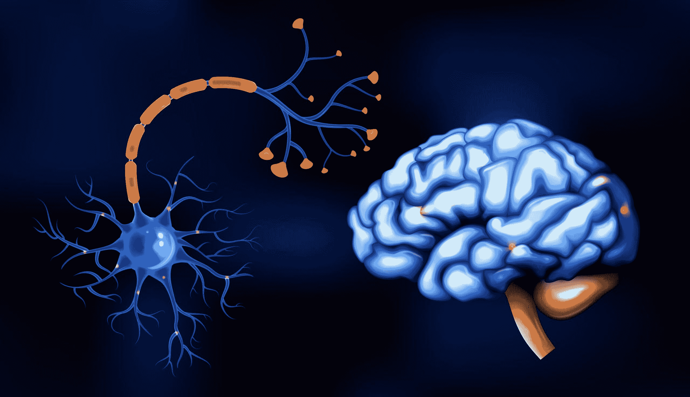

# 效率是生物神经元与人工神经元之间的区别

> 原文：[`www.kdnuggets.com/2022/11/efficiency-spells-difference-biological-neurons-artificial-counterparts.html`](https://www.kdnuggets.com/2022/11/efficiency-spells-difference-biological-neurons-artificial-counterparts.html)

[图片由 macrovector 提供](https://www.freepik.com/free-vector/realistic-brain-set_26760071.htm#query=brain%20neurons&position=0&from_view=search&track=sph) 在 Freepik 上

> * * *
> 
> ## 我们的前三名课程推荐
> ## 
>  1\. [谷歌网络安全证书](https://www.kdnuggets.com/google-cybersecurity) - 快速进入网络安全职业的快车道。
> 
>  2\. [谷歌数据分析专业证书](https://www.kdnuggets.com/google-data-analytics) - 提升您的数据分析能力
> 
>  3\. [谷歌 IT 支持专业证书](https://www.kdnuggets.com/google-itsupport) - 支持您的组织 IT
> 
> * * *
> 
> 机器学习取得了重大进展，但正如本系列所讨论的，它与大脑的工作方式没有太多相似之处。本系列第八部分探讨了生物神经元的一个方面，到目前为止，这一方面使它们远远领先于人工神经元：它们的效率。

您的大脑包含约 860 亿个神经元，这些神经元被挤在略超过一升的体积中。虽然机器学习可以做许多人脑做不到的事情，但大脑能够进行连续的语音识别、视觉解读以及许多其他任务，同时消耗约 12 瓦特的能量。相比之下，我的笔记本电脑消耗约 65 瓦特，而我的台式机消耗超过 200 瓦特，它们都无法运行当前使用的大型机器学习网络。

大脑是如何实现这种卓越效率的？我将其归因于三个关键因素：

1.  大脑是物理和化学的，而不是电子的。

1.  大脑中的神经元实际上非常慢。

1.  神经元只有在发出脉冲时才需要能量。

尽管我们可以使用电子仪器测量神经元中的电压，但它们的基本操作是化学的。离子从膜的一侧迁移到另一侧，离子分子的取向发生变化。这与计算机有根本性的不同，计算机中电子的移动速度是光速。显然，大脑中的分子在静止时不需要任何外部能量，而将钠离子（例如）从膜的一侧移动到另一侧所需的能量微不足道。

正如我在本系列之前的文章中提到的，神经元的尖峰频率最高为 250Hz，神经信号以悠闲的 2m/s 速度传播。如果我们将 CPU 的速度减慢到类似的步伐，它们的能量消耗也会减少，但永远不会像生物神经元那样少。

真实的区别在于，神经元除了在发放时几乎不需要能量。此外，它们并不经常发放。通过将大脑的总能量除以通过化学计算出的发放能量，可以得出神经元平均每两秒发放一次的结论。显然，像视觉和听觉这样的连续过程必须几乎持续运行，消耗更多的能量。因此，为了使事物平均化，我们必须得出结论，大脑中很大一部分神经元几乎不会发放。因此，代表特定记忆的神经元（例如你的祖母）可能只有在你想到她时才会发放。

但还有一种更深层次的思考方式。CPU 在高速运行时使用一定量的能量（而非闲置或休眠），并且无论处理的数据是什么，都会使用这种量的能量。例如，加两个数，加 0+0 所需的能量与加 12,345 + 67,890 基本相同。神经元则不同。

这种区别是神经形态计算运动的起源。在脑模拟器中，只有当神经元发放时才需要处理，因此桌面 CPU 每秒可以处理多达 25 亿个突触。神经形态芯片利用这一效果，以比传统机器学习过程少得多的能量产生 AI 结果。

尽管神经形态系统在朝着更像大脑的架构方向发展，但它们通常仍使用完全不神经形态的 ML 反向传播算法。

> *"本系列的最后一篇文章将总结机器学习与大脑不一样的诸多原因——以及一些相似之处。"*

**[查尔斯·西蒙](https://futureai.guru/Founder.aspx)** 是一位全国知名的企业家和软件开发者，也是 FutureAI 的首席执行官。西蒙是《计算机会反叛吗？：为人工智能的未来做准备》的作者，也是 Brain Simulator II 的开发者，这是一个 AGI 研究软件平台。欲了解更多信息，[请访问此处](https://futureai.guru/Founder.aspx)。

### 更多相关话题

+   [机器学习不像你的大脑 第五部分：生物神经元…](https://www.kdnuggets.com/2022/07/machine-learning-like-brain-part-5-biological-neurons-cant-summation-inputs.html)

+   [数据分析师与数据科学家的区别是什么？](https://www.kdnuggets.com/2022/03/difference-data-analysts-data-scientists.html)

+   [机器学习中训练数据与测试数据的区别](https://www.kdnuggets.com/2022/08/difference-training-testing-data-machine-learning.html)

+   [SQL 和对象关系映射（ORM）之间的区别是什么？](https://www.kdnuggets.com/2022/02/difference-sql-object-relational-mapping-orm.html)

+   [L1 和 L2 正则化之间的区别](https://www.kdnuggets.com/2022/08/difference-l1-l2-regularization.html)

+   [GBM 和 XGBoost 之间的区别是什么？](https://www.kdnuggets.com/wtf-is-the-difference-between-gbm-and-xgboost)
