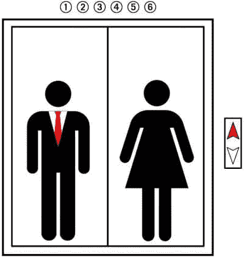
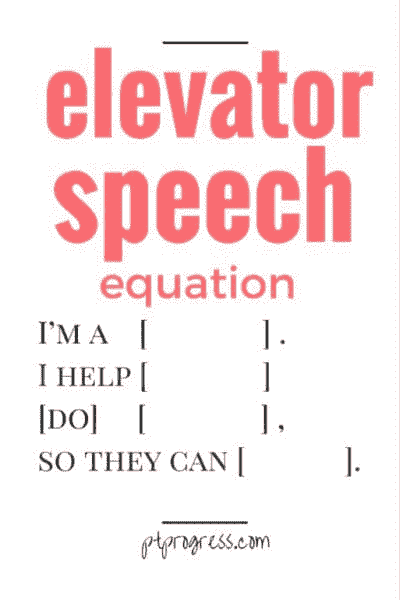

# 为你的数据科学初创公司打造电梯演讲

> 原文：[`www.kdnuggets.com/2019/08/elevator-pitch-data-science-startup.html`](https://www.kdnuggets.com/2019/08/elevator-pitch-data-science-startup.html)

 评论

**作者：Estelle Liotard，市场营销专家和商业顾问。**

* * *

## 我们的前三大课程推荐

 1\. [谷歌网络安全证书](https://www.kdnuggets.com/google-cybersecurity) - 快速进入网络安全职业轨道。

 2\. [谷歌数据分析专业证书](https://www.kdnuggets.com/google-data-analytics) - 提升你的数据分析技能

 3\. [谷歌 IT 支持专业证书](https://www.kdnuggets.com/google-itsupport) - 支持你的组织 IT 工作

* * *

“电梯演讲”一词最初来源于企业家和小企业主在被问到“你做什么？”时，发展出一个 30 秒的演讲。这可能发生在社交场合和活动等地方。这是企业主/企业家提供非常简短（因此，30 秒）解释他们向客户或客户提供的价值的机会，然后递交名片。这一活动一直被视为“传播信息”的工具，而不是寻求资金的工具。

### 电梯演讲的扩展

随着时间的推移，电梯演讲的定义已经显著扩展，现在不仅仅指对那个简单问题的简短回答。它已扩展到初创公司创始人在寻求资金时使用的演讲。显然，这种类型的演讲更长、更详细，发生在创始人寻求种子资金以启动或寻求额外资金以扩展时。

作为数据科学创始人，你处于一个相当有利的位置。这个领域还足够新，以至于投资者希望将资金投入那些能够为无法雇佣自己数据科学家的中小型企业提供这些服务的初创公司。你在这个市场上尚未面临巨大竞争，如果你能做好演讲，那将使你处于有利位置。

### 基础知识

尽管电梯演讲已经扩展，场所也发生了变化，但在你开始制定具体演讲之前，你必须识别[一些基本要素](https://www.inc.com/sean-wise/what-10000-hours-of-investor-pitches-can-tell-you-about-landing-perfect-pitch-in-21st-century.html)。以下是这些要素：

1.  对你的公司做出有力声明。你是谁，你在做什么？简洁明了。

1.  提供一个问题陈述。你为目标受众解决了什么问题？就数据科学服务而言，你显然是在解决获取大数据的问题。

1.  你带来的是怎样的价值？这就是对那个问题陈述的解决方案。

1.  注意你对自己所做的事情和解决的问题的描述。投资者不是技术专家，他们不一定理解算法、人工智能、预测模型等术语。在描述你所做的事情时，用所有人都能理解的通俗语言进行说明。一个好的建议？查看[一些成功的初创公司推介示例](https://slidebean.com/blog/startups-elevator-pitch-examples)。

### 新旧基础的变化

启动一家初创公司所需的资金比以前少得多。因此，许多创始人使用种子资金（他们自己、家庭、朋友、短期小额贷款、众筹等）来开发至少一个 MVP（最小可行产品），然后通过获取少量客户/客户来展示它是一个可行的产品。

这很重要。投资者希望看到产品/服务是可行的证据。你可以这样做：

1.  “展示，不要仅仅说明。” 不要只是说你的数据科学初创公司将提供什么。展示它为你现有的少数客户提供了什么，或者提供一个视觉演示，展示你的数据科学服务的某个特定方面如何解决问题。否则，展示一些来自初期客户的统计数据。例如，“在我们最初引入的 15 位客户中，所有 15 位在合作满一年后仍继续使用我们的服务。”

1.  投资者的获取方式发生了剧变。过去，寻找投资者是一个相当隐秘的过程。你需要认识一个认识可能感兴趣的人。互联网改变了这一切。通过众筹平台、“天使投资人”名单、招募提案的开放活动等，你可以轻松找到潜在的资助者，并设计你的提案以单独接触目标投资者。此外，网络交流可以在线进行，不再受地理位置限制。

1.  推介的新格式。推介活动，即创始人在舞台上向投资者展示他们的推介，仍然是一种常见的方式。但许多创始人变得更加主动。他们创建了可以嵌入到网站中的视频推介，同时可以发送和发布到各个地方，无需实体出席。考虑一下接触外国投资者的可能性——这是一个全新的融资世界，特别是在技术领域，如数据科学。

### 竞争非常激烈

你可能拥有一支出色的数据科学团队，并且你可能为需要你服务的企业提供了惊人的解决方案。但除非你能以吸引人且有说服力的方式展示自己，否则你只是另一个寻求资金的创始人——而这样的创始人有很多。

1.  做你自己，但也要融入他们

无论你是写一个电梯推介以口头形式向潜在投资者展示，还是为视频演示准备脚本，你都需要一个扎实的推介元素和[你的声音](https://bestessay.education/blog/finding-you-appealing-writing-voice)，否则你会显得不够真诚。这对那些不一定擅长文字的技术人员来说具有挑战性。正如[Studicus](https://studicus.com/descriptive-essay-writing-service)的编剧 Susan Johnston 所说：“我们有很多客户拥有惊人的概念和想法，但他们无法将这些转化为引人入胜的声音。技术人员常常处于这种情况。他们需要获得专业帮助，因为他们的声音必须真实，同时也是潜在客户和投资者可以理解的。”

1.  你不是一个编剧或市场营销人员

电梯推介需要一个脚本——你对公司热情的展示是不够的。如果你打算制作一个视频演示（并且你必须这样做），那么要明白它必须既专业又个人化，这取决于你的受众。你需要研究这些受众，也许为每个受众开发独特的脚本。然后，脚本必须在演讲前写好并练习。再次，专业帮助可能是必要的。Joe Lesinski，[WowGrade](https://wowgrade.net/do-my-essay)的客户编剧，这样说道：“编写脚本是一项特定技能，大多数人没有。任何没有这种技能的人都会失败。如果你打算吸引观众，最好找一个有经验的市场营销视频脚本编剧。”

关键在于：投资者和资助者每天都会收到大量的提案——成百上千个。你必须在这些竞争中脱颖而出，而你惊人的数据科学技能并不足以打动他们。沟通是可能最具挑战性的关键因素。遵循这些指南，你的成功机会将大大增加。

**个人简介：** Estelle Liotard 首先是一位市场营销专家，她曾与多个企业合作，从创办开始。根据她的经验，她还转向写作，讲述公司如何启动、获得资金和成长。她是多个博客的常客撰稿人，也是[Trust My Paper](https://www.trustmypaper.com/write-my-paper-for-me)的编辑部成员，这是一家与学生和企业合作的写作服务机构。

**相关：**

+   [如何为人工智能创业公司获得资金](https://www.kdnuggets.com/2019/06/funding-ai-startups.html)

+   [定位机器学习公司](https://www.kdnuggets.com/2016/04/positioning-machine-learning-company.html)

+   [2018 年将是建立人工智能创业公司的最佳时机](https://www.kdnuggets.com/2017/11/2018-perfect-time-build-ai-startup.html)

### 相关主题

+   [超越天网：打造人工智能演变的下一个前沿](https://www.kdnuggets.com/beyond-skynet-crafting-the-next-frontier-in-ai-evolution)

+   [SQL 简化：用 CTE 编写模块化和易于理解的查询](https://www.kdnuggets.com/sql-simplified-crafting-modular-and-understandable-queries-with-ctes)

+   [12 个建议：从数据分析师到初创公司联合创始人](https://www.kdnuggets.com/2021/12/12-tips-data-analyst-to-co-founder.html)

+   [在 ChatGPT 时代建立深科技初创公司的 10 个障碍](https://www.kdnuggets.com/2023/04/10-hurdles-building-deep-tech-startup-age-chatgpt.html)

+   [最佳文本分类任务架构：基准测试…](https://www.kdnuggets.com/2023/04/best-architecture-text-classification-task-benchmarking-options.html)

+   [用西北大学的数据科学学位启动你的职业生涯](https://www.kdnuggets.com/2022/04/nwu-launch-career-northwestern-data-science-degree.html)
