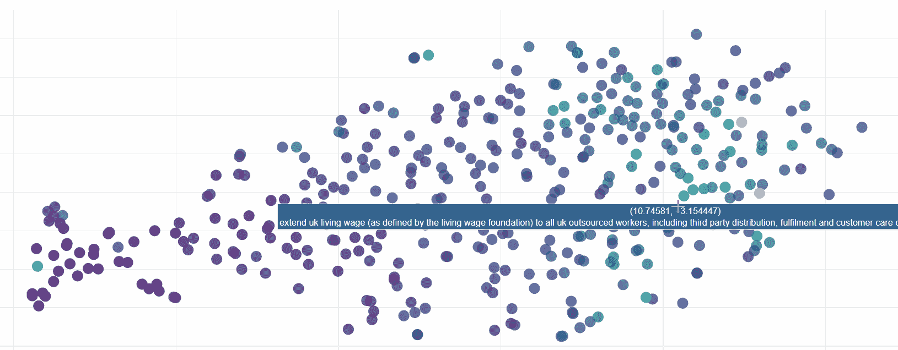
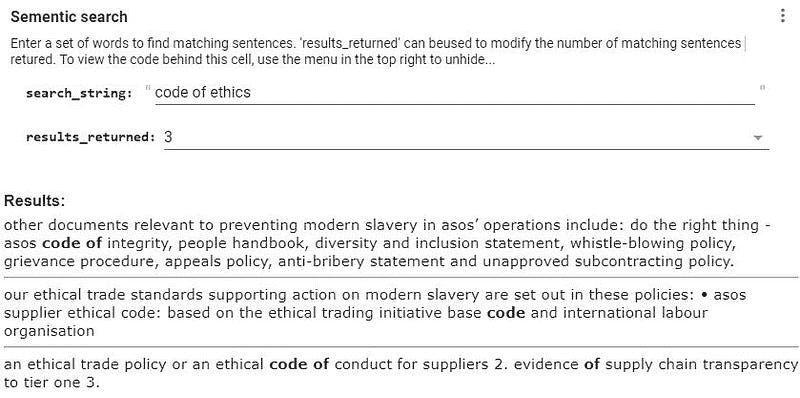

# ELMo：上下文化语言嵌入

> 原文：[`www.kdnuggets.com/2019/01/elmo-contextual-language-embedding.html`](https://www.kdnuggets.com/2019/01/elmo-contextual-language-embedding.html)

 评论

**由[Josh Taylor](https://www.linkedin.com/in/josh-taylor-24806975/)撰写，高级分析专家**



使用最先进的 ELMo 自然语言模型进行语义句子相似性分析

本文将探讨自然语言建模的最新进展——深度上下文化词嵌入。重点在于实践而非理论，包含了如何使用最先进的 ELMo 模型来审查给定文档中的句子相似性，以及创建一个简单的语义搜索引擎的实际示例。完整代码可以在 Colab 笔记本中查看，链接在[这里](https://colab.research.google.com/drive/13f6dKakC-0yO6_DxqSqo0Kl41KMHT8A1)。

### **上下文在自然语言处理中的重要性**

我们知道，语言是复杂的。上下文可以完全改变句子中单个词的含义。例如：

> 他踢翻了**桶**。
> 
> 我还没有完成我**人生愿望清单**上的所有项目。
> 
> **桶**里装满了水。

在这些句子中，虽然“桶”这个词始终相同，但其含义却大相径庭。


词语的含义可能会根据上下文而有所不同

尽管我们可以轻松解读这些语言中的复杂性，但创建一个可以理解给定文本周围词语不同细微含义的模型却很困难。

正因如此，传统的词嵌入（如 word2vec、GloVe、fastText）显得力不从心。它们每个词只有一种表示，因此无法捕捉每个词在不同上下文中含义的变化。

### **介绍 ELMo：深度上下文化词表示**

ELMo 应运而生。ELMo 由 AllenNLP 于 2018 年开发，超越了传统的嵌入技术。它使用深度双向 LSTM 模型来创建词表示。

与其说 ELMo 拥有一个词汇表及其对应向量，不如说 ELMo 在词语使用的上下文中进行分析。它还是基于字符的，使模型能够形成对超出词汇表范围的词的表示。

因此，ELMo 的使用方式与 word2vec 或 fastText 截然不同。ELMo 不是通过字典“查找”词及其对应的向量，而是通过将文本传递给深度学习模型即时创建向量。

### **一个实际示例，5 分钟内 ELMo 的实际应用**

让我们开始吧！我会在这里添加主要的代码片段，但如果你想查看完整的代码集（或者确实想体验点击笔记本中每个单元格的奇妙感觉），请查看相应的 [Colab 输出](https://colab.research.google.com/drive/13f6dKakC-0yO6_DxqSqo0Kl41KMHT8A1)。

根据我最近几篇文章，我们将使用的数据基于现代奴隶制的报告。这些是公司必须发布的声明，用以说明它们如何在内部及其供应链中解决现代奴隶制问题。我们将在本文中深入分析 ASOS 的报告（一个英国的在线时尚零售商）。

如果你对查看其他与此数据集相关的 NLP 实验感兴趣，这些实验正在快速成为一个迷你系列，我在本文末尾包含了这些文章的链接。

### **1\. 获取文本数据，清理并分词**

使用 Python 字符串函数和 spaCy 来做到这一点是如此简单。这里我们通过以下方式进行一些基本的文本清理：

a) 移除换行符、制表符和多余的空白，以及神秘的‘xa0’字符；

b) 使用 spaCy 的‘.sents’迭代器将文本拆分成句子。

ELMo 可以接收一个句子字符串列表或一个列表的列表（句子和单词）。在这里，我们选择了前者。我们知道 ELMo 是基于字符的，因此对单词进行分词应该不会影响性能。

```py
nlp = spacy.load('en_core_web_md')

#text represents our raw text document

text = text.lower().replace('\n', ' ').replace('\t', ' ').replace('\xa0',' ') #get rid of problem chars
text = ' '.join(text.split()) #a quick way of removing excess whitespace
doc = nlp(text)

sentences = []
for i in doc.sents:
  if len(i)>1:
    sentences.append(i.string.strip()) #tokenize into sentences
```

### **2\. 使用 TensorFlow Hub 获取 ELMo 模型：**

如果你还没遇到 TensorFlow Hub，它是一个极大的时间节省工具，用于提供大量的预训练模型以供 TensorFlow 使用。幸运的是，其中一个模型是 ELMo。我们只需两行代码即可加载一个完全训练好的模型。多么令人满意啊……

```py
url = "https://tfhub.dev/google/elmo/2"
embed = hub.Module(url)
```

然后，要使用这个模型，我们只需多写几行代码，将其指向我们的文本文件并创建句子向量：

```py
# This tells the model to run through the 'sentences' list and return the default output (1024 dimension sentence vectors).
embeddings = embed(
    sentences,
    signature="default",
    as_dict=True)["default"]

#Start a session and run ELMo to return the embeddings in variable x
with tf.Session() as sess:
  sess.run(tf.global_variables_initializer())
  sess.run(tf.tables_initializer())
  x = sess.run(embeddings)
```

### **3\. 使用可视化来检查输出的准确性**

可视化被忽视作为获得数据更深入理解的一种方式，这真是太惊人了。图片胜过千言万语，我们将创建一个*千言万语*的图表来证明这一点（实际上是 8,511 个单词）。

在这里，我们将使用 PCA 和 t-SNE 将 ELMo 输出的 1,024 维降到 2，以便我们可以查看模型的输出。如果你想了解更多，我在文章末尾包含了进一步的阅读材料。

```py
from sklearn.decomposition import PCA

pca = PCA(n_components=50) #reduce down to 50 dim
y = pca.fit_transform(x)

from sklearn.manifold import TSNE

y = TSNE(n_components=2).fit_transform(y) # further reduce to 2 dim using t-SNE
```

使用惊人的 Plotly 库，我们可以在短时间内创建一个美丽的交互式图表。下面的代码展示了如何呈现我们降维的结果，并将其与句子文本结合起来。颜色也根据句子长度添加。由于我们使用的是 Colab，最后一行代码下载了 HTML 文件。可以在下面找到：

[**句子编码**

*交互式句子嵌入* drive.google.com](https://drive.google.com/open?id=17gseqOhQl9c1iPTfzxGcCfB6TOTvSU_i)

创建这个的代码如下：

```py
import plotly.plotly as py
import plotly.graph_objs as go
from plotly.offline import download_plotlyjs, init_notebook_mode, plot, iplot

init_notebook_mode(connected=True)

data = [
    go.Scatter(
        x=[i[0] for i in y],
        y=[i[1] for i in y],
        mode='markers',
        text=[i for i in sentences],
    marker=dict(
        size=16,
        color = [len(i) for i in sentences], #set color equal to a variable
        opacity= 0.8,
        colorscale='Viridis',
        showscale=False
    )
    )
]
layout = go.Layout()
layout = dict(
              yaxis = dict(zeroline = False),
              xaxis = dict(zeroline = False)
             )
fig = go.Figure(data=data, layout=layout)
file = plot(fig, filename='Sentence encode.html')

from google.colab import files
files.download('Sentence encode.html')
```

通过这个可视化，我们可以看到 ELMo 在按语义相似性分组句子方面做得非常出色。实际上，模型的效果非常令人惊讶：


下载 HTML 文件（链接见上）以查看 ELMo 的实际效果

### **4\. 创建一个语义搜索引擎：**

现在我们对我们的语言模型运行良好充满信心，让我们在语义搜索引擎中发挥作用。其理念是让我们通过文本的语义接近度而非关键字来进行搜索。

这实际上很简单：

+   首先，我们获取一个搜索查询，并对其运行 ELMo；

+   然后，我们使用余弦相似度将其与文本文件中的向量进行比较；

+   然后，我们可以返回与搜索查询最接近的`n`个匹配结果。

Google Colab 提供了一些出色的功能来创建适合此用例的表单输入。例如，创建输入只需在变量后添加 ***#@param***。下面展示了一个字符串输入的示例：

```py
search_string = "example text" #@param {type:"string"}
```

除了使用 Colab 表单输入，我还使用了‘IPython.display.HTML’来美化输出文本，并使用一些基本的字符串匹配来突出显示搜索查询与结果之间的常见词汇。

让我们来检验一下。让我们看看 ASOS 在其现代奴隶制报告中关于伦理规范的做法：



只需几分钟即可创建一个完全互动的语义搜索引擎！

这太神奇了！这些匹配结果超越了关键字，搜索引擎显然知道‘伦理’和伦理相关词之间的紧密关系。我们找到了有关诚信规范以及伦理标准和政策的匹配结果。它们都与我们的搜索查询相关，但并不是基于关键字直接链接的。

希望你喜欢这篇文章。如果你有任何问题或建议，请留下评论。

***进一步阅读：***

以下是我在如今逐渐形成的自然语言处理和公司现代奴隶制报告迷你系列中的其他帖子：

[**使用无监督机器学习清理数据**]

*清理数据不一定要痛苦！这篇文章是如何使用无监督机器学习的一个快速示例……* [towardsdatascience.com](https://towardsdatascience.com/clean-your-data-with-unsupervised-machine-learning-8491af733595)

[**提升词向量**]

*在您的自然语言处理项目中提升 fastText 和其他词向量的简单技巧* [towardsdatascience.com](https://towardsdatascience.com/supercharging-word-vectors-be80ee5513d)

要了解更多关于降维过程的信息，我推荐以下帖子：

[**使用 PCA 和 t-SNE 在 Python 中可视化高维数据集**]

*围绕任何数据相关挑战的第一步是从数据本身开始探索。这可以通过查看……* [medium.com](https://medium.com/@luckylwk/visualising-high-dimensional-datasets-using-pca-and-t-sne-in-python-8ef87e7915b)

最后，关于最先进的语言模型，下面的内容是值得一读的：

[`jalammar.github.io/illustrated-bert/`](http://jalammar.github.io/illustrated-bert/)

**简介：[Josh Taylor](https://www.linkedin.com/in/josh-taylor-24806975/)** (**[@josh_taylor_01](https://twitter.com/josh_taylor_01)**) 是一位通过先进分析、机器学习和可视化技术生成洞见的专家，目前为女王陛下的政府工作。所有观点均为个人意见。

[原始内容](https://towardsdatascience.com/elmo-contextual-language-embedding-335de2268604)。经授权转载。

**相关：**

+   词嵌入与自监督学习，解释说明

+   自然语言处理任务的数据表示

+   2018 年数据科学领域的前 20 大 Python 库

* * *

## 我们的三大课程推荐

 1\. [Google 网络安全证书](https://www.kdnuggets.com/google-cybersecurity) - 快速进入网络安全职业生涯。

 2\. [Google 数据分析专业证书](https://www.kdnuggets.com/google-data-analytics) - 提升你的数据分析技能

 3\. [Google IT 支持专业证书](https://www.kdnuggets.com/google-itsupport) - 支持你的组织 IT 工作

* * *

### 更多相关主题

+   [终极指南：NLP 中不同的词嵌入技术](https://www.kdnuggets.com/2021/11/guide-word-embedding-techniques-nlp.html)

+   [自然语言处理中的 N-gram 语言建模](https://www.kdnuggets.com/2022/06/ngram-language-modeling-natural-language-processing.html)

+   [Python：机器学习的编程语言](https://www.kdnuggets.com/2022/06/mlm-python-programming-language-machine-learning.html)

+   [自然语言处理关键术语解释](https://www.kdnuggets.com/2017/02/natural-language-processing-key-terms-explained.html)

+   [自然语言处理任务的数据表示](https://www.kdnuggets.com/2018/11/data-representation-natural-language-processing.html)

+   [是什么让 Python 成为创业公司的理想编程语言](https://www.kdnuggets.com/2021/12/makes-python-ideal-programming-language-startups.html)
