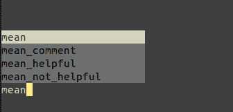
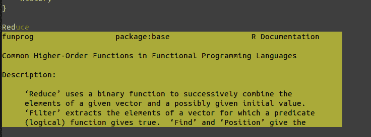
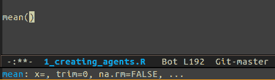
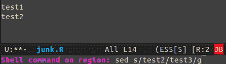

# Emacs 用于数据科学

> 原文：[`www.kdnuggets.com/2015/07/emacs-data-science.html`](https://www.kdnuggets.com/2015/07/emacs-data-science.html)

 评论

**作者：罗伯特·维斯科。**

> **如果你需要一个能够支持 R、Python、SAS、Stata、SQL 以及几乎所有其他数据科学语言的编辑器。如果你需要一个具有 IDE 类特性的编辑器。如果你需要一个能够在任何平台以及终端上工作的编辑器。如果你是文学化编程的爱好者。如果你需要一个高度可定制的编辑器，并且这个编辑器能够在大多数编辑器消失后依然存在，那么你可能很难找到比 Emacs 更好的选择。**

如果你完全在 R 环境下工作，你可能会考虑使用[Rstudio](http://www.rstudio.com)。如果你使用 Python，你可能会被[Spyder](https://code.google.com/p/spyderlib/)所吸引。通常，针对你所使用的语言可能会有专门的 IDE。但这就是问题所在。如果你想要使用其他语言呢？或者需要组合使用多种语言？你可能会使用多个 IDE，却不熟悉它们。而且，一旦这些 IDE 过时或停止更新，你辛苦获得的知识就会丢失。另一端则是像 Notepad++ 和 Sublime 这样的文本编辑器。这些编辑器可以与几乎所有你能想象的语言一起使用，并且通过一些插件可以获得额外的功能，但它们通常仅限于某些平台，且定制化往往并非易事。

现代数据科学家通常需要在多个平台上使用多种语言。一些项目可能在 R 中，其他项目则在 Python 中。或者你需要在没有图形界面的集群上工作。或者你可能需要用 LaTeX 写论文。你可以用 Emacs 完成这些工作，并根据需要进行定制。不过，我不会撒谎。学习曲线可能会很陡峭，但我认为这个投资是值得的。

下面是一些我认为使 Emacs 成为任何数据科学家出色编辑器的关键特性。

### 类似 IDE 的功能

对于大多数编程语言，你可以直接获得语法高亮功能。像[ESS](http://ess.r-project.org/Manual/ess.html)和[Elpy](https://github.com/jorgenschaefer/elpy)这样的包提供了额外的功能，如自动补全、文档和调试能力。可用的 IDE 功能数量会因语言而异，但至少应该有语法高亮和某种形式的自动补全。



图 1：“自动补全”

我喜欢的一点是轻松访问帮助和函数参数……这些通常也伴随着自动补全。



图 2：“函数帮助”



图 3：“函数参数帮助”

别再使用打印语句了，调试一下你的 R 和 Python 代码吧！


图 4：“使用条件断点进行交互式调试”

让我对 Emacs 的第一个吸引我的特性之一就是交互式命令。通过一个键盘快捷键，你可以将缓冲区、函数、段落或行发送到解释器。让我明确一点——你甚至不需要高亮代码。这在进行统计分析时节省了大量时间^(1)。


图 5：“交互式命令”

### SQL 也如此

你在处理数据库吗？上述许多相同的好处也适用于 SQL。与 sqlite、postgresql、mysql 以及其他数据库进行交互。你有一个长 SQL 语句在调试吗？没问题。快速迭代。


图 6：“交互式 SQL”

### Org mode / 文学编程

你写出版物吗？你想将代码和论文一起保存吗？你相信可重复研究吗？使用 Emacs，你可以在文档中放入任何你想要的语言。虽然 Rstudio 也允许这样做，但你仅限于 R 和 LaTeX。


图 7：“文学编程：代码与 Stata”

你需要 LaTeX 吗？没问题。

```py
#+BEGIN_LaTeX\frac{3}{4}#+END_LaTeX
```

这一魔法的关键是一个叫做 [org mode](http://orgmode.org/features.html) 的庞大软件包。它是 Emacs 的杀手级功能之一。你还可以用它来组织你的代码……或者你的生活。

### 终端/远程编辑

有时候你需要远程连接到服务器。或者你可能在一个没有 GUI 的集群上工作，需要交互式调试脚本。


图 8：“在终端中同样有效”

### 与 Shell 交互

有没有一个终端命令是你希望能运行的？在 Emacs 中，你可以轻松运行终端命令。但使这个功能特别酷的是，它可以对你的文本进行操作。你可以选择一段代码，将其发送到终端命令，然后让其标准输出替换你缓冲区中的文本！



图 9：“使用 SED 查找并替换缓冲区中的文本”

### 矩形编辑

数据科学家经常处理表格数据。有时候你可能需要删除或移动某一列。或者也许有一块空白区域你需要修改。


图 10：“使用矩形模式来修改文本块”

### 一切尽在你的指尖

Emacs 拥有众多包，允许你搜索和查找文件、函数以及你能想到的任何东西。但目前最好的还是 helm。只需按下几个键，你就可以瞬间找到你要找的东西。我无法充分展示它的强大，但这个演示让你体验到它的惊人功能。

[`tuhdo.github.io/helm-intro.html`](http://tuhdo.github.io/helm-intro.html)

### 任何你想要的功能

也许你习惯了 sublime 的多光标功能？你可以实现这个功能：[`emacsrocks.com/`](http://emacsrocks.com/)。或者你是一个长期使用 vim 的用户？Evil Mode 让你可以享受 Vim 的编辑能力，同时拥有 emacs 的实用性。如果你是 git 用户，Emacs 有 magit，可以让你愉快地使用 git。如果它缺少某些功能，查看是否有相关包，否则 emacs 是你能找到的最具可定制性的编辑器。几乎所有关于它的功能都可以根据你的工作流程进行调整。

### 超过 30 年历史和广泛的用户基础

Emacs 已经存在很长时间了。十年前写的代码大多仍然有效。而且每年都在变得更好。然而，emacs24 非常棒。如果你多年前尝试过 emacs，应该再试一次。它现在内置了包管理功能，所以你可以轻松地添加测试包。重要的是，没有迹象表明 emacs 会很快消失，而且它是免费的。它可能会再存在至少十年，甚至更久。

### 那么它的缺点是什么？

### 网络上的遗留代码让人困惑

Emacs 已经存在很长时间了。Emacs 24 是一次巨大的改进，但也破坏了许多东西。Org-mode 从版本 7 到 8 之间也是如此。很多网络上的资料可能会让你感到困惑和沮丧，如果你不了解这一点。

### 使用 Emacs-lisp 进行定制

我实际上喜欢使用 lisp，因为它与我工作的其他语言非常不同。然而，许多人可能更喜欢使用像 python 这样的语言。

### 不适合**新手**/**小白**

Emacs 并不像那个总是笑容满面的兄弟。第一次接触可能会让人感到痛苦和尴尬。它不是一种**绝对完美**的工具。不过，还是有几个初学者包可以开箱即用，提供有用的功能。对于科学家来说，Kieran Healy 的初学者包可能很有用：[`kieranhealy.org/resources/emacs-starter-kit/`](http://kieranhealy.org/resources/emacs-starter-kit/)

另一个有用的包是 prelude：[`github.com/bbatsov/prelude`](https://github.com/bbatsov/prelude)

如果你在 Mac 上，我听说 aquamacs 可以让你感到温暖和舒适：[`aquamacs.org/`](http://aquamacs.org/)

这些大多数包都能让你迅速体验到 emacs 的强大。就我个人而言，我更喜欢从头开始构建我的 emacs，使它只做我想让它做的事，但这些包是体验其强大功能的好方法。

### 多个包

如果你决定使用 Python，准备好尝试各种不同的 Python 包。虽然 emacs 具有基本的 Python 支持，但你可能会需要代码检查、重构或其他有用的功能。许多包尝试实现这些功能，有些比其他的做得更好。就个人而言，我喜欢 Elpy，但它并不完美。选项的缺点是你必须浏览它们，这有时可能会很痛苦。

### 我遗漏了什么？

尽管我尽力包括了我认为会吸引数据科学家的大部分功能，但如果我遗漏了任何重要功能，请告诉我，我会尽力在这里加入。[`twitter.com/robertvesco`](https://twitter.com/robertvesco)

### 脚注:

^(1 像许多其他功能一样，这将取决于你安装的包。也就是说，为你喜欢的语言实现这个功能很简单。

**个人简介:** [Robert Vesco](https://www.linkedin.com/in/robertvesco) 是一名博士候选人，正转回到工业界。

**相关:**

+   R 与 Python 在数据科学中的对决: 胜者是…

+   按受欢迎程度排序的前 20 个 R 包

+   21 个必备的数据可视化工具

* * *

## 我们的前三大课程推荐

 1\. [谷歌网络安全证书](https://www.kdnuggets.com/google-cybersecurity) - 快速进入网络安全职业道路。

 2\. [谷歌数据分析专业证书](https://www.kdnuggets.com/google-data-analytics) - 提升你的数据分析水平

 3\. [谷歌 IT 支持专业证书](https://www.kdnuggets.com/google-itsupport) - 支持你的组织的 IT

* * *

### 更多相关内容

+   [停止学习数据科学以寻找目标，并寻找目标以…](https://www.kdnuggets.com/2021/12/stop-learning-data-science-find-purpose.html)

+   [数据科学最低要求: 开始时需要知道的 10 项必备技能…](https://www.kdnuggets.com/2020/10/data-science-minimum-10-essential-skills.html)

+   [KDnuggets™ 新闻 22:n06, 2 月 9 日: 数据科学编程…](https://www.kdnuggets.com/2022/n06.html)

+   [数据科学定义幽默: 一系列古怪的名言…](https://www.kdnuggets.com/2022/02/data-science-definition-humor.html)

+   [5 个数据科学项目来学习 5 项关键数据科学技能](https://www.kdnuggets.com/2022/03/5-data-science-projects-learn-5-critical-data-science-skills.html)

+   [KDnuggets 新闻, 11 月 30 日: 什么是切比雪夫定理及其应用…](https://www.kdnuggets.com/2022/n46.html)
