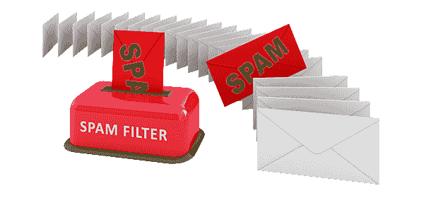

# 电子邮件垃圾邮件过滤：使用 Python 和 Scikit-learn 的实现

> 原文：[`www.kdnuggets.com/2017/03/email-spam-filtering-an-implementation-with-python-and-scikit-learn.html`](https://www.kdnuggets.com/2017/03/email-spam-filtering-an-implementation-with-python-and-scikit-learn.html)

**由 [Machine Learning in Action](https://appliedmachinelearning.wordpress.com/).**



* * *

## 我们的前三个课程推荐

 1\. [谷歌网络安全证书](https://www.kdnuggets.com/google-cybersecurity) - 快速进入网络安全职业生涯

 2\. [谷歌数据分析专业证书](https://www.kdnuggets.com/google-data-analytics) - 提升你的数据分析技能

 3\. [谷歌 IT 支持专业证书](https://www.kdnuggets.com/google-itsupport) - 支持你的组织 IT 事务

* * *

文本挖掘（从文本中提取信息）是一个广泛的领域，随着大量文本数据的生成而获得了普及。许多应用程序的自动化，如情感分析、文档分类、主题分类、文本摘要、机器翻译等，已经通过机器学习模型实现。

垃圾邮件过滤是一个初学者的文档分类任务示例，它涉及将电子邮件分类为垃圾邮件或非垃圾邮件（也称为正常邮件）。你的 Gmail 帐户中的垃圾邮件箱是最好的例子。所以，让我们开始在公开的邮件语料库上构建垃圾邮件过滤器。我已经从 [Ling-spam 语料库](http://www.aueb.gr/users/ion/data/lingspam_public.tar.gz) 中提取了相等数量的垃圾邮件和非垃圾邮件。我们将使用的提取子集可以从 [这里](https://www.dropbox.com/s/yjiplngoa430rid/) 下载。

我们将通过以下步骤来构建这个应用程序：

1.  准备文本数据。

1.  创建词典。

1.  特征提取过程

1.  训练分类器

此外，我们将检查在创建的子集上的测试集结果。

### 1\. 准备文本数据。

这里使用的数据集被分成了一个包含 702 封邮件的训练集和一个包含 260 封邮件的测试集，两者在垃圾邮件和正常邮件之间均等分配。你可以很容易地识别垃圾邮件，因为它的文件名中包含 *spmsg*。

在任何文本挖掘问题中，文本清理是第一步，我们会从文档中移除那些可能对我们要提取的信息没有贡献的词汇。电子邮件可能包含许多不必要的字符，如标点符号、停用词、数字等，这些在检测垃圾邮件时可能没有帮助。Ling-spam 语料库中的电子邮件已经通过以下方式进行了预处理：

a) 停用词的移除 – 停用词如“and”、“the”、“of”等在所有英语句子中都非常常见，在决定垃圾邮件或合法状态时并不太有意义，因此这些词已从邮件中移除。

b) 词形还原 – 这是将一个词的不同变形形式归为一类，以便将其作为单个项进行分析的过程。例如，“include”、“includes”和“included”都会被表示为“include”。与词干提取（另一种文本挖掘中的流行词，未考虑句子意义）不同，词形还原也会保留句子的上下文。

我们仍然需要从邮件文档中删除诸如标点符号或特殊字符等非单词。有几种方法可以做到这一点。在这里，我们将在创建字典后删除这些单词，这是一种非常方便的方法，因为有了字典后，你只需要删除每个这样的单词一次。所以，干杯！！到目前为止，你无需做任何事情。

### 2. 创建词典。

数据集中一个示例邮件如下所示：

```py
Subject: posting

hi , ' m work phonetics project modern irish ' m hard source . anyone recommend book article english ? ' , specifically interest palatal ( slender ) consonant , work helpful too . thank ! laurel sutton ( sutton @ garnet . berkeley . edu
```

可以看到，邮件的第一行是主题，第`3`行包含邮件正文。我们将仅对内容进行文本分析，以检测垃圾邮件。作为第一步，我们需要创建一个单词及其频率的字典。为此任务，使用了`700`封邮件的训练集。这个 Python 函数会为你创建字典。

```py
def make_Dictionary(train_dir):
    emails = [os.path.join(train_dir,f) for f in os.listdir(train_dir)]    
    all_words = []       
    for mail in emails:    
        with open(mail) as m:
            for i,line in enumerate(m):
                if i == 2:  #Body of email is only 3rd line of text file
                    words = line.split()
                    all_words += words

    dictionary = Counter(all_words)
    # Paste code for non-word removal here(code snippet is given below) 
    return dictionary
```

一旦字典创建完成，我们可以在上述函数中添加几行代码，以删除我们在第 1 步中讨论的非单词。我还删除了字典中那些无关的荒谬单字符。不要忘记将下面的代码插入到`def make_Dictionary(train_dir)`函数中。

```py
list_to_remove = dictionary.keys()
for item in list_to_remove:
    if item.isalpha() == False: 
        del dictionary[item]
    elif len(item) == 1:
        del dictionary[item]
dictionary = dictionary.most_common(3000)
```

可以通过命令`print dictionary`查看字典。你可能会发现一些荒谬的词频很高，但不用担心，这只是一个字典，你总有机会在之后改进它。如果你正在使用提供的数据集来跟随这个博客，请确保你的字典中包含下面列出的最常见词汇。我在字典中选择了`3000`个最常用的单词。

```py
[('order', 1414), ('address', 1293), ('report', 1216), ('mail', 1127), ('send', 1079), ('language', 1072), ('email', 1051), ('program', 1001), ('our', 987), ('list', 935), ('one', 917), ('name', 878), ('receive', 826), ('money', 788), ('free', 762)
```

### 3. 特征提取过程。

一旦字典准备好，我们可以为训练集中的每封邮件提取`3000`维的词频向量（我们的特征）。每个**词频向量**包含训练文件中`3000`个单词的频率。当然你现在可能已经猜到，大多数词频会是零。让我们举个例子。假设我们的字典中有`500`个单词。每个词频向量包含训练文件中`500`个字典单词的频率。假设训练文件中的文本是“Get the work done, work done”，那么它将被编码为[0,0,0,0,0,…….0,0,2,0,0,0,……,0,0,1,0,0,…0,0,1,0,0,……2,0,0,0,0,0]。在这里，所有词频都放在`500`长度词频向量的第`296`、`359`、`415`、`495`个索引处，其余为零。

以下的 python 代码将生成一个特征向量矩阵，其中行表示 700 个训练集文件，列表示 3000 个词典中的单词。索引‘*ij*’的值将是词典中第 j^(th)个单词在第 i^(th)个文件中出现的次数。

```py
def extract_features(mail_dir): 
    files = [os.path.join(mail_dir,fi) for fi in os.listdir(mail_dir)]
    features_matrix = np.zeros((len(files),3000))
    docID = 0;
    for fil in files:
      with open(fil) as fi:
        for i,line in enumerate(fi):
          if i == 2:
            words = line.split()
            for word in words:
              wordID = 0
              for i,d in enumerate(dictionary):
                if d[0] == word:
                  wordID = i
                  features_matrix[docID,wordID] = words.count(word)
        docID = docID + 1     
    return features_matrix
```

### 4\. 训练分类器。

在这里，我将使用[scikit-learn ML 库](http://scikit-learn.org/stable/)来训练分类器。它是一个开源的 python ML 库，可以在第三方分发包[anaconda](https://www.continuum.io/downloads)中找到，也可以通过[这个](http://scikit-learn.org/stable/install.html)单独安装。安装完成后，我们只需在程序中导入即可。

我在这里训练了两个模型，即朴素贝叶斯分类器和支持向量机（SVM）。朴素贝叶斯分类器是一种传统且非常流行的文档分类方法。它是一种基于贝叶斯定理的有监督概率分类器，假设每对特征之间相互独立。SVM 是一种有监督的二元分类器，当特征数量较多时非常有效。SVM 的目标是将训练数据的某个子集与其他数据分开，这些数据被称为支持向量（分隔超平面的边界）。SVM 模型的决策函数基于支持向量，并利用了核技巧来预测测试数据的类别。

一旦分类器训练完成，我们可以检查模型在测试集上的表现。我们提取测试集中每封邮件的词频向量，并用训练好的 NB 分类器和 SVM 模型预测其类别（ham 或 spam）。下面是完整的垃圾邮件过滤应用代码。你需要在第 2 步和第 3 步中包含我们定义的两个函数。

```py
import os
import numpy as np
from collections import Counter
from sklearn.naive_bayes import MultinomialNB, GaussianNB, BernoulliNB
from sklearn.svm import SVC, NuSVC, LinearSVC

# Create a dictionary of words with its frequency

train_dir = 'train-mails'
dictionary = make_Dictionary(train_dir)

# Prepare feature vectors per training mail and its labels

train_labels = np.zeros(702)
train_labels[351:701] = 1
train_matrix = extract_features(train_dir)

# Training SVM and Naive bayes classifier

model1 = MultinomialNB()
model2 = LinearSVC()
model1.fit(train_matrix,train_labels)
model2.fit(train_matrix,train_labels)

# Test the unseen mails for Spam
test_dir = 'test-mails'
test_matrix = extract_features(test_dir)
test_labels = np.zeros(260)
test_labels[130:260] = 1
result1 = model1.predict(test_matrix)
result2 = model2.predict(test_matrix)
print confusion_matrix(test_labels,result1)
print confusion_matrix(test_labels,result2)
```

### 性能检查

测试集包含 130 封垃圾邮件和 130 封非垃圾邮件。如果你读到这里，你会看到下面的结果。我展示了两个模型的测试集混淆矩阵。对角线元素表示正确识别（即真实识别）的邮件，而非对角线元素表示错误分类（虚假识别）的邮件。

| Multinomial NB | Ham | Spam |
| --- | --- | --- |
| Ham | 129 | 1 |
| Spam | 9 | 121 |
| SVM(Linear) | Ham | Spam |
| Ham | 126 | 4 |
| Spam | 6 | 124 |

两个模型在测试集上的表现类似，只是 SVM 在错误识别方面稍微平衡了一些。我必须提醒你，测试数据既没有用于创建词典，也没有用于训练集。

### 任务

下载[Euron-spam](http://www.aueb.gr/users/ion/data/enron-spam/)语料库的预处理版本。该语料库包含 33716 封电子邮件，分布在 6 个目录中。每个目录包含‘ham’和‘spam’文件夹。非垃圾邮件和垃圾邮件的总数分别为 16545 封和 17171 封。

按照本博客文章中描述的步骤操作，检查使用支持向量机和多项式朴素贝叶斯模型的表现。由于这个语料库的目录结构与博客文章中使用的 ling-spam 子集的目录结构不同，你可能需要重新组织它或修改`def make_Dictionary(dir)`和`def extract_features(dir)`函数。

我将 Euron-spam 语料库划分为 60:40 的训练集和测试集。在执行了本博客中的相同步骤后，我在 13487 个测试集邮件上得到了以下结果。我们可以看到，SVM 在正确检测垃圾邮件方面的表现略优于朴素贝叶斯分类器。

| 多项式 NB | Ham | Spam |
| --- | --- | --- |
| Ham | 6445 | 225 |
| Spam | 137 | 6680 |
| SVM(线性) | Ham | Spam |
| Ham | 6490 | 180 |
| Spam | 109 | 6708 |

### 最终思考

希望你觉得这个教程易于理解，因为我尽量保持简洁明了。对文本分析感兴趣的初学者可以从这个应用开始。

你可能在考虑使用的模型（如朴素贝叶斯和 SVM）背后的数学技术。SVM 是一个数学上复杂的模型，而朴素贝叶斯相对容易理解。建议你从在线资源中学习这些模型。此外，还可以进行很多实验，以找出不同参数的效果，比如

a) 训练数据量

b) 字典大小

c) 使用的机器学习技术的变体（GaussianNB, BernoulliNB, SVC）

d) 对 SVM 模型参数的微调

e) 通过去除无关词汇来改进字典（可能需要手动进行）

f) 其他特征（查找 td-idf）

我将会在一些其他的博客文章中撰写关于这些模型的数学解释。

你可以从 GitHub 链接[这里](https://github.com/abhijeet3922/Mail-Spam-Filtering)获取这两个语料库的完整 Python 实现。

如果你喜欢这篇文章，关注本博客以获取即将发布的文章更新。同时，分享它，让更多读者看到。请随时讨论任何与这篇文章相关的内容。我很乐意听取你的反馈。

祝你机器学习愉快！

**[机器学习实践](https://appliedmachinelearning.wordpress.com/)** 是一个完美的入门实践，适合初学者提升其机器学习技能。

[原文](https://appliedmachinelearning.wordpress.com/2017/01/23/email-spam-filter-python-scikit-learn/)。经许可转载。

**相关：**

+   与 Numpy 矩阵的操作：一个实用的初步参考

+   使用鸢尾花数据集的简单 XGBoost 教程

+   K-Means 与其他聚类算法：Python 快速入门

### 更多相关主题

+   [通过集成 Jupyter 和 KNIME 来缩短实现时间](https://www.kdnuggets.com/2021/12/cutting-implementation-time-integrating-jupyter-knime.html)

+   [DeepMind 的 AlphaTensor 首个开源实现](https://www.kdnuggets.com/2023/03/first-open-source-implementation-deepmind-alphatensor.html)

+   [过滤 Python 列表的 5 种方法](https://www.kdnuggets.com/2022/11/5-ways-filtering-python-lists.html)

+   [协同过滤的直观解释](https://www.kdnuggets.com/2022/09/intuitive-explanation-collaborative-filtering.html)

+   [在 Pandas 中进行条件过滤的五种方法](https://www.kdnuggets.com/2022/12/five-ways-conditional-filtering-pandas.html)

+   [理解 Python 的迭代与成员关系：__contains__ 和 __iter__ 魔法方法指南](https://www.kdnuggets.com/understanding-pythons-iteration-and-membership-a-guide-to-__contains__-and-__iter__-magic-methods)
